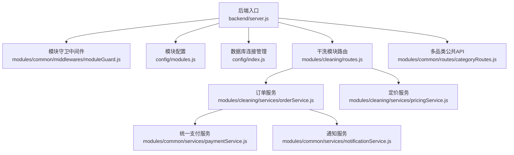
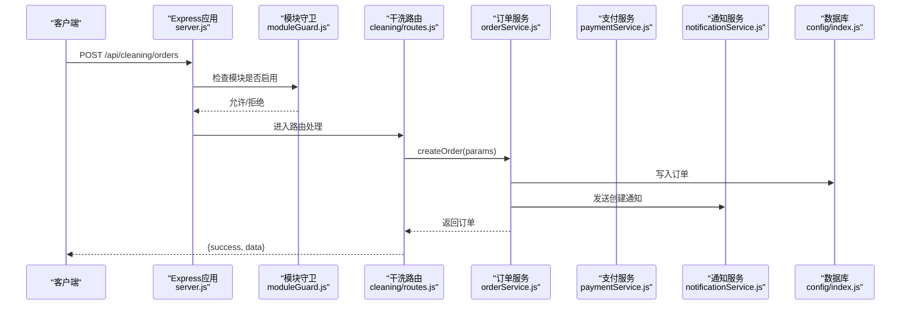
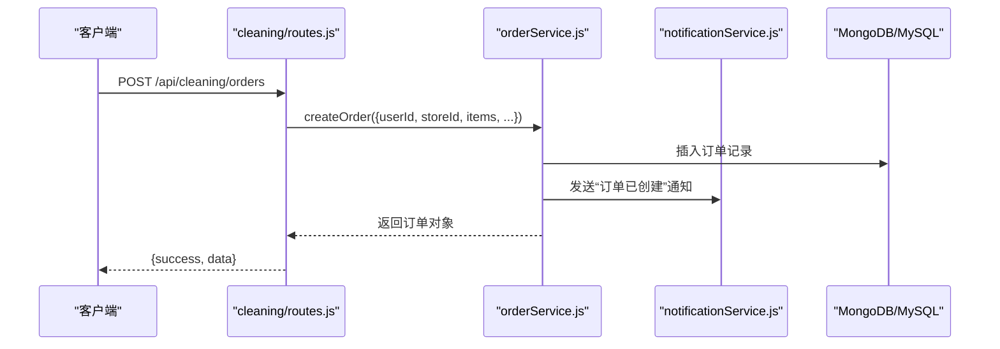
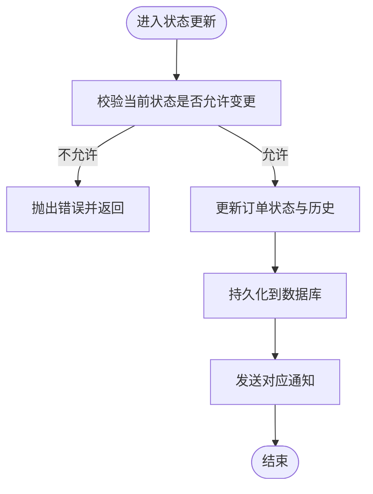
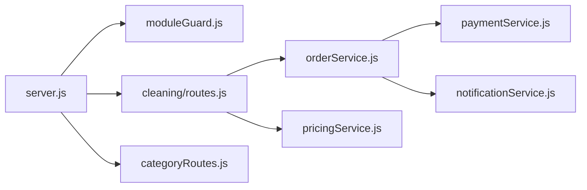

# 模块开发指南

<cite>
**本文引用的文件**   
- [backend/server.js](file://backend/server.js)
- [backend/config/index.js](file://backend/config/index.js)
- [backend/config/modules.js](file://backend/config/modules.js)
- [backend/modules/common/middlewares/moduleGuard.js](file://backend/modules/common/middlewares/moduleGuard.js)
- [backend/modules/cleaning/routes.js](file://backend/modules/cleaning/routes.js)
- [backend/modules/cleaning/services/orderService.js](file://backend/modules/cleaning/services/orderService.js)
- [backend/modules/cleaning/services/pricingService.js](file://backend/modules/cleaning/services/pricingService.js)
- [backend/modules/common/services/paymentService.js](file://backend/modules/common/services/paymentService.js)
- [backend/modules/common/services/notificationService.js](file://backend/modules/common/services/notificationService.js)
- [backend/modules/common/routes/categoryRoutes.js](file://backend/modules/common/routes/categoryRoutes.js)
- [backend/scripts/initDatabase.js](file://backend/scripts/initDatabase.js)
</cite>

## 目录
1. [引言](#引言)
2. [项目结构](#项目结构)
3. [核心组件](#核心组件)
4. [架构总览](#架构总览)
5. [详细组件分析](#详细组件分析)
6. [依赖关系分析](#依赖关系分析)
7. [性能与可扩展性](#性能与可扩展性)
8. [测试策略](#测试策略)
9. [版本管理与迁移](#版本管理与迁移)
10. [打包与部署](#打包与部署)
11. [常见问题与调试](#常见问题与调试)
12. [结论](#结论)

## 引言
本指南面向干洗店管理系统的后端模块开发者，提供从零创建新业务模块的完整流程：目录结构设计、配置注册、路由挂载、服务层设计、数据模型约定、接口规范、测试策略、版本管理与升级迁移、打包部署以及生产优化。文档以现有代码库为依据，确保所有建议均可落地执行。

## 项目结构
系统采用模块化架构，入口在 backend/server.js，通过统一中间件 moduleGuard 控制模块开关；数据库连接由 backend/config/index.js 统一管理；模块配置集中在 backend/config/modules.js；公共能力（支付、通知、品类等）位于 backend/modules/common 下；具体业务模块位于 backend/modules/<module> 下。

图示来源
- [backend/server.js:1-150](file://backend/server.js#L1-L150)
- [backend/modules/common/middlewares/moduleGuard.js:1-84](file://backend/modules/common/middlewares/moduleGuard.js#L1-L84)
- [backend/config/modules.js:1-203](file://backend/config/modules.js#L1-L203)
- [backend/config/index.js:1-167](file://backend/config/index.js#L1-L167)
- [backend/modules/cleaning/routes.js:1-120](file://backend/modules/cleaning/routes.js#L1-L120)
- [backend/modules/cleaning/services/orderService.js:1-120](file://backend/modules/cleaning/services/orderService.js#L1-L120)
- [backend/modules/cleaning/services/pricingService.js:1-60](file://backend/modules/cleaning/services/pricingService.js#L1-L60)
- [backend/modules/common/services/paymentService.js:1-60](file://backend/modules/common/services/paymentService.js#L1-L60)
- [backend/modules/common/services/notificationService.js:1-60](file://backend/modules/common/services/notificationService.js#L1-L60)
- [backend/modules/common/routes/categoryRoutes.js:1-45](file://backend/modules/common/routes/categoryRoutes.js#L1-L45)

章节来源
- [backend/server.js:1-150](file://backend/server.js#L1-L150)
- [backend/config/index.js:1-167](file://backend/config/index.js#L1-L167)
- [backend/config/modules.js:1-203](file://backend/config/modules.js#L1-L203)

## 核心组件
- 模块守卫中间件：根据 config/modules.js 中的 enabled 字段决定是否放行请求，未启用返回友好提示。
- 模块配置：集中定义模块元信息、功能开关、支付分账比例、消息模板等。
- 数据库连接：支持 MongoDB/MySQL 双引擎，提供初始化、事务、查询封装。
- 干洗模块：包含订单路由与服务实现，覆盖下单、状态流转、取件方式、配送费支付、智能灯条控制等。
- 公共服务：统一支付（含分账）、通知（多渠道模板）。

章节来源
- [backend/modules/common/middlewares/moduleGuard.js:1-84](file://backend/modules/common/middlewares/moduleGuard.js#L1-L84)
- [backend/config/modules.js:1-203](file://backend/config/modules.js#L1-L203)
- [backend/config/index.js:1-167](file://backend/config/index.js#L1-L167)
- [backend/modules/cleaning/routes.js:1-120](file://backend/modules/cleaning/routes.js#L1-L120)
- [backend/modules/cleaning/services/orderService.js:1-120](file://backend/modules/cleaning/services/orderService.js#L1-L120)
- [backend/modules/common/services/paymentService.js:1-185](file://backend/modules/common/services/paymentService.js#L1-L185)
- [backend/modules/common/services/notificationService.js:1-281](file://backend/modules/common/services/notificationService.js#L1-L281)

## 架构总览
系统采用“入口 + 中间件 + 模块路由 + 服务层”的分层架构。入口负责加载配置、初始化数据库、挂载各模块路由；模块路由负责鉴权与参数校验，调用服务层完成业务逻辑；服务层复用公共支付与通知能力，并通过数据库持久化。

图示来源
- [backend/server.js:90-150](file://backend/server.js#L90-L150)
- [backend/modules/common/middlewares/moduleGuard.js:13-42](file://backend/modules/common/middlewares/moduleGuard.js#L13-L42)
- [backend/modules/cleaning/routes.js:24-42](file://backend/modules/cleaning/routes.js#L24-L42)
- [backend/modules/cleaning/services/orderService.js:177-291](file://backend/modules/cleaning/services/orderService.js#L177-L291)
- [backend/modules/common/services/paymentService.js:24-47](file://backend/modules/common/services/paymentService.js#L24-L47)
- [backend/modules/common/services/notificationService.js:188-211](file://backend/modules/common/services/notificationService.js#L188-L211)
- [backend/config/index.js:19-53](file://backend/config/index.js#L19-L53)

## 详细组件分析

### 模块创建全流程（从0到1）
- 步骤一：新增模块目录
  - 在 backend/modules 下新建 <your_module> 目录，包含 routes 与 services 子目录。
- 步骤二：编写模块路由
  - 在 routes/index.js 中定义 Express Router，并在顶部使用 moduleGuard('your_module') 进行启用检查。
- 步骤三：注册路由
  - 在 backend/server.js 中 require 并 app.use('/api/your_module', router)。
- 步骤四：启用模块
  - 在 backend/config/modules.js 的 modules.your_module.enabled 设为 true，并可配置 version/name/icon 等元信息。
- 步骤五：实现服务层
  - 在 services 下按职责拆分服务类，复用 paymentService 与 notificationService。
- 步骤六：数据模型
  - 若使用 MongoDB，可在服务内定义 Schema 并使用 mongoose.model；若使用 MySQL，参考 migrations 与 initDatabase 脚本。
- 步骤七：测试与联调
  - 先写单元测试验证服务层，再写集成测试验证路由与服务交互。

章节来源
- [backend/modules/common/middlewares/moduleGuard.js:13-42](file://backend/modules/common/middlewares/moduleGuard.js#L13-L42)
- [backend/server.js:100-150](file://backend/server.js#L100-L150)
- [backend/config/modules.js:11-97](file://backend/config/modules.js#L11-L97)
- [backend/scripts/initDatabase.js:93-147](file://backend/scripts/initDatabase.js#L93-L147)

### 目录结构与命名约定
- 模块根目录：backend/modules/<module_name>
- 路由文件：routes/index.js（或按资源拆分为多个路由文件）
- 服务文件：services/<feature>.js（如 orderService.js、pricingService.js）
- 中间件：common/middlewares 下复用 moduleGuard、auth、rbac 等
- 公共服务：common/services 下复用 paymentService、notificationService、categoryService 等

章节来源
- [backend/modules/cleaning/routes.js:1-20](file://backend/modules/cleaning/routes.js#L1-L20)
- [backend/modules/cleaning/services/orderService.js:1-40](file://backend/modules/cleaning/services/orderService.js#L1-L40)
- [backend/modules/common/services/paymentService.js:1-40](file://backend/modules/common/services/paymentService.js#L1-L40)
- [backend/modules/common/services/notificationService.js:1-40](file://backend/modules/common/services/notificationService.js#L1-L40)

### 配置文件编写规范
- 模块元信息与开关：在 config/modules.js 中为每个模块设置 enabled/version/name/icon/message 等。
- 功能开关：features 下定义 delivery/membership/points/coupon/deposit/credit 等开关。
- 支付分账：payment.receivers 定义平台/门店比例；recycle/rental 预留分账规则。
- 消息模板：notifications 下按模块定义事件序列，便于通知服务渲染。

章节来源
- [backend/config/modules.js:11-203](file://backend/config/modules.js#L11-L203)

### 路由注册步骤
- 在 server.js 中引入模块路由并挂载到 /api/<prefix>。
- 模块内部路由需优先使用 moduleGuard 进行启用检查。
- 注意路由顺序，避免路径冲突（如搜索路由需在详情路由之前定义）。

章节来源
- [backend/server.js:100-150](file://backend/server.js#L100-L150)
- [backend/modules/cleaning/routes.js:88-140](file://backend/modules/cleaning/routes.js#L88-L140)

### 服务类设计模式
- 单例类：服务类通常导出 new XxxService() 的单例实例，便于全局复用。
- 方法职责单一：如 createOrder/payOrder/cancelOrder 等，保持高内聚低耦合。
- 依赖注入：通过 require 引入公共服务（支付、通知），必要时可改为 DI 容器。
- 错误处理：抛出明确错误消息，路由层捕获并返回统一格式。

章节来源
- [backend/modules/cleaning/services/orderService.js:177-291](file://backend/modules/cleaning/services/orderService.js#L177-L291)
- [backend/modules/common/services/paymentService.js:9-47](file://backend/modules/common/services/paymentService.js#L9-L47)
- [backend/modules/common/services/notificationService.js:177-211](file://backend/modules/common/services/notificationService.js#L177-L211)

### 控制器实现标准（路由层）
- 参数校验：对必填字段进行前置校验，返回统一错误格式。
- 用户识别：兼容 JWT 用户、openid、userId、phone 等多标识。
- 权限控制：结合 optionalAuth/authMiddleware 与角色判断。
- 响应格式：统一 { success, data/error } 结构。

章节来源
- [backend/modules/cleaning/routes.js:24-42](file://backend/modules/cleaning/routes.js#L24-L42)
- [backend/modules/cleaning/routes.js:49-81](file://backend/modules/cleaning/routes.js#L49-L81)

### 数据模型定义约定
- 订单模型：包含 orderNo、orderType、items、amounts、delivery、payment、status、statusHistory 等字段，支持软删除与跨平台查询。
- 物品模型：支持 itemType/serviceType/material/price/quantity/subtotal/specialReq/pickupCode/status。
- 门店模型：storeNo/name/address/location/phone/businessHours 等。
- 索引与排序：orderNo、userId、storeId、status 建立索引，列表查询按 createdAt 倒序。

章节来源
- [backend/modules/cleaning/services/orderService.js:33-151](file://backend/modules/cleaning/services/orderService.js#L33-L151)
- [backend/modules/cleaning/services/orderService.js:13-30](file://backend/modules/cleaning/services/orderService.js#L13-L30)
- [backend/modules/cleaning/services/orderService.js:296-389](file://backend/modules/cleaning/services/orderService.js#L296-L389)

### 接口规范示例（干洗模块）
- 创建订单：POST /api/cleaning/orders
- 获取订单列表：GET /api/cleaning/orders
- 订单详情：GET /api/cleaning/orders/:id
- 取消订单：POST /api/cleaning/orders/:id/cancel
- 门店收件：POST /api/cleaning/orders/:id/receive
- 开始处理：POST /api/cleaning/orders/:id/processing
- 完成清洗：POST /api/cleaning/orders/:id/complete
- 选择取件方式：POST /api/cleaning/orders/:id/pickup-method
- 支付配送费：POST /api/cleaning/orders/:id/pay-delivery-fee
- 实时状态轮询：GET /api/cleaning/orders/:id/status

章节来源
- [backend/modules/cleaning/routes.js:24-42](file://backend/modules/cleaning/routes.js#L24-L42)
- [backend/modules/cleaning/routes.js:49-81](file://backend/modules/cleaning/routes.js#L49-L81)
- [backend/modules/cleaning/routes.js:146-156](file://backend/modules/cleaning/routes.js#L146-L156)
- [backend/modules/cleaning/routes.js:162-173](file://backend/modules/cleaning/routes.js#L162-L173)
- [backend/modules/cleaning/routes.js:195-206](file://backend/modules/cleaning/routes.js#L195-L206)
- [backend/modules/cleaning/routes.js:212-222](file://backend/modules/cleaning/routes.js#L212-L222)
- [backend/modules/cleaning/routes.js:228-238](file://backend/modules/cleaning/routes.js#L228-L238)
- [backend/modules/cleaning/routes.js:276-301](file://backend/modules/cleaning/routes.js#L276-L301)
- [backend/modules/cleaning/routes.js:307-334](file://backend/modules/cleaning/routes.js#L307-L334)
- [backend/modules/cleaning/routes.js:497-564](file://backend/modules/cleaning/routes.js#L497-L564)

### 关键业务流程时序图（创建订单）

图示来源
- [backend/modules/cleaning/routes.js:24-42](file://backend/modules/cleaning/routes.js#L24-L42)
- [backend/modules/cleaning/services/orderService.js:177-291](file://backend/modules/cleaning/services/orderService.js#L177-L291)
- [backend/modules/common/services/notificationService.js:188-211](file://backend/modules/common/services/notificationService.js#L188-L211)

### 复杂逻辑流程图（订单状态流转）

图示来源
- [backend/modules/cleaning/services/orderService.js:667-715](file://backend/modules/cleaning/services/orderService.js#L667-L715)
- [backend/modules/cleaning/services/orderService.js:721-757](file://backend/modules/cleaning/services/orderService.js#L721-L757)
- [backend/modules/cleaning/services/orderService.js:763-800](file://backend/modules/cleaning/services/orderService.js#L763-L800)

## 依赖关系分析
- server.js 作为入口，依赖 moduleGuard 与 config/index.js，挂载各模块路由。
- cleaning/routes.js 依赖 orderService 与 pricingService，并复用 common 下的中间件与服务。
- orderService 依赖 paymentService 与 notificationService，并通过 config/index.js 访问数据库。
- categoryRoutes 提供多品类公共能力，供前端首页展示与导航。

图示来源
- [backend/server.js:100-150](file://backend/server.js#L100-L150)
- [backend/modules/cleaning/routes.js:1-20](file://backend/modules/cleaning/routes.js#L1-L20)
- [backend/modules/cleaning/services/orderService.js:1-40](file://backend/modules/cleaning/services/orderService.js#L1-L40)
- [backend/modules/common/services/paymentService.js:1-40](file://backend/modules/common/services/paymentService.js#L1-L40)
- [backend/modules/common/services/notificationService.js:1-40](file://backend/modules/common/services/notificationService.js#L1-L40)
- [backend/modules/common/routes/categoryRoutes.js:1-45](file://backend/modules/common/routes/categoryRoutes.js#L1-L45)

章节来源
- [backend/server.js:100-150](file://backend/server.js#L100-L150)
- [backend/modules/cleaning/routes.js:1-20](file://backend/modules/cleaning/routes.js#L1-L20)
- [backend/modules/cleaning/services/orderService.js:1-40](file://backend/modules/cleaning/services/orderService.js#L1-L40)
- [backend/modules/common/services/paymentService.js:1-40](file://backend/modules/common/services/paymentService.js#L1-L40)
- [backend/modules/common/services/notificationService.js:1-40](file://backend/modules/common/services/notificationService.js#L1-L40)
- [backend/modules/common/routes/categoryRoutes.js:1-45](file://backend/modules/common/routes/categoryRoutes.js#L1-L45)

## 性能与可扩展性
- 数据库索引：对高频查询字段（orderNo、userId、storeId、status）建立索引，提升列表与详情查询性能。
- 分页与筛选：列表接口支持 page/pageSize/status/storeId 过滤，减少单次返回数据量。
- 异步通知：通知发送采用异步不阻塞主流程，降低响应时间。
- 缓存策略：实时状态接口禁用缓存头，保证前端轮询获取最新数据。
- 扩展点：通过 config/modules.js 的 features 与 modules 配置，灵活启用/禁用功能与模块。

章节来源
- [backend/modules/cleaning/services/orderService.js:296-389](file://backend/modules/cleaning/services/orderService.js#L296-L389)
- [backend/modules/cleaning/routes.js:497-564](file://backend/modules/cleaning/routes.js#L497-L564)
- [backend/modules/cleaning/services/orderService.js:276-288](file://backend/modules/cleaning/services/orderService.js#L276-L288)
- [backend/config/modules.js:99-135](file://backend/config/modules.js#L99-L135)

## 测试策略
- 单元测试
  - 针对服务层方法（如 createOrder、payOrder、cancelOrder）编写断言，覆盖正常与异常分支。
  - 使用内存存储或轻量模拟数据库驱动，避免真实 IO。
- 集成测试
  - 启动 Express 应用，使用 supertest 或类似工具对路由进行端到端验证。
  - 模拟支付与通知服务，确保外部依赖失败不影响主流程。
- 模拟服务
  - 使用 paymentService 的占位实现快速验证支付流程。
  - 使用 notificationService 的多渠道模板渲染逻辑进行断言。

章节来源
- [backend/modules/common/services/paymentService.js:24-47](file://backend/modules/common/services/paymentService.js#L24-L47)
- [backend/modules/common/services/notificationService.js:188-211](file://backend/modules/common/services/notificationService.js#L188-L211)
- [backend/modules/cleaning/services/orderService.js:177-291](file://backend/modules/cleaning/services/orderService.js#L177-L291)

## 版本管理与迁移
- 语义化版本控制
  - 模块级 version 字段用于标识模块版本，配合 config/modules.js 的 VERSION 进行整体版本管理。
- 向后兼容性
  - 路由与数据模型变更遵循最小破坏原则，新增字段默认值，废弃字段保留兼容读取。
- 升级迁移策略
  - 数据库迁移：MySQL 使用 SQL 脚本（migrations/001_migrate_to_polymorphic.sql），MongoDB 使用 JS 脚本（migrations/002_mongodb_schema.js）。
  - 初始化脚本：scripts/initDatabase.js 自动执行迁移并输出结果。

章节来源
- [backend/config/modules.js:11-20](file://backend/config/modules.js#L11-L20)
- [backend/scripts/initDatabase.js:93-147](file://backend/scripts/initDatabase.js#L93-L147)

## 打包与部署
- 依赖管理
  - 在 backend/package.json 中声明依赖，使用 npm install 安装。
- 环境配置
  - 通过 .env 配置数据库类型与连接信息，支持 MongoDB/MySQL 切换。
- 生产环境优化
  - 使用 PM2 进程管理器（ecosystem.config.js/pm2.config.json）进行集群与日志管理。
  - 关闭不必要的调试输出，开启健康检查接口。
  - 合理设置数据库连接池大小与超时参数。

章节来源
- [backend/config/index.js:58-88](file://backend/config/index.js#L58-L88)
- [backend/server.js:615-702](file://backend/server.js#L615-L702)

## 常见问题与调试
- 端口占用
  - 启动时检测 EADDRINUSE，给出排查命令与解决方案。
- 数据库连接失败
  - 检查 .env 配置与网络连通性，查看连接日志。
- 模块未启用
  - 确认 config/modules.js 中 enabled 为 true，并检查 moduleGuard 返回码。
- 路由冲突
  - 注意路由定义顺序，避免 :id 与 :keyword 冲突。
- 支付回调与查询
  - 确认回调地址与签名校验，查询接口返回统一格式。

章节来源
- [backend/server.js:656-664](file://backend/server.js#L656-L664)
- [backend/config/index.js:49-53](file://backend/config/index.js#L49-L53)
- [backend/modules/common/middlewares/moduleGuard.js:25-35](file://backend/modules/common/middlewares/moduleGuard.js#L25-L35)
- [backend/modules/cleaning/routes.js:88-140](file://backend/modules/cleaning/routes.js#L88-L140)

## 结论
通过统一的模块守卫、集中化的配置与清晰的分层架构，本项目为新模块开发提供了标准化路径。遵循本文档的流程与规范，可以快速构建高质量、可维护、可扩展的业务模块，并确保在生产环境中稳定运行。