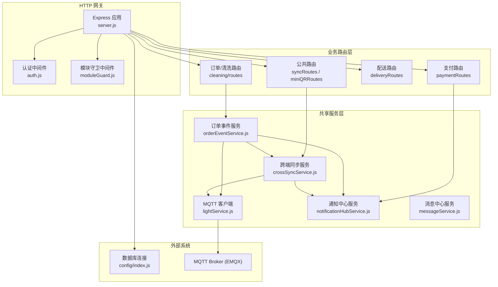
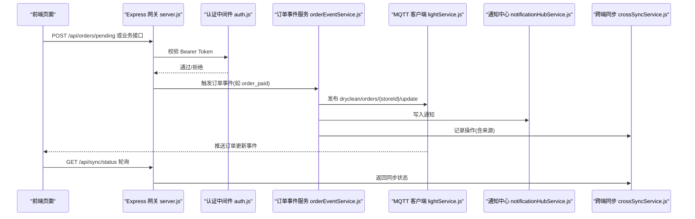
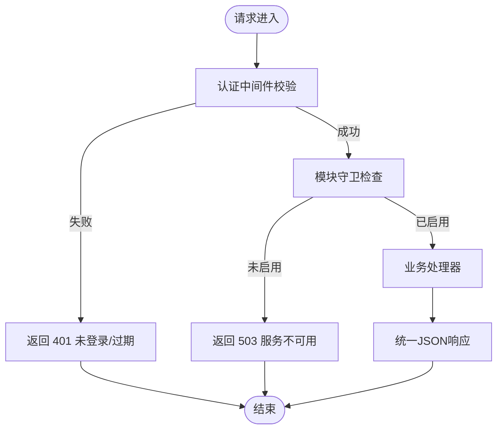
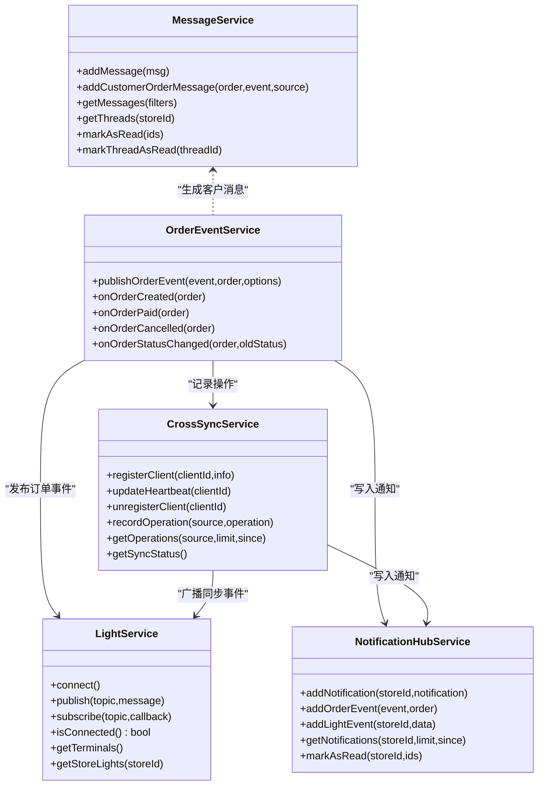
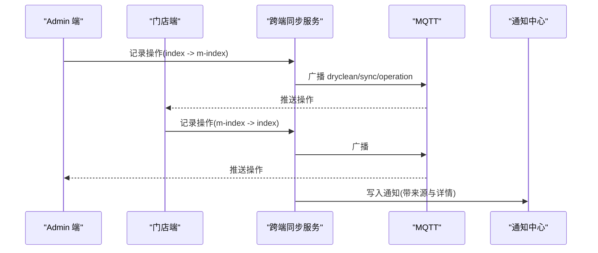
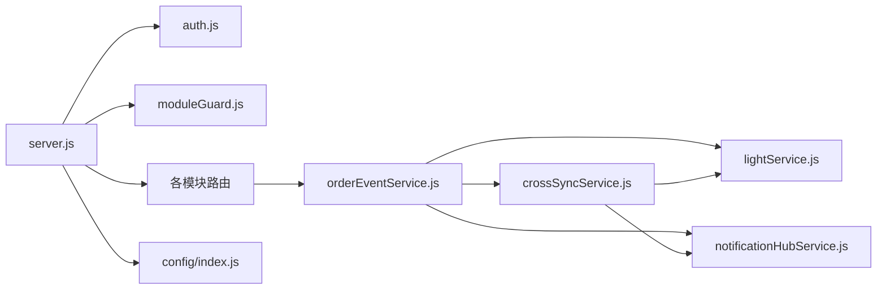

# 模块间通信

<cite>
**本文引用的文件**   
- [backend/server.js](file://backend/server.js)
- [backend/config/index.js](file://backend/config/index.js)
- [backend/config/modules.js](file://backend/config/modules.js)
- [backend/modules/common/middlewares/moduleGuard.js](file://backend/modules/common/middlewares/moduleGuard.js)
- [backend/modules/common/middlewares/auth.js](file://backend/modules/common/middlewares/auth.js)
- [backend/services/lightService.js](file://backend/services/lightService.js)
- [backend/services/orderEventService.js](file://backend/services/orderEventService.js)
- [backend/services/crossSyncService.js](file://backend/services/crossSyncService.js)
- [backend/services/notificationHubService.js](file://backend/services/notificationHubService.js)
- [backend/services/messageService.js](file://backend/services/messageService.js)
- [js/order-event-client.js](file://js/order-event-client.js)
- [js/cross-sync-client.js](file://js/cross-sync-client.js)
- [js/message-center.js](file://js/message-center.js)
- [api/payment-api.js](file://api/payment-api.js)
</cite>

## 目录
1. [简介](#简介)
2. [项目结构](#项目结构)
3. [核心组件](#核心组件)
4. [架构总览](#架构总览)
5. [详细组件分析](#详细组件分析)
6. [依赖关系分析](#依赖关系分析)
7. [性能与可扩展性](#性能与可扩展性)
8. [故障排查指南](#故障排查指南)
9. [结论](#结论)
10. [附录：API与主题规范](#附录api与主题规范)

## 简介
本文件系统性梳理干洗店管理系统的模块间通信模式，覆盖以下方面：
- HTTP API 调用模式（RESTful 接口设计、路由分发、响应格式）
- 事件驱动通信（MQTT 发布/订阅、主题与消息路由）
- 共享服务访问（全局服务单例、延迟加载、依赖注入式使用）
- 跨模块数据同步策略（一致性、缓存、冲突解决）
- 错误处理与异常传播（错误码、日志、恢复）
- 实际通信示例与最佳实践建议

## 项目结构
后端采用 Express 作为统一入口，按业务域划分模块路由与服务；通过中间件实现认证与模块开关控制；通过 MQTT Broker（EMQX）进行实时事件广播；前端通过 WebSocket 订阅事件并轮询兜底。

图示来源
- [backend/server.js:1-152](file://backend/server.js#L1-L152)
- [backend/modules/common/middlewares/auth.js:1-209](file://backend/modules/common/middlewares/auth.js#L1-L209)
- [backend/modules/common/middlewares/moduleGuard.js:1-84](file://backend/modules/common/middlewares/moduleGuard.js#L1-L84)
- [backend/services/lightService.js:1-234](file://backend/services/lightService.js#L1-L234)
- [backend/services/orderEventService.js:1-168](file://backend/services/orderEventService.js#L1-L168)
- [backend/services/crossSyncService.js:1-336](file://backend/services/crossSyncService.js#L1-L336)
- [backend/services/notificationHubService.js:1-264](file://backend/services/notificationHubService.js#L1-L264)
- [backend/services/messageService.js:1-247](file://backend/services/messageService.js#L1-L247)
- [backend/config/index.js:1-167](file://backend/config/index.js#L1-L167)

章节来源
- [backend/server.js:1-152](file://backend/server.js#L1-L152)
- [backend/config/index.js:1-167](file://backend/config/index.js#L1-L167)

## 核心组件
- 统一网关与路由分发：Express 应用集中挂载各模块路由，提供健康检查、系统信息、支付回调等通用接口。
- 认证与权限：基于 Bearer Token 的认证中间件，支持开发模式 mock 令牌与角色校验。
- 模块开关：通过配置与守卫中间件动态启用/禁用模块，返回友好提示。
- MQTT 客户端：封装 EMQX 连接、心跳、重连、终端状态维护与主题订阅。
- 订单事件服务：将订单状态变更以 MQTT 广播到门店级与全局主题，同时写入通知中心与跨端同步记录。
- 跨端同步服务：桥接 Admin 与门店端操作，维护在线客户端、心跳、操作历史与去重。
- 通知中心服务：聚合各类业务事件，供 Admin 端轮询获取。
- 消息中心服务：面向客户消息与账户通讯，提供线程聚合与未读计数。

章节来源
- [backend/server.js:1-152](file://backend/server.js#L1-L152)
- [backend/modules/common/middlewares/auth.js:1-209](file://backend/modules/common/middlewares/auth.js#L1-L209)
- [backend/modules/common/middlewares/moduleGuard.js:1-84](file://backend/modules/common/middlewares/moduleGuard.js#L1-L84)
- [backend/services/lightService.js:1-234](file://backend/services/lightService.js#L1-L234)
- [backend/services/orderEventService.js:1-168](file://backend/services/orderEventService.js#L1-L168)
- [backend/services/crossSyncService.js:1-336](file://backend/services/crossSyncService.js#L1-L336)
- [backend/services/notificationHubService.js:1-264](file://backend/services/notificationHubService.js#L1-L264)
- [backend/services/messageService.js:1-247](file://backend/services/messageService.js#L1-L247)

## 架构总览
系统采用“HTTP + MQTT”双通道混合通信：
- HTTP 用于请求-响应式交互（创建订单、查询、支付、消息、同步注册/心跳等）。
- MQTT 用于实时事件推送（订单更新、跨端操作广播、心跳）。

图示来源
- [backend/server.js:1-152](file://backend/server.js#L1-L152)
- [backend/modules/common/middlewares/auth.js:1-209](file://backend/modules/common/middlewares/auth.js#L1-L209)
- [backend/services/orderEventService.js:1-168](file://backend/services/orderEventService.js#L1-L168)
- [backend/services/lightService.js:1-234](file://backend/services/lightService.js#L1-L234)
- [backend/services/notificationHubService.js:1-264](file://backend/services/notificationHubService.js#L1-L264)
- [backend/services/crossSyncService.js:1-336](file://backend/services/crossSyncService.js#L1-L336)

## 详细组件分析

### HTTP API 调用模式
- 路由组织
  - 根路由集中在 backend/server.js，按领域挂载路由：认证、门店、清洗、回收、租赁、分类、支付、小程序码、配送、会员、管理员、连锁后台、价格、门店公共、订单灯条、取件、同步等。
  - 健康检查与系统信息接口无需模块守卫，便于外部探测。
- 认证与授权
  - 认证中间件支持 Bearer Token，开发环境兼容 dev-admin-/dev-chain-/mock_token_ 前缀，简化联调。
  - 可选认证中间件允许部分接口在携带 token 时解析用户上下文。
  - 角色校验工厂函数可按需保护接口。
- 模块开关
  - 模块配置位于 backend/config/modules.js，包含模块元信息与功能开关。
  - 模块守卫中间件根据配置返回 503 与友好提示，避免直接 404。
- 响应格式
  - 统一 JSON 包裹 { success, data?, error?, message? }，错误路径返回具体错误码与消息。
  - 全局错误处理捕获未预期异常，返回 500 与标准化错误体。

图示来源
- [backend/server.js:1-152](file://backend/server.js#L1-L152)
- [backend/modules/common/middlewares/auth.js:1-209](file://backend/modules/common/middlewares/auth.js#L1-L209)
- [backend/modules/common/middlewares/moduleGuard.js:1-84](file://backend/modules/common/middlewares/moduleGuard.js#L1-L84)
- [backend/config/modules.js:1-203](file://backend/config/modules.js#L1-L203)

章节来源
- [backend/server.js:1-152](file://backend/server.js#L1-L152)
- [backend/modules/common/middlewares/auth.js:1-209](file://backend/modules/common/middlewares/auth.js#L1-L209)
- [backend/modules/common/middlewares/moduleGuard.js:1-84](file://backend/modules/common/middlewares/moduleGuard.js#L1-L84)
- [backend/config/modules.js:1-203](file://backend/config/modules.js#L1-L203)

### 事件驱动通信机制（MQTT）
- 主题设计
  - 订单更新：dryclean/orders/{storeId}/update（门店级）、dryclean/orders/all/update（全局）
  - 跨端同步：dryclean/sync/operation（操作广播）、dryclean/sync/heartbeat（心跳）
  - 终端灯条：dryclean/{env}/{store}/light/*（心跳、状态、主消息）
- 发布/订阅
  - 后端通过 lightService 连接 EMQX，统一 publish/subscribe。
  - 前端通过 js/order-event-client.js 订阅订单主题，js/cross-sync-client.js 订阅同步主题。
- 消息路由规则
  - 订单事件由 orderEventService 构造 payload，按 storeId 与 all 双主题广播。
  - 跨端同步由 crossSyncService 记录操作后广播，附带 clientId 与 syncId 用于去重。
  - 通知中心与消息中心在事件发生时同步落库，供轮询查询。

图示来源
- [backend/services/lightService.js:1-234](file://backend/services/lightService.js#L1-L234)
- [backend/services/orderEventService.js:1-168](file://backend/services/orderEventService.js#L1-L168)
- [backend/services/crossSyncService.js:1-336](file://backend/services/crossSyncService.js#L1-L336)
- [backend/services/notificationHubService.js:1-264](file://backend/services/notificationHubService.js#L1-L264)
- [backend/services/messageService.js:1-247](file://backend/services/messageService.js#L1-L247)

章节来源
- [backend/services/lightService.js:1-234](file://backend/services/lightService.js#L1-L234)
- [backend/services/orderEventService.js:1-168](file://backend/services/orderEventService.js#L1-L168)
- [backend/services/crossSyncService.js:1-336](file://backend/services/crossSyncService.js#L1-L336)
- [backend/services/notificationHubService.js:1-264](file://backend/services/notificationHubService.js#L1-L264)
- [backend/services/messageService.js:1-247](file://backend/services/messageService.js#L1-L247)

### 共享服务访问模式
- 全局服务注册表
  - 服务以单例形式导出（如 messageService、notificationHubService、crossSyncService），在需要处 require 延迟加载，避免循环依赖。
- 服务查找机制
  - 通过 getMqttClient()/getNotificationHub()/getCrossSyncService()/getMessageService 等内部函数按需引入，若不可用则安全降级。
- 依赖注入容器
  - 当前采用“显式 require + 延迟加载”的轻量 DI 方式，保持模块解耦与可测试性。

章节来源
- [backend/services/orderEventService.js:1-168](file://backend/services/orderEventService.js#L1-L168)
- [backend/services/crossSyncService.js:1-336](file://backend/services/crossSyncService.js#L1-L336)
- [backend/services/messageService.js:1-247](file://backend/services/messageService.js#L1-L247)
- [backend/services/notificationHubService.js:1-264](file://backend/services/notificationHubService.js#L1-L264)

### 跨模块数据同步策略
- 一致性保证
  - 订单事件经 MQTT 广播，同时写入通知中心与跨端同步记录，确保多端可见性与审计。
  - 跨端同步记录包含 source、action、orderId、orderNo、storeId、data 等字段，便于溯源。
- 缓存与去重
  - 前端跨端同步客户端维护本地操作 ID 缓存，过滤自身操作与重复 syncId，避免回显与重复处理。
  - 服务端操作记录与通知均设置 TTL 与上限，定期清理。
- 冲突解决
  - 以服务端为权威源，前端收到对端操作后仅做 UI 同步与状态刷新，不直接写库。
  - 对于并发修改，后端业务逻辑应基于幂等键（如 orderId、transactionId）与乐观锁/版本号保障最终一致。

图示来源
- [backend/services/crossSyncService.js:1-336](file://backend/services/crossSyncService.js#L1-L336)
- [backend/services/notificationHubService.js:1-264](file://backend/services/notificationHubService.js#L1-L264)
- [js/cross-sync-client.js:1-399](file://js/cross-sync-client.js#L1-L399)

章节来源
- [backend/services/crossSyncService.js:1-336](file://backend/services/crossSyncService.js#L1-L336)
- [backend/services/notificationHubService.js:1-264](file://backend/services/notificationHubService.js#L1-L264)
- [js/cross-sync-client.js:1-399](file://js/cross-sync-client.js#L1-L399)

### 错误处理与异常传播
- 统一错误处理
  - Express 全局错误中间件捕获未处理异常，返回 500 与标准错误体。
- 认证错误
  - 未携带或无效 Bearer Token 返回 401，并标注 needLogin。
- 模块不可用
  - 模块守卫返回 503，附带 module、moduleName、launchDate 等提示。
- 日志与监控
  - 关键流程（MQTT 连接、事件发布、同步记录、通知写入）均有结构化日志输出，便于定位问题。
- 故障恢复
  - MQTT 客户端具备自动重连与保活机制；前端客户端具备指数退避重连与轮询降级。

章节来源
- [backend/server.js:599-702](file://backend/server.js#L599-L702)
- [backend/modules/common/middlewares/auth.js:1-209](file://backend/modules/common/middlewares/auth.js#L1-L209)
- [backend/modules/common/middlewares/moduleGuard.js:1-84](file://backend/modules/common/middlewares/moduleGuard.js#L1-L84)
- [backend/services/lightService.js:1-234](file://backend/services/lightService.js#L1-L234)
- [js/order-event-client.js:1-270](file://js/order-event-client.js#L1-L270)
- [js/cross-sync-client.js:1-399](file://js/cross-sync-client.js#L1-L399)

## 依赖关系分析
- 耦合与内聚
  - 路由层仅负责参数校验与转发，业务逻辑下沉至服务层，提升内聚度。
  - 服务层通过延迟加载降低循环依赖风险。
- 外部依赖
  - 数据库：MongoDB/MySQL 连接池与事务封装于 config/index.js。
  - MQTT：EMQX Broker，端口与鉴权通过环境变量配置。
- 潜在循环依赖
  - 通过延迟加载与条件 require 规避。

图示来源
- [backend/server.js:1-152](file://backend/server.js#L1-L152)
- [backend/modules/common/middlewares/auth.js:1-209](file://backend/modules/common/middlewares/auth.js#L1-L209)
- [backend/modules/common/middlewares/moduleGuard.js:1-84](file://backend/modules/common/middlewares/moduleGuard.js#L1-L84)
- [backend/services/orderEventService.js:1-168](file://backend/services/orderEventService.js#L1-L168)
- [backend/services/lightService.js:1-234](file://backend/services/lightService.js#L1-L234)
- [backend/services/notificationHubService.js:1-264](file://backend/services/notificationHubService.js#L1-L264)
- [backend/services/crossSyncService.js:1-336](file://backend/services/crossSyncService.js#L1-L336)
- [backend/config/index.js:1-167](file://backend/config/index.js#L1-L167)

章节来源
- [backend/server.js:1-152](file://backend/server.js#L1-L152)
- [backend/config/index.js:1-167](file://backend/config/index.js#L1-L167)

## 性能与可扩展性
- 连接与重连
  - MQTT 客户端设置 keepalive 与 reconnectPeriod，服务端定时 ensureConnected 保障健壮性。
- 资源限制
  - 通知与消息列表设置最大条目与 TTL，避免内存增长。
- 降级策略
  - 前端在 MQTT 不可用时自动切换轮询模式，保障基础可用性。
- 扩展点
  - 新增业务事件可在 orderEventService 中复用现有发布流程；新增同步类型在 crossSyncService 中扩展 actionMap。

[本节为通用指导，不涉及具体文件分析]

## 故障排查指南
- 常见问题
  - MQTT 无法连接：检查 Broker 地址、端口、用户名密码与网络连通性；查看 lightService 日志。
  - 事件未到达：确认主题订阅是否成功，检查前端 mqtt.js 加载与浏览器控制台。
  - 重复操作：核对客户端本地操作缓存与 syncId 去重逻辑。
  - 认证失败：检查 Authorization 头格式与前缀匹配（开发模式）。
- 诊断步骤
  - 使用 /api/health 与 /api/system/modules 验证服务与模块状态。
  - 通过 /api/sync/status 查看在线客户端与最近操作。
  - 查看通知中心与消息中心接口返回，确认数据写入。

章节来源
- [backend/services/lightService.js:1-234](file://backend/services/lightService.js#L1-L234)
- [js/order-event-client.js:1-270](file://js/order-event-client.js#L1-L270)
- [js/cross-sync-client.js:1-399](file://js/cross-sync-client.js#L1-L399)
- [backend/server.js:55-90](file://backend/server.js#L55-L90)

## 结论
本系统通过“HTTP + MQTT”的组合实现了高内聚、低耦合的模块间通信：
- HTTP 提供稳定可靠的请求-响应能力与统一的错误处理。
- MQTT 提供低延迟的事件广播与跨端协同。
- 共享服务以延迟加载的单例形式被消费，兼顾解耦与性能。
- 数据同步通过服务端权威源与前端去重策略达成最终一致。
- 完善的错误处理与降级策略提升了整体鲁棒性。

[本节为总结，不涉及具体文件分析]

## 附录：API与主题规范

### RESTful 接口要点
- 统一响应体
  - 成功：{ success: true, data: ... }
  - 失败：{ success: false, error: "...", message: "..." }
- 典型接口
  - 健康检查：GET /api/health
  - 系统模块：GET /api/system/modules、GET /api/system/modules/:name
  - 认证：/api/auth/*（由认证中间件保护）
  - 支付：/api/payment/create、/api/payment/query/:orderId、/api/payment/callback
  - 同步：/api/sync/status、/api/sync/register、/api/sync/heartbeat、/api/sync/unregister、/api/sync/operations、/api/sync/notify-operation
  - 通知：/api/admin/notifications/:storeId、/api/admin/notifications、/api/admin/notifications/:storeId/mark-read
  - 消息：/api/messages/threads、/api/messages、/api/messages/unread-count、/api/messages、/api/messages/read

章节来源
- [backend/server.js:55-152](file://backend/server.js#L55-L152)
- [backend/server.js:156-393](file://backend/server.js#L156-L393)
- [backend/server.js:399-523](file://backend/server.js#L399-L523)

### MQTT 主题与消息
- 主题
  - 订单更新：dryclean/orders/{storeId}/update、dryclean/orders/all/update
  - 跨端同步：dryclean/sync/operation、dryclean/sync/heartbeat
  - 终端灯条：dryclean/{env}/{store}/light/*
- 消息关键字段（订单事件）
  - event、orderId、orderNo、storeId、userId、status、paymentMethod、totalAmount、items、customerName、createdFrom、_source、_oldStatus、updatedAt
- 前端订阅
  - 订单事件客户端：js/order-event-client.js
  - 跨端同步客户端：js/cross-sync-client.js

章节来源
- [backend/services/orderEventService.js:1-168](file://backend/services/orderEventService.js#L1-L168)
- [backend/services/crossSyncService.js:1-336](file://backend/services/crossSyncService.js#L1-L336)
- [js/order-event-client.js:1-270](file://js/order-event-client.js#L1-L270)
- [js/cross-sync-client.js:1-399](file://js/cross-sync-client.js#L1-L399)

### 最佳实践
- 选择通信模式
  - 强一致与幂等写操作优先走 HTTP，配合唯一键与重试。
  - 实时展示与跨端联动优先走 MQTT，前端做好降级与去重。
- 错误与重试
  - 所有外部调用（支付、第三方）需实现超时与重试，并对幂等键进行保护。
- 可观测性
  - 关键路径打点日志，结合 /api/sync/status 与通知中心快速定位问题。
- 扩展新事件
  - 在 orderEventService 中定义事件类型与主题映射，并在前端订阅相应主题。

[本节为通用指导，不涉及具体文件分析]