# 系统架构设计

<cite>
**本文引用的文件**   
- [backend/server.js](file://backend/server.js)
- [backend/config/index.js](file://backend/config/index.js)
- [backend/config/database.js](file://backend/config/database.js)
- [backend/config/modules.js](file://backend/config/modules.js)
- [backend/modules/cleaning/routes.js](file://backend/modules/cleaning/routes.js)
- [backend/modules/recycle/routes.js](file://backend/modules/recycle/routes.js)
- [backend/modules/rental/routes.js](file://backend/modules/rental/routes.js)
- [backend/modules/common/middlewares/moduleGuard.js](file://backend/modules/common/middlewares/moduleGuard.js)
- [backend/modules/common/middlewares/auth.js](file://backend/modules/common/middlewares/auth.js)
- [backend/services/lightService.js](file://backend/services/lightService.js)
- [backend/services/messageService.js](file://backend/services/messageService.js)
- [backend/services/notificationHubService.js](file://backend/services/notificationHubService.js)
- [backend/services/crossSyncService.js](file://backend/services/crossSyncService.js)
- [backend/docker-compose.yml](file://backend/docker-compose.yml)
- [ecosystem.config.js](file://ecosystem.config.js)
</cite>

## 目录
1. [引言](#引言)
2. [项目结构](#项目结构)
3. [核心组件](#核心组件)
4. [架构总览](#架构总览)
5. [详细组件分析](#详细组件分析)
6. [依赖关系分析](#依赖关系分析)
7. [性能与扩展性](#性能与扩展性)
8. [故障排查指南](#故障排查指南)
9. [结论](#结论)
10. [附录](#附录)

## 引言
本架构设计文档面向架构师与高级开发者，系统化阐述干洗店管理系统的分层架构、模块化与微服务化实现。重点覆盖：
- Express 作为 API 网关的职责、路由分发机制与中间件体系
- 数据库连接管理策略与 MySQL/MongoDB 双模式切换
- 业务模块（cleaning、recycle、rental）的独立设计与动态启用机制
- 微服务间通信模式（HTTP API 与 MQTT 消息推送）
- 系统架构图与数据流图、部署拓扑、扩展性与性能优化建议

## 项目结构
后端采用“单体应用 + 模块化”的渐进式架构，以 Express 为统一入口，按领域划分 modules，并通过配置中心控制模块开关；同时集成 MQTT 能力用于实时通知与设备联动。

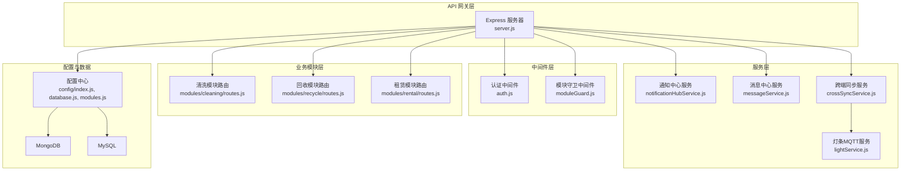

图表来源
- [backend/server.js:1-152](file://backend/server.js#L1-L152)
- [backend/modules/common/middlewares/auth.js:1-207](file://backend/modules/common/middlewares/auth.js#L1-L207)
- [backend/modules/common/middlewares/moduleGuard.js:1-84](file://backend/modules/common/middlewares/moduleGuard.js#L1-L84)
- [backend/modules/cleaning/routes.js:1-120](file://backend/modules/cleaning/routes.js#L1-L120)
- [backend/modules/recycle/routes.js:1-39](file://backend/modules/recycle/routes.js#L1-L39)
- [backend/modules/rental/routes.js:1-156](file://backend/modules/rental/routes.js#L1-L156)
- [backend/services/notificationHubService.js:1-120](file://backend/services/notificationHubService.js#L1-L120)
- [backend/services/messageService.js:1-120](file://backend/services/messageService.js#L1-L120)
- [backend/services/crossSyncService.js:1-120](file://backend/services/crossSyncService.js#L1-L120)
- [backend/services/lightService.js:1-120](file://backend/services/lightService.js#L1-L120)
- [backend/config/index.js:1-167](file://backend/config/index.js#L1-L167)
- [backend/config/database.js:1-65](file://backend/config/database.js#L1-L65)
- [backend/config/modules.js:1-203](file://backend/config/modules.js#L1-L203)

章节来源
- [backend/server.js:1-152](file://backend/server.js#L1-L152)
- [backend/config/index.js:1-167](file://backend/config/index.js#L1-L167)
- [backend/config/database.js:1-65](file://backend/config/database.js#L1-L65)
- [backend/config/modules.js:1-203](file://backend/config/modules.js#L1-L203)

## 核心组件
- API 网关（Express）
  - 统一加载中间件（CORS、BodyParser）、静态资源与健康检查
  - 注册各业务模块路由与公共接口（认证、支付、配送、门店、管理员等）
  - 启动时初始化数据库与 MQTT 客户端，提供优雅关闭与异常处理
- 配置与数据访问
  - 单例化的数据库连接管理，支持 MongoDB 与 MySQL 双模式
  - 模块开关与功能特性集中配置，支持运行时查询已启用模块
- 业务模块
  - cleaning：完整的订单生命周期与定价、门店配置、取件方式、智能灯条联动
  - recycle：V2 预留能力，当前返回“即将上线”占位
  - rental：服饰与小件商品租赁的双向跑腿模型（发货/归还）
- 服务层
  - 通知中心：聚合订单事件与灯条事件，供 Admin 轮询
  - 消息中心：客户消息与账户通讯，线程化展示
  - 跨端同步：index ↔ m-index 操作同步、心跳与去重
  - 灯条 MQTT：终端注册、心跳、状态管理与发布订阅
- 中间件
  - 认证：Bearer Token 解析、开发模式兼容、可选认证
  - 模块守卫：按模块开关拦截未启用模块请求

章节来源
- [backend/server.js:1-152](file://backend/server.js#L1-L152)
- [backend/config/index.js:1-167](file://backend/config/index.js#L1-L167)
- [backend/config/database.js:1-65](file://backend/config/database.js#L1-L65)
- [backend/config/modules.js:1-203](file://backend/config/modules.js#L1-L203)
- [backend/modules/cleaning/routes.js:1-120](file://backend/modules/cleaning/routes.js#L1-L120)
- [backend/modules/recycle/routes.js:1-39](file://backend/modules/recycle/routes.js#L1-L39)
- [backend/modules/rental/routes.js:1-156](file://backend/modules/rental/routes.js#L1-L156)
- [backend/services/notificationHubService.js:1-120](file://backend/services/notificationHubService.js#L1-L120)
- [backend/services/messageService.js:1-120](file://backend/services/messageService.js#L1-L120)
- [backend/services/crossSyncService.js:1-120](file://backend/services/crossSyncService.js#L1-L120)
- [backend/services/lightService.js:1-120](file://backend/services/lightService.js#L1-L120)
- [backend/modules/common/middlewares/auth.js:1-207](file://backend/modules/common/middlewares/auth.js#L1-L207)
- [backend/modules/common/middlewares/moduleGuard.js:1-84](file://backend/modules/common/middlewares/moduleGuard.js#L1-L84)

## 架构总览
系统采用分层架构与模块化设计，Express 作为 API 网关承担路由分发与中间件编排；服务层通过内存缓存与 MQTT 实现实时能力；数据层支持 MySQL/MongoDB 双模式，通过环境变量切换。

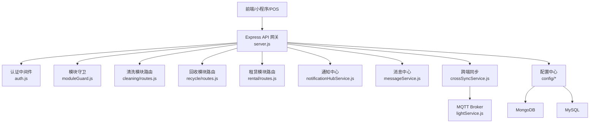

图表来源
- [backend/server.js:1-152](file://backend/server.js#L1-L152)
- [backend/modules/common/middlewares/auth.js:1-207](file://backend/modules/common/middlewares/auth.js#L1-L207)
- [backend/modules/common/middlewares/moduleGuard.js:1-84](file://backend/modules/common/middlewares/moduleGuard.js#L1-L84)
- [backend/modules/cleaning/routes.js:1-120](file://backend/modules/cleaning/routes.js#L1-L120)
- [backend/modules/recycle/routes.js:1-39](file://backend/modules/recycle/routes.js#L1-L39)
- [backend/modules/rental/routes.js:1-156](file://backend/modules/rental/routes.js#L1-L156)
- [backend/services/notificationHubService.js:1-120](file://backend/services/notificationHubService.js#L1-L120)
- [backend/services/messageService.js:1-120](file://backend/services/messageService.js#L1-L120)
- [backend/services/crossSyncService.js:1-120](file://backend/services/crossSyncService.js#L1-L120)
- [backend/services/lightService.js:1-120](file://backend/services/lightService.js#L1-L120)
- [backend/config/index.js:1-167](file://backend/config/index.js#L1-L167)
- [backend/config/database.js:1-65](file://backend/config/database.js#L1-L65)

## 详细组件分析

### API 网关与路由分发
- 职责
  - 全局中间件：CORS、JSON/表单解析、静态资源、健康检查
  - 模块路由挂载：认证、门店、清洗、回收、租赁、分类、支付、配送、会员、管理员、连锁后台、价格、门店公共、订单-灯条绑定、取件、同步、通知、消息、POS、会员卡、统一支付
  - 启动流程：初始化数据库、尝试连接 MQTT、监听端口、错误与优雅关闭
- 关键路径
  - /api/system/modules 与 /api/system/modules/:name 暴露模块元数据与启用状态
  - /api/health 健康检查
  - 各业务模块前缀路由统一挂载

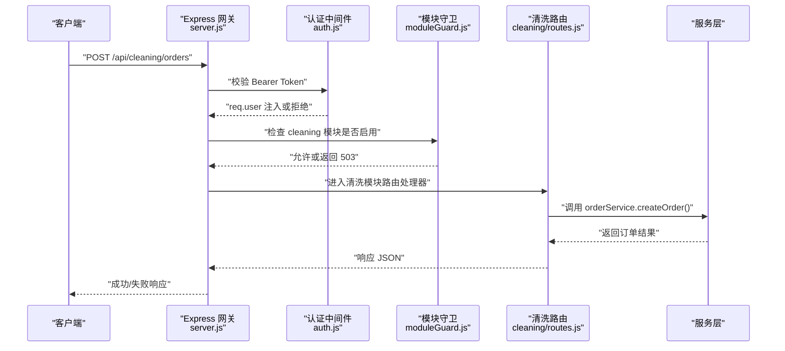

图表来源
- [backend/server.js:1-152](file://backend/server.js#L1-L152)
- [backend/modules/common/middlewares/auth.js:1-207](file://backend/modules/common/middlewares/auth.js#L1-L207)
- [backend/modules/common/middlewares/moduleGuard.js:1-84](file://backend/modules/common/middlewares/moduleGuard.js#L1-L84)
- [backend/modules/cleaning/routes.js:1-120](file://backend/modules/cleaning/routes.js#L1-L120)

章节来源
- [backend/server.js:1-152](file://backend/server.js#L1-L152)
- [backend/modules/cleaning/routes.js:1-120](file://backend/modules/cleaning/routes.js#L1-L120)

### 中间件体系
- 认证中间件
  - 支持 Bearer Token 解析与开发模式兼容（dev-admin/dev-chain/mock_token）
  - optionalAuth 允许匿名访问但可携带用户上下文
  - requireRoles 工厂方法用于角色校验
- 模块守卫中间件
  - 根据 config/modules.js 中 enabled 字段决定是否放行
  - 未启用模块返回 503 并附带友好提示与上线时间

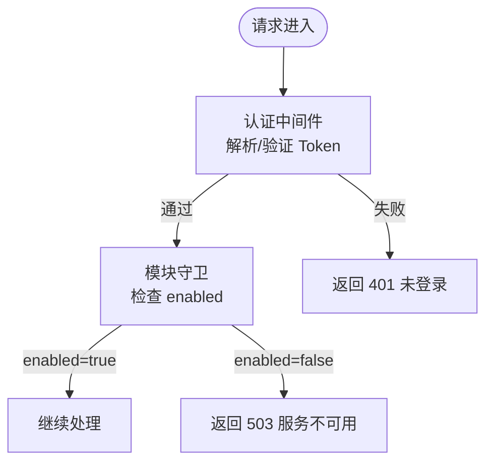

图表来源
- [backend/modules/common/middlewares/auth.js:1-207](file://backend/modules/common/middlewares/auth.js#L1-L207)
- [backend/modules/common/middlewares/moduleGuard.js:1-84](file://backend/modules/common/middlewares/moduleGuard.js#L1-L84)

章节来源
- [backend/modules/common/middlewares/auth.js:1-207](file://backend/modules/common/middlewares/auth.js#L1-L207)
- [backend/modules/common/middlewares/moduleGuard.js:1-84](file://backend/modules/common/middlewares/moduleGuard.js#L1-L84)

### 数据库连接管理与双模式切换
- 单例连接管理
  - initDatabase 根据配置 type 选择 MongoDB 或 MySQL
  - initMongoDB/initMySQL 分别建立连接/连接池，并提供 getMongoose/getMySQLPool
  - closeDatabase 统一关闭连接
- 配置项
  - DB_TYPE 决定使用 mongodb 或 mysql
  - MySQL 连接池参数、SSL、时区、日志开关
  - MongoDB URI 与选项（最大连接数、超时）
  - Redis 配置（预留缓存）

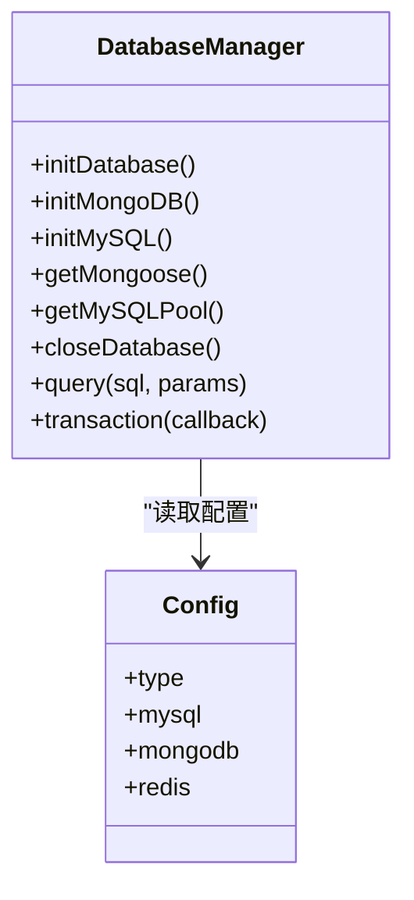

图表来源
- [backend/config/index.js:1-167](file://backend/config/index.js#L1-L167)
- [backend/config/database.js:1-65](file://backend/config/database.js#L1-L65)

章节来源
- [backend/config/index.js:1-167](file://backend/config/index.js#L1-L167)
- [backend/config/database.js:1-65](file://backend/config/database.js#L1-L65)

### 模块化业务架构与动态启用
- 模块定义
  - cleaning：已启用，完整订单与定价、门店配置、取件方式、灯条联动
  - recycle：未启用，占位返回“即将上线”
  - rental：已启用，双向跑腿模型（发货/归还），押金与信用评估
- 动态启用
  - 通过 moduleGuard 在路由级拦截
  - /api/system/modules 与 /api/system/modules/:name 暴露模块元数据与启用状态

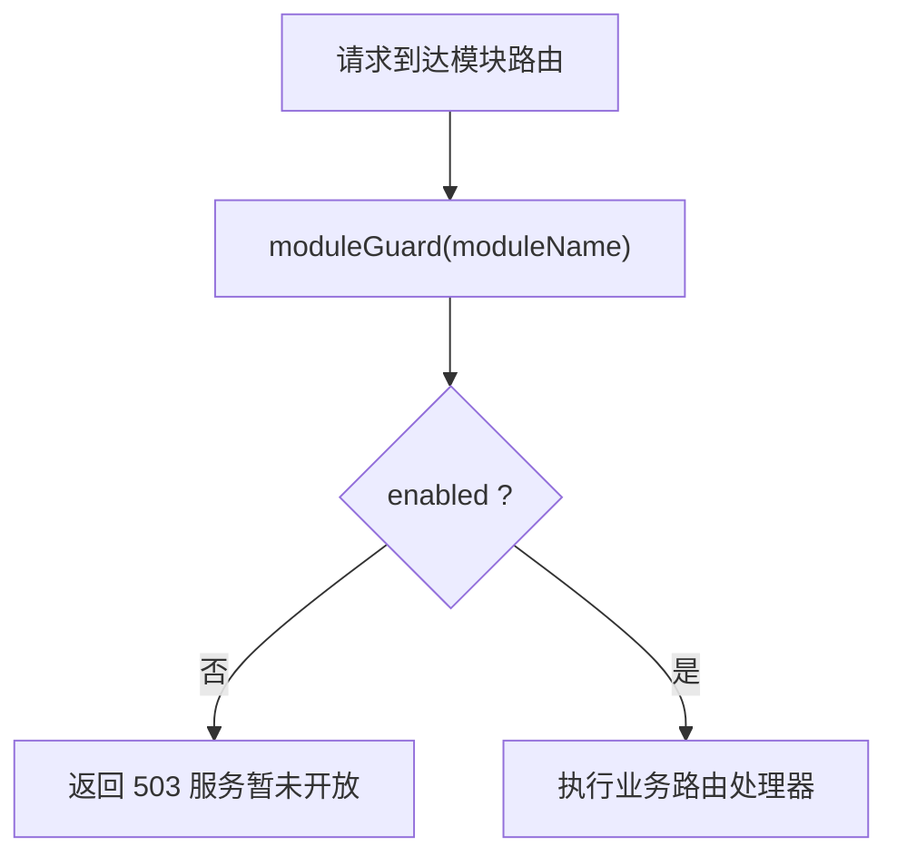

图表来源
- [backend/modules/common/middlewares/moduleGuard.js:1-84](file://backend/modules/common/middlewares/moduleGuard.js#L1-L84)
- [backend/config/modules.js:1-203](file://backend/config/modules.js#L1-L203)
- [backend/modules/recycle/routes.js:1-39](file://backend/modules/recycle/routes.js#L1-L39)
- [backend/modules/rental/routes.js:1-156](file://backend/modules/rental/routes.js#L1-L156)
- [backend/modules/cleaning/routes.js:1-120](file://backend/modules/cleaning/routes.js#L1-L120)

章节来源
- [backend/config/modules.js:1-203](file://backend/config/modules.js#L1-L203)
- [backend/modules/recycle/routes.js:1-39](file://backend/modules/recycle/routes.js#L1-L39)
- [backend/modules/rental/routes.js:1-156](file://backend/modules/rental/routes.js#L1-L156)
- [backend/modules/cleaning/routes.js:1-120](file://backend/modules/cleaning/routes.js#L1-L120)

### 微服务间通信模式（HTTP API 与 MQTT）
- HTTP API
  - 统一支付接口、POS、会员卡、消息中心、通知中心、跨端同步等 REST 接口
- MQTT 消息推送
  - 灯条服务负责连接 Broker、订阅终端心跳与状态、发布控制指令
  - 跨端同步服务将操作广播到主题，供多端实时同步
  - 通知中心与消息中心配合，形成“事件→通知/消息”的闭环

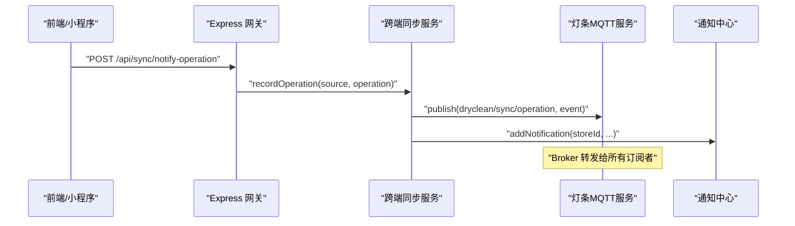

图表来源
- [backend/services/crossSyncService.js:1-200](file://backend/services/crossSyncService.js#L1-L200)
- [backend/services/lightService.js:1-120](file://backend/services/lightService.js#L1-L120)
- [backend/services/notificationHubService.js:1-120](file://backend/services/notificationHubService.js#L1-L120)
- [backend/server.js:210-298](file://backend/server.js#L210-L298)

章节来源
- [backend/services/crossSyncService.js:1-200](file://backend/services/crossSyncService.js#L1-L200)
- [backend/services/lightService.js:1-120](file://backend/services/lightService.js#L1-L120)
- [backend/services/notificationHubService.js:1-120](file://backend/services/notificationHubService.js#L1-L120)
- [backend/server.js:210-298](file://backend/server.js#L210-L298)

### 清洗模块（cleaning）关键流程
- 订单创建与状态流转
  - 创建订单 → 支付 → 入库/处理/清洗完成 → 待取件 → 配送/自提 → 完成
- 取件方式与跑腿服务商
  - 支持到店自提与配送到家，可选择服务商并支付配送费
- 智能灯条联动
  - 点亮/关闭灯条、获取状态，结合 MQTT 下发至终端

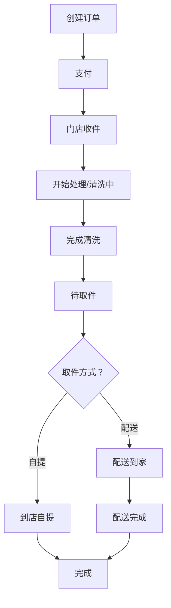

图表来源
- [backend/modules/cleaning/routes.js:1-120](file://backend/modules/cleaning/routes.js#L1-L120)

章节来源
- [backend/modules/cleaning/routes.js:1-120](file://backend/modules/cleaning/routes.js#L1-L120)

### 回收模块（recycle）与租赁模块（rental）
- 回收模块
  - 当前为 V2 占位，所有接口返回“即将上线”
- 租赁模块
  - 双向跑腿模型：发货（门店→用户）、归还（用户→门店）
  - 订单生命周期：预约 → 发货 → 确认收货 → 发起归还 → 确认归还
  - 押金与信用评估接口预留

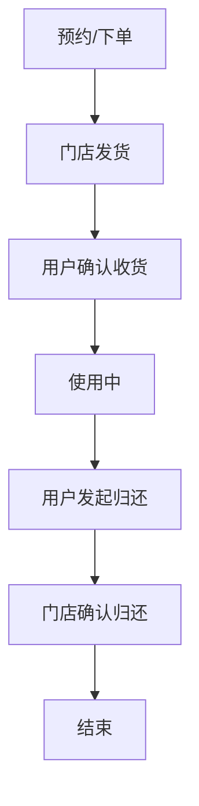

图表来源
- [backend/modules/rental/routes.js:1-156](file://backend/modules/rental/routes.js#L1-L156)
- [backend/modules/recycle/routes.js:1-39](file://backend/modules/recycle/routes.js#L1-L39)

章节来源
- [backend/modules/rental/routes.js:1-156](file://backend/modules/rental/routes.js#L1-L156)
- [backend/modules/recycle/routes.js:1-39](file://backend/modules/recycle/routes.js#L1-L39)

## 依赖关系分析
- 组件耦合
  - server.js 作为装配器，依赖中间件、模块路由与服务层
  - crossSyncService 依赖 lightService 与 notificationHubService
  - 模块路由依赖各自 service 与中间件
- 外部依赖
  - express、cors、body-parser、dotenv
  - mongoose、mysql2
  - mqtt（MQTT 客户端）
  - aedes/mosca（Broker 相关脚本）

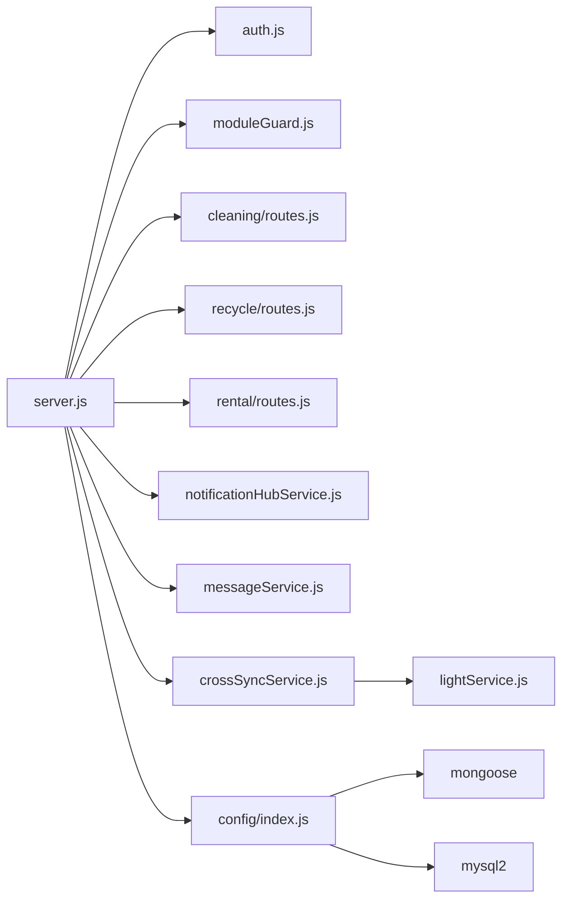

图表来源
- [backend/server.js:1-152](file://backend/server.js#L1-L152)
- [backend/modules/common/middlewares/auth.js:1-207](file://backend/modules/common/middlewares/auth.js#L1-L207)
- [backend/modules/common/middlewares/moduleGuard.js:1-84](file://backend/modules/common/middlewares/moduleGuard.js#L1-L84)
- [backend/modules/cleaning/routes.js:1-120](file://backend/modules/cleaning/routes.js#L1-L120)
- [backend/modules/recycle/routes.js:1-39](file://backend/modules/recycle/routes.js#L1-L39)
- [backend/modules/rental/routes.js:1-156](file://backend/modules/rental/routes.js#L1-L156)
- [backend/services/notificationHubService.js:1-120](file://backend/services/notificationHubService.js#L1-L120)
- [backend/services/messageService.js:1-120](file://backend/services/messageService.js#L1-L120)
- [backend/services/crossSyncService.js:1-120](file://backend/services/crossSyncService.js#L1-L120)
- [backend/services/lightService.js:1-120](file://backend/services/lightService.js#L1-L120)
- [backend/config/index.js:1-167](file://backend/config/index.js#L1-L167)

章节来源
- [backend/server.js:1-152](file://backend/server.js#L1-L152)
- [backend/config/index.js:1-167](file://backend/config/index.js#L1-L167)

## 性能与扩展性
- 数据库
  - MySQL 连接池参数可调（min/max/acquire/idle），MongoDB 最大连接数与超时可配置
  - 读写分离与分库分表可在后续演进中引入
- 并发与实例
  - PM2 配置默认 fork 单实例，生产可按 CPU 核数提升 instances 或使用 cluster 模式
  - 注意共享内存服务的限制（如通知中心、消息中心、跨端同步均为进程内内存）
- 实时通信
  - MQTT 连接保活与自动重连，定期 ensureConnected 保证健壮性
  - 心跳与离线清理避免僵尸连接
- 缓存与限流
  - 预留 Redis 配置，可用于热点数据缓存与会话存储
  - 建议在网关层增加速率限制与请求体大小限制
- 扩展性
  - 模块化开关便于灰度发布与按门店维度启用
  - 服务层逐步拆分为独立微服务（如支付、消息、通知、MQTT Broker 外置）

[本节为通用指导，不直接分析具体文件]

## 故障排查指南
- 启动与端口
  - 端口占用错误会输出诊断信息，建议使用 netstat 查看占用进程
- 数据库连接
  - 检查 DB_TYPE 与对应连接参数，确保网络可达与凭据正确
- MQTT 连接
  - 检查 Broker 地址、端口与认证配置，关注重连日志
- 模块不可用
  - 若返回 503，检查 config/modules.js 中对应模块 enabled 字段
- 认证失败
  - 检查 Authorization 头格式与 Token 有效性，开发模式可使用 mock_token

章节来源
- [backend/server.js:600-702](file://backend/server.js#L600-L702)
- [backend/config/index.js:1-167](file://backend/config/index.js#L1-L167)
- [backend/services/lightService.js:1-120](file://backend/services/lightService.js#L1-L120)
- [backend/modules/common/middlewares/moduleGuard.js:1-84](file://backend/modules/common/middlewares/moduleGuard.js#L1-L84)
- [backend/modules/common/middlewares/auth.js:1-207](file://backend/modules/common/middlewares/auth.js#L1-L207)

## 结论
本系统以 Express 为统一网关，采用模块化与中间件体系实现高内聚低耦合的业务组织；通过配置中心实现模块的动态启用与功能开关；数据库层支持 MySQL/MongoDB 双模式，满足不同场景需求；借助 MQTT 实现实时通知与设备联动，结合通知中心与消息中心形成完整的运营支撑能力。整体架构具备良好的可扩展性与运维可控性，适合从单体逐步演进为微服务。

[本节为总结，不直接分析具体文件]

## 附录

### 部署拓扑与环境
- Docker Compose
  - 提供 MongoDB 与 MySQL 容器模板，便于本地与测试环境快速搭建
- PM2 生态配置
  - 主后端服务与内置 MQTT Broker 双进程管理，含日志、重启策略与内存上限

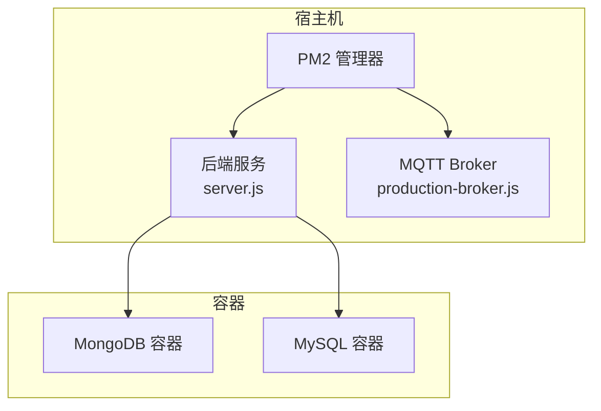

图表来源
- [backend/docker-compose.yml:1-34](file://backend/docker-compose.yml#L1-L34)
- [ecosystem.config.js:1-100](file://ecosystem.config.js#L1-L100)

章节来源
- [backend/docker-compose.yml:1-34](file://backend/docker-compose.yml#L1-L34)
- [ecosystem.config.js:1-100](file://ecosystem.config.js#L1-L100)