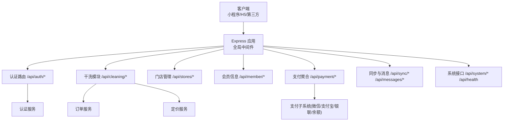
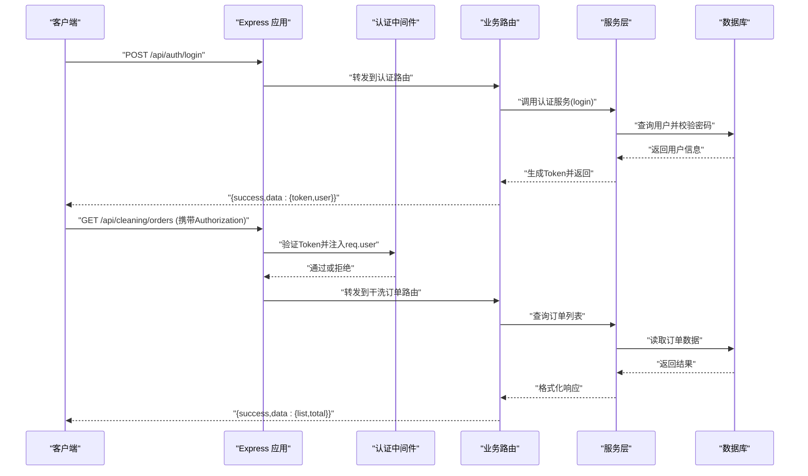
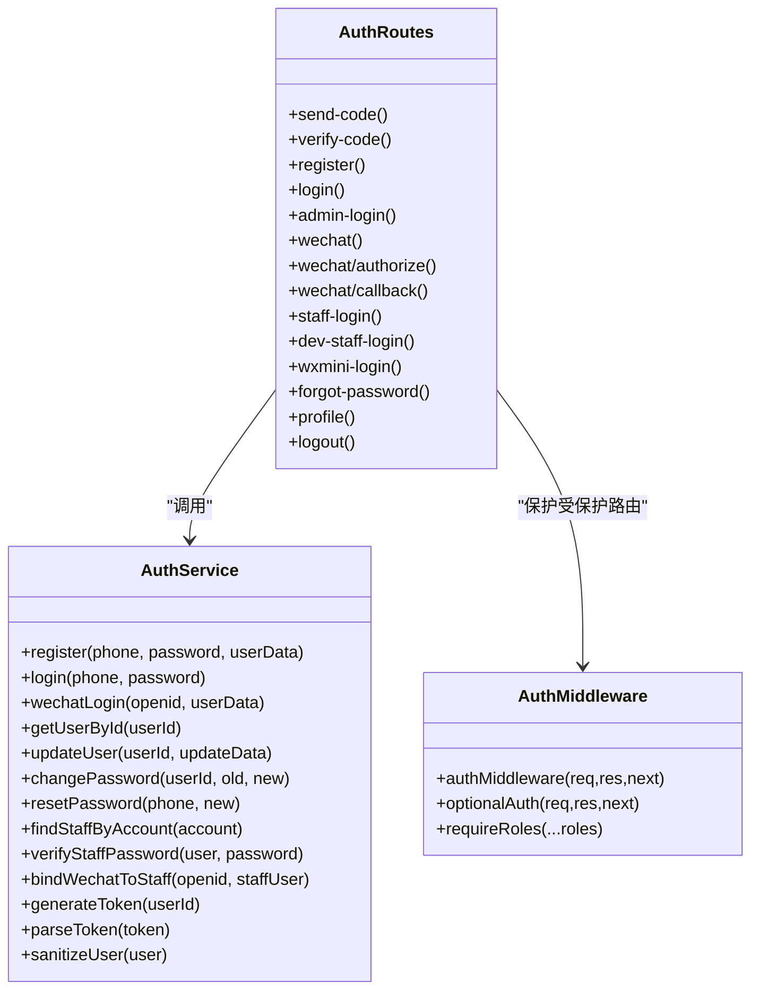
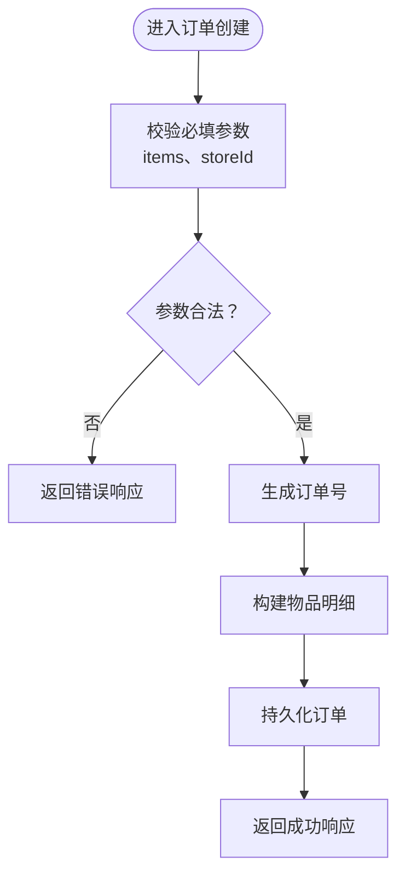
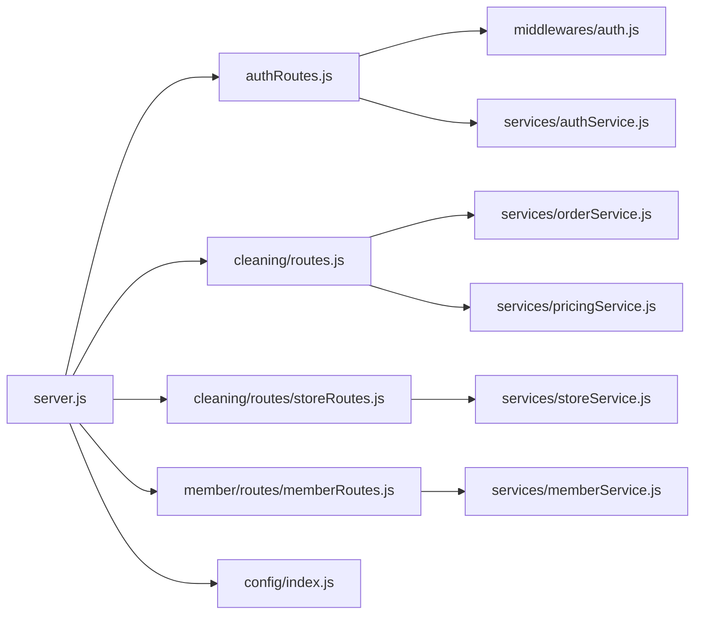

# HTTP RESTful API

<cite>
**本文引用的文件**   
- [backend/server.js](file://backend/server.js)
- [backend/modules/common/routes/authRoutes.js](file://backend/modules/common/routes/authRoutes.js)
- [backend/modules/common/middlewares/auth.js](file://backend/modules/common/middlewares/auth.js)
- [backend/modules/common/services/authService.js](file://backend/modules/common/services/authService.js)
- [backend/modules/cleaning/routes.js](file://backend/modules/cleaning/routes.js)
- [backend/modules/cleaning/routes/storeRoutes.js](file://backend/modules/cleaning/routes/storeRoutes.js)
- [backend/modules/member/routes/memberRoutes.js](file://backend/modules/member/routes/memberRoutes.js)
- [backend/config/index.js](file://backend/config/index.js)
- [api/API_DOCUMENTATION.md](file://api/API_DOCUMENTATION.md)
- [api/payment-api.js](file://api/payment-api.js)
</cite>

## 目录
1. [简介](#简介)
2. [项目结构](#项目结构)
3. [核心组件](#核心组件)
4. [架构总览](#架构总览)
5. [详细组件分析](#详细组件分析)
6. [依赖关系分析](#依赖关系分析)
7. [性能与扩展性](#性能与扩展性)
8. [故障排查指南](#故障排查指南)
9. [结论](#结论)
10. [附录：API 规范与集成指南](#附录api-规范与集成指南)

## 简介
本文件面向干洗系统后端 HTTP RESTful API，系统化阐述接口设计规范、版本策略、请求/响应格式、认证授权、网关与安全实践，并提供消费者集成与 SDK 使用建议。文档基于仓库中实际路由与服务实现进行归纳与提炼，确保读者可据此完成对接与二次开发。

## 项目结构
后端采用 Express 模块化架构，按业务域划分路由与服务，统一在入口文件中挂载。关键路径如下：
- 应用入口与全局中间件：[backend/server.js](file://backend/server.js)
- 认证与鉴权：[backend/modules/common/routes/authRoutes.js](file://backend/modules/common/routes/authRoutes.js)、[backend/modules/common/middlewares/auth.js](file://backend/modules/common/middlewares/auth.js)、[backend/modules/common/services/authService.js](file://backend/modules/common/services/authService.js)
- 干洗业务（订单、定价、门店）：[backend/modules/cleaning/routes.js](file://backend/modules/cleaning/routes.js)、[backend/modules/cleaning/routes/storeRoutes.js](file://backend/modules/cleaning/routes/storeRoutes.js)
- 会员信息：[backend/modules/member/routes/memberRoutes.js](file://backend/modules/member/routes/memberRoutes.js)
- 数据库配置与连接管理：[backend/config/index.js](file://backend/config/index.js)
- C端支付文档与前端支付SDK预留：[api/API_DOCUMENTATION.md](file://api/API_DOCUMENTATION.md)、[api/payment-api.js](file://api/payment-api.js)

图表来源
- [backend/server.js:96-151](file://backend/server.js#L96-L151)
- [backend/modules/cleaning/routes.js:1-20](file://backend/modules/cleaning/routes.js#L1-L20)
- [backend/modules/common/routes/authRoutes.js:1-20](file://backend/modules/common/routes/authRoutes.js#L1-L20)

章节来源
- [backend/server.js:1-151](file://backend/server.js#L1-L151)

## 核心组件
- 应用入口与路由挂载：统一注册各模块路由，提供健康检查与系统能力查询接口。
- 认证与鉴权：支持手机号+密码、短信验证码、微信小程序登录、网页微信授权、员工账号登录；基于自定义 Token 的鉴权中间件与可选认证中间件；角色权限控制。
- 干洗业务：订单全生命周期（创建、状态流转、取件方式、配送费支付、扫码取件、批量操作）、智能灯条控制、定价计算与门店配置同步。
- 门店管理：门店列表/详情、服务列表、员工账户管理与角色变更。
- 会员信息：可选认证的会员信息查询。
- 支付聚合：统一创建支付、查询、回调、余额充值等。
- 数据同步与消息中心：跨端在线状态、心跳、操作记录广播；消息线程与未读数。

章节来源
- [backend/server.js:55-151](file://backend/server.js#L55-L151)
- [backend/modules/common/routes/authRoutes.js:1-120](file://backend/modules/common/routes/authRoutes.js#L1-L120)
- [backend/modules/cleaning/routes.js:20-120](file://backend/modules/cleaning/routes.js#L20-L120)
- [backend/modules/cleaning/routes/storeRoutes.js:1-60](file://backend/modules/cleaning/routes/storeRoutes.js#L1-L60)
- [backend/modules/member/routes/memberRoutes.js:1-48](file://backend/modules/member/routes/memberRoutes.js#L1-L48)

## 架构总览
整体为单体 Express 应用，通过模块化路由组织业务域，配合中间件实现认证、鉴权与错误处理。支付功能以子模块形式集成，订单与门店相关逻辑由服务层封装，数据库通过单例连接管理。

图表来源
- [backend/modules/common/routes/authRoutes.js:66-80](file://backend/modules/common/routes/authRoutes.js#L66-L80)
- [backend/modules/common/middlewares/auth.js:10-38](file://backend/modules/common/middlewares/auth.js#L10-L38)
- [backend/modules/cleaning/routes.js:49-81](file://backend/modules/cleaning/routes.js#L49-L81)

## 详细组件分析

### 认证与授权
- 登录与注册
  - 手机号+密码登录、注册、发送/校验验证码
  - 微信小程序登录（code换openid）
  - 网页微信授权（生成授权URL与回调）
  - 员工账号登录（支持工号/手机号），返回 token、用户信息、门店信息与菜单权限
- 鉴权机制
  - 自定义 Token（Base64 编码的用户ID+时间戳+随机串），解析后从数据库加载用户信息并挂载至 req.user
  - 可选认证中间件 optionalAuth：允许匿名访问但携带有效 Token 时自动识别用户
  - 角色校验 requireRoles：限制特定角色访问
- 安全要点
  - 敏感字段清理（如 password）
  - 开发模式特殊 Token 兼容（便于本地调试）

图表来源
- [backend/modules/common/services/authService.js:63-198](file://backend/modules/common/services/authService.js#L63-L198)
- [backend/modules/common/middlewares/auth.js:10-138](file://backend/modules/common/middlewares/auth.js#L10-L138)
- [backend/modules/common/routes/authRoutes.js:1-120](file://backend/modules/common/routes/authRoutes.js#L1-L120)

章节来源
- [backend/modules/common/routes/authRoutes.js:1-120](file://backend/modules/common/routes/authRoutes.js#L1-L120)
- [backend/modules/common/middlewares/auth.js:1-209](file://backend/modules/common/middlewares/auth.js#L1-L209)
- [backend/modules/common/services/authService.js:1-200](file://backend/modules/common/services/authService.js#L1-L200)

### 干洗业务（订单与定价）
- 订单生命周期
  - 创建订单、获取列表（支持分页、状态筛选、按 userId/openid/phone 跨平台查询）
  - 订单详情、取消、软删除
  - 门店收件、开始处理、完成清洗、设置配送中、用户取件确认
  - 选择取件方式（到店自提/配送到家）、支付配送费、选择跑腿服务商、扫码取件
  - 一键取货（批量操作同一网点待取件订单）
  - 实时状态轮询接口（禁用缓存）
- 定价与门店配置
  - 价格计算、门店服务列表
  - 门店配置同步（服务类别/价格/促销），实时报价（含促销折扣计算）
- 智能灯条控制
  - 点亮/关闭取货灯、获取灯条状态

图表来源
- [backend/modules/cleaning/routes.js:24-42](file://backend/modules/cleaning/routes.js#L24-L42)
- [backend/modules/cleaning/services/orderService.js:177-200](file://backend/modules/cleaning/services/orderService.js#L177-L200)

章节来源
- [backend/modules/cleaning/routes.js:20-120](file://backend/modules/cleaning/routes.js#L20-L120)
- [backend/modules/cleaning/routes.js:474-564](file://backend/modules/cleaning/routes.js#L474-L564)
- [backend/modules/cleaning/routes.js:656-722](file://backend/modules/cleaning/routes.js#L656-L722)
- [backend/modules/cleaning/routes.js:724-800](file://backend/modules/cleaning/routes.js#L724-L800)

### 门店管理
- 公开接口：门店列表（支持分页、城市/区县/关键词/经纬度半径）、门店详情、门店服务列表
- 认证接口：创建/更新门店、我的门店列表、员工账户创建/移除/角色更新、员工列表（含详细信息）

章节来源
- [backend/modules/cleaning/routes/storeRoutes.js:1-194](file://backend/modules/cleaning/routes/storeRoutes.js#L1-L194)

### 会员信息
- 可选认证：有 Token 返回真实数据，无 Token 返回模拟数据（便于前端联调）

章节来源
- [backend/modules/member/routes/memberRoutes.js:1-48](file://backend/modules/member/routes/memberRoutes.js#L1-L48)

### 支付聚合
- 统一支付创建：根据支付方式（微信/支付宝/银联/余额）分发到对应处理器
- 支付查询与回调：预留查询与回调接口
- 余额查询与充值：便捷接口

章节来源
- [backend/server.js:398-523](file://backend/server.js#L398-L523)
- [api/API_DOCUMENTATION.md:1-120](file://api/API_DOCUMENTATION.md#L1-L120)
- [api/payment-api.js:1-120](file://api/payment-api.js#L1-L120)

## 依赖关系分析
- 入口 server.js 负责：
  - 全局中间件（CORS、JSON 解析、静态资源）
  - 健康检查与系统能力查询
  - 各模块路由挂载（认证、干洗、门店、会员、支付、同步、消息等）
- 认证链路：
  - authRoutes 暴露登录/注册/微信登录等
  - authMiddleware 解析 Token 并注入 req.user
  - authService 负责用户模型、密码哈希、Token 生成与解析、微信登录流程
- 业务链路：
  - cleaning routes 调用 orderService/pricingService 等
  - store routes 调用 storeService
  - member routes 调用 memberService
- 数据库：
  - config/index.js 提供 MongoDB/MySQL 连接管理、事务与查询封装

图表来源
- [backend/server.js:96-151](file://backend/server.js#L96-L151)
- [backend/modules/common/routes/authRoutes.js:1-20](file://backend/modules/common/routes/authRoutes.js#L1-L20)
- [backend/modules/cleaning/routes.js:1-20](file://backend/modules/cleaning/routes.js#L1-L20)

章节来源
- [backend/server.js:1-151](file://backend/server.js#L1-L151)
- [backend/config/index.js:1-167](file://backend/config/index.js#L1-L167)

## 性能与扩展性
- 数据库连接池与单例：MySQL 连接池与 MongoDB 连接复用，避免频繁握手开销。
- 响应缓存控制：订单状态轮询接口显式禁用缓存，保证实时性。
- 可扩展点：
  - 新增业务模块可通过独立路由文件并在入口挂载
  - 支付子系统已模块化，可按需接入更多渠道
  - 中间件体系可扩展（限流、审计、灰度等）

[本节为通用指导，不直接分析具体文件]

## 故障排查指南
- 常见错误码
  - 400：参数不完整或校验失败
  - 401：未登录或 Token 无效
  - 403：权限不足
  - 404：资源不存在
  - 500：服务器内部错误
- 定位步骤
  - 查看服务端日志输出（错误堆栈与业务日志）
  - 核对请求头 Authorization 是否包含 Bearer Token
  - 检查数据库连接状态与模块开关
  - 对支付问题，核对回调与签名参数

章节来源
- [backend/server.js:602-609](file://backend/server.js#L602-L609)
- [backend/modules/common/middlewares/auth.js:10-38](file://backend/modules/common/middlewares/auth.js#L10-L38)

## 结论
本系统采用清晰的模块化 REST 设计，围绕认证授权、订单生命周期、门店与会员、支付聚合与消息同步构建了完整的服务能力。通过中间件与服务的分层，既保证了安全性与可维护性，也为后续扩展提供了良好基础。

[本节为总结，不直接分析具体文件]

## 附录：API 规范与集成指南

### 一、RESTful 设计规范
- URL 命名约定
  - 使用小写英文与短横线分隔，名词复数表示集合，资源层级清晰
  - 示例：/api/cleaning/orders、/api/stores/:id/services
- HTTP 方法使用
  - GET：查询资源
  - POST：创建资源或触发动作
  - PUT/PATCH：更新资源
  - DELETE：删除资源
- 状态码定义
  - 2xx：成功
  - 400：请求参数错误
  - 401：未认证
  - 403：权限不足
  - 404：资源不存在
  - 5xx：服务端错误
- 版本控制策略
  - 当前所有路由未带版本前缀，建议在根路径引入 /v1 前缀以实现向后兼容与平滑升级
  - 变更原则：新增字段保持兼容，废弃字段保留一段时间并给出迁移说明

章节来源
- [backend/server.js:96-151](file://backend/server.js#L96-L151)

### 二、请求与响应格式标准
- 统一响应体
  - success：布尔值，表示本次请求是否成功
  - data：业务数据对象
  - error/message：错误描述
- JSON 数据结构
  - 金额单位：元（如需分，请在接口文档明确）
  - 时间：ISO 8601 字符串
- 分页机制
  - 查询参数：page、pageSize
  - 响应中包含 list 与 total 字段（部分接口返回）
- 批量操作
  - 提供批量取件等专用接口，减少多次往返

章节来源
- [backend/modules/cleaning/routes.js:49-81](file://backend/modules/cleaning/routes.js#L49-L81)
- [backend/modules/cleaning/routes.js:392-419](file://backend/modules/cleaning/routes.js#L392-L419)

### 三、认证与授权机制
- 令牌类型
  - 自定义 Base64 Token（userId+时间戳+随机串），Header 格式：Authorization: Bearer <token>
- 登录流程
  - 手机号+密码或短信验证码登录
  - 微信小程序登录（code 换 openid）
  - 网页微信授权（生成授权URL与回调）
  - 员工账号登录（支持工号/手机号）
- 权限控制
  - 基于角色的访问控制（admin、store_owner、store_staff、customer 等）
  - 中间件 requireRoles 用于路由级权限校验
- 访问频率限制
  - 当前未内置限流中间件，建议在网关层或应用层增加限流策略（见“安全最佳实践”）

章节来源
- [backend/modules/common/middlewares/auth.js:10-138](file://backend/modules/common/middlewares/auth.js#L10-L138)
- [backend/modules/common/routes/authRoutes.js:66-120](file://backend/modules/common/routes/authRoutes.js#L66-L120)
- [backend/modules/common/services/authService.js:469-498](file://backend/modules/common/services/authService.js#L469-L498)

### 四、API 网关设计（建议）
- 请求路由
  - 在网关层统一前缀（如 /api/v1）并转发至后端
- 负载均衡
  - 多实例部署，结合反向代理（Nginx/云厂商 LB）进行流量分发与健康检查
- 熔断与降级
  - 对下游依赖（支付、短信、地图等）设置超时与重试上限
  - 当依赖不可用时返回降级响应（如模拟数据或友好提示）

[本节为概念性设计，不直接分析具体文件]

### 五、API 安全最佳实践
- 输入验证
  - 对所有入参进行类型与范围校验，拒绝非法字符与异常长度
- SQL 注入防护
  - 使用 ORM/参数化查询，避免拼接 SQL
- XSS 防护
  - 对输出内容进行转义，设置合适的 Content-Type 与 CSP
- 传输安全
  - 全站 HTTPS，启用 HSTS
- 密钥与敏感信息
  - 环境变量管理，禁止硬编码
- 速率限制与防刷
  - 针对登录、验证码、支付等高风险接口实施 IP/用户维度限流

[本节为通用指导，不直接分析具体文件]

### 六、消费者集成指南与 SDK 使用说明
- 基础配置
  - 基础地址：http(s)://your-domain/api
  - 超时与重试：建议 30s 超时，幂等接口最多重试 2 次
- 认证集成
  - 登录后保存 token，并在后续请求头添加 Authorization: Bearer <token>
  - 可选认证接口无需强制登录，但携带 token 可获得个性化数据
- 常用接口
  - 认证：/api/auth/login、/api/auth/register、/api/auth/wechat、/api/auth/wxmini-login
  - 订单：/api/cleaning/orders、/api/cleaning/orders/:id/status
  - 门店：/api/stores、/api/stores/:id/services
  - 会员：/api/member/info
  - 支付：/api/payment/create、/api/payment/query/:orderId、/api/payment/callback
- SDK 使用建议
  - 封装统一的请求函数，自动附加 token、处理错误码与重试
  - 将支付流程抽象为策略模式，便于切换不同渠道
  - 提供离线/弱网降级方案（如本地缓存与延迟同步）

章节来源
- [api/API_DOCUMENTATION.md:1-120](file://api/API_DOCUMENTATION.md#L1-L120)
- [api/payment-api.js:1-120](file://api/payment-api.js#L1-L120)
- [backend/server.js:410-523](file://backend/server.js#L410-L523)