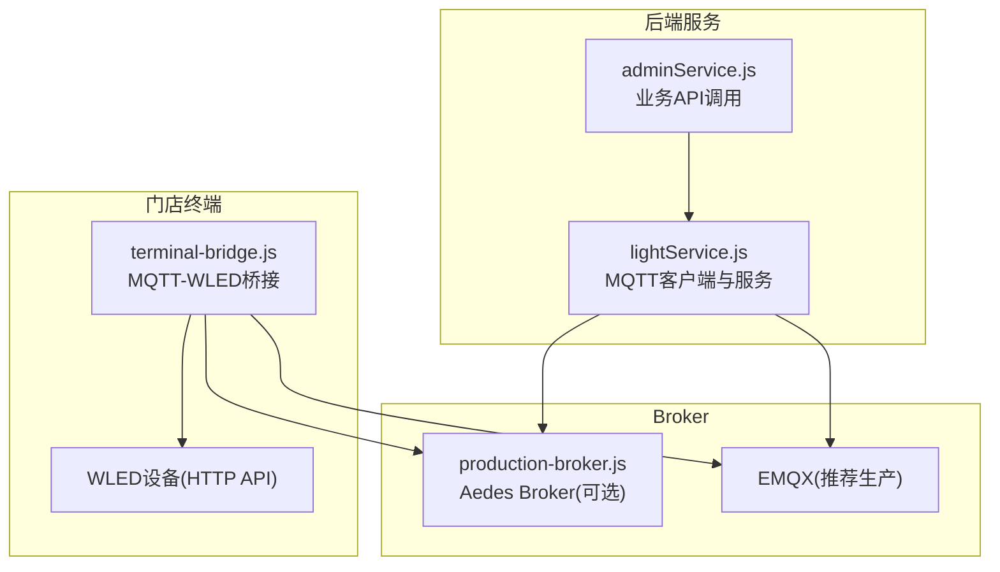
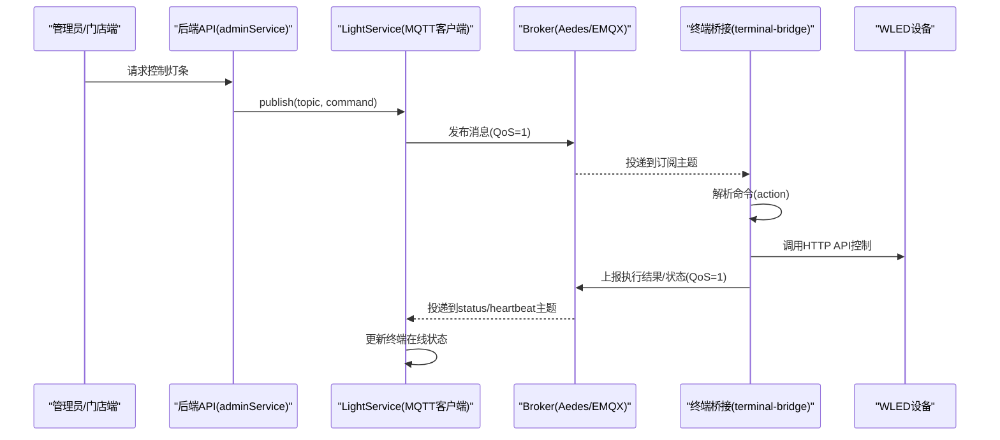
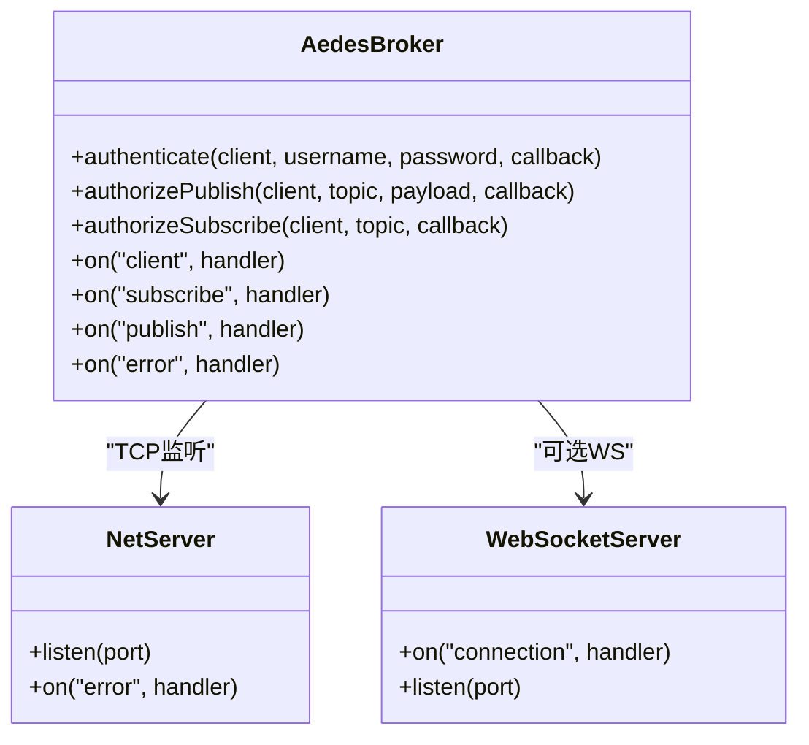
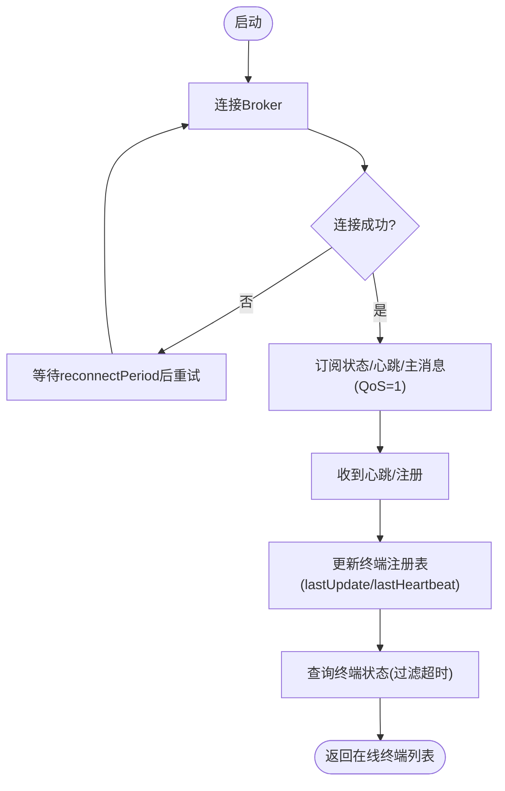
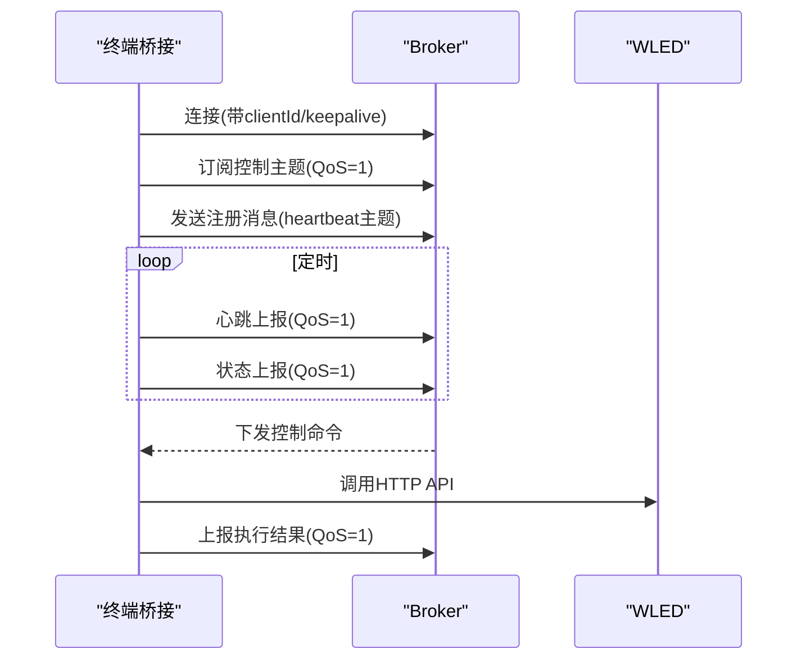
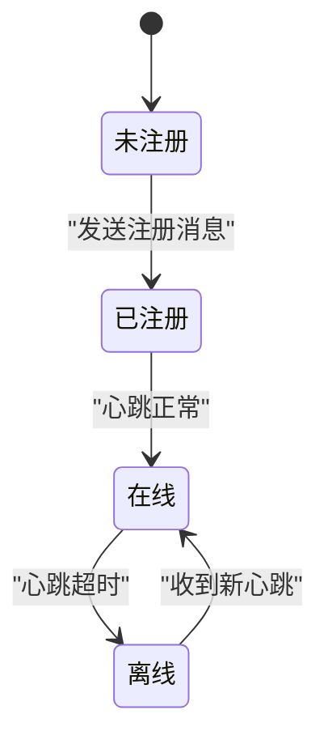
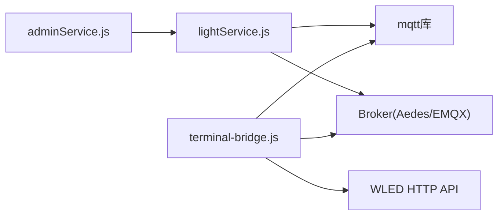

# MQTT实时通信

<cite>
**本文引用的文件列表**
- [backend/production-broker.js](file://backend/production-broker.js)
- [backend/BROKER_README.md](file://backend/BROKER_README.md)
- [backend/services/lightService.js](file://backend/services/lightService.js)
- [terminal-bridge/terminal-bridge.js](file://terminal-bridge/terminal-bridge.js)
- [backend/services/MQTT_DEPLOYMENT.md](file://backend/services/MQTT_DEPLOYMENT.md)
- [ecosystem.config.js](file://ecosystem.config.js)
- [backend/mqtt-diagnostic.js](file://backend/mqtt-diagnostic.js)
- [backend/tcp-mqtt-test.js](file://backend/tcp-mqtt-test.js)
- [backend/quick-connect-test.js](file://backend/quick-connect-test.js)
- [backend/modules/admin/services/adminService.js](file://backend/modules/admin/services/adminService.js)
</cite>

## 目录
1. [简介](#简介)
2. [项目结构](#项目结构)
3. [核心组件](#核心组件)
4. [架构总览](#架构总览)
5. [详细组件分析](#详细组件分析)
6. [依赖关系分析](#依赖关系分析)
7. [性能与可靠性](#性能与可靠性)
8. [故障排查指南](#故障排查指南)
9. [结论](#结论)
10. [附录：集成与调试清单](#附录集成与调试清单)

## 简介
本文件面向干洗门店智能灯条系统的MQTT实时通信，系统性说明基于发布/订阅的消息模型、Broker配置、客户端连接管理、消息路由机制、主题命名规范、QoS策略与持久化、终端设备注册与心跳检测、在线状态管理与故障恢复、连接池与重连策略、错误处理方案、性能优化建议与监控指标收集方法，并提供开发者集成与调试指南。

## 项目结构
本项目在“后端服务 + 终端桥接 + Broker”三层结构中实现MQTT实时通信：
- Broker层：提供生产级Aedes Broker或EMQX部署能力，支持认证、授权、WebSocket扩展。
- 后端服务层：封装MQTT客户端（LightService），负责订阅终端上报、向终端下发控制命令、维护终端在线状态。
- 终端桥接层：运行于门店侧，订阅控制主题，将MQTT命令转换为WLED HTTP API调用，并定时上报心跳与状态。

图表来源
- [backend/services/lightService.js:1-234](file://backend/services/lightService.js#L1-L234)
- [backend/production-broker.js:1-227](file://backend/production-broker.js#L1-L227)
- [terminal-bridge/terminal-bridge.js:1-480](file://terminal-bridge/terminal-bridge.js#L1-L480)
- [backend/modules/admin/services/adminService.js:1193-1235](file://backend/modules/admin/services/adminService.js#L1193-L1235)

章节来源
- [backend/services/lightService.js:1-234](file://backend/services/lightService.js#L1-L234)
- [backend/production-broker.js:1-227](file://backend/production-broker.js#L1-L227)
- [terminal-bridge/terminal-bridge.js:1-480](file://terminal-bridge/terminal-bridge.js#L1-L480)
- [backend/modules/admin/services/adminService.js:1193-1235](file://backend/modules/admin/services/adminService.js#L1193-L1235)

## 核心组件
- 生产级Broker（Aedes）：提供认证、授权、日志、WebSocket扩展能力，适合本地或轻量生产环境。
- 后端MQTT服务（LightService）：单例客户端，统一订阅终端上报主题，维护终端注册表与在线状态，对外暴露publish/subscribe接口。
- 终端桥接（terminal-bridge）：门店端进程，订阅控制主题，执行WLED控制，上报心跳与状态。
- 部署文档与诊断脚本：提供EMQX/Aedes部署、测试与排障工具。

章节来源
- [backend/production-broker.js:1-227](file://backend/production-broker.js#L1-L227)
- [backend/services/lightService.js:1-234](file://backend/services/lightService.js#L1-L234)
- [terminal-bridge/terminal-bridge.js:1-480](file://terminal-bridge/terminal-bridge.js#L1-L480)
- [backend/services/MQTT_DEPLOYMENT.md:1-410](file://backend/services/MQTT_DEPLOYMENT.md#L1-L410)

## 架构总览
系统采用“后端集中式控制 + 终端边缘执行”的架构：
- 管理员/门店端通过HTTP API触发控制逻辑，后端通过MQTT将命令下发到终端。
- 终端通过MQTT上报心跳与状态，后端据此维护在线状态。
- Broker可选择Aedes（内置）或EMQX（推荐生产）。

图表来源
- [backend/modules/admin/services/adminService.js:1193-1235](file://backend/modules/admin/services/adminService.js#L1193-L1235)
- [backend/services/lightService.js:78-108](file://backend/services/lightService.js#L78-L108)
- [terminal-bridge/terminal-bridge.js:259-302](file://terminal-bridge/terminal-bridge.js#L259-L302)
- [terminal-bridge/terminal-bridge.js:339-405](file://terminal-bridge/terminal-bridge.js#L339-L405)

## 详细组件分析

### 组件一：生产级Broker（Aedes）
- 功能要点
  - 支持用户名/密码认证，可通过环境变量注入用户列表。
  - 支持发布/订阅授权钩子（示例中默认放行，可接入权限策略）。
  - 事件监听：client、subscribe、publish、error等，便于审计与排障。
  - 可选WebSocket服务器，便于浏览器端直连。
- 关键配置项
  - MQTT端口、WS端口、认证开关、用户列表。
- 安全建议
  - 生产环境启用认证；限制主题访问模式；必要时启用TLS。

图表来源
- [backend/production-broker.js:53-111](file://backend/production-broker.js#L53-L111)
- [backend/production-broker.js:147-171](file://backend/production-broker.js#L147-L171)

章节来源
- [backend/production-broker.js:1-227](file://backend/production-broker.js#L1-L227)
- [backend/BROKER_README.md:1-194](file://backend/BROKER_README.md#L1-L194)

### 组件二：后端MQTT服务（LightService）
- 职责
  - 连接Broker，设置订阅（状态、心跳、主消息）。
  - 接收终端心跳，维护终端注册表与在线状态。
  - 对外提供publish/subscribe/isConnected等方法。
  - 定期健康检查，自动重连。
- 主题订阅
  - 状态主题：dryclean/+/+/light/status
  - 心跳主题：dryclean/+/+/light/heartbeat
  - 主消息主题：dryclean/+/+/light
- QoS与持久化
  - 订阅使用QoS=1，确保至少一次投递。
  - 发布使用QoS=1，保证可靠送达。
  - 会话保持由Broker决定；当前客户端未显式开启持久化标志。
- 终端注册与心跳
  - 从topic提取storeId，按store聚合lights，记录lastHeartbeat。
  - 清理超时心跳的灯条，判定离线。
- 连接管理
  - keepalive/reconnectPeriod/connectTimeout可配置。
  - ensureConnected每30秒检查并重连。

图表来源
- [backend/services/lightService.js:29-76](file://backend/services/lightService.js#L29-L76)
- [backend/services/lightService.js:78-108](file://backend/services/lightService.js#L78-L108)
- [backend/services/lightService.js:110-169](file://backend/services/lightService.js#L110-L169)
- [backend/services/lightService.js:211-231](file://backend/services/lightService.js#L211-L231)

章节来源
- [backend/services/lightService.js:1-234](file://backend/services/lightService.js#L1-L234)

### 组件三：终端桥接（terminal-bridge）
- 职责
  - 连接Broker，订阅门店控制主题与通用主题。
  - 解析action（开/关/闪烁/全关/查询状态），调用WLED HTTP API。
  - 发送终端注册、心跳、执行结果与状态上报。
- 主题与QoS
  - 订阅：dryclean/{env}/{storeId}/light 与 dryclean/+/+/light
  - 上报：dryclean/{env}/{storeId}/light/heartbeat 与 status
  - QoS=1
- 心跳与状态上报
  - 固定间隔上报心跳与状态，用于后端在线判定。
- 错误处理
  - 连接失败/离线/重连事件均有日志输出。
  - WLED调用失败时记录错误并继续重试。

图表来源
- [terminal-bridge/terminal-bridge.js:192-257](file://terminal-bridge/terminal-bridge.js#L192-L257)
- [terminal-bridge/terminal-bridge.js:259-302](file://terminal-bridge/terminal-bridge.js#L259-L302)
- [terminal-bridge/terminal-bridge.js:339-405](file://terminal-bridge/terminal-bridge.js#L339-L405)

章节来源
- [terminal-bridge/terminal-bridge.js:1-480](file://terminal-bridge/terminal-bridge.js#L1-L480)

### 组件四：主题命名规范与消息路由
- 命名规范
  - 前缀：dryclean
  - 层级：{env}/{storeId}/light[/{sub}]
  - 示例：dryclean/prod/ST001/light、dryclean/dev/ST002/light/heartbeat、dryclean/prod/ST001/light/status
- 通配符路由
  - 单级通配符+：如 dryclean/+/+/light
  - 多级通配符#：如 dryclean/#
- 路由策略
  - 后端订阅所有门店的状态/心跳/主消息，进行统一处理。
  - 终端仅订阅自身门店主题，同时兼容通用主题以简化运维。

章节来源
- [backend/services/lightService.js:78-89](file://backend/services/lightService.js#L78-L89)
- [terminal-bridge/terminal-bridge.js:214-232](file://terminal-bridge/terminal-bridge.js#L214-L232)
- [backend/modules/admin/services/adminService.js:1228-1235](file://backend/modules/admin/services/adminService.js#L1228-L1235)

### 组件五：QoS级别选择与消息持久化
- QoS选择
  - 控制命令与状态上报使用QoS=1，保证至少一次送达。
  - 心跳为高频低价值消息，仍使用QoS=1以确保在线判定准确。
- 持久化
  - 当前实现未显式开启持久化会话；是否保留离线消息取决于Broker配置。
  - 若需严格持久化，可在Broker层开启持久化插件或改用支持持久化的Broker（如EMQX持久化配置）。

章节来源
- [backend/services/lightService.js:83-89](file://backend/services/lightService.js#L83-L89)
- [terminal-bridge/terminal-bridge.js:215-232](file://terminal-bridge/terminal-bridge.js#L215-L232)
- [backend/services/MQTT_DEPLOYMENT.md:149-177](file://backend/services/MQTT_DEPLOYMENT.md#L149-L177)

### 组件六：终端设备注册与心跳检测
- 注册流程
  - 终端连接成功后立即发送注册消息（包含终端ID、门店ID、MAC、能力集）。
- 心跳机制
  - 固定周期上报心跳，携带终端ID、门店ID、灯条ID、状态。
- 在线判定
  - 后端维护每个门店的灯条最后心跳时间，超过阈值视为离线。
- 故障恢复
  - 终端断线后Broker会通知；终端自动重连；后端检测到离线后UI可降级展示。

图表来源
- [terminal-bridge/terminal-bridge.js:339-371](file://terminal-bridge/terminal-bridge.js#L339-L371)
- [backend/services/lightService.js:110-169](file://backend/services/lightService.js#L110-L169)

章节来源
- [terminal-bridge/terminal-bridge.js:339-405](file://terminal-bridge/terminal-bridge.js#L339-L405)
- [backend/services/lightService.js:110-169](file://backend/services/lightService.js#L110-L169)

### 组件七：连接池管理、重连策略与错误处理
- 连接池
  - 当前后端与终端均采用单实例MQTT客户端，未实现多连接池；如需高并发可扩展为连接池。
- 重连策略
  - 客户端配置keepalive、reconnectPeriod、connectTimeout。
  - 后端每30秒主动ensureConnected，避免Broker后启动导致无法恢复。
- 错误处理
  - 连接错误、离线、关闭、重连事件均记录日志。
  - 诊断脚本提供超时与错误码提示。

章节来源
- [backend/services/lightService.js:38-76](file://backend/services/lightService.js#L38-L76)
- [backend/services/lightService.js:211-231](file://backend/services/lightService.js#L211-L231)
- [backend/mqtt-diagnostic.js:1-104](file://backend/mqtt-diagnostic.js#L1-L104)
- [backend/tcp-mqtt-test.js:41-60](file://backend/tcp-mqtt-test.js#L41-L60)
- [backend/quick-connect-test.js:1-53](file://backend/quick-connect-test.js#L1-L53)

### 组件八：监控指标与日志
- Broker侧
  - 连接数、订阅数、发布/订阅事件、错误事件均可通过事件监听输出。
- 后端侧
  - 连接状态、订阅成功、消息处理、终端注册/心跳、重连尝试等日志。
- 终端侧
  - 连接/订阅/命令执行/WLED调用/心跳上报等日志。
- 运维建议
  - 结合PM2日志轮转与外部监控系统（如Prometheus）采集关键指标。

章节来源
- [backend/production-broker.js:114-144](file://backend/production-broker.js#L114-L144)
- [backend/services/lightService.js:49-71](file://backend/services/lightService.js#L49-L71)
- [terminal-bridge/terminal-bridge.js:211-256](file://terminal-bridge/terminal-bridge.js#L211-L256)
- [ecosystem.config.js:60-87](file://ecosystem.config.js#L60-L87)

## 依赖关系分析
- 后端LightService依赖mqtt库与Broker，被adminService调用以发布控制命令。
- 终端桥接依赖mqtt库与WLED HTTP API。
- Broker作为中心枢纽，承载所有客户端的连接与消息分发。

图表来源
- [backend/modules/admin/services/adminService.js:1193-1235](file://backend/modules/admin/services/adminService.js#L1193-L1235)
- [backend/services/lightService.js:1-20](file://backend/services/lightService.js#L1-L20)
- [terminal-bridge/terminal-bridge.js:14-40](file://terminal-bridge/terminal-bridge.js#L14-L40)

章节来源
- [backend/modules/admin/services/adminService.js:1193-1235](file://backend/modules/admin/services/adminService.js#L1193-L1235)
- [backend/services/lightService.js:1-20](file://backend/services/lightService.js#L1-L20)
- [terminal-bridge/terminal-bridge.js:14-40](file://terminal-bridge/terminal-bridge.js#L14-L40)

## 性能与可靠性
- 性能优化建议
  - 合理设置keepalive与reconnectPeriod，避免频繁重连风暴。
  - 控制心跳频率与消息体大小，减少带宽占用。
  - 使用通配符订阅减少重复订阅数量。
  - 生产环境优先使用EMQX以获得更高吞吐与更丰富的监控能力。
- 可靠性保障
  - QoS=1确保至少一次送达；幂等处理避免重复执行。
  - 终端侧对WLED调用增加重试与超时保护。
  - 后端定期健康检查，确保Broker重启后可恢复。

[本节为通用指导，不直接分析具体文件]

## 故障排查指南
- 常见问题定位
  - 连接超时：检查Broker是否运行、端口是否开放、防火墙策略。
  - 认证失败：核对用户名/密码与环境变量配置。
  - 消息丢失：确认QoS设置与Broker持久化配置。
  - 终端离线：检查心跳间隔与阈值，确认网络连通性。
- 诊断工具
  - 快速连接测试：验证Broker可达性与基本连接。
  - TCP诊断：查看CONNACK返回码与错误信息。
  - 诊断脚本：输出连接参数、错误类型与建议。

章节来源
- [backend/quick-connect-test.js:1-53](file://backend/quick-connect-test.js#L1-L53)
- [backend/tcp-mqtt-test.js:41-60](file://backend/tcp-mqtt-test.js#L41-L60)
- [backend/mqtt-diagnostic.js:1-104](file://backend/mqtt-diagnostic.js#L1-L104)
- [backend/BROKER_README.md:169-194](file://backend/BROKER_README.md#L169-L194)

## 结论
本系统通过统一的MQTT主题与QoS策略，实现了后端对门店终端的稳定控制与状态感知。生产环境推荐使用EMQX并配合完善的认证与监控；开发阶段可使用内置Aedes快速验证。通过心跳与在线状态管理，系统具备良好的故障恢复能力。后续可按需引入连接池、持久化与会话恢复增强可靠性与吞吐。

[本节为总结，不直接分析具体文件]

## 附录：集成与调试清单
- 环境准备
  - 安装并启动Broker（Aedes或EMQX），确认端口开放。
  - 配置.env中的MQTT_BROKER、用户名/密码等。
- 后端集成
  - 初始化LightService并等待连接成功。
  - 使用publish向终端下发控制命令。
  - 订阅状态/心跳主题，维护终端在线状态。
- 终端集成
  - 配置STORE_ID、WLED_IP、MQTT_BROKER。
  - 启动后观察连接、订阅、心跳与状态上报日志。
- 调试技巧
  - 使用诊断脚本与TCP测试验证连接。
  - 在Broker控制台查看连接与消息流。
  - 关注PM2日志与错误日志文件。

章节来源
- [backend/services/MQTT_DEPLOYMENT.md:115-146](file://backend/services/MQTT_DEPLOYMENT.md#L115-L146)
- [backend/mqtt-diagnostic.js:1-104](file://backend/mqtt-diagnostic.js#L1-L104)
- [backend/tcp-mqtt-test.js:41-60](file://backend/tcp-mqtt-test.js#L41-L60)
- [ecosystem.config.js:60-87](file://ecosystem.config.js#L60-L87)