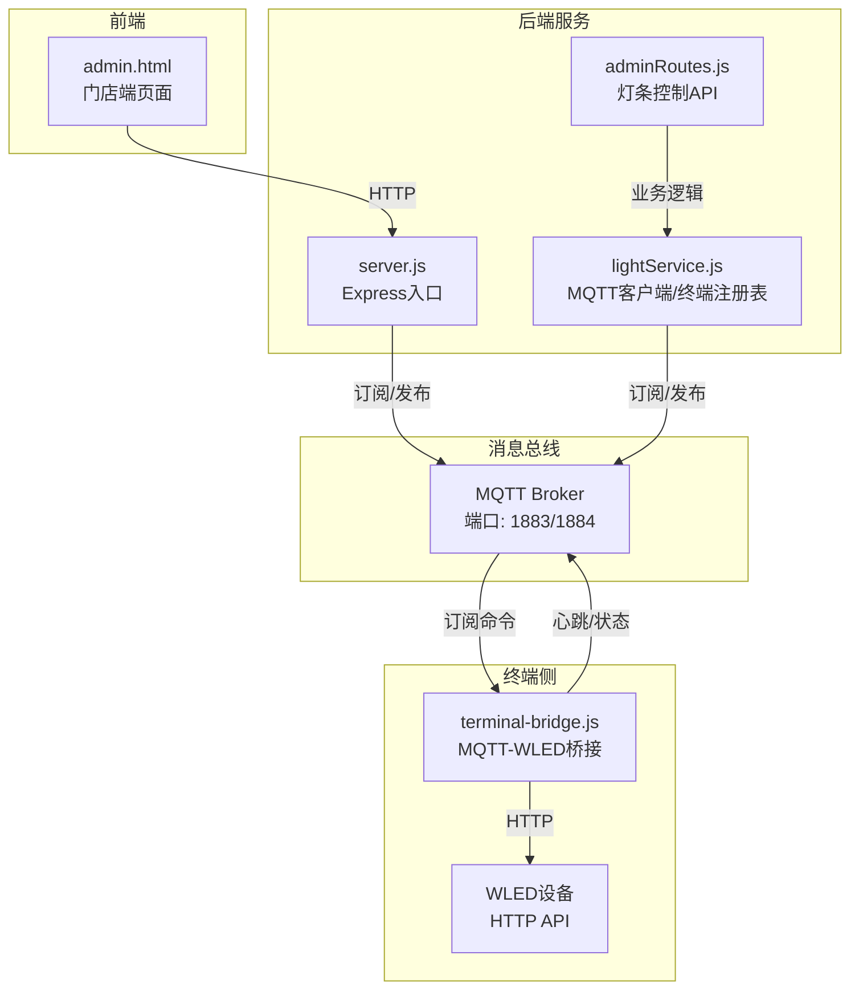
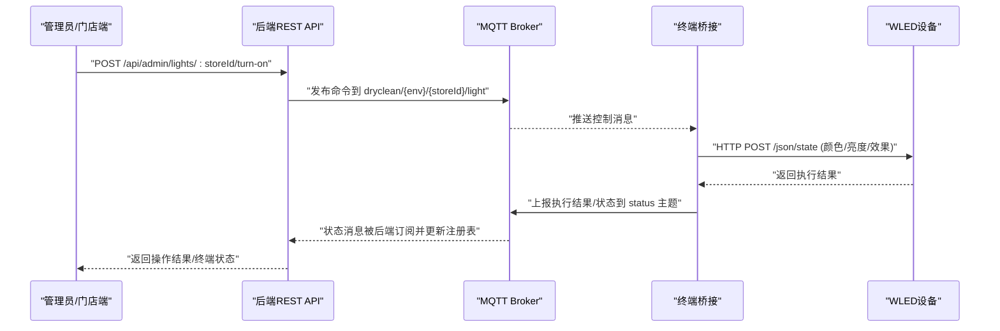
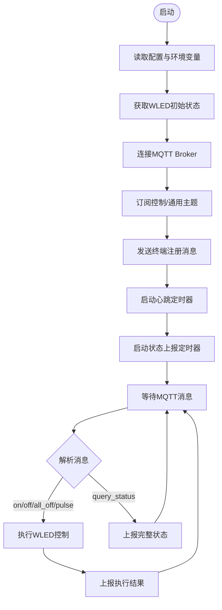
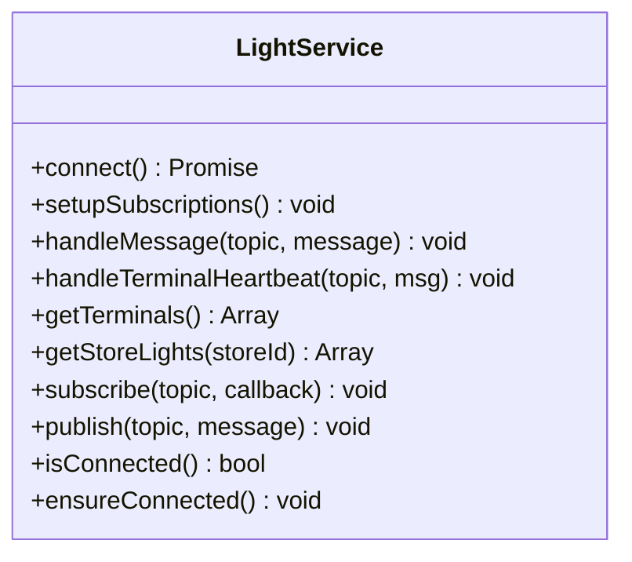
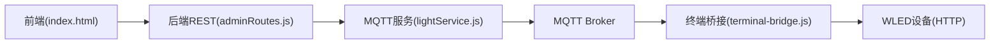

# TCP设备通信

<cite>
**本文引用的文件**
- [terminal-bridge/README.md](file://terminal-bridge/README.md)
- [terminal-bridge/terminal-bridge.js](file://terminal-bridge/terminal-bridge.js)
- [backend/services/lightService.js](file://backend/services/lightService.js)
- [backend/server.js](file://backend/server.js)
- [backend/modules/admin/routes/adminRoutes.js](file://backend/modules/admin/routes/adminRoutes.js)
- [backend/test-net.js](file://backend/test-net.js)
- [backend/tcp-mqtt-test.js](file://backend/tcp-mqtt-test.js)
- [backend/test-port.js](file://backend/test-port.js)
- [index.html](file://index.html)
</cite>

## 目录
1. [引言](#引言)
2. [项目结构](#项目结构)
3. [核心组件](#核心组件)
4. [架构总览](#架构总览)
5. [详细组件分析](#详细组件分析)
6. [依赖关系分析](#依赖关系分析)
7. [性能与可靠性](#性能与可靠性)
8. [故障排查指南](#故障排查指南)
9. [结论](#结论)
10. [附录：协议与接入规范](#附录协议与接入规范)

## 引言
本文件面向硬件开发者与系统集成工程师，系统化阐述本项目中的“TCP设备通信”方案。当前系统采用 MQTT（基于TCP）作为设备与后端之间的消息总线，终端侧通过轻量桥接程序将MQTT命令转换为对WLED设备的HTTP控制，并上报心跳与状态。文档覆盖连接管理、心跳与异常恢复、设备协议设计、终端桥接服务实现、智能灯条控制协议、设备发现与服务注册、安全与联调测试等关键主题，并提供可操作的排障步骤与接入规范。

## 项目结构
围绕TCP/MQTT设备通信的相关代码主要分布在以下位置：
- 终端桥接服务：位于 terminal-bridge 目录，负责订阅MQTT命令、调用WLED HTTP API、上报心跳与状态。
- 后端MQTT服务：位于 backend/services/lightService.js，维护终端在线状态、处理心跳与状态上报、提供查询接口。
- 后端HTTP入口：backend/server.js 启动Express服务并初始化MQTT客户端。
- 管理员API路由：backend/modules/admin/routes/adminRoutes.js 暴露灯条控制与终端状态查询的REST接口。
- 前端调用示例：index.html 中演示了通过HTTP API触发灯条控制。
- 诊断脚本：backend/test-net.js、tcp-mqtt-test.js、test-port.js 用于TCP端口连通性与MQTT握手验证。

图表来源
- [backend/server.js:615-653](file://backend/server.js#L615-L653)
- [backend/services/lightService.js:29-90](file://backend/services/lightService.js#L29-L90)
- [backend/modules/admin/routes/adminRoutes.js:556-746](file://backend/modules/admin/routes/adminRoutes.js#L556-L746)
- [terminal-bridge/terminal-bridge.js:192-257](file://terminal-bridge/terminal-bridge.js#L192-L257)

章节来源
- [backend/server.js:615-653](file://backend/server.js#L615-L653)
- [backend/services/lightService.js:29-90](file://backend/services/lightService.js#L29-L90)
- [backend/modules/admin/routes/adminRoutes.js:556-746](file://backend/modules/admin/routes/adminRoutes.js#L556-L746)
- [terminal-bridge/terminal-bridge.js:192-257](file://terminal-bridge/terminal-bridge.js#L192-L257)

## 核心组件
- 终端桥接服务（terminal-bridge.js）
  - 功能：订阅MQTT控制主题，解析命令，调用WLED HTTP API执行颜色/亮度/效果控制；定时上报心跳与状态；支持自动重连与离线恢复。
  - 配置：通过环境变量或命令行参数设置门店ID、WLED IP、MQTT Broker地址、认证信息等。
- 后端MQTT服务（lightService.js）
  - 功能：连接Broker，订阅终端心跳与状态主题，维护终端在线状态（按门店聚合），提供查询接口供管理端展示。
  - 健康检查：周期性检测连接状态，必要时尝试重连。
- 后端HTTP入口（server.js）
  - 功能：启动Express服务，挂载各模块路由，初始化MQTT服务，统一错误处理与优雅关闭。
- 管理员API路由（adminRoutes.js）
  - 功能：暴露灯条控制与终端状态查询的REST接口，内部调用业务服务并通过MQTT下发命令。
- 前端调用（index.html）
  - 功能：通过HTTP API触发灯条控制，具备失败降级到本地WLED控制的容错逻辑。

章节来源
- [terminal-bridge/terminal-bridge.js:192-257](file://terminal-bridge/terminal-bridge.js#L192-L257)
- [backend/services/lightService.js:29-90](file://backend/services/lightService.js#L29-L90)
- [backend/server.js:615-653](file://backend/server.js#L615-L653)
- [backend/modules/admin/routes/adminRoutes.js:556-746](file://backend/modules/admin/routes/adminRoutes.js#L556-L746)
- [index.html:4257-4351](file://index.html#L4257-L4351)

## 架构总览
整体采用“前端HTTP → 后端REST → MQTT → 终端桥接 → WLED设备”的分层架构。MQTT作为可靠的消息通道，承担命令下发与状态回传职责；终端桥接负责协议转换与设备控制；后端维护终端注册表与在线状态，为前端提供可视化与控制能力。

图表来源
- [backend/modules/admin/routes/adminRoutes.js:633-682](file://backend/modules/admin/routes/adminRoutes.js#L633-L682)
- [backend/services/lightService.js:78-90](file://backend/services/lightService.js#L78-L90)
- [terminal-bridge/terminal-bridge.js:260-302](file://terminal-bridge/terminal-bridge.js#L260-L302)
- [terminal-bridge/terminal-bridge.js:389-405](file://terminal-bridge/terminal-bridge.js#L389-L405)

## 详细组件分析

### 终端桥接服务（MQTT-WLED桥接）
- 连接与订阅
  - 使用MQTT客户端连接Broker，订阅门店专属与通用主题，支持QoS=1保证至少一次投递。
  - 连接成功后发送注册消息，包含终端ID、门店ID、设备MAC等信息。
- 命令处理
  - 解析动作类型（开灯、关灯、全关、闪烁/呼吸等），将高层语义转换为WLED JSON state。
  - 调用WLED HTTP API执行控制，记录本地状态并上报执行结果。
- 心跳与状态上报
  - 定时发送心跳消息，携带终端标识与在线状态。
  - 定时拉取WLED状态并上报，便于后端维护终端在线视图。
- 异常恢复
  - 支持自动重连与离线事件处理；WLED不可达时继续运行并在下次可用时重试。

图表来源
- [terminal-bridge/terminal-bridge.js:409-459](file://terminal-bridge/terminal-bridge.js#L409-L459)
- [terminal-bridge/terminal-bridge.js:260-302](file://terminal-bridge/terminal-bridge.js#L260-L302)
- [terminal-bridge/terminal-bridge.js:389-405](file://terminal-bridge/terminal-bridge.js#L389-L405)

章节来源
- [terminal-bridge/terminal-bridge.js:192-257](file://terminal-bridge/terminal-bridge.js#L192-L257)
- [terminal-bridge/terminal-bridge.js:260-302](file://terminal-bridge/terminal-bridge.js#L260-L302)
- [terminal-bridge/terminal-bridge.js:389-405](file://terminal-bridge/terminal-bridge.js#L389-L405)
- [terminal-bridge/terminal-bridge.js:409-459](file://terminal-bridge/terminal-bridge.js#L409-L459)

### 后端MQTT服务（终端注册与状态维护）
- 连接与订阅
  - 连接Broker后订阅终端心跳、状态与主消息主题，接收终端上报数据。
- 终端注册表
  - 以门店维度维护灯条列表与最后心跳时间，定期清理超时条目。
- 健康检查
  - 周期性检测连接状态，若断开则尝试重建连接，确保Broker后启动也能恢复。

图表来源
- [backend/services/lightService.js:24-223](file://backend/services/lightService.js#L24-L223)

章节来源
- [backend/services/lightService.js:29-90](file://backend/services/lightService.js#L29-L90)
- [backend/services/lightService.js:110-187](file://backend/services/lightService.js#L110-L187)
- [backend/services/lightService.js:225-231](file://backend/services/lightService.js#L225-L231)

### 后端HTTP入口与管理API
- server.js
  - 加载环境变量、挂载中间件与静态资源、注册各模块路由、初始化数据库与MQTT服务、统一错误处理与优雅关闭。
- adminRoutes.js
  - 提供灯条控制相关REST接口（点亮/关闭/全部关闭/终端状态查询等），内部调用业务服务并通过MQTT下发命令。

章节来源
- [backend/server.js:615-653](file://backend/server.js#L615-L653)
- [backend/modules/admin/routes/adminRoutes.js:556-746](file://backend/modules/admin/routes/adminRoutes.js#L556-L746)

### 前端调用与降级策略
- index.html
  - 通过HTTP API触发灯条控制，失败时降级到本地WLED控制，提升可用性。

章节来源
- [index.html:4257-4351](file://index.html#L4257-L4351)

## 依赖关系分析
- 组件耦合
  - 前端仅依赖后端REST API，不直接访问MQTT，降低耦合度。
  - 后端通过lightService封装MQTT细节，对外暴露稳定接口。
  - 终端桥接独立部署，仅依赖MQTT与WLED HTTP API，解耦清晰。
- 外部依赖
  - MQTT Broker（EMQX/NanoMQ等）
  - WLED设备HTTP API
- 潜在循环依赖
  - 当前未发现循环依赖；前后端与终端桥接之间通过MQTT异步解耦。

图表来源
- [backend/modules/admin/routes/adminRoutes.js:556-746](file://backend/modules/admin/routes/adminRoutes.js#L556-L746)
- [backend/services/lightService.js:29-90](file://backend/services/lightService.js#L29-L90)
- [terminal-bridge/terminal-bridge.js:192-257](file://terminal-bridge/terminal-bridge.js#L192-L257)

章节来源
- [backend/modules/admin/routes/adminRoutes.js:556-746](file://backend/modules/admin/routes/adminRoutes.js#L556-L746)
- [backend/services/lightService.js:29-90](file://backend/services/lightService.js#L29-L90)
- [terminal-bridge/terminal-bridge.js:192-257](file://terminal-bridge/terminal-bridge.js#L192-L257)

## 性能与可靠性
- 连接池
  - 当前未实现显式连接池；每个进程持有单一MQTT客户端实例。建议在高并发场景引入连接池或分片客户端以提升吞吐。
- 心跳与保活
  - 终端侧每15秒发送心跳，后端30秒无心跳视为离线；Broker keepalive默认60秒。可根据网络质量调整间隔。
- 异常恢复
  - 终端桥接支持自动重连与离线事件处理；后端定期检测连接并尝试重连。
- QoS与幂等
  - 使用QoS=1保证至少一次投递；建议在终端侧对重复命令进行幂等处理（如去抖、状态比对）。
- 资源占用
  - 避免频繁拉取WLED状态，合理设置上报间隔；批量命令合并减少HTTP调用次数。

[本节为通用指导，无需特定文件引用]

## 故障排查指南
- TCP端口连通性
  - 使用测试脚本验证Broker端口是否响应，并发送MQTT CONNECT报文确认握手成功。
- MQTT连接问题
  - 检查Broker地址、端口、用户名密码；查看后端日志中的连接与重连信息。
- 终端不响应
  - 确认终端桥接已启动且配置正确（门店ID、WLED IP）；检查WLED设备可达性与HTTP API响应。
- 状态不同步
  - 核对前后端使用的门店ID一致；确认MQTT主题匹配与订阅生效；查看后端终端注册表是否更新。

章节来源
- [backend/test-net.js:1-40](file://backend/test-net.js#L1-L40)
- [backend/tcp-mqtt-test.js:1-60](file://backend/tcp-mqtt-test.js#L1-L60)
- [backend/test-port.js:1-47](file://backend/test-port.js#L1-L47)
- [terminal-bridge/README.md:203-236](file://terminal-bridge/README.md#L203-L236)

## 结论
本方案以MQTT为核心，结合终端桥接与后端服务，实现了稳定的TCP设备通信链路。通过心跳与状态上报机制，后端可实时掌握终端在线情况；通过REST API与MQTT的组合，前端可便捷地控制设备。后续可在连接池、QoS策略、鉴权与加密等方面进一步增强安全性与可扩展性。

[本节为总结，无需特定文件引用]

## 附录：协议与接入规范

### 设备协议设计（MQTT主题与消息）
- 主题命名
  - 控制主题：dryclean/{env}/{storeId}/light
  - 心跳主题：dryclean/{env}/{storeId}/light/heartbeat
  - 状态主题：dryclean/{env}/{storeId}/light/status
- 控制命令（后台→终端）
  - 动作字段action包括：on、off、all_off、pulse/blink、query_status等。
  - 可选字段：color、brightness、priority、timestamp等。
- 心跳（终端→后台）
  - 包含terminalId、storeId、lightId、status、wledMac、timestamp等。
- 状态上报（终端→后台）
  - 包含terminalId、storeId、lightId、wledStatus、localState、timestamp等。

章节来源
- [terminal-bridge/README.md:56-122](file://terminal-bridge/README.md#L56-L122)

### 终端桥接服务实现要点
- 协议转换
  - 将高层动作（on/off/pulse）转换为WLED JSON state（颜色、亮度、效果）。
- 消息路由
  - 根据主题前缀与门店ID过滤消息，仅处理目标门店的命令。
- 状态同步
  - 定时上报状态与执行结果，后端维护终端注册表并向前端展示。

章节来源
- [terminal-bridge/terminal-bridge.js:260-302](file://terminal-bridge/terminal-bridge.js#L260-L302)
- [terminal-bridge/terminal-bridge.js:389-405](file://terminal-bridge/terminal-bridge.js#L389-L405)

### 智能灯条控制协议（颜色、亮度、效果）
- 颜色设置
  - 支持名称映射（red/green/blue等）与十六进制格式，终端内部转换为RGB数组。
- 亮度调节
  - 通过state.bri字段控制亮度（0-255）。
- 效果控制
  - 通过seg.fx指定效果编号（如呼吸效果），tt设置过渡时间。

章节来源
- [terminal-bridge/terminal-bridge.js:156-187](file://terminal-bridge/terminal-bridge.js#L156-L187)

### 设备发现与服务注册
- 自动发现
  - 终端启动后向心跳主题发送注册消息，包含终端ID、门店ID、设备MAC等元数据。
- 动态配置
  - 可通过环境变量或启动参数动态配置MQTT Broker、门店ID、WLED IP等。

章节来源
- [terminal-bridge/terminal-bridge.js:339-355](file://terminal-bridge/terminal-bridge.js#L339-L355)
- [terminal-bridge/README.md:227-236](file://terminal-bridge/README.md#L227-L236)

### 安全保障
- 设备认证
  - MQTT客户端可配置username/password；建议在生产环境启用Broker级ACL与TLS。
- 数据传输加密
  - 建议使用MQTT over TLS（端口通常为8883），并在终端与Broker间启用证书校验。
- 访问控制
  - 在Broker层面限制主题读写权限；后端API增加鉴权中间件与角色校验。

[本节为通用指导，无需特定文件引用]

### 联调测试工具与示例
- TCP连通性测试
  - 使用test-net.js、tcp-mqtt-test.js、test-port.js验证端口与MQTT握手。
- 端到端流程
  - 启动Broker → 启动后端 → 启动终端桥接 → 通过前端或REST API触发控制 → 观察终端行为与状态上报。

章节来源
- [backend/test-net.js:1-40](file://backend/test-net.js#L1-L40)
- [backend/tcp-mqtt-test.js:1-60](file://backend/tcp-mqtt-test.js#L1-L60)
- [backend/test-port.js:1-47](file://backend/test-port.js#L1-L47)

### 硬件接入规范与示例
- 接入要求
  - 设备需支持WLED固件或兼容HTTP API；终端桥接部署于门店侧，负责协议转换。
- 启动方式
  - 通过命令行或批处理脚本传入门店ID与WLED IP，自动完成MQTT连接与订阅。
- 示例路径
  - 终端桥接启动脚本与说明见 terminal-bridge 目录。

章节来源
- [terminal-bridge/README.md:146-172](file://terminal-bridge/README.md#L146-L172)
- [terminal-bridge/README.md:227-236](file://terminal-bridge/README.md#L227-L236)