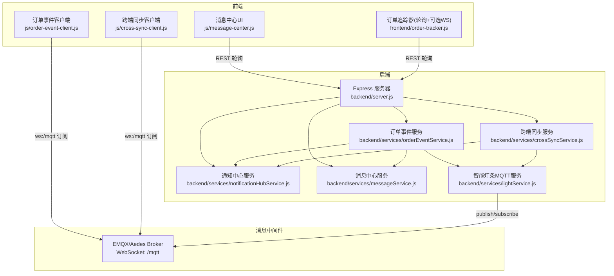
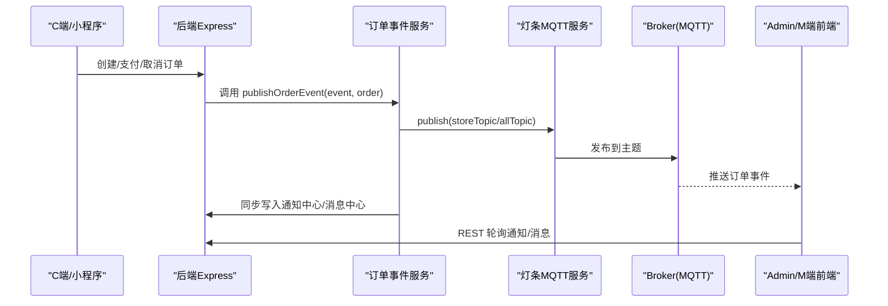
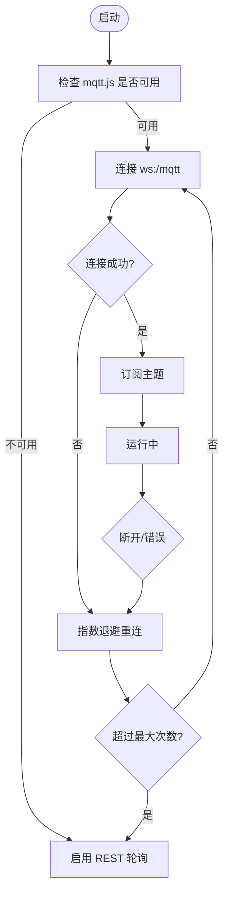
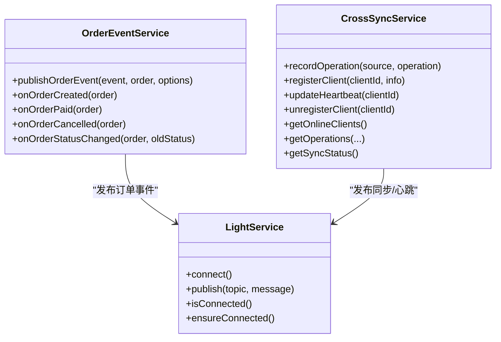
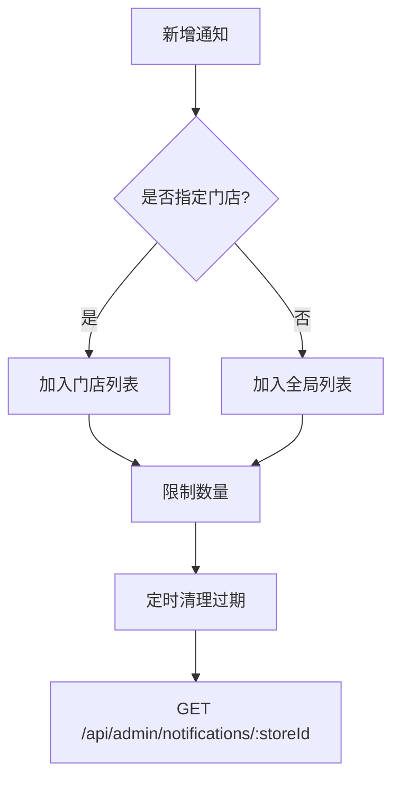
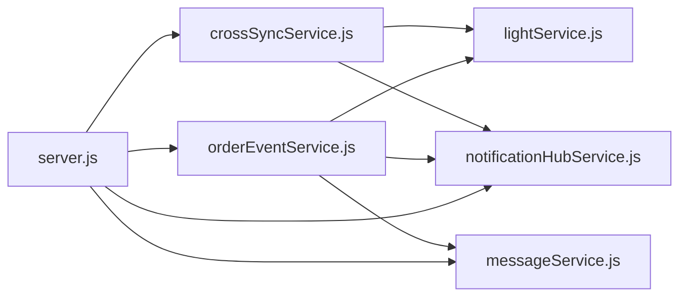

# WebSocket实时推送

<cite>
**本文引用的文件**   
- [backend/server.js](file://backend/server.js)
- [backend/services/orderEventService.js](file://backend/services/orderEventService.js)
- [backend/services/notificationHubService.js](file://backend/services/notificationHubService.js)
- [backend/services/messageService.js](file://backend/services/messageService.js)
- [backend/services/crossSyncService.js](file://backend/services/crossSyncService.js)
- [backend/services/lightService.js](file://backend/services/lightService.js)
- [backend/production-broker.js](file://backend/production-broker.js)
- [backend/start-mqtt-broker.js](file://backend/start-mqtt-broker.js)
- [backend/mqtt-diagnostic.js](file://backend/mqtt-diagnostic.js)
- [js/order-event-client.js](file://js/order-event-client.js)
- [js/cross-sync-client.js](file://js/cross-sync-client.js)
- [js/message-center.js](file://js/message-center.js)
- [frontend/order-tracker.js](file://frontend/order-tracker.js)
</cite>

## 目录
1. [简介](#简介)
2. [项目结构](#项目结构)
3. [核心组件](#核心组件)
4. [架构总览](#架构总览)
5. [详细组件分析](#详细组件分析)
6. [依赖关系分析](#依赖关系分析)
7. [性能与背压](#性能与背压)
8. [安全设计](#安全设计)
9. [监控与故障诊断](#监控与故障诊断)
10. [结论](#结论)

## 简介
本设计文档围绕“WebSocket实时推送”在干洗系统中的应用，结合现有代码库中的 MQTT over WebSocket（EMQX）能力、订单事件服务、通知中心、消息中心与跨端同步机制，给出连接管理、会话保持、断线重连、消息推送模式（广播/单播/群组）、异步处理与背压控制、通知聚合与优先级、前端客户端实现以及安全防护与监控诊断的完整方案。

## 项目结构
后端以 Express 提供 HTTP API，并通过 MQTT Broker（Aedes/EMQX）承载实时通道；前端通过 mqtt.js 建立 WebSocket 长连接订阅主题，配合 REST 轮询作为降级策略。关键模块：
- 后端入口与路由：HTTP API 注册、健康检查、通知与消息中心接口、跨端同步接口
- 事件与同步：订单事件发布、跨端操作广播、心跳与在线状态
- 通知与消息：通知中心（系统事件流）、消息中心（客户消息与账户通讯）
- 终端灯条：MQTT 客户端与服务，用于设备交互与心跳
- 前端：订单事件客户端、跨端同步客户端、消息中心 UI、订单追踪器

图表来源
- [backend/server.js:1-702](file://backend/server.js#L1-L702)
- [backend/services/orderEventService.js:1-168](file://backend/services/orderEventService.js#L1-L168)
- [backend/services/crossSyncService.js:1-336](file://backend/services/crossSyncService.js#L1-L336)
- [backend/services/notificationHubService.js:1-264](file://backend/services/notificationHubService.js#L1-L264)
- [backend/services/messageService.js:1-247](file://backend/services/messageService.js#L1-L247)
- [backend/services/lightService.js:1-234](file://backend/services/lightService.js#L1-L234)
- [js/order-event-client.js:1-270](file://js/order-event-client.js#L1-L270)
- [js/cross-sync-client.js:1-399](file://js/cross-sync-client.js#L1-L399)
- [js/message-center.js:1-352](file://js/message-center.js#L1-L352)
- [frontend/order-tracker.js:1-441](file://frontend/order-tracker.js#L1-L441)

章节来源
- [backend/server.js:1-702](file://backend/server.js#L1-L702)

## 核心组件
- 订单事件服务：将业务事件（下单、支付、取消、状态变更）通过 MQTT 广播到门店级与全局主题，并同步写入通知中心与消息中心。
- 跨端同步服务：桥接 Admin 与 M端的操作，记录操作历史、广播对端操作、维护在线客户端与心跳。
- 通知中心：集中存储系统事件通知，支持按门店/全局聚合、过期清理、未读计数。
- 消息中心：面向客户消息与账户通讯，提供线程聚合、已读标记、分页查询。
- 智能灯条服务：后端 MQTT 客户端，负责设备心跳、状态管理与主题订阅。
- 前端客户端：订单事件客户端与跨端同步客户端基于 mqtt.js 通过 WebSocket 连接 Broker；消息中心使用 REST 轮询；订单追踪器默认轮询，预留 WebSocket 扩展点。

章节来源
- [backend/services/orderEventService.js:1-168](file://backend/services/orderEventService.js#L1-L168)
- [backend/services/crossSyncService.js:1-336](file://backend/services/crossSyncService.js#L1-L336)
- [backend/services/notificationHubService.js:1-264](file://backend/services/notificationHubService.js#L1-L264)
- [backend/services/messageService.js:1-247](file://backend/services/messageService.js#L1-L247)
- [backend/services/lightService.js:1-234](file://backend/services/lightService.js#L1-L234)
- [js/order-event-client.js:1-270](file://js/order-event-client.js#L1-L270)
- [js/cross-sync-client.js:1-399](file://js/cross-sync-client.js#L1-L399)
- [js/message-center.js:1-352](file://js/message-center.js#L1-L352)
- [frontend/order-tracker.js:1-441](file://frontend/order-tracker.js#L1-L441)

## 架构总览
整体采用“HTTP + MQTT over WebSocket”的双通道架构：
- 实时通道：前端通过 mqtt.js 连接 Broker 的 WebSocket 端口，订阅主题接收订单事件与跨端同步消息。
- 兼容通道：当 MQTT 不可用时，前端自动降级为 REST 轮询，保证基本可用性。
- 服务端：Express 暴露 REST API 供前端轮询与操作触发；同时通过 MQTT 客户端发布/订阅主题，驱动通知与消息中心。

图表来源
- [backend/services/orderEventService.js:77-144](file://backend/services/orderEventService.js#L77-L144)
- [backend/services/lightService.js:197-201](file://backend/services/lightService.js#L197-L201)
- [backend/server.js:154-392](file://backend/server.js#L154-L392)

## 详细组件分析

### 连接建立与管理（连接池、会话、重连）
- 前端连接
  - 订单事件客户端：通过 mqtt.js 连接 ws://host:8083/mqtt，设置 keepalive、reconnectPeriod、clean 等参数；连接成功后订阅门店级与全局主题；断开后指数退避重连，达到上限后降级轮询。
  - 跨端同步客户端：同样基于 mqtt.js 连接同一地址，订阅 sync/operation 与 heartbeat 主题；定期发送心跳与状态轮询，页面可见性变化时重新注册。
- 后端连接
  - 灯条服务：作为 MQTT 客户端连接 broker，订阅终端相关主题；内置 ensureConnected 定时检测并重连。
- 会话与持久化
  - 前端 clean=true 表示非持久会话；如需离线消息可改为 clean=false 并结合 Broker 持久化配置。
- 连接池
  - 当前实现为每页一个连接；若需多实例并发，可在进程内复用单一连接或引入连接池抽象，避免重复握手。

图表来源
- [js/order-event-client.js:118-217](file://js/order-event-client.js#L118-L217)
- [js/cross-sync-client.js:160-232](file://js/cross-sync-client.js#L160-L232)
- [backend/services/lightService.js:29-76](file://backend/services/lightService.js#L29-L76)

章节来源
- [js/order-event-client.js:1-270](file://js/order-event-client.js#L1-L270)
- [js/cross-sync-client.js:1-399](file://js/cross-sync-client.js#L1-L399)
- [backend/services/lightService.js:1-234](file://backend/services/lightService.js#L1-L234)

### 消息推送架构（广播、单播、群组）
- 广播
  - 全局订单更新主题 dryclean/orders/all/update，所有订阅者均可收到。
- 群组/门店级
  - 门店级主题 dryclean/orders/{storeId}/update，仅该门店订阅者接收。
- 单播
  - 跨端同步主题 dryclean/sync/operation，携带 clientId 进行本地回显抑制，实现点对点效果。
- 心跳与在线状态
  - 主题 dryclean/sync/heartbeat，周期性广播在线客户端列表，辅助前端显示对端在线状态。

图表来源
- [backend/services/orderEventService.js:77-144](file://backend/services/orderEventService.js#L77-L144)
- [backend/services/crossSyncService.js:143-197](file://backend/services/crossSyncService.js#L143-L197)
- [backend/services/lightService.js:197-201](file://backend/services/lightService.js#L197-L201)

章节来源
- [backend/services/orderEventService.js:1-168](file://backend/services/orderEventService.js#L1-L168)
- [backend/services/crossSyncService.js:1-336](file://backend/services/crossSyncService.js#L1-L336)

### 消息队列集成（异步处理与背压）
- 异步处理
  - 订单事件发布与通知/消息中心写入均为同步调用，但可通过 Broker 解耦下游消费者；建议后续将通知/消息写入放入独立队列（如 Redis/RabbitMQ）以增强吞吐。
- 背压控制
  - 前端采用 QoS=1 确保至少一次投递；Broker 侧可开启限流与队列长度限制；前端具备轮询降级，避免阻塞。
  - 服务端应增加消息速率限制与批量落盘策略，防止突发流量导致内存增长。

章节来源
- [js/order-event-client.js:168-174](file://js/order-event-client.js#L168-L174)
- [js/cross-sync-client.js:185-198](file://js/cross-sync-client.js#L185-L198)

### 通知中心设计（聚合、优先级、偏好）
- 聚合
  - 支持 per-store 与 global 两类通知集合；获取 ALL 时合并去重。
- 优先级
  - 通知对象包含 priority 字段，便于前端排序与展示。
- 用户偏好
  - 可扩展：根据用户角色/门店/渠道过滤通知；当前实现按 storeId 维度隔离。
- 生命周期
  - 固定 TTL 清理，避免无限增长。

图表来源
- [backend/services/notificationHubService.js:44-82](file://backend/services/notificationHubService.js#L44-L82)
- [backend/services/notificationHubService.js:163-200](file://backend/services/notificationHubService.js#L163-L200)
- [backend/services/notificationHubService.js:235-249](file://backend/services/notificationHubService.js#L235-L249)

章节来源
- [backend/services/notificationHubService.js:1-264](file://backend/services/notificationHubService.js#L1-L264)
- [backend/server.js:154-207](file://backend/server.js#L154-L207)

### 消息中心（客户消息与账户通讯）
- 功能
  - 线程聚合、未读计数、分页、按类型/线程过滤、已读标记。
- 来源
  - 由订单事件服务在 C端/微信操作时自动写入客户消息线程。
- 前端
  - 通过 REST 轮询加载线程与消息，支持快捷回复与乐观更新。

章节来源
- [backend/services/messageService.js:1-247](file://backend/services/messageService.js#L1-L247)
- [backend/services/orderEventService.js:137-143](file://backend/services/orderEventService.js#L137-L143)
- [js/message-center.js:1-352](file://js/message-center.js#L1-L352)
- [backend/server.js:304-392](file://backend/server.js#L304-L392)

### 前端实时通信客户端（连接、分发、UI更新）
- 订单事件客户端
  - 连接、订阅、重连、降级轮询；提供 onOrderUpdate 回调统一处理事件。
- 跨端同步客户端
  - 注册/心跳/注销；订阅操作与心跳主题；本地回显抑制；状态轮询。
- 订单追踪器
  - 默认轮询获取订单状态；提供可选的 WebSocket 类（OrderWebSocket）用于未来扩展。

章节来源
- [js/order-event-client.js:1-270](file://js/order-event-client.js#L1-L270)
- [js/cross-sync-client.js:1-399](file://js/cross-sync-client.js#L1-L399)
- [frontend/order-tracker.js:1-441](file://frontend/order-tracker.js#L1-L441)

## 依赖关系分析
- 后端入口 server.js 挂载各模块路由，并在启动时尝试连接 MQTT 服务。
- 订单事件服务依赖灯条服务（MQTT 客户端），并间接依赖通知中心与消息中心。
- 跨端同步服务依赖灯条服务与通知中心。
- 前端客户端依赖 mqtt.js 与后端 REST API。

图表来源
- [backend/server.js:1-702](file://backend/server.js#L1-L702)
- [backend/services/orderEventService.js:1-168](file://backend/services/orderEventService.js#L1-L168)
- [backend/services/crossSyncService.js:1-336](file://backend/services/crossSyncService.js#L1-L336)
- [backend/services/notificationHubService.js:1-264](file://backend/services/notificationHubService.js#L1-L264)
- [backend/services/messageService.js:1-247](file://backend/services/messageService.js#L1-L247)
- [backend/services/lightService.js:1-234](file://backend/services/lightService.js#L1-L234)

章节来源
- [backend/server.js:1-702](file://backend/server.js#L1-L702)

## 性能与背压
- 连接与订阅
  - 前端 QoS=1，Broker 层可配置最大连接数与消息队列长度；建议在生产环境启用 Broker 的限流与持久化策略。
- 服务端
  - 通知与消息中心为内存存储，存在容量上限与 TTL 清理；高并发场景建议迁移至数据库或缓存（Redis）。
- 降级与容错
  - 前端具备轮询降级；后端提供健康检查与健康路径；灯条服务具备 ensureConnected 定时重连。
- 优化建议
  - 将通知/消息写入异步化（队列）；对高频主题做批处理；前端按主题粒度拆分连接；对大消息体进行压缩。

[本节为通用指导，不直接分析具体文件]

## 安全设计
- 身份认证
  - Broker 生产版支持用户名/密码认证；前端与后端均配置了默认账号；生产环境应通过环境变量注入强口令，并最小化权限。
- 授权控制
  - 生产 Broker 支持 authorizePublish/authorizeSubscribe；可按主题前缀与用户角色精细化授权。
- 传输加密
  - 当前示例使用 ws://；生产建议使用 wss:// 并通过反向代理（Nginx/Traefik）终止 TLS。
- 防重放攻击
  - 跨端同步携带 clientId 与 syncId，前端据此抑制本地回显；建议在消息体中加入时间戳与签名，服务端校验窗口期与签名有效性。
- 输入校验与限流
  - 后端对所有 REST 接口进行必要校验；Broker 层开启连接与消息速率限制。

章节来源
- [backend/production-broker.js:1-50](file://backend/production-broker.js#L1-L50)
- [backend/start-mqtt-broker.js:1-59](file://backend/start-mqtt-broker.js#L1-L59)
- [js/cross-sync-client.js:235-278](file://js/cross-sync-client.js#L235-L278)

## 监控与故障诊断
- 诊断脚本
  - 提供 mqtt-diagnostic.js 用于快速验证 Broker 连通性、订阅与发布流程，并输出超时与错误原因提示。
- 日志与指标
  - 后端在各服务中打印连接、订阅、发布与错误信息；建议接入结构化日志与指标采集（连接数、消息吞吐、延迟）。
- 常见问题定位
  - 连接失败：检查 Broker 端口、防火墙、TLS 配置；查看诊断脚本输出。
  - 消息丢失：确认 QoS 与 Broker 持久化；核对主题匹配与授权。
  - 前端离线：观察重连日志与降级轮询行为。

章节来源
- [backend/mqtt-diagnostic.js:1-104](file://backend/mqtt-diagnostic.js#L1-L104)
- [backend/services/lightService.js:225-231](file://backend/services/lightService.js#L225-L231)
- [js/order-event-client.js:202-217](file://js/order-event-client.js#L202-L217)

## 结论
本项目已具备基于 MQTT over WebSocket 的实时推送基础能力，覆盖订单事件广播、跨端同步、通知与消息中心、前端连接管理与降级策略。生产落地建议完善认证与授权、启用 TLS、引入异步队列与持久化存储、完善限流与监控告警，并逐步将通知/消息落库以提升可靠性与可观测性。