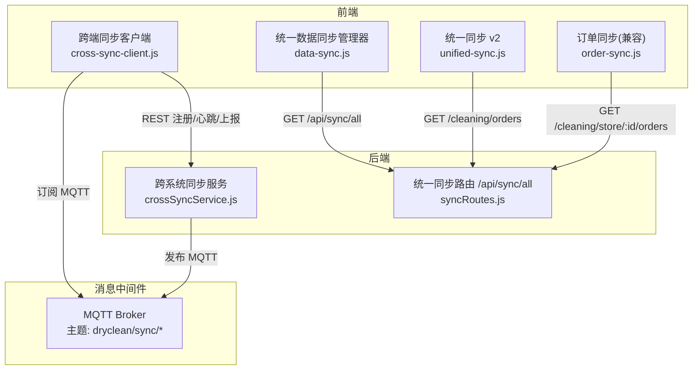
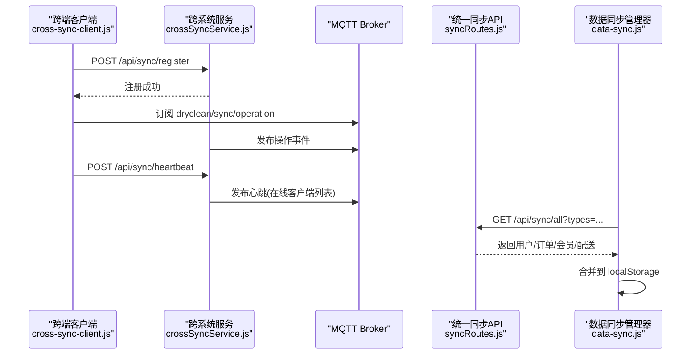
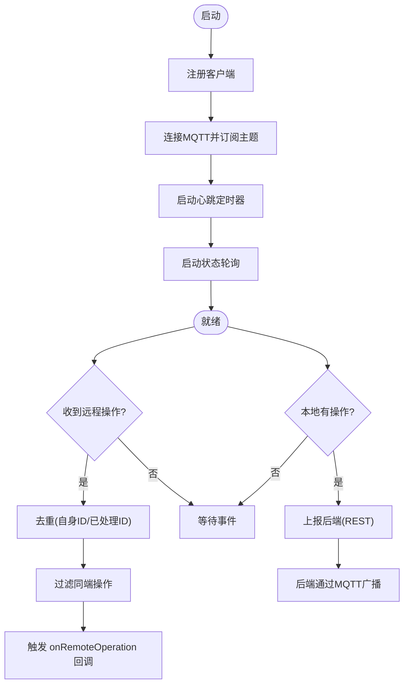
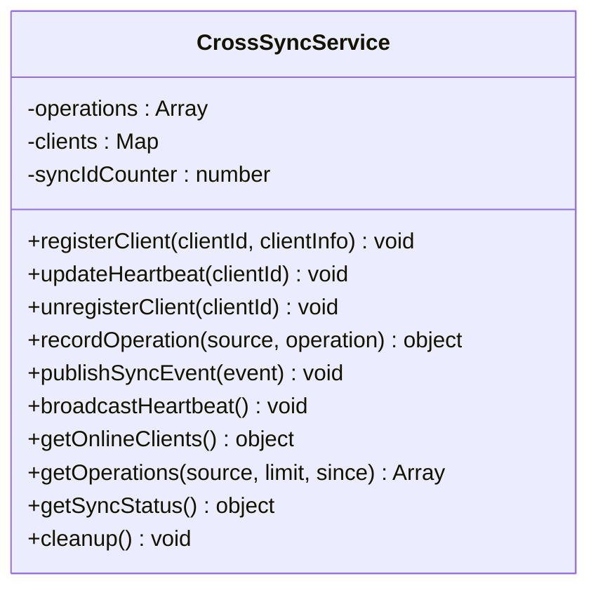
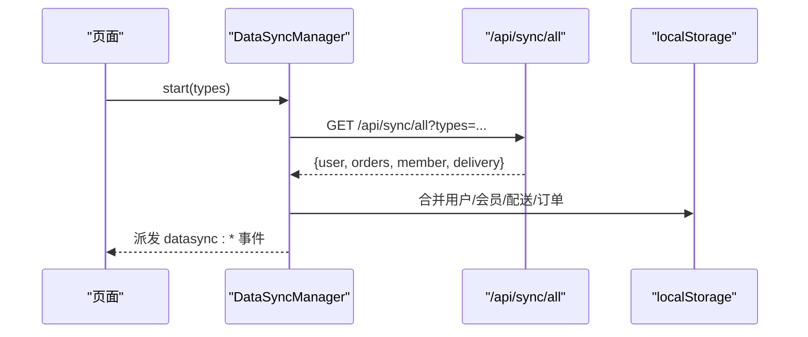
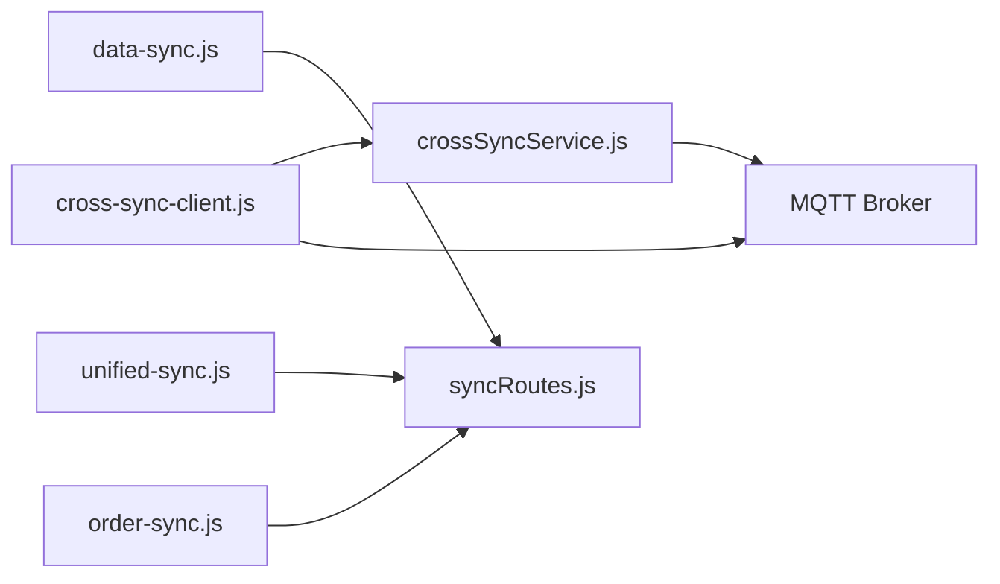

# 跨端数据同步

<cite>
**本文引用的文件**   
- [js/cross-sync-client.js](file://js/cross-sync-client.js)
- [backend/services/crossSyncService.js](file://backend/services/crossSyncService.js)
- [js/data-sync.js](file://js/data-sync.js)
- [backend/modules/common/routes/syncRoutes.js](file://backend/modules/common/routes/syncRoutes.js)
- [js/unified-sync.js](file://js/unified-sync.js)
- [js/order-sync.js](file://js/order-sync.js)
- [DATA-SYNC-GUIDE.md](file://DATA-SYNC-GUIDE.md)
- [DATA-SYNC-TROUBLESHOOTING.md](file://DATA-SYNC-TROUBLESHOOTING.md)
</cite>

## 目录
1. [引言](#引言)
2. [项目结构](#项目结构)
3. [核心组件](#核心组件)
4. [架构总览](#架构总览)
5. [详细组件分析](#详细组件分析)
6. [依赖关系分析](#依赖关系分析)
7. [性能与优化](#性能与优化)
8. [故障排查指南](#故障排查指南)
9. [结论](#结论)
10. [附录](#附录)

## 引言
本设计文档围绕“跨端数据同步”目标，系统化梳理现有实现并给出可落地的架构方案。重点覆盖：
- 双向同步机制：增量/全量、冲突解决策略
- 状态一致性保证：版本号管理、操作日志、回滚机制
- 触发机制：事件驱动、定时同步、手动触发
- 冲突检测与处理：最后写入获胜、业务规则合并、人工干预
- 离线缓存与同步策略：本地存储、差异计算、网络优化
- 性能优化：批量操作、压缩传输、断点续传
- 监控与诊断：指标、日志、定位问题工具

## 项目结构
仓库中涉及跨端同步的关键模块分布如下：
- 前端同步客户端与服务端桥接：
  - 跨端实时通道（MQTT + REST）：[js/cross-sync-client.js](file://js/cross-sync-client.js)、[backend/services/crossSyncService.js](file://backend/services/crossSyncService.js)
  - 统一数据拉取（后端权威源）：[js/data-sync.js](file://js/data-sync.js)、[backend/modules/common/routes/syncRoutes.js](file://backend/modules/common/routes/syncRoutes.js)
  - 历史兼容与多端适配：[js/unified-sync.js](file://js/unified-sync.js)、[js/order-sync.js](file://js/order-sync.js)
- 使用与排障文档：
  - [DATA-SYNC-GUIDE.md](file://DATA-SYNC-GUIDE.md)、[DATA-SYNC-TROUBLESHOOTING.md](file://DATA-SYNC-TROUBLESHOOTING.md)

图表来源
- [js/cross-sync-client.js:160-232](file://js/cross-sync-client.js#L160-L232)
- [backend/services/crossSyncService.js:224-262](file://backend/services/crossSyncService.js#L224-L262)
- [backend/modules/common/routes/syncRoutes.js:26-187](file://backend/modules/common/routes/syncRoutes.js#L26-L187)
- [js/data-sync.js:111-190](file://js/data-sync.js#L111-L190)
- [js/unified-sync.js:122-204](file://js/unified-sync.js#L122-L204)
- [js/order-sync.js:96-194](file://js/order-sync.js#L96-L194)

章节来源
- [DATA-SYNC-GUIDE.md:104-140](file://DATA-SYNC-GUIDE.md#L104-L140)

## 核心组件
- 跨端同步客户端（浏览器侧）
  - 负责注册/心跳、MQTT 连接与订阅、本地操作去重、对端在线状态感知、将本地操作上报到后端并通过 MQTT 广播
- 跨系统同步服务（Node 侧）
  - 维护在线客户端、记录操作流水、通过 MQTT 广播操作事件、周期性广播心跳、提供同步状态查询
- 统一数据同步管理器（浏览器侧）
  - 以 /api/sync/all 为权威数据源，定时或事件触发全量拉取，合并用户、会员、配送、订单等数据到 localStorage
- 统一同步 v2（浏览器侧）
  - 面向多端（C/M/Admin）的通用拉取与合并逻辑，按端类型选择不同存储键与过滤条件
- 订单同步（兼容层）
  - 基于路径判断端类型，调用对应订单 API，合并到本地存储；默认关闭自动启动，由页面显式控制

章节来源
- [js/cross-sync-client.js:23-96](file://js/cross-sync-client.js#L23-L96)
- [backend/services/crossSyncService.js:44-135](file://backend/services/crossSyncService.js#L44-L135)
- [js/data-sync.js:18-106](file://js/data-sync.js#L18-L106)
- [js/unified-sync.js:13-119](file://js/unified-sync.js#L13-L119)
- [js/order-sync.js:11-71](file://js/order-sync.js#L11-L71)

## 架构总览
整体采用“双通道 + 权威源”的混合模式：
- 实时通道：MQTT 用于跨端操作广播与心跳，保障低延迟与在线感知
- 权威源：/api/sync/all 作为唯一可信数据源，定期全量拉取，确保最终一致
- 本地缓存：localStorage 持久化，支持离线浏览与快速渲染

图表来源
- [js/cross-sync-client.js:111-157](file://js/cross-sync-client.js#L111-L157)
- [backend/services/crossSyncService.js:67-135](file://backend/services/crossSyncService.js#L67-L135)
- [backend/modules/common/routes/syncRoutes.js:26-187](file://backend/modules/common/routes/syncRoutes.js#L26-L187)
- [js/data-sync.js:111-190](file://js/data-sync.js#L111-L190)

## 详细组件分析

### 组件A：跨端同步客户端（CrossSyncClient）
职责
- 注册/心跳/注销：通过 REST 与后端保持在线
- MQTT 连接与订阅：接收对端操作与心跳
- 本地操作去重：避免本地回显重复处理
- 状态轮询：作为 MQTT 的补充，获取全局同步状态
- 发布本地操作：将本端操作上报至后端，由后端广播

关键流程
- 启动：初始化配置 → 注册 → 连接MQTT → 启动心跳 → 启动状态轮询
- 收到操作：过滤自身clientId → 检查本地已处理ID → 过滤同端操作 → 回调上层
- 发布操作：生成本地标记 → 上报后端 → 静默失败降级

图表来源
- [js/cross-sync-client.js:53-96](file://js/cross-sync-client.js#L53-L96)
- [js/cross-sync-client.js:160-232](file://js/cross-sync-client.js#L160-L232)
- [js/cross-sync-client.js:235-278](file://js/cross-sync-client.js#L235-L278)
- [js/cross-sync-client.js:347-371](file://js/cross-sync-client.js#L347-L371)

章节来源
- [js/cross-sync-client.js:23-96](file://js/cross-sync-client.js#L23-L96)
- [js/cross-sync-client.js:160-232](file://js/cross-sync-client.js#L160-L232)
- [js/cross-sync-client.js:235-278](file://js/cross-sync-client.js#L235-L278)
- [js/cross-sync-client.js:347-371](file://js/cross-sync-client.js#L347-L371)

### 组件B：跨系统同步服务（CrossSyncService）
职责
- 客户端生命周期管理：注册、心跳、下线清理
- 操作记录与广播：生成 syncId，记录操作流水，通过 MQTT 广播
- 心跳广播：周期性推送在线客户端集合
- 状态查询：汇总在线客户端、最近操作、MQTT 连通性

数据结构与复杂度
- operations：数组，最多保留固定数量，时间窗口过期清理
- clients：Map，按 clientId 索引，O(1) 更新/删除
- 查询：getOperations 线性扫描后过滤，O(n)

图表来源
- [backend/services/crossSyncService.js:44-135](file://backend/services/crossSyncService.js#L44-L135)
- [backend/services/crossSyncService.js:143-197](file://backend/services/crossSyncService.js#L143-L197)
- [backend/services/crossSyncService.js:224-262](file://backend/services/crossSyncService.js#L224-L262)
- [backend/services/crossSyncService.js:270-305](file://backend/services/crossSyncService.js#L270-L305)

章节来源
- [backend/services/crossSyncService.js:44-135](file://backend/services/crossSyncService.js#L44-L135)
- [backend/services/crossSyncService.js:143-197](file://backend/services/crossSyncService.js#L143-L197)
- [backend/services/crossSyncService.js:224-262](file://backend/services/crossSyncService.js#L224-L262)
- [backend/services/crossSyncService.js:270-305](file://backend/services/crossSyncService.js#L270-L305)

### 组件C：统一数据同步管理器（DataSyncManager）
职责
- 以 /api/sync/all 为权威源，定时或事件触发全量拉取
- 合并用户资料、会员信息、配送信息、订单到 localStorage
- 暴露手动同步与状态查询接口

同步策略
- 全量拉取：每次请求 types=user,orders,member,delivery
- 合并策略：服务器优先，保留本地特有字段；订单按 orderNo/_id 去重合并
- 事件驱动：监听 visibilitychange、storage、pageshow 等触发同步

图表来源
- [js/data-sync.js:78-106](file://js/data-sync.js#L78-L106)
- [js/data-sync.js:111-190](file://js/data-sync.js#L111-L190)
- [js/data-sync.js:195-284](file://js/data-sync.js#L195-L284)
- [backend/modules/common/routes/syncRoutes.js:26-187](file://backend/modules/common/routes/syncRoutes.js#L26-L187)

章节来源
- [js/data-sync.js:78-106](file://js/data-sync.js#L78-L106)
- [js/data-sync.js:111-190](file://js/data-sync.js#L111-L190)
- [js/data-sync.js:195-284](file://js/data-sync.js#L195-L284)
- [backend/modules/common/routes/syncRoutes.js:26-187](file://backend/modules/common/routes/syncRoutes.js#L26-L187)

### 组件D：统一同步 v2（UnifiedSync）
职责
- 根据当前页面路径识别端类型（C/M/Admin），选择不同存储键与过滤条件
- 从 /cleaning/orders 拉取并按端维度过滤，合并到本地
- 提供备份键与同步状态展示

要点
- 端类型判定：m-index → m，admin → admin，其他 → c
- 过滤：M端按 storeId 过滤
- 合并：服务器优先，保留本地特有字段，排序最新在前

章节来源
- [js/unified-sync.js:73-78](file://js/unified-sync.js#L73-L78)
- [js/unified-sync.js:122-204](file://js/unified-sync.js#L122-L204)
- [js/unified-sync.js:207-264](file://js/unified-sync.js#L207-L264)

### 组件E：订单同步（OrderSyncManager，兼容层）
职责
- 根据页面路径选择端类型与认证方式
- 调用对应订单 API（门店/全部/用户），合并到本地
- 默认关闭自动启动，由页面显式控制

章节来源
- [js/order-sync.js:96-194](file://js/order-sync.js#L96-L194)
- [js/order-sync.js:196-234](file://js/order-sync.js#L196-L234)

## 依赖关系分析
- 前端依赖
  - cross-sync-client.js 依赖 mqtt.js（可选）、REST API（/api/sync/*）
  - data-sync.js 依赖 /api/sync/all
  - unified-sync.js 依赖 /cleaning/orders
  - order-sync.js 依赖 /cleaning/store/:id/orders 与 /cleaning/orders
- 后端依赖
  - crossSyncService.js 依赖 lightService（MQTT 封装）与 notificationHubService（通知中心）
  - syncRoutes.js 依赖 authService、memberService、orderService

图表来源
- [js/cross-sync-client.js:160-232](file://js/cross-sync-client.js#L160-L232)
- [backend/services/crossSyncService.js:224-262](file://backend/services/crossSyncService.js#L224-L262)
- [backend/modules/common/routes/syncRoutes.js:26-187](file://backend/modules/common/routes/syncRoutes.js#L26-L187)

章节来源
- [js/cross-sync-client.js:160-232](file://js/cross-sync-client.js#L160-L232)
- [backend/services/crossSyncService.js:224-262](file://backend/services/crossSyncService.js#L224-L262)
- [backend/modules/common/routes/syncRoutes.js:26-187](file://backend/modules/common/routes/syncRoutes.js#L26-L187)

## 性能与优化
- 批量操作
  - 建议在后端聚合多个实体（用户、订单、会员、配送）一次返回，减少往返次数
  - 前端合并时按 ID 建立 Map，避免多次遍历
- 压缩传输
  - 在网关或反向代理启用 gzip/br，降低 JSON 体积
- 断点续传
  - 引入 lastSyncTime 或版本向量，服务端仅返回变更集（增量）
  - 前端记录上次拉取时间戳，下次请求携带 since 参数
- 去重与幂等
  - 利用 syncId 与本地已处理集合，避免重复应用
- 缓存与预取
  - 结合 visibilitychange 与 pageshow 做轻量预取
  - 对热点数据（如门店列表）做短期内存缓存

[本节为通用指导，不直接分析具体文件]

## 故障排查指南
常见问题与定位步骤
- 端口不一致导致数据隔离
  - 现象：localhost:3000 与 localhost:3002 的 localStorage 互不可见
  - 排查：确认当前页面访问端口与后端服务端口一致
- 认证失败（401）
  - 现象：同步停止或跳过
  - 排查：检查 token 存储键名与有效期
- MQTT 连接失败
  - 现象：无法实时收到对端操作
  - 排查：检查 ws://host:8083/mqtt 可达性与鉴权
- 本地回显未抑制
  - 现象：同一操作被重复处理
  - 排查：检查 clientId 与 localOperations 去重逻辑

实用命令与脚本
- 健康检查：curl http://localhost:3000/api/health
- 查看本地订单数：在控制台执行相关读取语句
- 手动触发同步：调用 OrderSyncManager.manualSync() 或 DataSyncManager.manualSync()

章节来源
- [DATA-SYNC-TROUBLESHOOTING.md:105-147](file://DATA-SYNC-TROUBLESHOOTING.md#L105-L147)
- [DATA-SYNC-TROUBLESHOOTING.md:234-246](file://DATA-SYNC-TROUBLESHOOTING.md#L234-L246)

## 结论
当前系统已具备“实时通道 + 权威源 + 本地缓存”的基础能力：
- 实时通道：MQTT 提供跨端操作广播与在线感知
- 权威源：/api/sync/all 提供统一的全量视图，确保最终一致
- 本地缓存：localStorage 支撑离线浏览与快速渲染

下一步建议
- 完善增量同步：引入 lastSyncTime/version 与后端增量接口
- 强化冲突解决：明确“最后写入获胜”与业务规则合并策略，必要时引入人工干预入口
- 增强可靠性：增加重试、退避、断点续传与幂等校验
- 完善监控：输出同步指标（成功率、耗时、队列长度、错误码分布）

[本节为总结性内容，不直接分析具体文件]

## 附录

### 同步触发机制对照
- 事件驱动
  - 页面可见性变化、storage 事件、pageshow 恢复
- 定时同步
  - 定时器周期拉取（间隔可配置）
- 手动触发
  - 暴露 manualSync 方法供页面主动调用

章节来源
- [js/data-sync.js:309-337](file://js/data-sync.js#L309-L337)
- [js/unified-sync.js:395-412](file://js/unified-sync.js#L395-L412)
- [js/order-sync.js:346-351](file://js/order-sync.js#L346-L351)

### 冲突检测与处理策略
- 最后写入获胜（LWW）
  - 以服务器时间为基准，合并时服务器数据优先
- 业务规则合并
  - 保留本地特有字段，按业务语义合并金额、状态等
- 人工干预
  - 当检测到严重不一致时，提示用户并引导刷新或重新登录

章节来源
- [js/data-sync.js:218-251](file://js/data-sync.js#L218-L251)
- [js/unified-sync.js:207-264](file://js/unified-sync.js#L207-L264)

### 离线数据缓存与同步策略
- 本地存储
  - 各端使用独立 storageKey，避免互相污染
- 差异计算
  - 基于 ID 映射进行新增/更新/删除推断
- 网络优化
  - 超时控制、静默失败、降级为轮询

章节来源
- [js/unified-sync.js:207-264](file://js/unified-sync.js#L207-L264)
- [js/data-sync.js:111-190](file://js/data-sync.js#L111-L190)