# 通信架构设计

<cite>
**本文引用的文件**   
- [server.js](file://backend/server.js)
- [lightService.js](file://backend/services/lightService.js)
- [orderEventService.js](file://backend/services/orderEventService.js)
- [crossSyncService.js](file://backend/services/crossSyncService.js)
- [notificationHubService.js](file://backend/services/notificationHubService.js)
- [messageService.js](file://backend/services/messageService.js)
- [syncRoutes.js](file://backend/modules/common/routes/syncRoutes.js)
- [config/index.js](file://backend/config/index.js)
- [order-event-client.js](file://js/order-event-client.js)
- [unified-sync.js](file://js/unified-sync.js)
- [data-sync.js](file://js/data-sync.js)
- [message-center.js](file://js/message-center.js)
</cite>

## 目录
1. [引言](#引言)
2. [项目结构](#项目结构)
3. [核心组件](#核心组件)
4. [架构总览](#架构总览)
5. [详细组件分析](#详细组件分析)
6. [依赖关系分析](#依赖关系分析)
7. [性能与可靠性](#性能与可靠性)
8. [故障排查指南](#故障排查指南)
9. [结论](#结论)
10. [附录：集成与安全规范](#附录集成与安全规范)

## 引言
本文件面向通信架构师与开发者，系统化阐述干洗店管理系统的多协议通信架构。系统以 MQTT 为实时总线，结合 HTTP RESTful API、WebSocket（MQTT over WS）以及 TCP 设备通道，实现跨端数据同步、通知聚合、消息中心与终端设备联动。文档覆盖主题命名规范、QoS 策略、路由分发机制、双向同步与一致性保证、通知中心设计与安全机制，并提供可操作的集成指南与优化建议。

## 项目结构
后端采用 Express 模块化路由组织业务接口，并通过服务层封装 MQTT 发布/订阅、通知中心、消息中心与跨端同步能力；前端提供统一的数据同步与事件客户端，分别用于轮询拉取与实时推送场景。

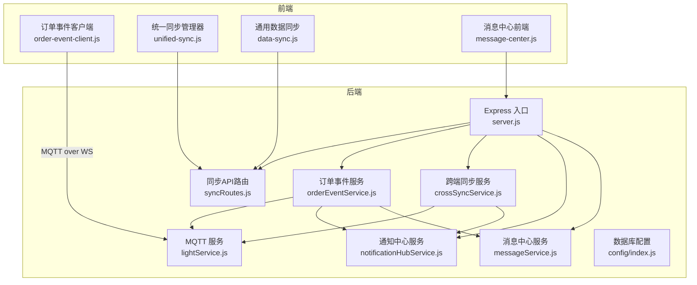

图表来源
- [server.js:1-200](file://backend/server.js#L1-L200)
- [lightService.js:1-234](file://backend/services/lightService.js#L1-L234)
- [orderEventService.js:1-168](file://backend/services/orderEventService.js#L1-L168)
- [crossSyncService.js:1-336](file://backend/services/crossSyncService.js#L1-L336)
- [notificationHubService.js:1-264](file://backend/services/notificationHubService.js#L1-L264)
- [messageService.js:1-247](file://backend/services/messageService.js#L1-L247)
- [syncRoutes.js:1-190](file://backend/modules/common/routes/syncRoutes.js#L1-L190)
- [config/index.js:1-167](file://backend/config/index.js#L1-L167)
- [order-event-client.js:1-270](file://js/order-event-client.js#L1-L270)
- [unified-sync.js:1-420](file://js/unified-sync.js#L1-L420)
- [data-sync.js:1-348](file://js/data-sync.js#L1-L348)
- [message-center.js:1-352](file://js/message-center.js#L1-L352)

章节来源
- [server.js:1-200](file://backend/server.js#L1-L200)
- [config/index.js:1-167](file://backend/config/index.js#L1-L167)

## 核心组件
- MQTT 服务（lightService.js）：负责连接 Broker、订阅终端状态与心跳、对外提供 publish/subscribe 能力，并维护终端在线状态。
- 订单事件服务（orderEventService.js）：在订单关键生命周期发布事件到门店级与全局主题，同时写入通知中心与消息中心，并记录跨端操作。
- 跨端同步服务（crossSyncService.js）：桥接 Admin 与 M 端操作，通过 MQTT 广播操作事件，维护在线客户端与心跳，避免本地回显。
- 通知中心服务（notificationHubService.js）：聚合系统事件（订单、灯条等），支持按门店/全局查询与已读标记。
- 消息中心服务（messageService.js）：处理客户消息与账户通讯，提供线程聚合、未读数统计与过期清理。
- 同步 API（syncRoutes.js）：作为唯一权威数据源，聚合用户、会员、订单、配送信息供前端统一拉取。
- 前端事件客户端（order-event-client.js）：基于 MQTT over WebSocket 订阅订单更新，具备重连与降级轮询。
- 前端统一同步（unified-sync.js / data-sync.js）：定时从 /api/sync/all 拉取数据，合并至本地存储，触发页面更新。
- 消息中心前端（message-center.js）：轮询消息线程与详情，支持发送与已读标记。

章节来源
- [lightService.js:1-234](file://backend/services/lightService.js#L1-L234)
- [orderEventService.js:1-168](file://backend/services/orderEventService.js#L1-L168)
- [crossSyncService.js:1-336](file://backend/services/crossSyncService.js#L1-L336)
- [notificationHubService.js:1-264](file://backend/services/notificationHubService.js#L1-L264)
- [messageService.js:1-247](file://backend/services/messageService.js#L1-L247)
- [syncRoutes.js:1-190](file://backend/modules/common/routes/syncRoutes.js#L1-L190)
- [order-event-client.js:1-270](file://js/order-event-client.js#L1-L270)
- [unified-sync.js:1-420](file://js/unified-sync.js#L1-L420)
- [data-sync.js:1-348](file://js/data-sync.js#L1-L348)
- [message-center.js:1-352](file://js/message-center.js#L1-L352)

## 架构总览
系统采用“HTTP + MQTT + WS + TCP”的多协议融合架构：
- HTTP RESTful API：提供认证、业务查询与统一数据同步（/api/sync/all）。
- MQTT over WebSocket：前端通过 ws://host:8083/mqtt 订阅订单与同步事件，实现低延迟推送。
- MQTT TCP：后端与 Broker 使用 TCP 直连，终端设备也可通过 TCP 上报心跳与状态。
- 通知中心与消息中心：将系统事件与业务消息解耦，便于不同端按需消费。

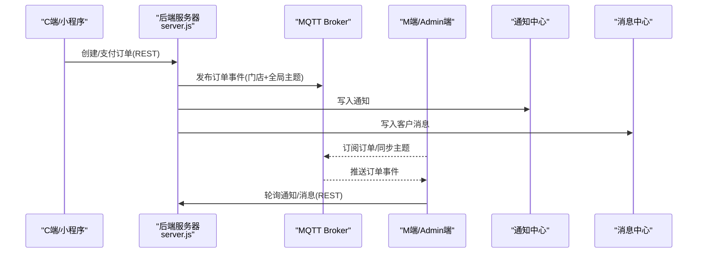

图表来源
- [orderEventService.js:1-168](file://backend/services/orderEventService.js#L1-L168)
- [notificationHubService.js:1-264](file://backend/services/notificationHubService.js#L1-L264)
- [messageService.js:1-247](file://backend/services/messageService.js#L1-L247)
- [order-event-client.js:1-270](file://js/order-event-client.js#L1-L270)
- [server.js:1-200](file://backend/server.js#L1-L200)

## 详细组件分析

### MQTT 服务（lightService.js）
- 职责：连接 Broker、订阅终端状态/心跳/主消息主题、维护终端注册表、对外暴露 publish/subscribe/isConnected。
- 主题订阅：终端状态、心跳与主消息主题采用通配符模式，便于按门店维度聚合。
- 健康检查：周期性 ensureConnected 保障 Broker 后启动时的自动恢复。

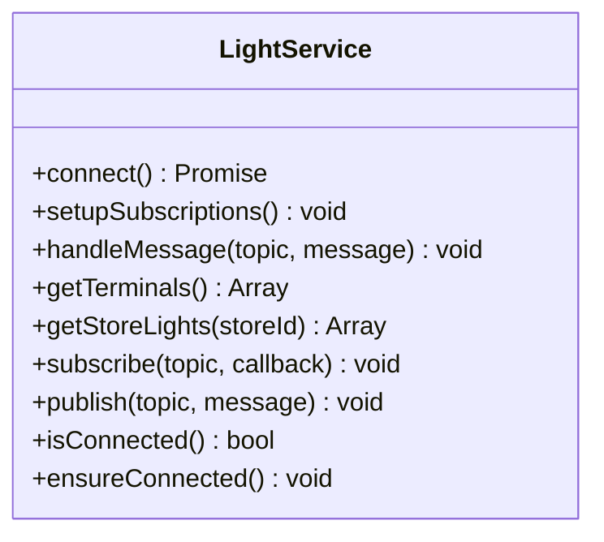

图表来源
- [lightService.js:1-234](file://backend/services/lightService.js#L1-L234)

章节来源
- [lightService.js:1-234](file://backend/services/lightService.js#L1-L234)

### 订单事件服务（orderEventService.js）
- 职责：在订单关键事件发生时，向门店级与全局主题发布事件，并同步写入通知中心与消息中心，记录跨端操作。
- 主题设计：
  - 门店级：dryclean/orders/{storeId}/update
  - 全局级：dryclean/orders/all/update
- QoS：默认使用 QoS 1，确保至少一次投递。

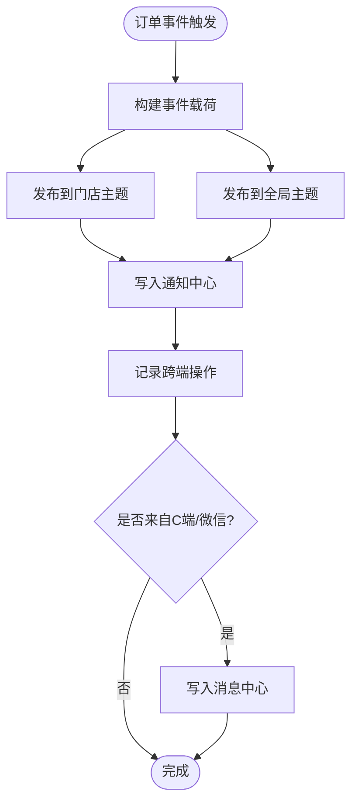

图表来源
- [orderEventService.js:1-168](file://backend/services/orderEventService.js#L1-L168)
- [notificationHubService.js:1-264](file://backend/services/notificationHubService.js#L1-L264)
- [messageService.js:1-247](file://backend/services/messageService.js#L1-L247)
- [crossSyncService.js:1-336](file://backend/services/crossSyncService.js#L1-L336)

章节来源
- [orderEventService.js:1-168](file://backend/services/orderEventService.js#L1-L168)

### 跨端同步服务（crossSyncService.js）
- 职责：桥接 Admin 与 M 端操作，广播操作事件，维护在线客户端与心跳，避免本地回显。
- 主题设计：
  - dryclean/sync/operation：跨端操作广播
  - dryclean/sync/heartbeat：页面在线心跳
- 特性：携带 clientId 与 syncId，客户端据此过滤自身操作与去重。

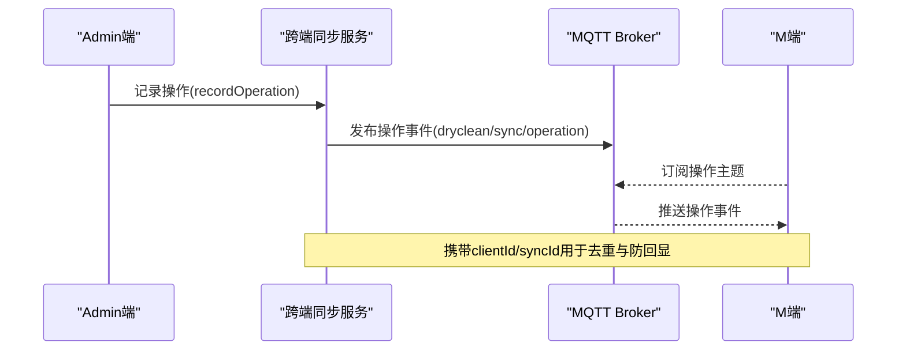

图表来源
- [crossSyncService.js:1-336](file://backend/services/crossSyncService.js#L1-L336)

章节来源
- [crossSyncService.js:1-336](file://backend/services/crossSyncService.js#L1-L336)

### 通知中心服务（notificationHubService.js）
- 职责：聚合系统事件（订单、灯条等），支持按门店或全局查询、已读标记与过期清理。
- 优先级：支持 high/normal/low 三级，便于界面展示与提醒策略。
- 有效期：默认 1 小时，定期清理。

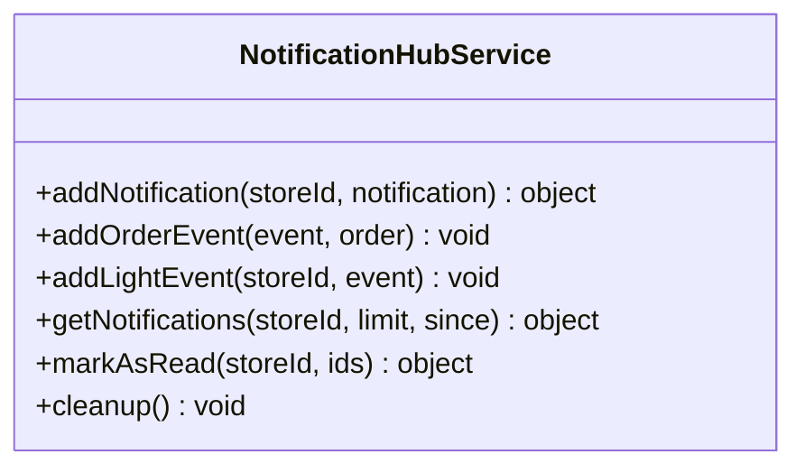

图表来源
- [notificationHubService.js:1-264](file://backend/services/notificationHubService.js#L1-L264)

章节来源
- [notificationHubService.js:1-264](file://backend/services/notificationHubService.js#L1-L264)

### 消息中心服务（messageService.js）
- 职责：处理客户消息与账户通讯，提供线程聚合、未读数统计、已读标记与过期清理。
- 线程模型：按 threadId 聚合，支持按 storeId/type/threadId/since 过滤。
- 有效期：默认 7 天，定时清理。

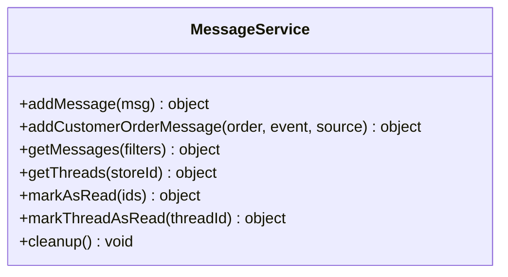

图表来源
- [messageService.js:1-247](file://backend/services/messageService.js#L1-L247)

章节来源
- [messageService.js:1-247](file://backend/services/messageService.js#L1-L247)

### 统一数据同步 API（syncRoutes.js）
- 职责：作为唯一权威数据源，聚合用户、会员、订单、配送信息，供前端统一拉取。
- 认证：支持 Authorization Bearer token 与 query 参数兼容（开发模式 mock_token）。
- 幂等性：返回时间戳与数据结构稳定，前端可做增量合并。

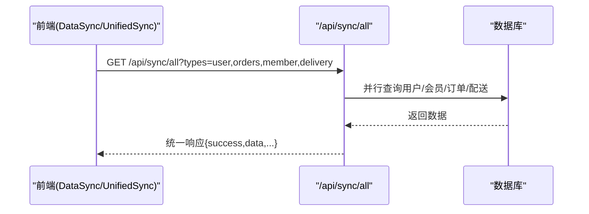

图表来源
- [syncRoutes.js:1-190](file://backend/modules/common/routes/syncRoutes.js#L1-L190)
- [config/index.js:1-167](file://backend/config/index.js#L1-L167)

章节来源
- [syncRoutes.js:1-190](file://backend/modules/common/routes/syncRoutes.js#L1-L190)
- [config/index.js:1-167](file://backend/config/index.js#L1-L167)

### 前端事件客户端（order-event-client.js）
- 职责：通过 MQTT over WebSocket 连接 Broker，订阅订单与同步主题，具备指数退避重连与降级轮询。
- 主题订阅：
  - 门店模式：dryclean/orders/{storeId}/update + dryclean/orders/all/update
  - 全局模式：dryclean/orders/all/update + dryclean/orders/+/update
- QoS：订阅使用 QoS 1。

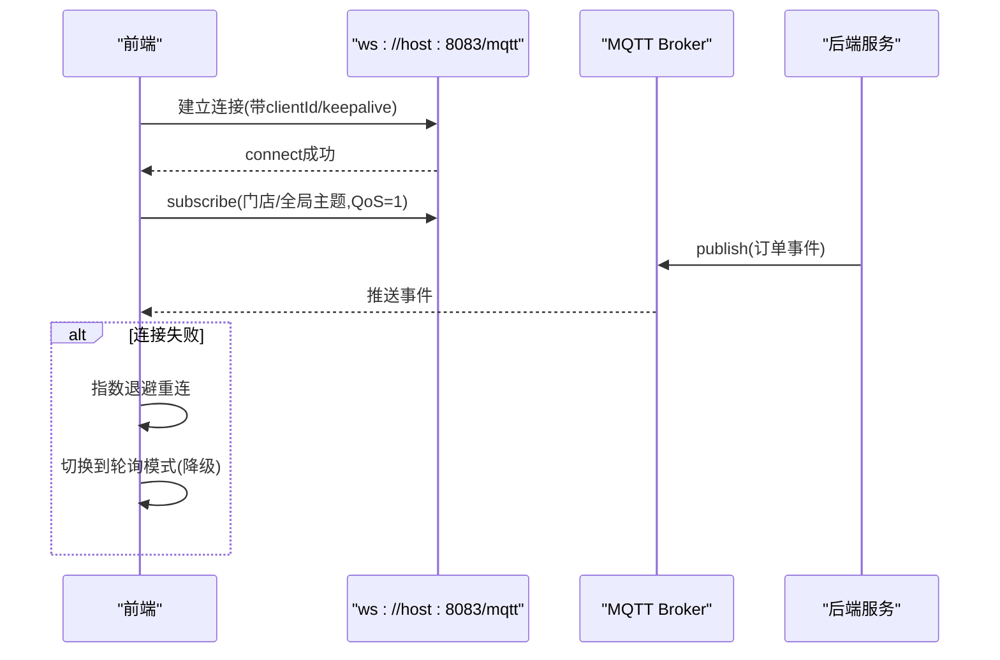

图表来源
- [order-event-client.js:1-270](file://js/order-event-client.js#L1-L270)
- [orderEventService.js:1-168](file://backend/services/orderEventService.js#L1-L168)

章节来源
- [order-event-client.js:1-270](file://js/order-event-client.js#L1-L270)

### 前端统一同步（unified-sync.js / data-sync.js）
- unified-sync.js：按端类型（C/M/Admin）选择存储键与端点，定时拉取并合并到 localStorage，触发页面更新事件。
- data-sync.js：通用数据同步，调用 /api/sync/all 拉取 user/member/orders/delivery，智能 diff 合并。

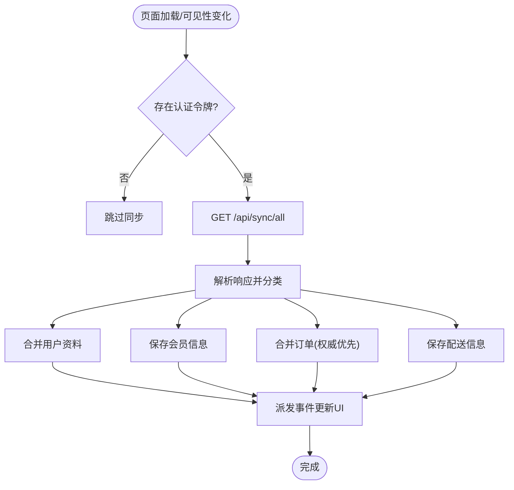

图表来源
- [unified-sync.js:1-420](file://js/unified-sync.js#L1-L420)
- [data-sync.js:1-348](file://js/data-sync.js#L1-L348)
- [syncRoutes.js:1-190](file://backend/modules/common/routes/syncRoutes.js#L1-L190)

章节来源
- [unified-sync.js:1-420](file://js/unified-sync.js#L1-L420)
- [data-sync.js:1-348](file://js/data-sync.js#L1-L348)

### 消息中心前端（message-center.js）
- 职责：轮询消息线程与详情，支持发送消息与已读标记，显示未读数徽标。
- 交互：打开线程时自动标记已读，定时刷新列表与当前线程。

章节来源
- [message-center.js:1-352](file://js/message-center.js#L1-L352)

## 依赖关系分析
- 模块耦合：
  - orderEventService 依赖 lightService（MQTT）、notificationHubService（通知）、crossSyncService（跨端）、messageService（消息）。
  - crossSyncService 依赖 lightService（MQTT）与 notificationHubService（通知）。
  - server.js 挂载各路由与服务实例，形成统一的 HTTP 入口。
- 外部依赖：
  - MQTT Broker（EMQX/Aedes/NanoMQ 等）通过 TCP 与 WS 端口暴露。
  - 数据库（MongoDB/MySQL）由 config/index.js 统一管理。

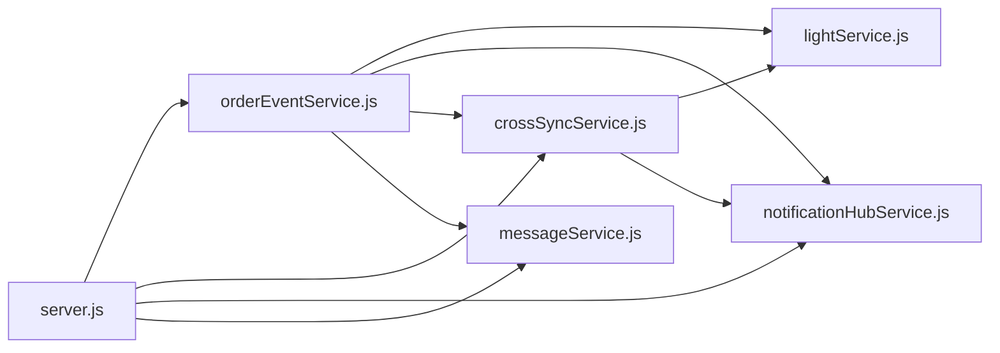

图表来源
- [orderEventService.js:1-168](file://backend/services/orderEventService.js#L1-L168)
- [crossSyncService.js:1-336](file://backend/services/crossSyncService.js#L1-L336)
- [notificationHubService.js:1-264](file://backend/services/notificationHubService.js#L1-L264)
- [messageService.js:1-247](file://backend/services/messageService.js#L1-L247)
- [lightService.js:1-234](file://backend/services/lightService.js#L1-L234)
- [server.js:1-200](file://backend/server.js#L1-L200)

章节来源
- [server.js:1-200](file://backend/server.js#L1-L200)

## 性能与可靠性
- 主题与 QoS
  - 订单事件：门店级与全局级双主题，QoS=1，兼顾实时性与可靠性。
  - 跨端同步：operation 与 heartbeat 主题，QoS=1，降低重复与丢包风险。
- 重连与降级
  - 前端 MQTT 客户端具备指数退避重连，达到上限后自动切换轮询模式，保证可用性。
- 数据一致性
  - 统一同步 API 作为权威数据源，前端采用“服务器优先”的合并策略，保留本地特有字段，减少冲突。
- 资源控制
  - 通知与消息中心设置最大条目与 TTL，定时清理，避免内存膨胀。
- 终端心跳
  - 终端心跳超时判定离线，定期清理无效灯条，保持状态新鲜度。

[本节为通用指导，不直接分析具体文件]

## 故障排查指南
- MQTT 连接问题
  - 检查 Broker 端口与鉴权配置，确认 WS/TCP 可达。
  - 查看后端日志中的连接错误与重连提示。
- 事件未推送
  - 确认前端已正确订阅对应主题，且 QoS 一致。
  - 检查后端是否成功 publish 到门店与全局主题。
- 数据不一致
  - 核对 /api/sync/all 返回的时间戳与数据量，确认前端合并逻辑是否生效。
  - 检查跨端操作是否携带 clientId/syncId，避免本地回显。
- 通知/消息丢失
  - 确认 TTL 与最大条目限制是否符合预期，必要时调整清理周期。

章节来源
- [lightService.js:1-234](file://backend/services/lightService.js#L1-L234)
- [order-event-client.js:1-270](file://js/order-event-client.js#L1-L270)
- [syncRoutes.js:1-190](file://backend/modules/common/routes/syncRoutes.js#L1-L190)
- [crossSyncService.js:1-336](file://backend/services/crossSyncService.js#L1-L336)
- [notificationHubService.js:1-264](file://backend/services/notificationHubService.js#L1-L264)
- [messageService.js:1-247](file://backend/services/messageService.js#L1-L247)

## 结论
本架构以 MQTT 为核心实时总线，辅以 HTTP 统一数据同步与通知/消息中心，实现了跨端高可靠、低延迟的通信体系。通过明确的主题命名、QoS 策略与一致性合并算法，系统在可扩展性与稳定性之间取得平衡。后续可在负载均衡、持久化与审计方面进一步增强。

[本节为总结性内容，不直接分析具体文件]

## 附录：集成与安全规范

### 主题命名规范
- 订单事件
  - 门店级：dryclean/orders/{storeId}/update
  - 全局级：dryclean/orders/all/update
- 跨端同步
  - 操作广播：dryclean/sync/operation
  - 心跳广播：dryclean/sync/heartbeat
- 终端设备
  - 状态/心跳/主消息主题采用层级通配符，便于按门店维度聚合。

章节来源
- [orderEventService.js:1-168](file://backend/services/orderEventService.js#L1-L168)
- [crossSyncService.js:1-336](file://backend/services/crossSyncService.js#L1-L336)
- [lightService.js:1-234](file://backend/services/lightService.js#L1-L234)

### QoS 级别选择
- 订单事件与跨端操作：QoS=1，确保至少一次投递。
- 心跳与状态上报：QoS=1，兼顾实时性与可靠性。
- 前端订阅：统一使用 QoS=1，避免消息丢失。

章节来源
- [order-event-client.js:1-270](file://js/order-event-client.js#L1-L270)
- [lightService.js:1-234](file://backend/services/lightService.js#L1-L234)

### 多协议通信支持
- HTTP RESTful API
  - 统一数据同步：/api/sync/all
  - 通知与消息：/api/admin/notifications、/api/messages
- WebSocket（MQTT over WS）
  - 前端通过 ws://host:8083/mqtt 连接 Broker，订阅订单与同步主题。
- TCP 设备通信
  - 后端与 Broker 使用 TCP 直连，终端设备可通过 TCP 上报心跳与状态。

章节来源
- [server.js:1-200](file://backend/server.js#L1-L200)
- [order-event-client.js:1-270](file://js/order-event-client.js#L1-L270)
- [lightService.js:1-234](file://backend/services/lightService.js#L1-L234)

### 消息路由与分发机制
- 路由分发
  - 订单事件：同时发布到门店级与全局级主题，满足不同端的订阅需求。
  - 跨端操作：统一广播到 operation 主题，所有在线客户端接收。
- 负载均衡
  - 前端多实例订阅同一主题，Broker 负责分发消息；后端通过 ensureConnected 提升可用性。
- 故障重试
  - 前端 MQTT 客户端具备指数退避重连与降级轮询；后端定期 ensureConnected 恢复连接。

章节来源
- [orderEventService.js:1-168](file://backend/services/orderEventService.js#L1-L168)
- [crossSyncService.js:1-336](file://backend/services/crossSyncService.js#L1-L336)
- [lightService.js:1-234](file://backend/services/lightService.js#L1-L234)
- [order-event-client.js:1-270](file://js/order-event-client.js#L1-L270)

### 跨端数据同步架构
- 双向同步
  - 服务器→前端：/api/sync/all 全量拉取，前端合并到本地存储。
  - 前端→服务器：通过 REST 提交变更，后端发布事件与记录跨端操作。
- 冲突检测
  - 前端合并策略以服务器为准，保留本地特有字段，避免覆盖权威数据。
- 状态一致性
  - 携带 clientId/syncId 进行去重与防回显；TTL 与最大条目限制保障内存可控。

章节来源
- [syncRoutes.js:1-190](file://backend/modules/common/routes/syncRoutes.js#L1-L190)
- [unified-sync.js:1-420](file://js/unified-sync.js#L1-L420)
- [data-sync.js:1-348](file://js/data-sync.js#L1-L348)
- [crossSyncService.js:1-336](file://backend/services/crossSyncService.js#L1-L336)

### 通知中心设计
- 消息聚合
  - 订单事件与灯条事件统一写入通知中心，支持按门店/全局查询。
- 优先级管理
  - 支持 high/normal/low 三级，便于界面展示与提醒策略。
- 用户偏好
  - 前端可按需订阅不同类型通知，结合已读标记与过期清理。

章节来源
- [notificationHubService.js:1-264](file://backend/services/notificationHubService.js#L1-L264)

### 通信安全机制
- 身份认证
  - HTTP：Authorization Bearer token，支持开发模式 mock_token 兼容。
  - MQTT：用户名/密码鉴权（示例 admin/admin123），生产环境建议使用强口令与证书。
- 访问控制
  - 路由守卫与权限校验在后端中间件层实施，保护敏感接口。
- 传输加密
  - 生产环境建议启用 TLS（MQTT over WSS/HTTPS），防止窃听与篡改。
- 消息加密
  - 对敏感载荷可在应用层进行加密签名，确保端到端安全。

章节来源
- [syncRoutes.js:1-190](file://backend/modules/common/routes/syncRoutes.js#L1-L190)
- [lightService.js:1-234](file://backend/services/lightService.js#L1-L234)
- [server.js:1-200](file://backend/server.js#L1-L200)

### 集成指南与性能优化建议
- 集成步骤
  - 初始化后端服务与数据库连接，确保 MQTT Broker 可用。
  - 前端引入统一同步与事件客户端，配置正确的 API 基础地址与 WS 端口。
  - 订阅所需主题，处理事件回调并更新 UI。
- 性能优化
  - 合理设置同步间隔与轮询频率，避免频繁请求。
  - 使用主题通配符减少订阅数量，按门店粒度隔离流量。
  - 开启前端缓存与增量合并，减少重复渲染。
  - 监控 Broker 连接与健康状态，及时告警与自愈。

[本节为通用指导，不直接分析具体文件]