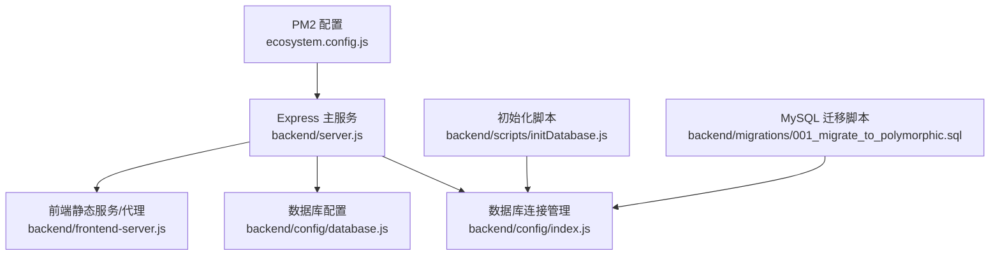
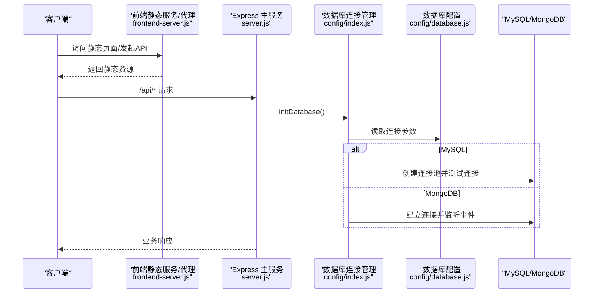
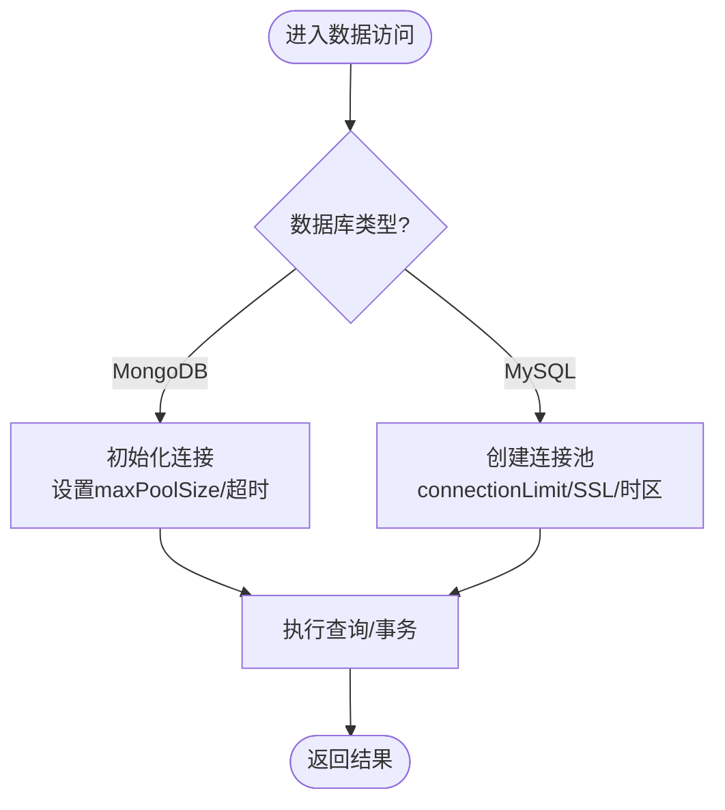
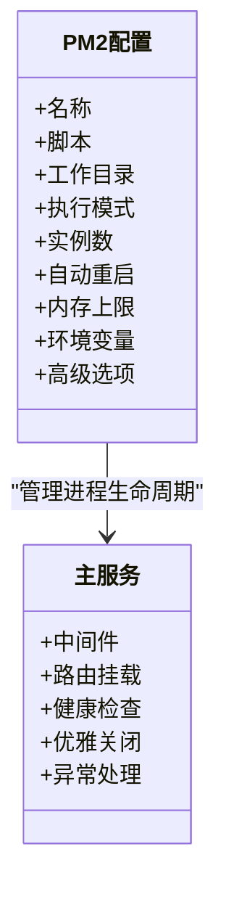
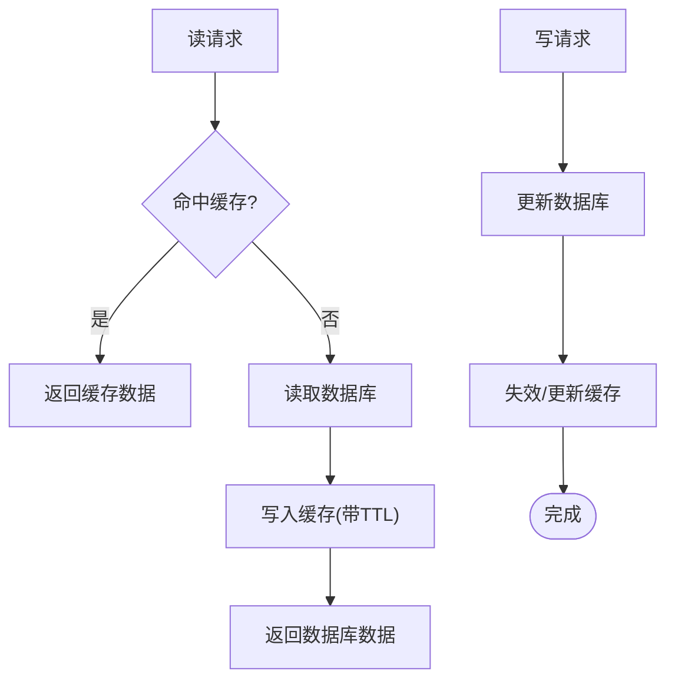
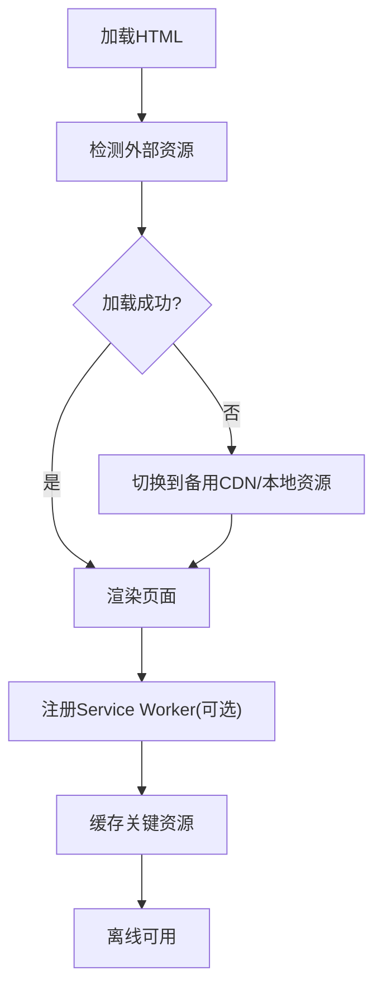
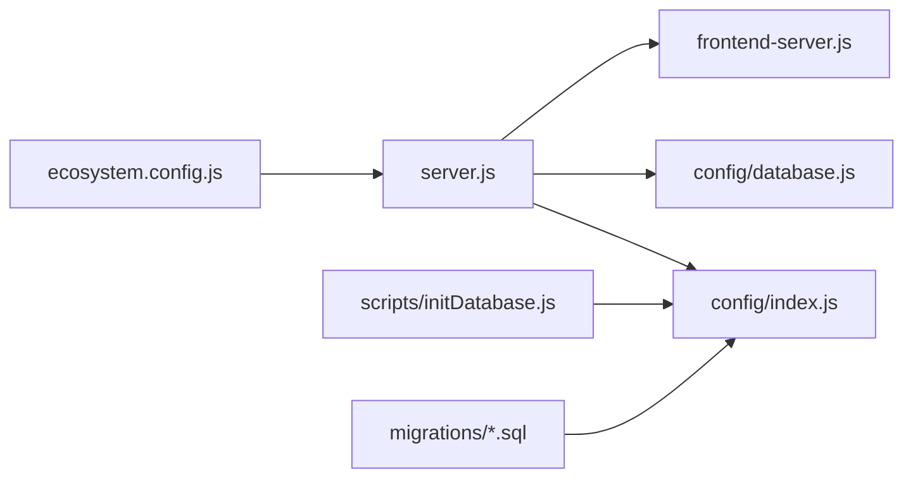

# 性能优化指南

<cite>
**本文引用的文件**   
- [backend/server.js](file://backend/server.js)
- [backend/config/index.js](file://backend/config/index.js)
- [backend/config/database.js](file://backend/config/database.js)
- [backend/scripts/initDatabase.js](file://backend/scripts/initDatabase.js)
- [backend/migrations/001_migrate_to_polymorphic.sql](file://backend/migrations/001_migrate_to_polymorphic.sql)
- [ecosystem.config.js](file://ecosystem.config.js)
- [backend/frontend-server.js](file://backend/frontend-server.js)
- [PRODUCTION_GUIDE.md](file://PRODUCTION_GUIDE.md)
</cite>

## 目录
1. [引言](#引言)
2. [项目结构](#项目结构)
3. [核心组件](#核心组件)
4. [架构总览](#架构总览)
5. [详细组件分析](#详细组件分析)
6. [依赖关系分析](#依赖关系分析)
7. [性能考量](#性能考量)
8. [故障排查指南](#故障排查指南)
9. [结论](#结论)
10. [附录](#附录)

## 引言
本指南面向干洗店管理系统的开发与运维团队，聚焦于系统级性能优化。内容覆盖数据库性能优化（索引、查询、连接池、分库分表）、应用层调优（Node.js进程与内存、异步处理）、缓存策略（Redis架构、失效与一致性）、前端性能（静态资源压缩、CDN加速、懒加载），以及压力测试与基准测试方法。所有建议均结合仓库现有实现进行落地说明，并提供可视化图示帮助理解。

## 项目结构
后端采用模块化 Express 服务，统一入口在 server.js；数据库配置与连接管理集中在 config 目录；生产部署使用 PM2 配置文件 ecosystem.config.js；前端静态资源由独立的前端服务器或反向代理提供。

**图表来源**
- [backend/server.js:1-120](file://backend/server.js#L1-L120)
- [backend/config/index.js:1-120](file://backend/config/index.js#L1-L120)
- [backend/config/database.js:1-64](file://backend/config/database.js#L1-L64)
- [backend/frontend-server.js:1-53](file://backend/frontend-server.js#L1-L53)
- [ecosystem.config.js:1-34](file://ecosystem.config.js#L1-L34)
- [backend/scripts/initDatabase.js:1-40](file://backend/scripts/initDatabase.js#L1-L40)
- [backend/migrations/001_migrate_to_polymorphic.sql:185-229](file://backend/migrations/001_migrate_to_polymorphic.sql#L185-L229)

**章节来源**
- [backend/server.js:1-120](file://backend/server.js#L1-L120)
- [backend/config/index.js:1-120](file://backend/config/index.js#L1-L120)
- [backend/config/database.js:1-64](file://backend/config/database.js#L1-L64)
- [backend/frontend-server.js:1-53](file://backend/frontend-server.js#L1-L53)
- [ecosystem.config.js:1-34](file://ecosystem.config.js#L1-L34)
- [backend/scripts/initDatabase.js:1-40](file://backend/scripts/initDatabase.js#L1-L40)
- [backend/migrations/001_migrate_to_polymorphic.sql:185-229](file://backend/migrations/001_migrate_to_polymorphic.sql#L185-L229)

## 核心组件
- 数据库连接管理：支持 MySQL 与 MongoDB 双引擎，提供连接池与单例连接，封装事务与便捷查询。
- 启动与生命周期：统一入口负责中间件、路由挂载、健康检查、优雅关闭与异常处理。
- 前端静态服务：开发期提供静态文件与 API 代理，便于前后端联调。
- 进程管理：通过 PM2 配置控制实例数、自动重启、内存阈值等。

**章节来源**
- [backend/config/index.js:1-167](file://backend/config/index.js#L1-L167)
- [backend/server.js:615-701](file://backend/server.js#L615-L701)
- [backend/frontend-server.js:1-53](file://backend/frontend-server.js#L1-L53)
- [ecosystem.config.js:1-34](file://ecosystem.config.js#L1-L34)

## 架构总览
下图展示请求从客户端到后端、再到数据库的链路，以及关键配置与进程管理点。

**图表来源**
- [backend/frontend-server.js:1-53](file://backend/frontend-server.js#L1-L53)
- [backend/server.js:1-120](file://backend/server.js#L1-L120)
- [backend/config/index.js:1-120](file://backend/config/index.js#L1-L120)
- [backend/config/database.js:1-64](file://backend/config/database.js#L1-L64)

## 详细组件分析

### 数据库性能优化
- 连接池与超时
  - MySQL：通过连接池创建与测试连接，支持 SSL、时区、日志开关；可依据负载调整最大连接数与获取超时。
  - MongoDB：通过选项设置最大连接数、选择超时与套接字超时，避免慢选与阻塞。
- 索引设计
  - MongoDB：初始化脚本定义常用集合及索引键，如用户 openId、phone、订单 userId/storeId/status/createdAt 等，提升高频查询效率。
  - MySQL：迁移脚本为支付分账、信用、门店等表创建必要索引，减少全表扫描。
- 查询与事务
  - 提供便捷 query 与 transaction 封装，确保写操作原子性与错误回滚。
- 分库分表方案
  - 当前仓库未内置分片逻辑。可按“按门店/租户维度”拆分数据库实例或集合，并在接入层做路由；对热点表（订单、支付）考虑水平分片与归档策略。

**图表来源**
- [backend/config/index.js:1-120](file://backend/config/index.js#L1-L120)
- [backend/config/database.js:1-64](file://backend/config/database.js#L1-L64)
- [backend/scripts/initDatabase.js:40-94](file://backend/scripts/initDatabase.js#L40-L94)
- [backend/migrations/001_migrate_to_polymorphic.sql:185-229](file://backend/migrations/001_migrate_to_polymorphic.sql#L185-L229)

**章节来源**
- [backend/config/index.js:1-167](file://backend/config/index.js#L1-L167)
- [backend/config/database.js:1-64](file://backend/config/database.js#L1-L64)
- [backend/scripts/initDatabase.js:40-94](file://backend/scripts/initDatabase.js#L40-L94)
- [backend/migrations/001_migrate_to_polymorphic.sql:185-229](file://backend/migrations/001_migrate_to_polymorphic.sql#L185-L229)

### 应用层性能调优（Node.js）
- 进程管理与弹性
  - 使用 PM2 配置：fork 模式、实例数、自动重启、内存上限触发重启、最小运行时间、指数退避重启延迟、停止/监听超时等。
- 内存使用优化
  - 监控峰值内存，合理设置 max_memory_restart 阈值；避免全局大对象长期驻留；批量写入与分页查询降低单次内存占用。
- 异步处理最佳实践
  - 统一错误处理与未捕获异常处理器；Promise 拒绝不直接退出进程，仅记录日志；HTTP 层尽量短路径、避免阻塞 I/O。

**图表来源**
- [ecosystem.config.js:1-34](file://ecosystem.config.js#L1-L34)
- [ecosystem.config.js:85-99](file://ecosystem.config.js#L85-L99)
- [backend/server.js:615-701](file://backend/server.js#L615-L701)

**章节来源**
- [ecosystem.config.js:1-34](file://ecosystem.config.js#L1-L34)
- [ecosystem.config.js:85-99](file://ecosystem.config.js#L85-L99)
- [backend/server.js:615-701](file://backend/server.js#L615-L701)

### 缓存策略设计（Redis）
- 架构要点
  - 配置中预留 Redis 连接与 TTL 模板（模块配置、用户会话、订单缓存），可作为读多写少数据的热点缓存层。
- 失效策略
  - 基于 TTL 的过期策略；写后主动失效；热点键采用随机抖动避免雪崩。
- 一致性保证
  - 先更新数据库再删除缓存；必要时引入版本号或短重试；对强一致场景仍应以数据库为准。

[此图为概念流程，无需源码映射]

**章节来源**
- [backend/config/database.js:50-64](file://backend/config/database.js#L50-L64)

### 前端性能优化
- 静态资源压缩与本地化
  - 生产环境建议使用国内 CDN 镜像或完全本地化资源，避免跨域与网络不稳定导致的加载失败。
- CDN 加速与容灾
  - 提供 CDN 容灾脚本思路：检测第三方库是否加载成功，失败则切换备用源；离线状态提示。
- Service Worker 与 PWA
  - 通过 sw.js 缓存关键静态资源，提升首屏与离线体验。
- 懒加载
  - 非首屏模块按需加载，减少初始包体积与渲染开销。

**章节来源**
- [PRODUCTION_GUIDE.md:1-45](file://PRODUCTION_GUIDE.md#L1-L45)
- [PRODUCTION_GUIDE.md:47-86](file://PRODUCTION_GUIDE.md#L47-L86)
- [PRODUCTION_GUIDE.md:131-155](file://PRODUCTION_GUIDE.md#L131-L155)

### 压力测试与基准测试
- 工具与方法
  - 使用 HTTP 压测工具（如 wrk、autocannon、JMeter）对关键接口进行并发与吞吐测试。
  - 关注指标：QPS、P95/P99 延迟、错误率、CPU/内存占用、数据库连接池利用率。
- 基准对比
  - 基线：默认配置；优化后：调整连接池、开启缓存、压缩静态资源、启用 gzip/brotli。
- 回归与持续
  - 将压测纳入 CI，设定阈值告警，防止性能退化。

[本节为通用指导，不直接分析具体文件]

## 依赖关系分析
后端服务依赖 Express、数据库驱动与中间件；PM2 作为进程管理器；前端静态服务提供开发期代理能力。

**图表来源**
- [backend/server.js:1-120](file://backend/server.js#L1-L120)
- [backend/config/index.js:1-120](file://backend/config/index.js#L1-L120)
- [backend/config/database.js:1-64](file://backend/config/database.js#L1-L64)
- [backend/frontend-server.js:1-53](file://backend/frontend-server.js#L1-L53)
- [ecosystem.config.js:1-34](file://ecosystem.config.js#L1-L34)
- [backend/scripts/initDatabase.js:1-40](file://backend/scripts/initDatabase.js#L1-L40)
- [backend/migrations/001_migrate_to_polymorphic.sql:185-229](file://backend/migrations/001_migrate_to_polymorphic.sql#L185-L229)

**章节来源**
- [backend/server.js:1-120](file://backend/server.js#L1-L120)
- [backend/config/index.js:1-120](file://backend/config/index.js#L1-L120)
- [backend/config/database.js:1-64](file://backend/config/database.js#L1-L64)
- [backend/frontend-server.js:1-53](file://backend/frontend-server.js#L1-L53)
- [ecosystem.config.js:1-34](file://ecosystem.config.js#L1-L34)
- [backend/scripts/initDatabase.js:1-40](file://backend/scripts/initDatabase.js#L1-L40)
- [backend/migrations/001_migrate_to_polymorphic.sql:185-229](file://backend/migrations/001_migrate_to_polymorphic.sql#L185-L229)

## 性能考量
- 数据库
  - 根据查询特征完善索引；避免 SELECT *；分页与游标式查询；长事务拆分为短事务。
  - MySQL 连接池大小需与 CPU 核数、磁盘 IO 匹配；MongoDB 连接池与 socket 超时需结合网络质量调整。
- 应用层
  - 限制单次响应体大小；避免同步阻塞调用；合理使用队列与批处理；对耗时任务异步化。
- 缓存
  - 热点数据优先落缓存；设置合理的 TTL 与刷新策略；注意缓存穿透与雪崩防护。
- 前端
  - 资源压缩与合并；CDN 就近分发；图片与字体按需加载；首屏关键路径最小化。

[本节为通用指导，不直接分析具体文件]

## 故障排查指南
- 端口冲突与服务启动
  - 监听端口被占用时给出明确错误信息；优雅关闭释放连接；未捕获异常与 Promise 拒绝分别处理。
- 进程管理
  - PM2 自动重启与内存阈值保护；查看进程列表与日志定位问题。
- 数据库连通性
  - 初始化阶段打印连接状态与错误；提供测试脚本验证读写能力。

**章节来源**
- [backend/server.js:655-701](file://backend/server.js#L655-L701)
- [ecosystem.config.js:1-34](file://ecosystem.config.js#L1-L34)
- [backend/config/index.js:1-120](file://backend/config/index.js#L1-L120)

## 结论
通过对数据库连接与索引、应用进程与内存、缓存策略与前端资源的系统化优化，可显著提升干洗店管理系统的吞吐与稳定性。建议在上线前完成基线压测与回归，结合监控与告警持续迭代优化。

[本节为总结，不直接分析具体文件]

## 附录
- 快速命令参考
  - 健康检查：GET /api/health
  - 模块状态：GET /api/system/modules
- 生产部署建议
  - 使用 Nginx/Caddy 反向代理静态与 API；开启 gzip/brotli；配置缓存头与 CDN。
  - 将外部依赖本地化或使用国内镜像，保障可用性。

**章节来源**
- [backend/server.js:88-90](file://backend/server.js#L88-L90)
- [backend/server.js:59-70](file://backend/server.js#L59-L70)
- [PRODUCTION_GUIDE.md:181-216](file://PRODUCTION_GUIDE.md#L181-L216)