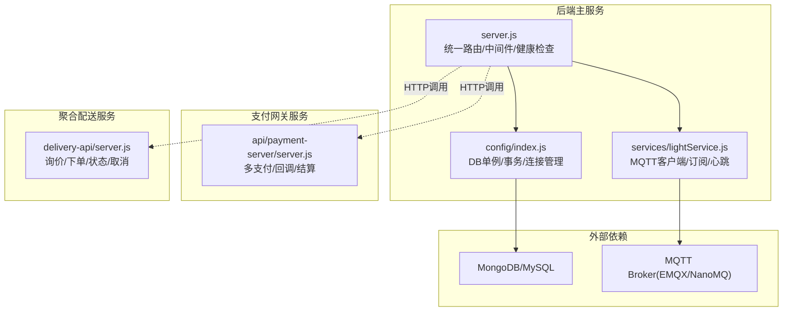
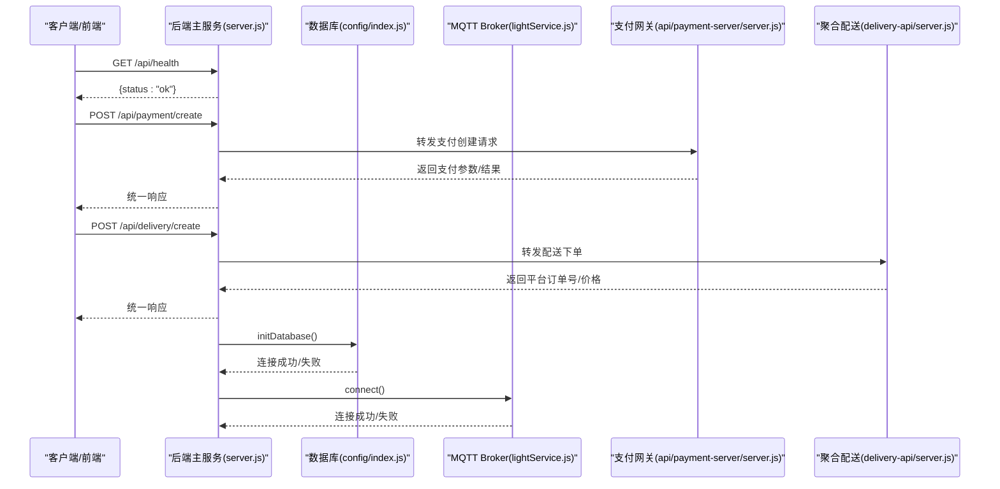
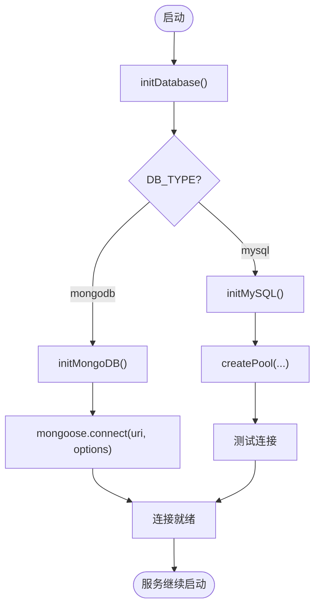
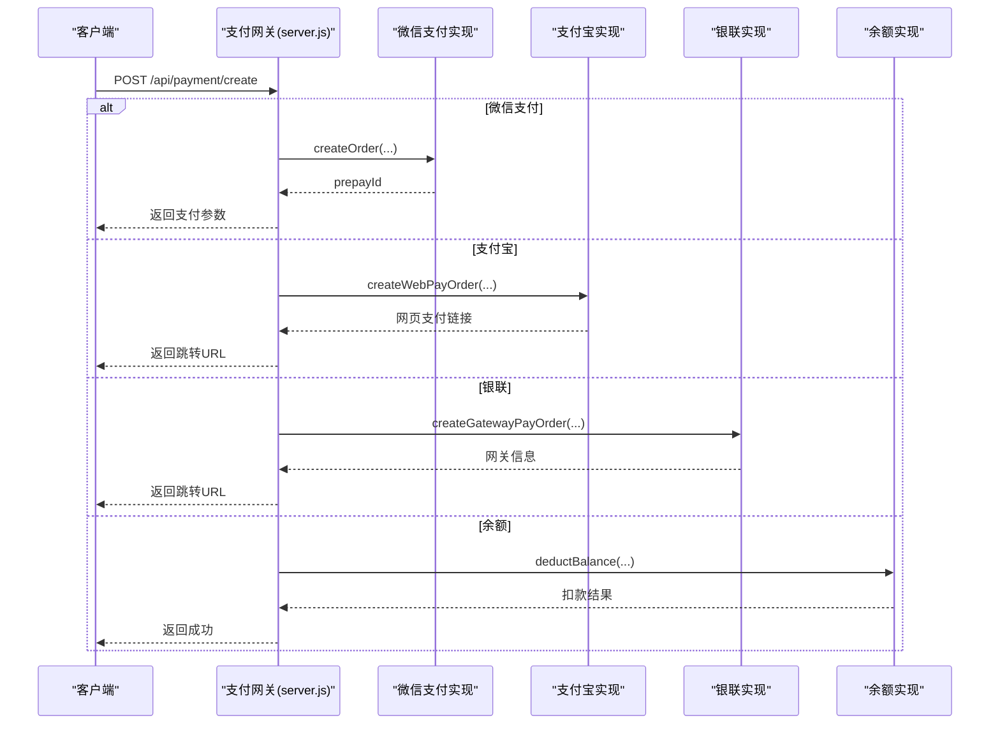
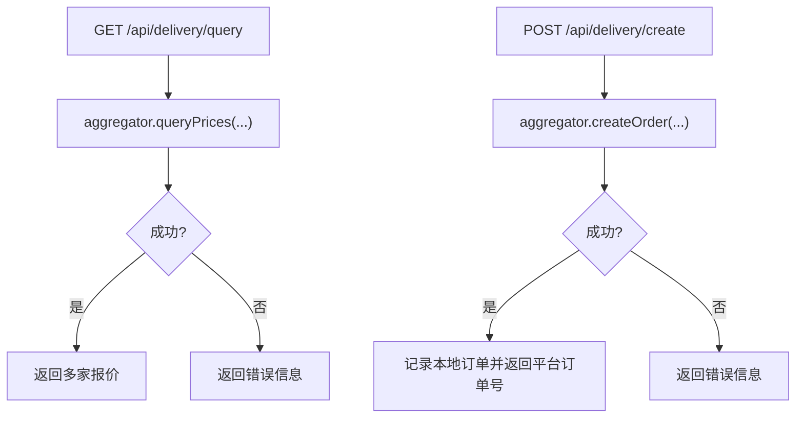
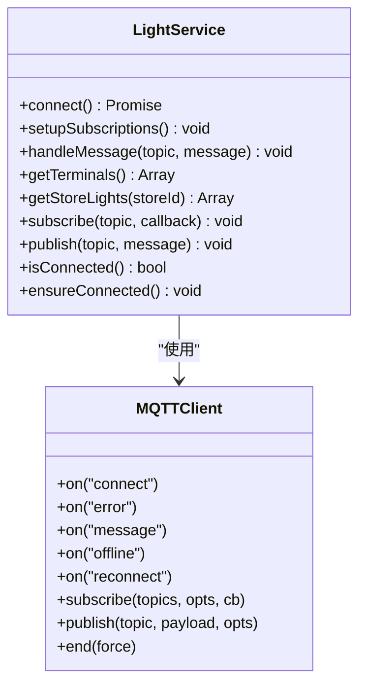
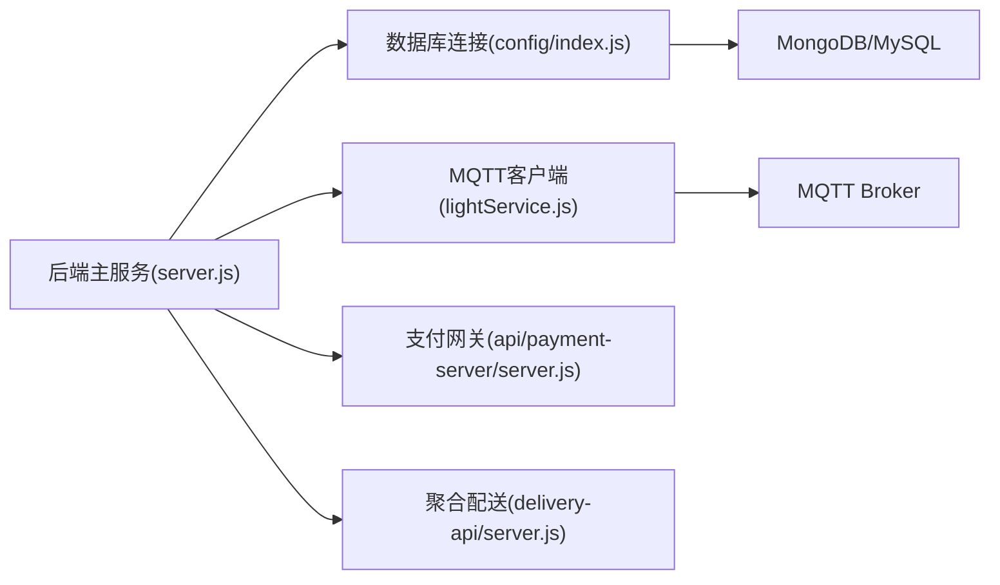

# 故障排查手册

<cite>
**本文引用的文件列表**
- [backend/server.js](file://backend/server.js)
- [backend/config/index.js](file://backend/config/index.js)
- [backend/config/database.js](file://backend/config/database.js)
- [api/payment-server/server.js](file://api/payment-server/server.js)
- [delivery-api/server.js](file://delivery-api/server.js)
- [backend/services/lightService.js](file://backend/services/lightService.js)
- [backend/mqtt-diagnostic.js](file://backend/mqtt-diagnostic.js)
- [backend/test-port.js](file://backend/test-port.js)
- [backend/scripts/testConnection.js](file://backend/scripts/testConnection.js)
- [诊断工具.html](file://诊断工具.html)
- [诊断工具.bat](file://诊断工具.bat)
</cite>

## 目录
1. [简介](#简介)
2. [项目结构](#项目结构)
3. [核心组件](#核心组件)
4. [架构总览](#架构总览)
5. [详细组件分析](#详细组件分析)
6. [依赖关系分析](#依赖关系分析)
7. [性能考虑](#性能考虑)
8. [故障排查指南](#故障排查指南)
9. [应急响应流程](#应急响应流程)
10. [结论](#结论)
11. [附录：复盘模板与改进跟踪](#附录复盘模板与改进跟踪)

## 简介
本手册面向技术支持与运维团队，聚焦干洗店管理系统的常见故障场景与排障方法，覆盖数据库连接、MQTT通信、支付接口失败、配送服务超时等典型问题；提供系统诊断工具使用指南（端口检测、服务状态检查、日志分析方法）；给出性能瓶颈识别与优化建议（数据库查询优化、内存泄漏检测、并发调优）；并包含应急响应流程（降级策略、数据恢复、灾难恢复）以及故障复盘模板与改进措施跟踪机制。

## 项目结构
系统由多个独立服务组成：后端主服务、支付网关服务、聚合配送服务、MQTT Broker（EMQX/NanoMQ）、前端页面与小程序端。关键入口与配置如下：
- 后端主服务：Express 应用，统一路由挂载，集成认证、订单、支付、消息中心、跨端同步等模块，并在启动时初始化数据库与 MQTT 客户端。
- 支付网关服务：独立 Express 服务，封装微信/支付宝/银联/余额等多支付方式，提供健康检查与回调处理。
- 聚合配送服务：对外暴露统一配送 API，内部聚合多家服务商。
- MQTT 服务：通过 lightService 连接 Broker，用于灯条终端心跳与指令下发。
- 诊断工具：HTML 诊断页与批处理脚本，辅助快速定位端口、服务连通性与基础数据一致性。

图表来源
- [backend/server.js:1-120](file://backend/server.js#L1-L120)
- [backend/config/index.js:1-120](file://backend/config/index.js#L1-L120)
- [backend/services/lightService.js:1-120](file://backend/services/lightService.js#L1-L120)
- [api/payment-server/server.js:1-120](file://api/payment-server/server.js#L1-L120)
- [delivery-api/server.js:1-120](file://delivery-api/server.js#L1-L120)

章节来源
- [backend/server.js:1-120](file://backend/server.js#L1-L120)
- [backend/config/index.js:1-120](file://backend/config/index.js#L1-L120)
- [backend/services/lightService.js:1-120](file://backend/services/lightService.js#L1-L120)
- [api/payment-server/server.js:1-120](file://api/payment-server/server.js#L1-L120)
- [delivery-api/server.js:1-120](file://delivery-api/server.js#L1-L120)

## 核心组件
- 后端主服务
  - 负责统一路由注册、全局错误处理、健康检查、跨端同步、消息中心、支付合并接口等。
  - 启动流程中初始化数据库连接与 MQTT 客户端，并对端口占用、未捕获异常进行优雅处理。
- 数据库连接管理
  - 支持 MongoDB 与 MySQL，提供连接池、事务、便捷查询方法，集中管理生命周期。
- 支付网关服务
  - 统一创建支付订单、查询/关闭订单、处理各渠道回调、账户余额与门店结算。
- 聚合配送服务
  - 提供可用服务商列表、询价、下单、查询状态、取消订单等接口，兼容旧接口。
- MQTT 灯条服务
  - 连接 Broker，订阅终端心跳与状态主题，维护终端在线状态，具备自动重连与健康检查。

章节来源
- [backend/server.js:120-220](file://backend/server.js#L120-L220)
- [backend/config/index.js:1-167](file://backend/config/index.js#L1-L167)
- [api/payment-server/server.js:1-200](file://api/payment-server/server.js#L1-L200)
- [delivery-api/server.js:1-120](file://delivery-api/server.js#L1-L120)
- [backend/services/lightService.js:1-120](file://backend/services/lightService.js#L1-L120)

## 架构总览
下图展示后端主服务与各子系统之间的交互关系及关键健康检查点。

图表来源
- [backend/server.js:85-120](file://backend/server.js#L85-L120)
- [backend/config/index.js:18-53](file://backend/config/index.js#L18-L53)
- [backend/services/lightService.js:29-76](file://backend/services/lightService.js#L29-L76)
- [api/payment-server/server.js:42-174](file://api/payment-server/server.js#L42-L174)
- [delivery-api/server.js:89-154](file://delivery-api/server.js#L89-L154)

## 详细组件分析

### 数据库连接与事务
- 连接管理
  - 根据环境变量选择 MongoDB 或 MySQL，分别建立连接/连接池，并提供统一的初始化与关闭方法。
  - 提供事务封装，确保多步操作的原子性。
- 常见问题定位
  - 连接失败：检查环境变量、网络可达性、账号权限、SSL 配置。
  - 连接池耗尽：观察 pool.max 与并发量，必要时提升连接上限或优化慢查询。
  - 事务回滚：关注业务逻辑抛出的异常路径，确保 catch 分支正确回滚。

图表来源
- [backend/config/index.js:18-88](file://backend/config/index.js#L18-L88)

章节来源
- [backend/config/index.js:1-167](file://backend/config/index.js#L1-L167)
- [backend/config/database.js:1-65](file://backend/config/database.js#L1-L65)

### 支付网关服务
- 功能要点
  - 统一支付入口，按支付方式分发到对应实现（微信/支付宝/银联/余额）。
  - 提供查询、关闭订单、多渠道回调处理、余额充值与门店结算接口。
- 常见问题定位
  - 签名验证失败：核对商户密钥、回调地址、时间戳与排序规则。
  - 回调未触发：检查公网可达性、回调 URL 白名单、防火墙与反向代理。
  - 余额不足：校验用户余额与金额大小关系，提示充值。

图表来源
- [api/payment-server/server.js:42-174](file://api/payment-server/server.js#L42-L174)

章节来源
- [api/payment-server/server.js:1-200](file://api/payment-server/server.js#L1-L200)

### 聚合配送服务
- 功能要点
  - 获取可用服务商、询价、创建订单、查询状态、取消订单，兼容旧接口。
- 常见问题定位
  - 询价失败：检查起止地址、重量、城市参数是否完整。
  - 下单失败：确认服务商配置、API Key、网络连通性。
  - 状态不同步：核对平台侧回调或轮询策略。

图表来源
- [delivery-api/server.js:56-154](file://delivery-api/server.js#L56-L154)

章节来源
- [delivery-api/server.js:1-200](file://delivery-api/server.js#L1-L200)

### MQTT 灯条服务
- 功能要点
  - 连接 Broker，订阅终端心跳与状态主题，维护终端在线状态，具备自动重连与健康检查。
- 常见问题定位
  - 连接失败：检查 Broker 地址、端口、用户名密码、防火墙。
  - 订阅失败：检查主题格式、权限、Broker 版本兼容性。
  - 心跳丢失：检查终端设备网络、心跳间隔、服务端清理策略。

图表来源
- [backend/services/lightService.js:24-120](file://backend/services/lightService.js#L24-L120)

章节来源
- [backend/services/lightService.js:1-234](file://backend/services/lightService.js#L1-L234)

## 依赖关系分析
- 后端主服务依赖数据库连接管理与 MQTT 客户端，同时作为 HTTP 网关转发支付与配送请求。
- 支付与配送为独立服务，通过 HTTP 与后端主服务交互。
- MQTT Broker 为异步通信基础设施，支撑灯条终端实时状态与指令。

图表来源
- [backend/server.js:1-120](file://backend/server.js#L1-L120)
- [backend/config/index.js:1-120](file://backend/config/index.js#L1-L120)
- [backend/services/lightService.js:1-120](file://backend/services/lightService.js#L1-L120)
- [api/payment-server/server.js:1-120](file://api/payment-server/server.js#L1-L120)
- [delivery-api/server.js:1-120](file://delivery-api/server.js#L1-L120)

章节来源
- [backend/server.js:1-120](file://backend/server.js#L1-L120)
- [backend/config/index.js:1-120](file://backend/config/index.js#L1-L120)
- [backend/services/lightService.js:1-120](file://backend/services/lightService.js#L1-L120)
- [api/payment-server/server.js:1-120](file://api/payment-server/server.js#L1-L120)
- [delivery-api/server.js:1-120](file://delivery-api/server.js#L1-L120)

## 性能考虑
- 数据库
  - 监控连接池使用率与慢查询，合理设置 max 连接数与超时。
  - 对高频查询增加索引，避免全表扫描；分页查询限制 limit。
- 支付与配送
  - 对第三方接口增加超时与重试策略，避免级联阻塞。
  - 批量操作采用队列化与限流，降低峰值压力。
- MQTT
  - 调整 keepalive 与 reconnectPeriod，避免频繁重连风暴。
  - 控制消息 QoS 与主题粒度，减少无效广播。
- 内存与并发
  - 监控 Node.js 进程内存增长，排查闭包引用与长驻 Map 的清理策略。
  - 使用 PM2 集群模式提升并发处理能力，结合 CPU 核数设置实例数。

[本节为通用指导，不直接分析具体文件]

## 故障排查指南

### 一、数据库连接问题
- 现象
  - 服务启动时报数据库连接失败；部分接口返回 500；事务执行异常。
- 诊断步骤
  - 运行数据库连接测试脚本，验证连通性与读写能力。
  - 检查环境变量中的数据库类型、主机、端口、用户名、密码、库名、SSL 开关。
  - 查看后端启动日志中数据库初始化阶段输出。
- 解决方案
  - 修正 .env 配置，确保网络可达与账号权限正确。
  - 调整连接池大小与超时参数，缓解高并发下的连接竞争。
  - 若使用 MySQL，确认时区与 SSL 配置符合预期。

章节来源
- [backend/scripts/testConnection.js:1-88](file://backend/scripts/testConnection.js#L1-L88)
- [backend/config/database.js:1-65](file://backend/config/database.js#L1-L65)
- [backend/config/index.js:18-88](file://backend/config/index.js#L18-L88)

### 二、MQTT 通信异常
- 现象
  - 灯条无心跳、终端离线、命令下发失败；后端日志出现连接错误或离线事件。
- 诊断步骤
  - 使用 TCP 端口测试脚本验证 1884 端口可连通性。
  - 运行 MQTT 诊断脚本，模拟 CONNECT、SUBSCRIBE、PUBLISH 流程。
  - 检查 Broker 健康检查接口（如 EMQX 的 HTTP API）是否可达。
- 解决方案
  - 启动并确认 Broker 正常运行，检查防火墙与端口映射。
  - 校正 lightService 的 broker 地址、端口、用户名密码。
  - 调整 keepalive 与 reconnectPeriod，避免频繁断连。

章节来源
- [backend/test-port.js:1-62](file://backend/test-port.js#L1-L62)
- [backend/mqtt-diagnostic.js:1-104](file://backend/mqtt-diagnostic.js#L1-L104)
- [backend/services/lightService.js:29-76](file://backend/services/lightService.js#L29-L76)

### 三、支付接口失败
- 现象
  - 创建支付订单失败、回调未触发、余额不足、查询状态不一致。
- 诊断步骤
  - 访问支付网关健康检查接口，确认服务状态与已启用渠道。
  - 核对支付创建请求的必要参数（orderId、amount、paymentMethod、openid 等）。
  - 检查回调 URL 可达性与签名验证逻辑。
- 解决方案
  - 完善商户配置（mchId、apiKey、returnUrl），确保公网可达与白名单放行。
  - 针对余额支付，先查询用户余额再发起扣款，避免超扣。
  - 对第三方回调增加幂等处理与重试补偿。

章节来源
- [api/payment-server/server.js:42-174](file://api/payment-server/server.js#L42-L174)
- [api/payment-server/server.js:580-592](file://api/payment-server/server.js#L580-L592)

### 四、配送服务超时
- 现象
  - 询价/下单/查询状态接口耗时过长或超时；平台订单号缺失。
- 诊断步骤
  - 检查聚合配送服务健康检查与可用服务商列表。
  - 核对请求参数完整性（起止地址、重量、城市）。
  - 查看第三方服务商 API 的返回码与错误信息。
- 解决方案
  - 为第三方接口设置合理的超时与重试策略，避免阻塞主线程。
  - 引入缓存与降级策略，在第三方不可用时返回兜底方案。
  - 对高频地址进行预计算与缓存，减少重复计算。

章节来源
- [delivery-api/server.js:56-154](file://delivery-api/server.js#L56-L154)
- [delivery-api/server.js:206-212](file://delivery-api/server.js#L206-L212)

### 五、系统诊断工具使用指南
- 端口检测与服务状态检查
  - 使用批处理脚本快速检查后端服务与 MQTT Broker 端口监听情况，列出 Node.js 进程。
  - 通过 HTML 诊断页一键执行全面诊断，包括后端 API、MongoDB、EMQX 连通性与存储状态。
- 日志分析方法
  - 关注后端启动日志中的数据库与 MQTT 初始化输出。
  - 在支付与配送服务中，查看创建/回调/查询阶段的错误堆栈。
  - 使用诊断页导出报告，便于归档与复盘。

章节来源
- [诊断工具.bat:1-47](file://诊断工具.bat#L1-L47)
- [诊断工具.html:194-514](file://诊断工具.html#L194-L514)

## 应急响应流程
- 服务降级策略
  - 支付：当第三方支付不可用时，切换至余额支付或模拟支付（开发环境），并记录待补偿订单。
  - 配送：当第三方不可用，返回兜底方案（如自提或延迟下单），并通知运营人员。
  - MQTT：当 Broker 不可用，暂停灯条指令下发，保留本地状态，待恢复后补发。
- 数据恢复方案
  - 数据库：基于备份恢复最近一致时间点的数据；对事务失败的订单进行补偿与幂等处理。
  - 支付：依据回调流水与本地订单状态进行对账，修复不一致记录。
  - 配送：以平台订单号为基准，拉取最新状态并更新本地记录。
- 灾难恢复预案
  - 多活部署：将后端、支付、配送服务部署于多节点，配合负载均衡与健康检查。
  - 自动化重启：通过 PM2 或系统任务管理器实现服务崩溃后的自动拉起。
  - 监控告警：对关键指标（CPU、内存、连接池、错误率）设置阈值告警。

[本节为通用指导，不直接分析具体文件]

## 结论
通过系统化诊断工具与标准化排障流程，可快速定位并解决数据库、MQTT、支付与配送等核心链路的典型故障。结合性能优化与应急响应策略，能显著提升系统稳定性与可恢复性。建议持续完善监控与告警体系，沉淀故障知识库，形成闭环改进。

[本节为总结，不直接分析具体文件]

## 附录：复盘模板与改进跟踪
- 故障复盘模板
  - 基本信息：故障时间、影响范围、发现渠道、处理人。
  - 现象描述：症状、错误日志、截图与链路追踪。
  - 根因分析：直接原因、间接原因、系统性缺陷。
  - 处置过程：操作步骤、回滚与恢复、验证方式。
  - 改进措施：短期修复、长期优化、责任人、完成时间。
  - 效果验证：指标对比、回归测试、监控覆盖。
- 改进措施跟踪机制
  - 建立工单系统，关联故障编号与改进项。
  - 定期回顾改进项落地情况，纳入质量考核。
  - 将经验沉淀为文档与自动化脚本，降低重复劳动。

[本节为通用指导，不直接分析具体文件]