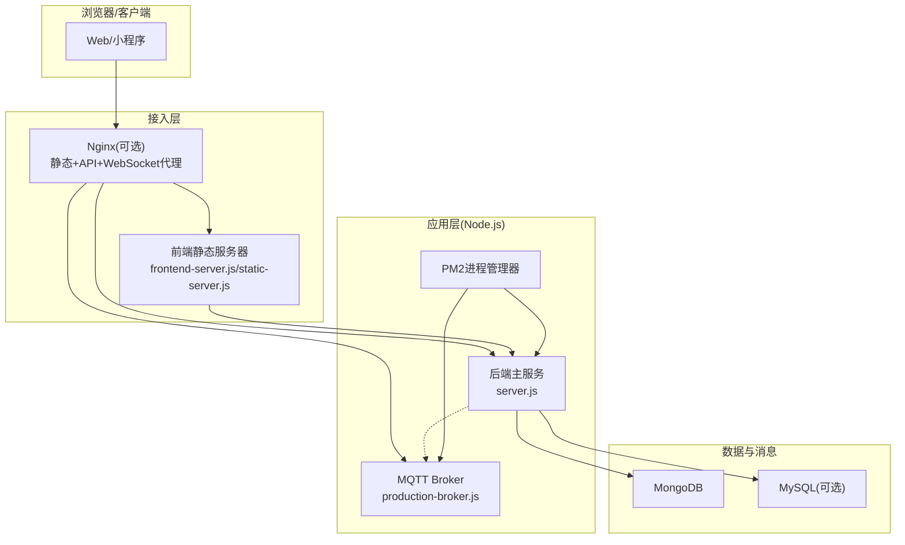
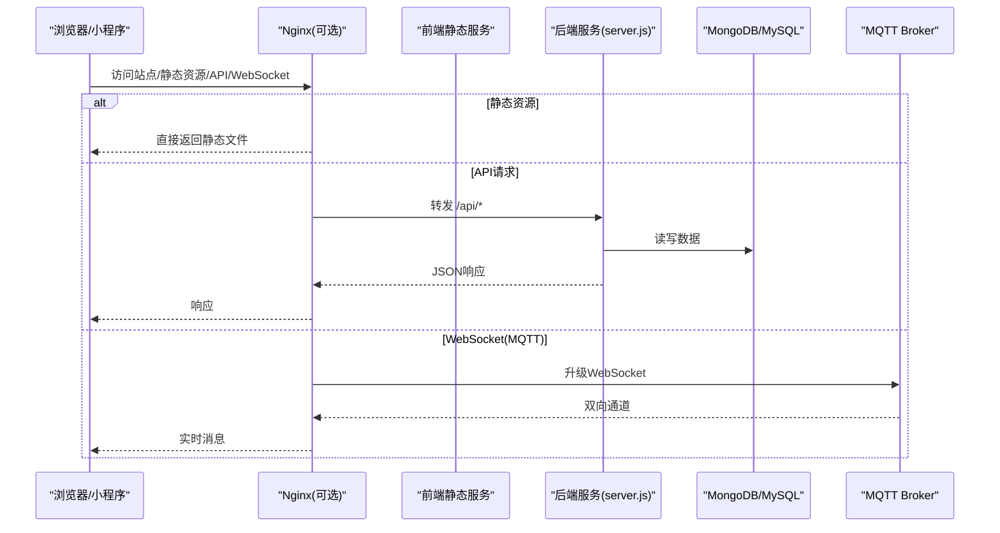
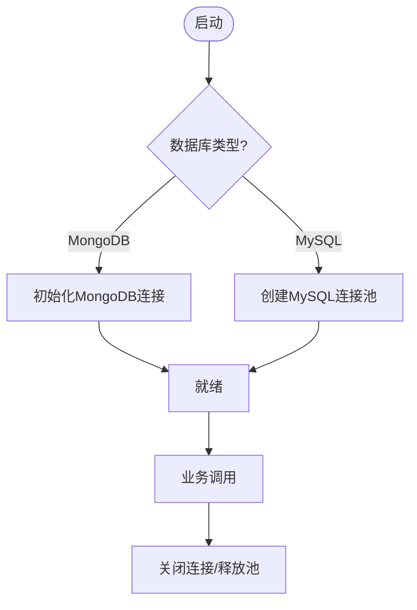
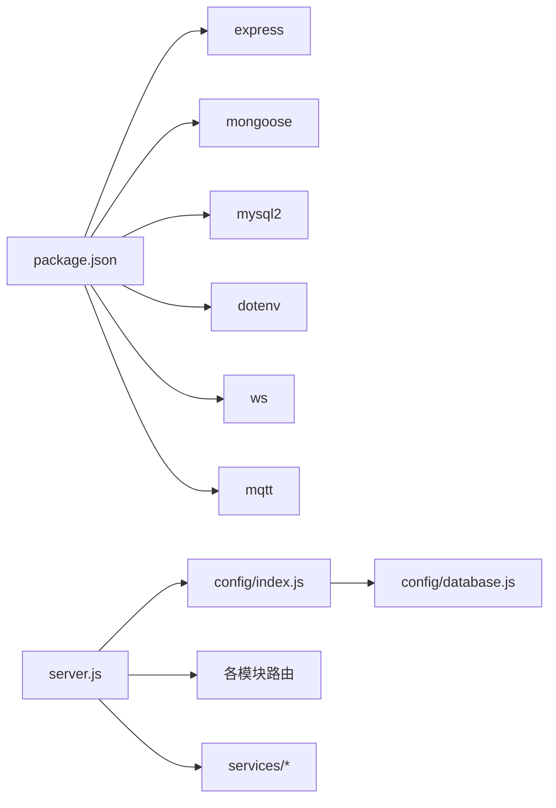

# 环境部署配置

<cite>
**本文引用的文件**   
- [backend/docker-compose.yml](file://backend/docker-compose.yml)
- [ecosystem.config.js](file://ecosystem.config.js)
- [pm2.config.json](file://pm2.config.json)
- [backend/config/index.js](file://backend/config/index.js)
- [backend/config/database.js](file://backend/config/database.js)
- [backend/package.json](file://backend/package.json)
- [PRODUCTION_GUIDE.md](file://PRODUCTION_GUIDE.md)
- [backend/services/MQTT_DEPLOYMENT.md](file://backend/services/MQTT_DEPLOYMENT.md)
- [backend/production-broker.js](file://backend/production-broker.js)
- [backend/frontend-server.js](file://backend/frontend-server.js)
- [static-server.js](file://static-server.js)
- [backend/server.js](file://backend/server.js)
- [PM2_Startup.bat](file://PM2_Startup.bat)
- [PM2开机自启动V2.bat](file://PM2开机自启动V2.bat)
- [PM2管理.bat](file://PM2管理.bat)
- [启动全部服务.bat](file://启动全部服务.bat)
</cite>

## 目录
1. [简介](#简介)
2. [项目结构](#项目结构)
3. [核心组件](#核心组件)
4. [架构总览](#架构总览)
5. [详细组件分析](#详细组件分析)
6. [依赖关系分析](#依赖关系分析)
7. [性能与容量规划](#性能与容量规划)
8. [故障排查指南](#故障排查指南)
9. [结论](#结论)
10. [附录：部署清单与命令速查](#附录部署清单与命令速查)

## 简介
本手册面向运维人员，提供干洗店管理系统的完整环境部署参考，覆盖开发环境与生产环境的搭建步骤、Docker容器化编排、PM2进程管理、Nginx反向代理（含静态资源、API代理与WebSocket）、CDN优化与本地化方案，以及MQTT消息中间件的部署与集成。文档基于仓库现有配置文件与脚本进行说明，确保可落地执行。

## 项目结构
系统采用前后端分离与模块化后端设计，关键部署相关位置如下：
- 后端入口与路由：backend/server.js
- 数据库连接与配置：backend/config/index.js、backend/config/database.js
- 前端静态服务与API代理：backend/frontend-server.js、static-server.js
- 进程管理与多应用编排：ecosystem.config.js、pm2.config.json
- Docker服务编排：backend/docker-compose.yml
- MQTT Broker与部署文档：backend/production-broker.js、backend/services/MQTT_DEPLOYMENT.md
- 生产环境CDN与Nginx建议：PRODUCTION_GUIDE.md
- Windows一键启动与PM2自启脚本：启动全部服务.bat、PM2_Startup.bat、PM2开机自启动V2.bat、PM2管理.bat

图表来源
- [backend/server.js:1-702](file://backend/server.js#L1-L702)
- [backend/frontend-server.js:1-53](file://backend/frontend-server.js#L1-L53)
- [static-server.js:1-42](file://static-server.js#L1-L42)
- [backend/production-broker.js:1-50](file://backend/production-broker.js#L1-L50)
- [backend/docker-compose.yml:1-34](file://backend/docker-compose.yml#L1-L34)

章节来源
- [backend/server.js:1-702](file://backend/server.js#L1-L702)
- [backend/frontend-server.js:1-53](file://backend/frontend-server.js#L1-L53)
- [static-server.js:1-42](file://static-server.js#L1-L42)
- [backend/production-broker.js:1-50](file://backend/production-broker.js#L1-L50)
- [backend/docker-compose.yml:1-34](file://backend/docker-compose.yml#L1-L34)

## 核心组件
- 后端主服务：Express应用，加载环境变量、初始化数据库、挂载业务路由、健康检查、错误处理与优雅关闭。
- 数据库连接：支持MongoDB与MySQL双引擎，通过配置切换；提供连接池、事务与便捷查询方法。
- 前端静态服务：提供静态文件托管与/api反向代理到后端，便于开发联调。
- MQTT Broker：生产级Broker实现，支持认证、授权、心跳保活与WebSocket端口。
- 进程管理：PM2统一启动后端与MQTT Broker，配置自动重启、内存阈值、日志轮转与指数退避。
- 容器编排：docker-compose定义MongoDB与MySQL持久卷与端口映射，便于快速拉起依赖。

章节来源
- [backend/server.js:1-702](file://backend/server.js#L1-L702)
- [backend/config/index.js:1-167](file://backend/config/index.js#L1-L167)
- [backend/config/database.js:1-65](file://backend/config/database.js#L1-L65)
- [backend/frontend-server.js:1-53](file://backend/frontend-server.js#L1-L53)
- [backend/production-broker.js:1-50](file://backend/production-broker.js#L1-L50)
- [ecosystem.config.js:1-100](file://ecosystem.config.js#L1-L100)
- [backend/docker-compose.yml:1-34](file://backend/docker-compose.yml#L1-L34)

## 架构总览
下图展示从浏览器到后端、数据库与MQTT的整体交互路径，并标注了Nginx、PM2、静态服务与API代理的职责边界。

图表来源
- [backend/server.js:1-702](file://backend/server.js#L1-L702)
- [backend/production-broker.js:1-50](file://backend/production-broker.js#L1-L50)
- [backend/docker-compose.yml:1-34](file://backend/docker-compose.yml#L1-L34)

## 详细组件分析

### 数据库连接与配置
- 支持类型切换：通过环境变量或默认值选择MongoDB或MySQL。
- MongoDB：使用Mongoose连接，提供连接事件监听与错误处理。
- MySQL：使用连接池，支持SSL与时区设置，提供事务封装与便捷查询。
- 生命周期：启动时初始化连接，关闭时释放资源。

图表来源
- [backend/config/index.js:1-167](file://backend/config/index.js#L1-L167)
- [backend/config/database.js:1-65](file://backend/config/database.js#L1-L65)

章节来源
- [backend/config/index.js:1-167](file://backend/config/index.js#L1-L167)
- [backend/config/database.js:1-65](file://backend/config/database.js#L1-L65)

### 后端主服务与路由
- 环境变量加载：从指定.env文件读取配置。
- 中间件：CORS、JSON解析、静态文件服务。
- 路由挂载：认证、门店、清洗、回收、租赁、分类、支付、配送、会员、管理员、连锁后台、价格、公共接口、订单灯条绑定、取件、同步、通知中心、消息中心等。
- 健康检查：/api/health用于探针。
- 错误处理与优雅关闭：捕获未处理异常与信号，安全退出。

章节来源
- [backend/server.js:1-702](file://backend/server.js#L1-L702)

### 前端静态服务与API代理
- 开发模式：提供静态文件服务与/api反向代理到后端，便于跨域联调。
- 简易静态服务：纯Node http服务，适合最小化部署。

章节来源
- [backend/frontend-server.js:1-53](file://backend/frontend-server.js#L1-L53)
- [static-server.js:1-42](file://static-server.js#L1-L42)

### MQTT Broker（生产级）
- 功能：用户认证、发布/订阅授权、心跳保活、WebSocket支持。
- 配置：通过环境变量控制端口、认证开关与用户列表。
- 日志：启动与连接日志清晰，便于排障。

章节来源
- [backend/production-broker.js:1-50](file://backend/production-broker.js#L1-L50)
- [backend/services/MQTT_DEPLOYMENT.md:1-410](file://backend/services/MQTT_DEPLOYMENT.md#L1-L410)

### PM2进程管理
- 应用定义：后端主服务与MQTT Broker两个应用，分别配置实例数、内存上限、自动重启、日志文件与时间格式。
- 环境变量：区分开发与生产环境，包含NODE_ENV、PORT、MQTT端口与认证开关等。
- 高级策略：最小运行时间、最大重启次数、重启延迟、指数退避、超时控制。
- Windows自启：提供批处理与PowerShell脚本，结合任务计划实现开机恢复。

章节来源
- [ecosystem.config.js:1-100](file://ecosystem.config.js#L1-L100)
- [pm2.config.json:1-21](file://pm2.config.json#L1-L21)
- [PM2_Startup.bat:1-6](file://PM2_Startup.bat#L1-L6)
- [PM2开机自启动V2.bat:1-26](file://PM2开机自启动V2.bat#L1-L26)
- [PM2管理.bat:1-69](file://PM2管理.bat#L1-L69)

### Docker容器化编排
- 服务：MongoDB与MySQL（可选），暴露常用端口，持久化数据卷。
- 环境变量：数据库名、用户密码等。
- 网络与卷：使用命名卷保证数据持久化。

章节来源
- [backend/docker-compose.yml:1-34](file://backend/docker-compose.yml#L1-L34)

### 生产环境CDN与Nginx
- CDN容灾：建议使用国内镜像或完全本地化资源，避免外网不可用导致页面空白。
- Nginx示例：静态文件根目录、/api代理至后端、/mqtt代理至MQTT WebSocket，开启HTTP/1.1与Upgrade头。
- 离线与缓存：可通过Service Worker与Nginx缓存策略提升首屏与稳定性。

章节来源
- [PRODUCTION_GUIDE.md:1-223](file://PRODUCTION_GUIDE.md#L1-L223)

## 依赖关系分析
- 运行时依赖：Express、CORS、Body Parser、Mongoose、mysql2、dotenv、ws、mqtt等。
- 脚本能力：提供db初始化、种子数据、迁移与MQTT部署提示。
- 外部服务：MongoDB、MySQL（可选）、MQTT Broker（内置或EMQX）。

图表来源
- [backend/package.json:1-43](file://backend/package.json#L1-L43)
- [backend/server.js:1-702](file://backend/server.js#L1-L702)
- [backend/config/index.js:1-167](file://backend/config/index.js#L1-L167)
- [backend/config/database.js:1-65](file://backend/config/database.js#L1-L65)

章节来源
- [backend/package.json:1-43](file://backend/package.json#L1-L43)

## 性能与容量规划
- Node.js版本：建议使用长期支持版本，配合PM2的内存限制与自动重启策略，防止内存泄漏影响可用性。
- 数据库：
  - MongoDB：根据订单量与并发调整maxPoolSize与socketTimeoutMS。
  - MySQL：合理设置连接池min/max与超时参数，必要时启用SSL。
- MQTT：
  - 生产环境建议启用认证与TLS，限制主题访问权限，监控连接数与吞吐。
- 静态资源：
  - 将Tailwind CSS与图标库本地化或使用国内CDN，减少首屏失败率。
  - 在Nginx层开启Gzip/Brotli与缓存策略。

[本节为通用指导，不直接分析具体文件]

## 故障排查指南
- 端口冲突：后端启动失败时检查端口占用，查看错误日志并释放端口。
- 数据库连接：确认环境变量与docker-compose端口映射，验证连接池是否建立成功。
- MQTT连接：检查Broker端口与认证配置，使用测试脚本或工具验证连通性。
- 日志定位：
  - PM2日志：combined/out/error三类日志，按日期格式化。
  - 服务日志：后端与Broker均输出关键阶段日志，便于快速定位。
- 健康检查：访问/api/health判断后端存活状态。

章节来源
- [backend/server.js:1-702](file://backend/server.js#L1-L702)
- [ecosystem.config.js:1-100](file://ecosystem.config.js#L1-L100)
- [backend/production-broker.js:1-50](file://backend/production-broker.js#L1-L50)

## 结论
本部署手册围绕仓库现有配置与脚本，提供了从依赖安装、容器编排、进程管理到反向代理与CDN优化的完整链路。按照本文档执行，可在开发与生产环境中稳定拉起后端、数据库与MQTT服务，并通过PM2与Nginx保障高可用与用户体验。

[本节为总结，不直接分析具体文件]

## 附录：部署清单与命令速查

- 前置准备
  - 安装Node.js与npm
  - 安装PM2（全局）
  - 安装Docker与docker-compose（可选）

- 依赖服务
  - MongoDB：默认端口27017，数据卷持久化
  - MySQL（可选）：默认端口3306，数据卷持久化
  - MQTT Broker：可使用内置production-broker.js或EMQX

- 启动方式
  - 一键启动（Windows）：使用“启动全部服务.bat”拉起MQTT与后端
  - PM2管理：使用“PM2管理.bat”或ecosystem.config.js统一管理
  - Docker编排：进入backend目录，使用docker-compose up -d拉起依赖

- 常用命令
  - pm2 start ecosystem.config.js
  - pm2 list / logs / restart / stop
  - docker-compose up -d / logs -f

- 反向代理（Nginx要点）
  - 静态文件根目录指向项目根或public
  - /api代理至后端端口
  - /mqtt代理至MQTT WebSocket端口，并设置HTTP/1.1与Upgrade头

- 本地化与CDN
  - 优先使用国内CDN或下载资源至lib目录
  - 必要时引入Service Worker做离线缓存

章节来源
- [启动全部服务.bat:1-33](file://启动全部服务.bat#L1-L33)
- [PM2管理.bat:1-69](file://PM2管理.bat#L1-L69)
- [ecosystem.config.js:1-100](file://ecosystem.config.js#L1-L100)
- [backend/docker-compose.yml:1-34](file://backend/docker-compose.yml#L1-L34)
- [PRODUCTION_GUIDE.md:1-223](file://PRODUCTION_GUIDE.md#L1-L223)