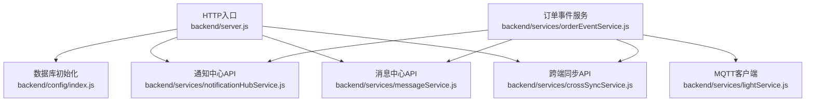
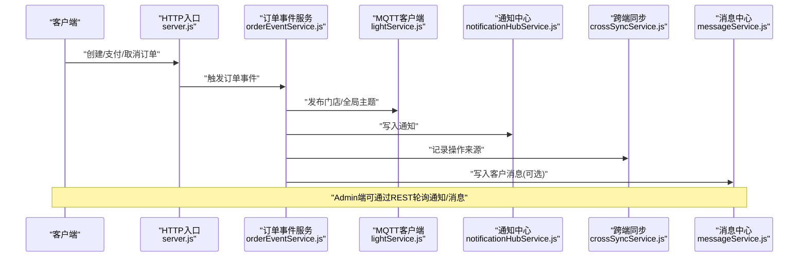
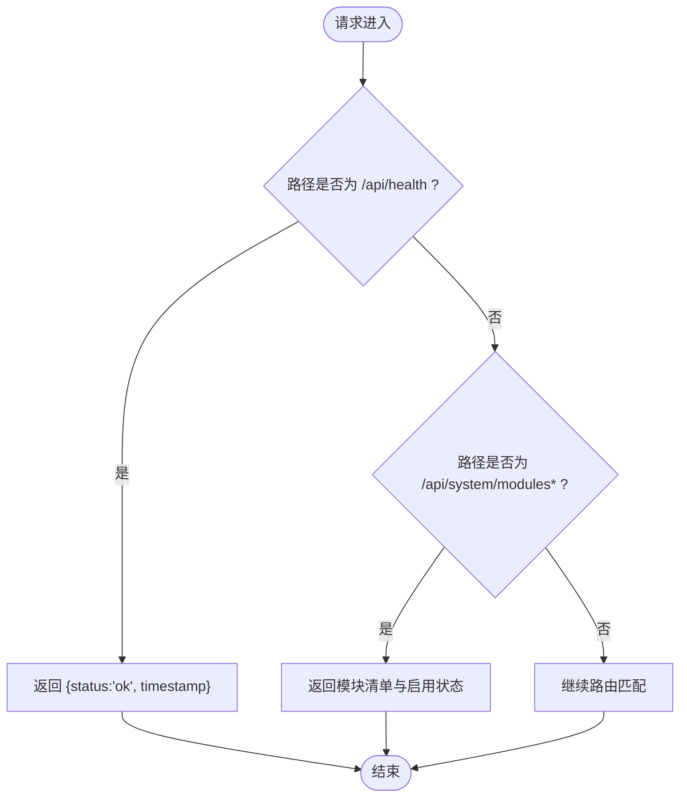
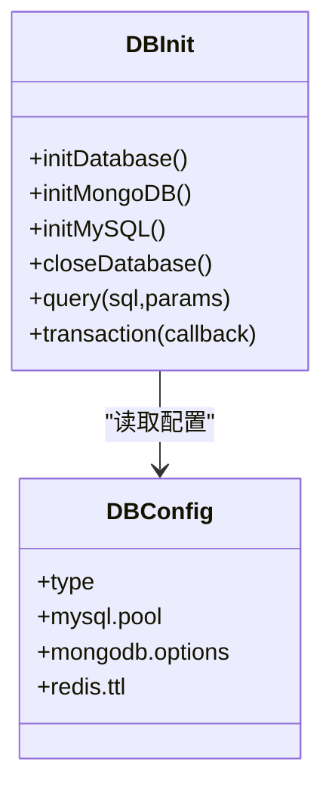
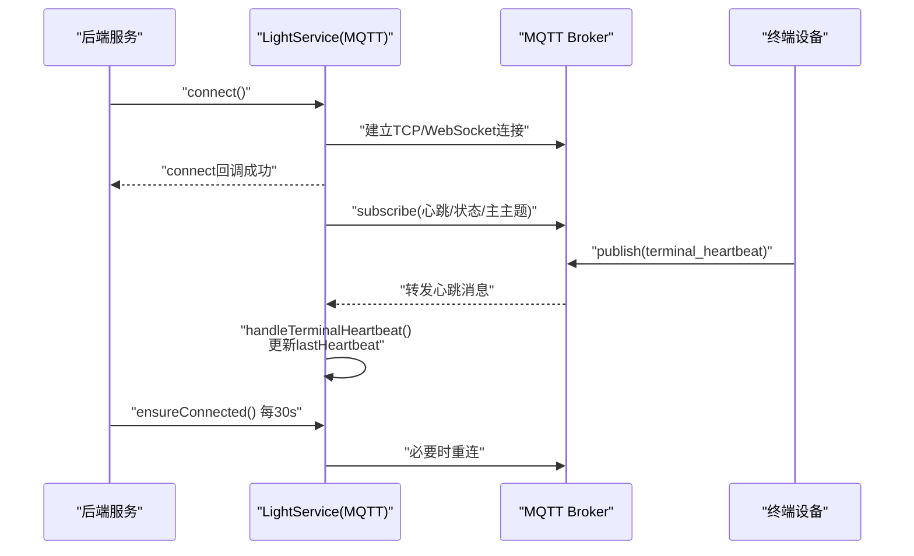
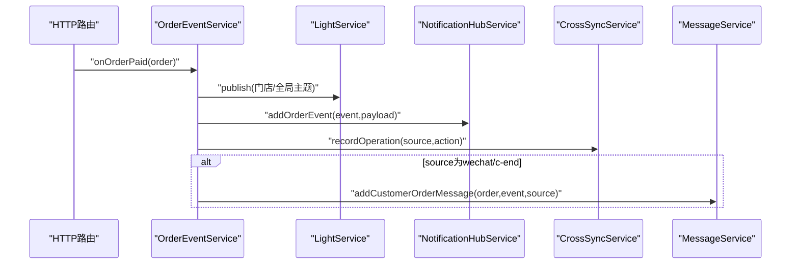
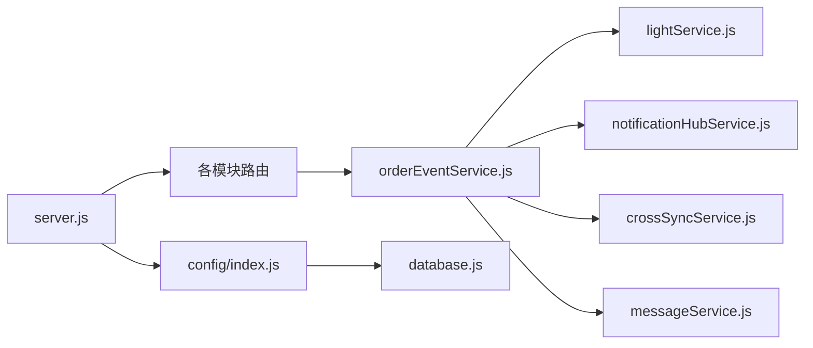

# 监控告警系统

<cite>
**本文引用的文件**   
- [backend/server.js](file://backend/server.js)
- [backend/config/index.js](file://backend/config/index.js)
- [backend/config/database.js](file://backend/config/database.js)
- [backend/services/lightService.js](file://backend/services/lightService.js)
- [backend/services/orderEventService.js](file://backend/services/orderEventService.js)
- [backend/services/notificationHubService.js](file://backend/services/notificationHubService.js)
- [backend/services/messageService.js](file://backend/services/messageService.js)
- [backend/services/crossSyncService.js](file://backend/services/crossSyncService.js)
- [backend/docker-compose.yml](file://backend/docker-compose.yml)
- [ecosystem.config.js](file://ecosystem.config.js)
</cite>

## 目录
1. [引言](#引言)
2. [项目结构](#项目结构)
3. [核心组件](#核心组件)
4. [架构总览](#架构总览)
5. [详细组件分析](#详细组件分析)
6. [依赖关系分析](#依赖关系分析)
7. [性能与容量规划](#性能与容量规划)
8. [日志聚合与分析策略](#日志聚合与分析策略)
9. [告警规则与通知渠道](#告警规则与通知渠道)
10. [实时监控仪表板搭建指南](#实时监控仪表板搭建指南)
11. [健康检查接口设计](#健康检查接口设计)
12. [自动化巡检脚本](#自动化巡检脚本)
13. [故障排查指南](#故障排查指南)
14. [结论](#结论)

## 引言
本方案为干洗店管理系统提供一套完整的监控、日志与告警体系，覆盖应用指标采集、数据库性能监控、MQTT消息队列监控、结构化日志聚合、告警规则配置以及Prometheus+Grafana实时仪表板。同时给出系统健康检查接口设计与自动化巡检脚本，帮助运维团队快速定位问题并保障业务连续性。

## 项目结构
后端服务采用模块化Express应用，关键可观测性相关代码集中在以下位置：
- HTTP入口与健康检查：backend/server.js
- 数据库连接与连接池：backend/config/index.js、backend/config/database.js
- MQTT客户端与终端心跳：backend/services/lightService.js
- 订单事件发布（MQTT）：backend/services/orderEventService.js
- 通知中心（轮询/历史）：backend/services/notificationHubService.js
- 消息中心（客户/账户消息）：backend/services/messageService.js
- 跨端同步与在线状态：backend/services/crossSyncService.js
- 容器化依赖：backend/docker-compose.yml
- 进程管理与日志输出：ecosystem.config.js

图表来源
- [backend/server.js:85-90](file://backend/server.js#L85-L90)
- [backend/config/index.js:19-88](file://backend/config/index.js#L19-L88)
- [backend/services/orderEventService.js:77-144](file://backend/services/orderEventService.js#L77-L144)
- [backend/services/lightService.js:29-76](file://backend/services/lightService.js#L29-L76)
- [backend/services/notificationHubService.js:44-82](file://backend/services/notificationHubService.js#L44-L82)
- [backend/services/messageService.js:29-55](file://backend/services/messageService.js#L29-L55)
- [backend/services/crossSyncService.js:143-197](file://backend/services/crossSyncService.js#L143-L197)

章节来源
- [backend/server.js:1-152](file://backend/server.js#L1-L152)
- [backend/config/index.js:1-167](file://backend/config/index.js#L1-L167)
- [backend/config/database.js:1-65](file://backend/config/database.js#L1-L65)
- [backend/services/lightService.js:1-234](file://backend/services/lightService.js#L1-L234)
- [backend/services/orderEventService.js:1-168](file://backend/services/orderEventService.js#L1-L168)
- [backend/services/notificationHubService.js:1-264](file://backend/services/notificationHubService.js#L1-L264)
- [backend/services/messageService.js:1-247](file://backend/services/messageService.js#L1-L247)
- [backend/services/crossSyncService.js:1-336](file://backend/services/crossSyncService.js#L1-L336)
- [backend/docker-compose.yml:1-34](file://backend/docker-compose.yml#L1-L34)
- [ecosystem.config.js:1-100](file://ecosystem.config.js#L1-L100)

## 核心组件
- 健康检查与模块状态接口：用于外部探针探测服务可用性、端口占用、模块开关等。
- 数据库连接管理：支持MySQL/MongoDB双引擎，提供连接池与事务封装，便于采集连接数、慢查询等指标。
- MQTT客户端与终端心跳：维护Broker连接、订阅主题、终端注册与心跳清理，支撑MQTT监控。
- 订单事件服务：将订单变更通过MQTT广播，并同步写入通知中心与跨端同步记录。
- 通知中心：集中存储门店/全局通知，供Admin端轮询获取。
- 消息中心：面向C端/账户的消息聚合与未读计数。
- 跨端同步：追踪操作来源、在线客户端、心跳广播与操作历史。

章节来源
- [backend/server.js:55-90](file://backend/server.js#L55-L90)
- [backend/config/index.js:19-88](file://backend/config/index.js#L19-L88)
- [backend/services/lightService.js:29-76](file://backend/services/lightService.js#L29-L76)
- [backend/services/orderEventService.js:77-144](file://backend/services/orderEventService.js#L77-L144)
- [backend/services/notificationHubService.js:44-82](file://backend/services/notificationHubService.js#L44-L82)
- [backend/services/messageService.js:29-55](file://backend/services/messageService.js#L29-L55)
- [backend/services/crossSyncService.js:143-197](file://backend/services/crossSyncService.js#L143-L197)

## 架构总览
下图展示了从HTTP请求到MQTT广播、通知与消息落盘的整体链路，以及健康检查与跨端同步的交互。

图表来源
- [backend/server.js:410-485](file://backend/server.js#L410-L485)
- [backend/services/orderEventService.js:77-144](file://backend/services/orderEventService.js#L77-L144)
- [backend/services/lightService.js:197-205](file://backend/services/lightService.js#L197-L205)
- [backend/services/notificationHubService.js:88-127](file://backend/services/notificationHubService.js#L88-L127)
- [backend/services/crossSyncService.js:143-197](file://backend/services/crossSyncService.js#L143-L197)
- [backend/services/messageService.js:61-103](file://backend/services/messageService.js#L61-L103)

## 详细组件分析

### 健康检查与系统信息接口
- 健康检查：GET /api/health，返回服务时间戳与状态，适合Kubernetes或负载均衡器探针。
- 模块状态：GET /api/system/modules 与 GET /api/system/modules/:name，返回版本、模块清单与启用情况。
- 错误处理：统一中间件捕获异常并返回标准化JSON错误体。

图表来源
- [backend/server.js:85-90](file://backend/server.js#L85-L90)
- [backend/server.js:55-82](file://backend/server.js#L55-L82)
- [backend/server.js:602-609](file://backend/server.js#L602-L609)

章节来源
- [backend/server.js:55-90](file://backend/server.js#L55-L90)
- [backend/server.js:602-609](file://backend/server.js#L602-L609)

### 数据库性能监控
- 连接管理：initDatabase根据配置选择MongoDB或MySQL；MySQL使用连接池，MongoDB使用Mongoose连接。
- 连接池参数：max/min、超时、空闲回收、SSL与时区等均可在配置中调整。
- 监控建议：
  - MySQL：采集连接池活跃/空闲数、等待队列长度、慢查询数量、事务回滚率。
  - MongoDB：采集连接数、命令延迟、游标数、锁等待。
  - 统一暴露：可在中间件中增加自定义指标（如请求耗时直方图、错误计数器），并通过Prometheus抓取。

图表来源
- [backend/config/database.js:6-64](file://backend/config/database.js#L6-L64)
- [backend/config/index.js:19-88](file://backend/config/index.js#L19-L88)

章节来源
- [backend/config/index.js:19-88](file://backend/config/index.js#L19-L88)
- [backend/config/database.js:6-64](file://backend/config/database.js#L6-L64)

### MQTT消息队列监控
- 连接与重连：LightService负责连接Broker、设置keepalive与重连周期，并提供ensureConnected定时自检。
- 终端心跳：订阅终端心跳主题，维护storeId→lights映射，按超时清理离线设备。
- 监控要点：
  - Broker可达性与重连次数
  - 订阅失败与消息解析异常
  - 终端在线率与心跳超时分布
  - 主题发布成功率与QoS=1确认

图表来源
- [backend/services/lightService.js:29-76](file://backend/services/lightService.js#L29-L76)
- [backend/services/lightService.js:78-90](file://backend/services/lightService.js#L78-L90)
- [backend/services/lightService.js:111-140](file://backend/services/lightService.js#L111-L140)
- [backend/services/lightService.js:211-231](file://backend/services/lightService.js#L211-L231)

章节来源
- [backend/services/lightService.js:29-76](file://backend/services/lightService.js#L29-L76)
- [backend/services/lightService.js:111-140](file://backend/services/lightService.js#L111-L140)
- [backend/services/lightService.js:211-231](file://backend/services/lightService.js#L211-L231)

### 订单事件与通知/消息联动
- 事件发布：OrderEventService将订单变更以结构化负载发布到门店级与全局主题。
- 通知中心：同步行内通知，供Admin端轮询查看。
- 消息中心：对C端/微信来源的事件生成客户可见消息。
- 跨端同步：记录操作来源与动作，广播给其他前端页面。

图表来源
- [backend/services/orderEventService.js:77-144](file://backend/services/orderEventService.js#L77-L144)
- [backend/services/notificationHubService.js:88-127](file://backend/services/notificationHubService.js#L88-L127)
- [backend/services/crossSyncService.js:143-197](file://backend/services/crossSyncService.js#L143-L197)
- [backend/services/messageService.js:61-103](file://backend/services/messageService.js#L61-L103)

章节来源
- [backend/services/orderEventService.js:77-144](file://backend/services/orderEventService.js#L77-L144)
- [backend/services/notificationHubService.js:88-127](file://backend/services/notificationHubService.js#L88-L127)
- [backend/services/crossSyncService.js:143-197](file://backend/services/crossSyncService.js#L143-L197)
- [backend/services/messageService.js:61-103](file://backend/services/messageService.js#L61-L103)

## 依赖关系分析
- 模块耦合：
  - server.js作为HTTP入口，挂载各模块路由，依赖config与services。
  - orderEventService依赖lightService、notificationHubService、crossSyncService、messageService，采用延迟加载避免循环依赖。
  - lightService独立于业务逻辑，仅关注MQTT连接与终端状态。
- 外部依赖：
  - MySQL/MongoDB通过docker-compose启动，便于本地与测试环境一致性。
  - PM2进程管理器负责日志分离与自动重启。

图表来源
- [backend/server.js:1-152](file://backend/server.js#L1-L152)
- [backend/config/index.js:1-167](file://backend/config/index.js#L1-L167)
- [backend/config/database.js:1-65](file://backend/config/database.js#L1-L65)
- [backend/services/orderEventService.js:1-168](file://backend/services/orderEventService.js#L1-L168)
- [backend/services/lightService.js:1-234](file://backend/services/lightService.js#L1-L234)
- [backend/services/notificationHubService.js:1-264](file://backend/services/notificationHubService.js#L1-L264)
- [backend/services/crossSyncService.js:1-336](file://backend/services/crossSyncService.js#L1-L336)
- [backend/services/messageService.js:1-247](file://backend/services/messageService.js#L1-L247)

章节来源
- [backend/server.js:1-152](file://backend/server.js#L1-L152)
- [backend/config/index.js:1-167](file://backend/config/index.js#L1-L167)
- [backend/config/database.js:1-65](file://backend/config/database.js#L1-L65)
- [backend/services/orderEventService.js:1-168](file://backend/services/orderEventService.js#L1-L168)
- [backend/services/lightService.js:1-234](file://backend/services/lightService.js#L1-L234)
- [backend/services/notificationHubService.js:1-264](file://backend/services/notificationHubService.js#L1-L264)
- [backend/services/crossSyncService.js:1-336](file://backend/services/crossSyncService.js#L1-L336)
- [backend/services/messageService.js:1-247](file://backend/services/messageService.js#L1-L247)

## 性能与容量规划
- 连接池与超时：
  - MySQL：根据并发量调整pool.max与acquireTimeout，避免排队过长导致超时。
  - MongoDB：合理设置maxPoolSize与socketTimeoutMS，防止长事务阻塞。
- MQTT：
  - keepalive与reconnectPeriod需与网络稳定性匹配，避免频繁重连风暴。
  - 终端心跳阈值应小于设备上报间隔，确保及时下线判定。
- 内存与重启：
  - PM2 max_memory_restart阈值用于防范内存泄漏导致的OOM。
  - exp_backoff_restart_delay用于故障恢复时的退避保护。

章节来源
- [backend/config/database.js:11-48](file://backend/config/database.js#L11-L48)
- [backend/services/lightService.js:8-15](file://backend/services/lightService.js#L8-L15)
- [ecosystem.config.js:28-56](file://ecosystem.config.js#L28-L56)

## 日志聚合与分析策略
- 当前实现：
  - 使用console.log/console.error输出结构化文本日志。
  - PM2按应用拆分out_file与error_file，支持合并日志与时间格式化。
- 建议升级：
  - 引入结构化日志库（如Pino/Winston），统一字段：timestamp、level、service、traceId、storeId、orderId等。
  - 将stdout/stderr输出至文件后，由Filebeat/Fluent Bit采集并转发至Elasticsearch/ClickHouse。
  - 基于关键字与字段建立索引，支持按门店、订单号、错误类型检索。
  - 对敏感信息脱敏（手机号、身份证、支付凭证）。

章节来源
- [ecosystem.config.js:38-44](file://ecosystem.config.js#L38-L44)
- [backend/server.js:602-609](file://backend/server.js#L602-L609)

## 告警规则与通知渠道
- 关键指标建议：
  - 应用层：HTTP 5xx比率、P95/P99延迟、错误总数、未处理Promise拒绝。
  - 数据库：连接池使用率、慢查询数、事务回滚率、MongoDB命令延迟。
  - MQTT：Broker连接断开次数、订阅失败、终端离线率、消息发布失败。
  - 业务层：订单创建/支付失败率、通知中心堆积、消息中心未读增长。
- 阈值示例（可按实际基线调整）：
  - 5分钟错误率 > 1%
  - P95延迟 > 2秒
  - MySQL连接池使用率 > 80%持续5分钟
  - MQTT重连次数 > 3次/5分钟
  - 终端离线率 > 20%
- 通知渠道：
  - 企业微信/钉钉机器人Webhook
  - 邮件SMTP
  - 短信网关（重要级别）
  - 电话语音（严重级别）

[本节为通用指导，不直接分析具体文件]

## 实时监控仪表板搭建指南
- 数据采集：
  - Node.js应用指标：通过中间件收集请求数、耗时直方图、错误计数，暴露/metrics端点供Prometheus抓取。
  - 数据库指标：导出MySQL/MongoDB运行指标（连接数、慢查询、锁等待等）。
  - MQTT指标：在LightService中统计连接、订阅、发布、心跳与离线事件，暴露指标。
- 存储与可视化：
  - Prometheus持久化时序数据。
  - Grafana导入/自建看板，展示应用、数据库、MQTT与业务指标。
- 告警集成：
  - Alertmanager对接通知渠道，按规则发送告警。

[本节为通用指导，不直接分析具体文件]

## 健康检查接口设计
- 基础健康：GET /api/health，返回服务可用状态。
- 模块状态：GET /api/system/modules 与 GET /api/system/modules/:name，返回版本与模块启用情况。
- 扩展建议：
  - 依赖健康：/api/health/db、/api/health/mqtt、/api/health/cache
  - 就绪探针：/api/ready（数据库连接、MQTT连接均成功后才就绪）

章节来源
- [backend/server.js:85-90](file://backend/server.js#L85-L90)
- [backend/server.js:55-82](file://backend/server.js#L55-L82)

## 自动化巡检脚本
- 巡检项建议：
  - 进程存活与端口监听
  - 健康检查接口连通性
  - 数据库连接与慢查询
  - MQTT连接与终端在线率
  - 通知/消息中心堆积与未读
- 执行方式：
  - 通过PM2调度或系统cron定时执行
  - 结果输出至日志文件并推送告警

[本节为通用指导，不直接分析具体文件]

## 故障排查指南
- 常见问题定位：
  - 端口占用：启动时检测EADDRINUSE并提示关闭占用进程。
  - 未捕获异常：uncaughtException优雅退出，unhandledRejection只记录不退出。
  - MQTT连接失败：首次连接失败reject，后续重连错误不阻断服务；ensureConnected定时自检。
  - 数据库连接失败：init阶段抛出错误，便于快速发现配置问题。
- 建议增强：
  - 为关键路径添加traceId，贯穿HTTP→MQTT→DB调用链。
  - 对错误分类打标签，便于Prometheus与告警规则识别。

章节来源
- [backend/server.js:656-691](file://backend/server.js#L656-L691)
- [backend/services/lightService.js:211-231](file://backend/services/lightService.js#L211-L231)
- [backend/config/index.js:49-52](file://backend/config/index.js#L49-L52)

## 结论
本方案围绕现有后端服务与MQTT能力，构建了从健康检查、指标采集、日志聚合到告警与可视化的完整监控体系。通过合理的阈值与多渠道通知，结合Prometheus+Grafana的实时看板，运维团队可实现对应用、数据库与消息队列的全方位监控与快速排障。后续建议逐步引入结构化日志与分布式追踪，进一步提升问题定位效率与系统可观测性。