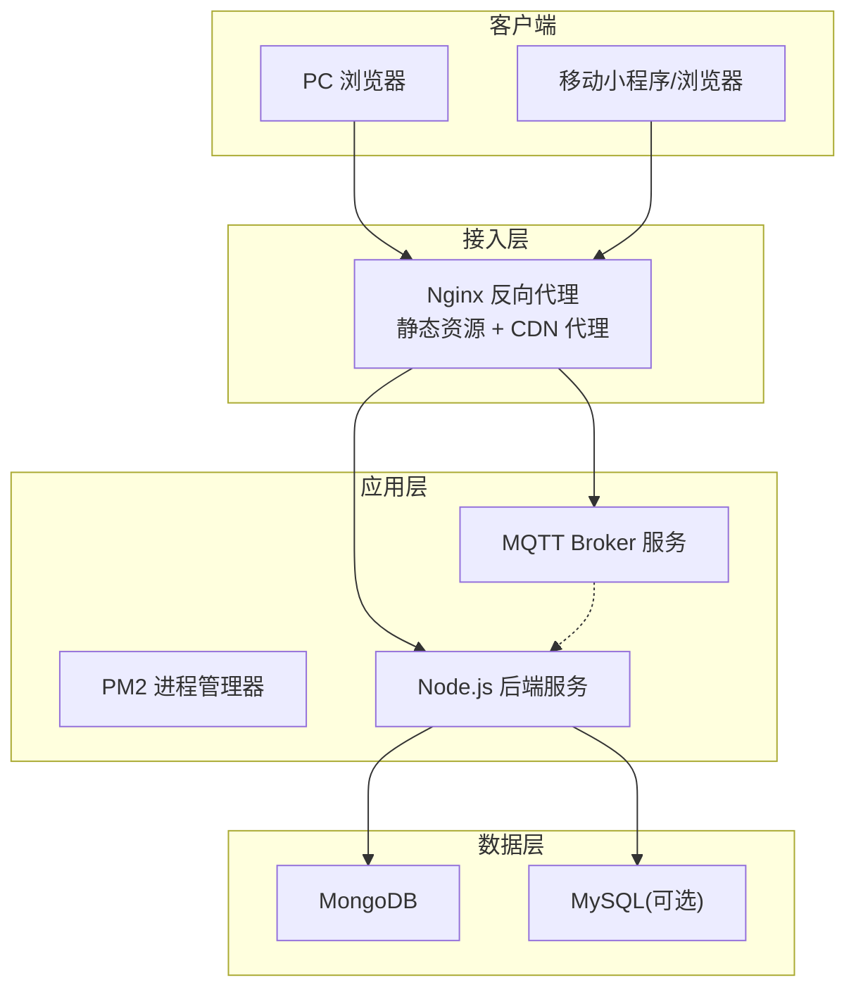
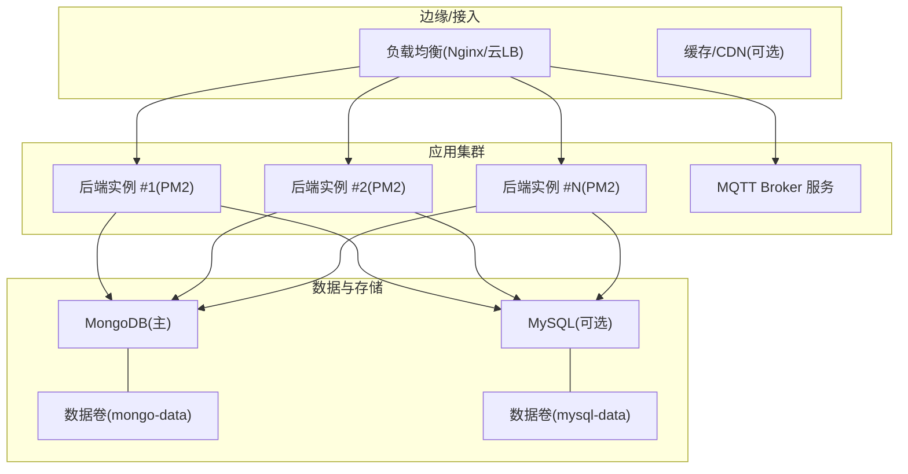
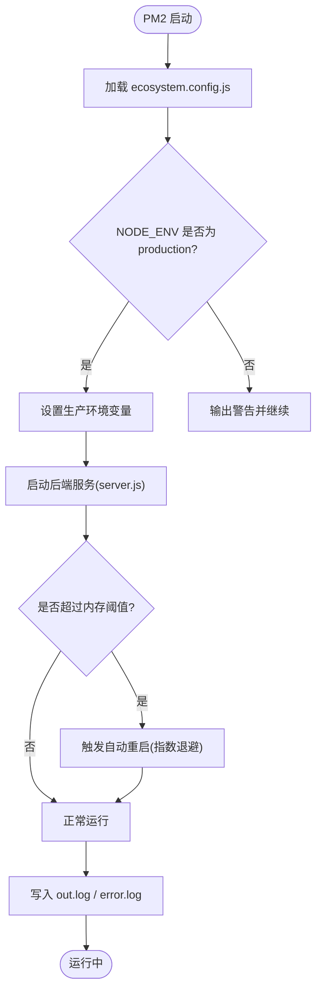
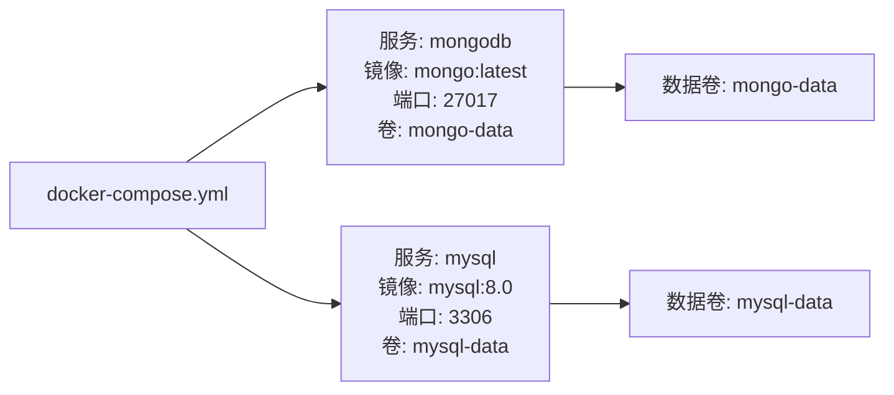
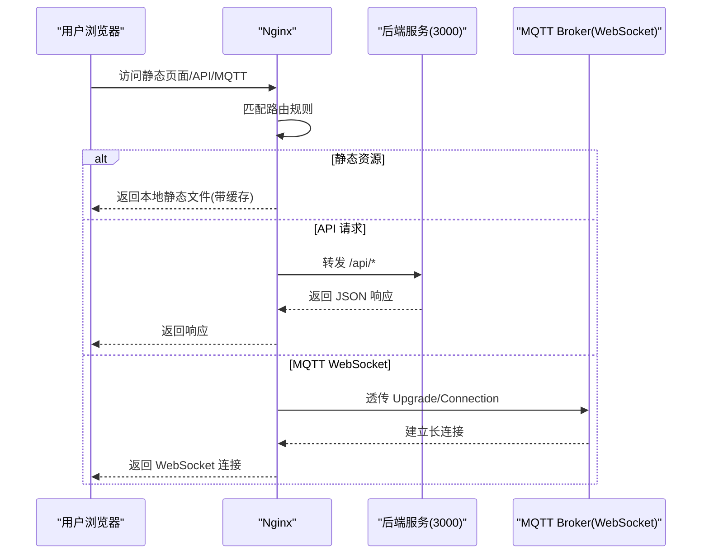
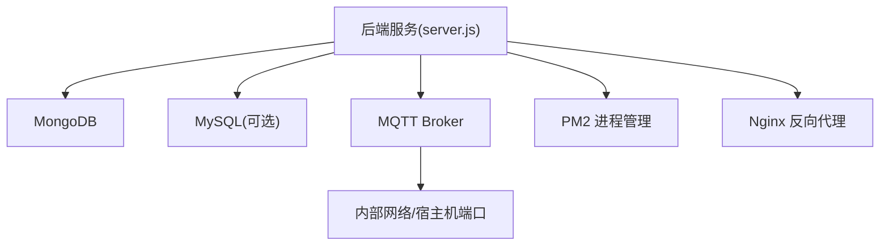
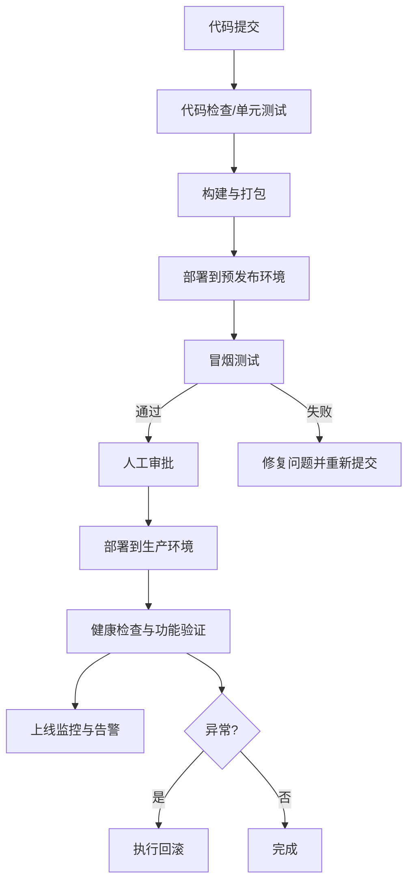

# 部署运维指南

<cite>
**本文引用的文件**   
- [backend/docker-compose.yml](file://backend/docker-compose.yml)
- [ecosystem.config.js](file://ecosystem.config.js)
- [pm2.config.json](file://pm2.config.json)
- [PRODUCTION_GUIDE.md](file://PRODUCTION_GUIDE.md)
- [.trae/specs/deployment-testing-spec.md](file://.trae/specs/deployment-testing-spec.md)
</cite>

## 目录
1. [简介](#简介)
2. [项目结构](#项目结构)
3. [核心组件](#核心组件)
4. [架构总览](#架构总览)
5. [详细组件分析](#详细组件分析)
6. [依赖关系分析](#依赖关系分析)
7. [性能与容量规划](#性能与容量规划)
8. [监控与告警方案](#监控与告警方案)
9. [CI/CD 流水线配置](#cicd-流水线配置)
10. [故障排查手册](#故障排查手册)
11. [备份与恢复策略](#备份与恢复策略)
12. [安全加固最佳实践](#安全加固最佳实践)
13. [结论](#结论)

## 简介
本指南面向运维工程师与 DevOps 团队，提供干洗店管理系统的生产环境部署与运维参考。内容覆盖容器化部署、负载均衡与高可用、PM2 进程管理、Docker 编排（服务发现、数据持久化、网络）、CI/CD 流水线、系统监控与告警、故障排查、备份恢复、容量规划与安全加固等关键主题。文档中的流程与配置均基于仓库内现有脚本与说明进行整理与扩展，确保可落地执行。

## 项目结构
从生产视角看，系统包含以下关键部分：
- 前端静态资源与入口页面（PC/移动端）
- Node.js 后端 API 服务
- MQTT Broker（用于实时消息）
- 数据库（MongoDB/MySQL，按实际选择）
- 反向代理与静态资源托管（Nginx/Caddy）
- 进程管理与容器编排（PM2/Docker Compose）

图表来源
- [backend/docker-compose.yml:1-34](file://backend/docker-compose.yml#L1-L34)
- [ecosystem.config.js:1-100](file://ecosystem.config.js#L1-L100)
- [PRODUCTION_GUIDE.md:183-216](file://PRODUCTION_GUIDE.md#L183-L216)

章节来源
- [PRODUCTION_GUIDE.md:88-130](file://PRODUCTION_GUIDE.md#L88-L130)
- [backend/docker-compose.yml:1-34](file://backend/docker-compose.yml#L1-L34)

## 核心组件
- 后端服务：Node.js 应用，通过 PM2 管理进程、日志与自动重启。
- MQTT Broker：独立进程，负责实时消息通道，支持 WebSocket 访问。
- 数据库：MongoDB 为主，MySQL 为可选；使用 Docker Compose 卷持久化数据。
- 反向代理：Nginx 提供静态资源、API 代理与 MQTT WebSocket 透传。
- 容器编排：Docker Compose 定义数据库服务与数据卷，便于本地与测试环境快速拉起。

章节来源
- [ecosystem.config.js:17-56](file://ecosystem.config.js#L17-L56)
- [ecosystem.config.js:57-97](file://ecosystem.config.js#L57-L97)
- [backend/docker-compose.yml:1-34](file://backend/docker-compose.yml#L1-L34)

## 架构总览
生产推荐架构采用“反向代理 + 多实例后端 + 独立 Broker + 持久化数据库”的分层设计。通过 Nginx 统一入口，将静态资源、API 请求与 MQTT WebSocket 分流到对应服务；后端服务由 PM2 管理，具备自动重启与内存保护；数据库使用外部或容器化部署并挂载数据卷实现持久化。

图表来源
- [backend/docker-compose.yml:1-34](file://backend/docker-compose.yml#L1-L34)
- [ecosystem.config.js:17-56](file://ecosystem.config.js#L17-L56)
- [PRODUCTION_GUIDE.md:183-216](file://PRODUCTION_GUIDE.md#L183-L216)

## 详细组件分析

### PM2 进程管理配置
PM2 配置文件定义了后端服务与 MQTT Broker 的启动参数、环境变量、日志路径与重启策略。建议在生产环境：
- 明确设置 NODE_ENV=production
- 配置 max_memory_restart 防止内存泄漏导致雪崩
- 启用 exp_backoff_restart_delay 指数退避避免频繁重启风暴
- 分离 out_file 与 error_file，便于集中采集与分析

图表来源
- [ecosystem.config.js:17-56](file://ecosystem.config.js#L17-L56)
- [pm2.config.json:1-21](file://pm2.config.json#L1-L21)

章节来源
- [ecosystem.config.js:17-56](file://ecosystem.config.js#L17-L56)
- [pm2.config.json:1-21](file://pm2.config.json#L1-L21)

### Docker 容器编排（数据库与服务）
Docker Compose 定义了 MongoDB 与可选 MySQL 的服务、端口映射与数据卷持久化。生产建议：
- 使用外部数据库或 K8s StatefulSet 替代单机容器
- 通过命名卷或云盘挂载保障数据持久化
- 限制对外暴露端口，仅通过内部网络访问

图表来源
- [backend/docker-compose.yml:1-34](file://backend/docker-compose.yml#L1-L34)

章节来源
- [backend/docker-compose.yml:1-34](file://backend/docker-compose.yml#L1-L34)

### 反向代理与静态资源（Nginx）
生产推荐使用 Nginx 作为统一入口，完成：
- 静态资源托管与缓存
- API 请求反向代理至后端
- MQTT WebSocket 透传（Upgrade/Connection 头）
- 国内 CDN 代理与容灾切换

图表来源
- [PRODUCTION_GUIDE.md:183-216](file://PRODUCTION_GUIDE.md#L183-L216)

章节来源
- [PRODUCTION_GUIDE.md:183-216](file://PRODUCTION_GUIDE.md#L183-L216)

### 服务发现与网络配置（概念性）
在容器化与微服务场景下，建议引入服务发现与内部网络：
- 使用 Docker Network 或 K8s Service 实现服务间通信
- 通过环境变量注入服务地址（如 MQTT_BROKER）
- 使用 Ingress/Gateway 统一暴露 HTTP/WebSocket 入口

[本节为概念性说明，不直接分析具体文件]

## 依赖关系分析
- 后端服务依赖：
  - 数据库：MongoDB（必需），MySQL（可选）
  - MQTT Broker：独立进程，提供实时消息能力
  - 反向代理：Nginx（生产推荐）
- 进程管理依赖：
  - PM2：负责进程生命周期、日志与自动重启
- 容器编排依赖：
  - Docker Compose：定义数据库服务与数据卷

图表来源
- [ecosystem.config.js:17-56](file://ecosystem.config.js#L17-L56)
- [backend/docker-compose.yml:1-34](file://backend/docker-compose.yml#L1-L34)

章节来源
- [ecosystem.config.js:17-56](file://ecosystem.config.js#L17-L56)
- [backend/docker-compose.yml:1-34](file://backend/docker-compose.yml#L1-L34)

## 性能与容量规划
- 后端实例数：根据 QPS 与 CPU/内存占用评估，至少双实例配合负载均衡
- 内存保护：max_memory_restart 阈值需结合压测结果设定，避免频繁重启
- 数据库容量：依据订单量、附件大小与保留策略估算磁盘增长
- 带宽与并发：评估静态资源与图片上传峰值，合理配置 Nginx worker 与缓存
- 冷启动优化：减少初始化开销，预热常用数据，必要时提高最小实例数

[本节提供通用指导，不直接分析具体文件]

## 监控与告警方案
- 指标收集：
  - 系统级：CPU、内存、磁盘、网络 I/O
  - 应用级：PM2 进程状态、错误率、响应时间、队列积压
  - 数据库：连接数、慢查询、锁等待、复制延迟
- 日志聚合：
  - 集中采集 out.log/error.log 与系统日志
  - 结构化字段（traceId、userId、orderId）便于关联分析
- 告警通知：
  - 阈值告警：错误率、超时、OOM、磁盘空间不足
  - 事件告警：服务重启、证书过期、备份失败
  - 渠道：邮件、企业微信/钉钉、短信

[本节提供通用指导，不直接分析具体文件]

## CI/CD 流水线配置
基于仓库内的部署与测试规格，建议构建如下流水线阶段：
- 代码检查与单元测试
- 构建与打包（静态资源压缩、依赖安装）
- 预发布环境部署与冒烟测试
- 手动审批后生产环境部署
- 部署后验证与健康检查
- 回滚预案与自动化回滚脚本

图表来源
- [.trae/specs/deployment-testing-spec.md:75-138](file://.trae/specs/deployment-testing-spec.md#L75-L138)
- [.trae/specs/deployment-testing-spec.md:115-138](file://.trae/specs/deployment-testing-spec.md#L115-L138)

章节来源
- [.trae/specs/deployment-testing-spec.md:75-138](file://.trae/specs/deployment-testing-spec.md#L75-L138)
- [.trae/specs/deployment-testing-spec.md:115-138](file://.trae/specs/deployment-testing-spec.md#L115-L138)

## 故障排查手册
常见问题与处理步骤：
- 页面无法加载或样式缺失
  - 检查 CDN 可用性，优先切换国内镜像或本地资源
  - 确认 Nginx 静态目录与 try_files 配置正确
- API 接口 502/504
  - 查看 PM2 日志（out.log/error.log），确认后端进程存活
  - 检查数据库连接与权限，确认端口可达
- MQTT 连接失败
  - 确认 Broker 进程状态与端口监听
  - 检查 Nginx WebSocket 透传配置（Upgrade/Connection）
- 内存泄漏与频繁重启
  - 调整 max_memory_restart 阈值，定位热点模块
  - 开启堆快照与性能分析工具

章节来源
- [PRODUCTION_GUIDE.md:104-155](file://PRODUCTION_GUIDE.md#L104-L155)
- [ecosystem.config.js:17-56](file://ecosystem.config.js#L17-L56)

## 备份与恢复策略
- 备份范围：
  - 数据库：MongoDB 全量/增量备份，MySQL 逻辑备份
  - 静态资源与配置文件：版本库与制品库归档
- 备份频率：
  - 每日定时全量备份，关键变更前后手动备份
- 恢复演练：
  - 定期在预发布环境执行恢复演练，验证 RTO/RPO
- 回滚方案：
  - 版本化部署，保留最近 N 个版本
  - 一键回滚脚本与审批流程

章节来源
- [.trae/specs/deployment-testing-spec.md:225-241](file://.trae/specs/deployment-testing-spec.md#L225-L241)

## 安全加固最佳实践
- 网络与访问控制
  - 仅开放必要端口，数据库不暴露公网
  - 使用反向代理统一鉴权与限流
- 认证与授权
  - 启用 MQTT 认证，最小权限原则
  - 敏感信息通过环境变量注入，避免硬编码
- 资源与依赖
  - 固定依赖版本，定期扫描漏洞
  - 静态资源本地化或可信 CDN，禁用不安全协议
- 审计与合规
  - 开启操作审计日志，留存周期满足合规要求
  - 定期安全巡检与渗透测试

[本节提供通用指导，不直接分析具体文件]

## 结论
本指南围绕干洗店管理系统的生产部署与运维需求，给出了从架构设计、进程管理、容器编排、CI/CD、监控告警到故障排查与备份恢复的完整参考。建议在实际落地时结合业务规模与平台能力逐步演进，优先保证稳定性与可观测性，再持续优化性能与成本。