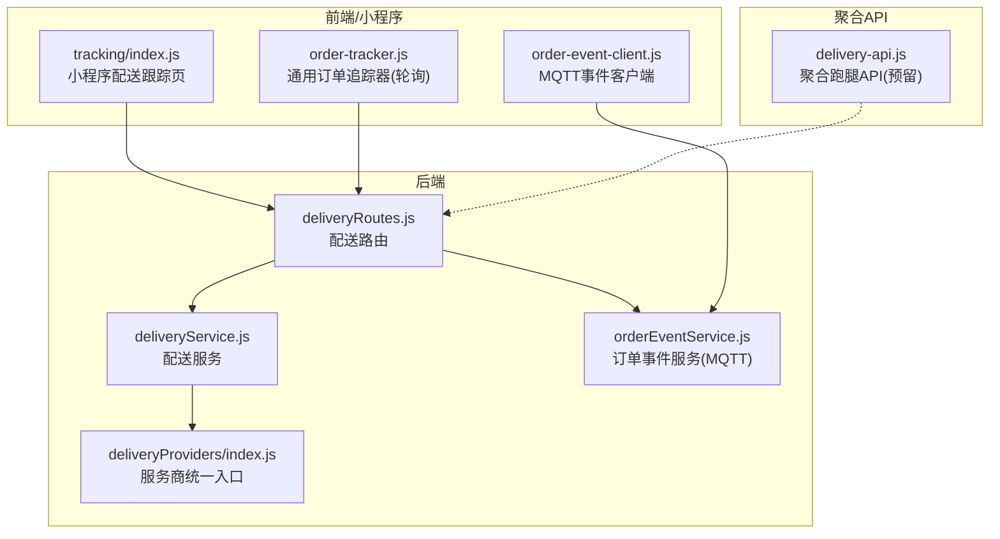
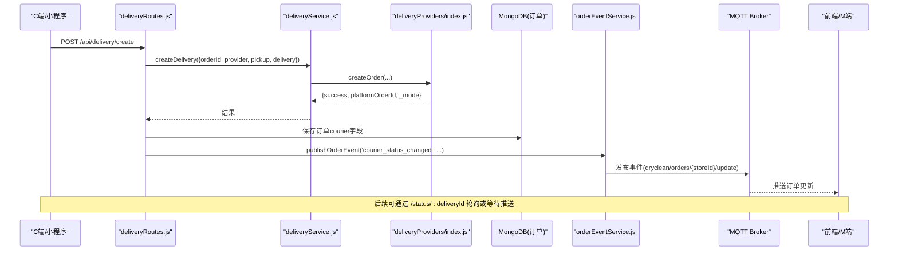
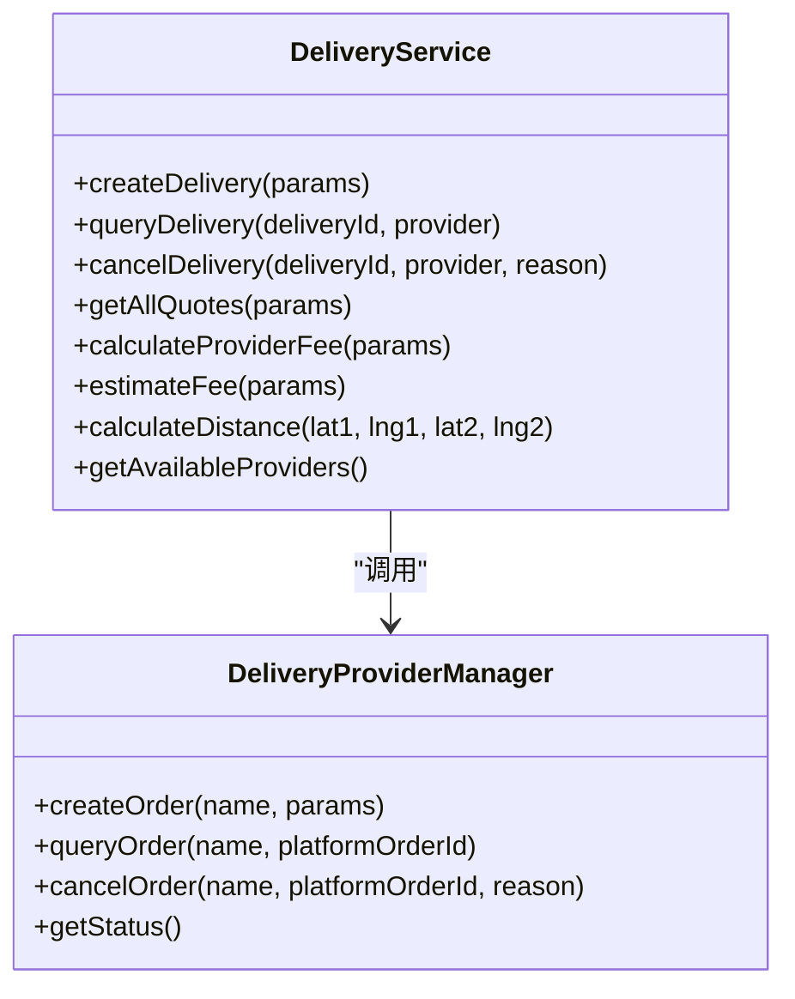
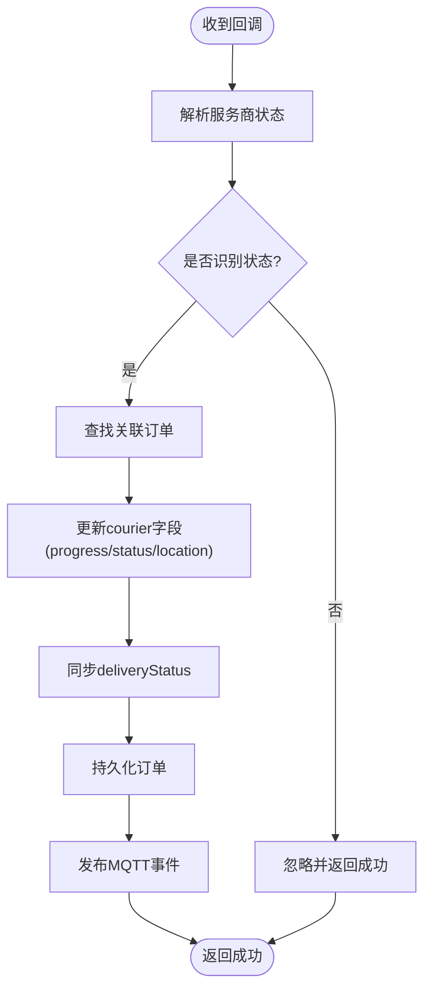
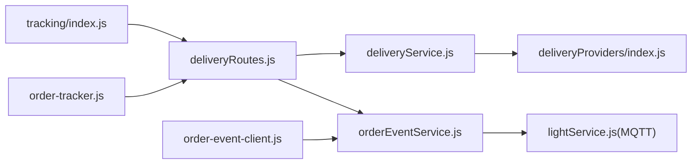

# 状态跟踪机制

<cite>
**本文引用的文件**
- [backend/modules/common/services/deliveryService.js](file://backend/modules/common/services/deliveryService.js)
- [backend/modules/common/routes/deliveryRoutes.js](file://backend/modules/common/routes/deliveryRoutes.js)
- [backend/services/deliveryProviders/index.js](file://backend/services/deliveryProviders/index.js)
- [backend/services/orderEventService.js](file://backend/services/orderEventService.js)
- [js/order-event-client.js](file://js/order-event-client.js)
- [wechat-mini-app/pages/delivery/tracking/index.js](file://wechat-mini-app/pages/delivery/tracking/index.js)
- [frontend/order-tracker.js](file://frontend/order-tracker.js)
- [api/delivery-api.js](file://api/delivery-api.js)
</cite>

## 目录
1. [引言](#引言)
2. [项目结构](#项目结构)
3. [核心组件](#核心组件)
4. [架构总览](#架构总览)
5. [详细组件分析](#详细组件分析)
6. [依赖关系分析](#依赖关系分析)
7. [性能与可靠性](#性能与可靠性)
8. [故障排查指南](#故障排查指南)
9. [结论](#结论)
10. [附录：接口规范](#附录接口规范)

## 引言
本文件围绕“配送状态跟踪机制”进行系统化说明，覆盖订单全生命周期状态管理、状态同步（实时推送/轮询更新/事件驱动）、位置跟踪与预计到达时间计算、异常处理策略、查询接口使用方式，以及前端展示与用户体验优化建议。文档以代码仓库中的实际实现为依据，确保可落地、可追溯。

## 项目结构
与配送状态跟踪相关的后端服务、路由、服务商聚合、事件发布/订阅、小程序端跟踪页面及通用追踪模块分布如下：
- 后端业务与服务层：配送服务、路由、服务商统一入口、订单事件服务
- 客户端侧：微信小程序配送跟踪页、通用订单追踪器、MQTT事件客户端
- 聚合API配置：预留的跑腿聚合API（用于前端或外部集成）

图表来源
- [backend/modules/common/routes/deliveryRoutes.js:1-323](file://backend/modules/common/routes/deliveryRoutes.js#L1-L323)
- [backend/modules/common/services/deliveryService.js:1-322](file://backend/modules/common/services/deliveryService.js#L1-L322)
- [backend/services/deliveryProviders/index.js:1-87](file://backend/services/deliveryProviders/index.js#L1-L87)
- [backend/services/orderEventService.js:1-168](file://backend/services/orderEventService.js#L1-L168)
- [wechat-mini-app/pages/delivery/tracking/index.js:1-217](file://wechat-mini-app/pages/delivery/tracking/index.js#L1-L217)
- [frontend/order-tracker.js:1-441](file://frontend/order-tracker.js#L1-L441)
- [js/order-event-client.js:1-270](file://js/order-event-client.js#L1-L270)
- [api/delivery-api.js:1-283](file://api/delivery-api.js#L1-L283)

章节来源
- [backend/modules/common/routes/deliveryRoutes.js:1-323](file://backend/modules/common/routes/deliveryRoutes.js#L1-L323)
- [backend/modules/common/services/deliveryService.js:1-322](file://backend/modules/common/services/deliveryService.js#L1-L322)
- [backend/services/deliveryProviders/index.js:1-87](file://backend/services/deliveryProviders/index.js#L1-L87)
- [backend/services/orderEventService.js:1-168](file://backend/services/orderEventService.js#L1-L168)
- [wechat-mini-app/pages/delivery/tracking/index.js:1-217](file://wechat-mini-app/pages/delivery/tracking/index.js#L1-L217)
- [frontend/order-tracker.js:1-441](file://frontend/order-tracker.js#L1-L441)
- [js/order-event-client.js:1-270](file://js/order-event-client.js#L1-L270)
- [api/delivery-api.js:1-283](file://api/delivery-api.js#L1-L283)

## 核心组件
- 配送服务（DeliveryService）
  - 负责创建配送订单、查询配送状态、取消配送；同时提供定价与报价计算逻辑。
  - 通过统一入口 DeliveryProviderManager 调用具体服务商（美团、京东秒送、淘宝闪送、顺丰同城），支持真实/模拟模式。
- 配送路由（deliveryRoutes）
  - 暴露REST接口：获取服务商列表/报价、创建配送订单、查询配送状态、取消配送、回调处理、启动跟踪模拟等。
  - 将服务商回传的状态映射为系统内部 courierStatus，并持久化到订单对象，触发MQTT事件推送。
- 订单事件服务（OrderEventService）
  - 基于MQTT发布订单相关事件（含配送状态变更），供M端/Admin端实时刷新。
- 小程序配送跟踪页（tracking/index.js）
  - 拉取订单详情，构建配送信息（状态、司机、时间线），在失败时回退到模拟数据。
- 通用订单追踪器（order-tracker.js）
  - 提供定时轮询获取订单状态的封装，支持本地缓存降级与停止条件。
- MQTT事件客户端（order-event-client.js）
  - 连接EMQX WebSocket，订阅门店/全局主题；断线自动重连，失败降级为轮询。
- 聚合跑腿API（delivery-api.js）
  - 预留对外聚合能力（当前为模拟实现），便于未来接入第三方平台。

章节来源
- [backend/modules/common/services/deliveryService.js:1-322](file://backend/modules/common/services/deliveryService.js#L1-L322)
- [backend/modules/common/routes/deliveryRoutes.js:1-323](file://backend/modules/common/routes/deliveryRoutes.js#L1-L323)
- [backend/services/orderEventService.js:1-168](file://backend/services/orderEventService.js#L1-L168)
- [wechat-mini-app/pages/delivery/tracking/index.js:1-217](file://wechat-mini-app/pages/delivery/tracking/index.js#L1-L217)
- [frontend/order-tracker.js:1-441](file://frontend/order-tracker.js#L1-L441)
- [js/order-event-client.js:1-270](file://js/order-event-client.js#L1-L270)
- [api/delivery-api.js:1-283](file://api/delivery-api.js#L1-L283)

## 架构总览
下图展示了从下单到状态更新的端到端流程，包括真实/模拟服务商、回调映射、数据库持久化与MQTT推送。

图表来源
- [backend/modules/common/routes/deliveryRoutes.js:86-133](file://backend/modules/common/routes/deliveryRoutes.js#L86-L133)
- [backend/modules/common/services/deliveryService.js:45-70](file://backend/modules/common/services/deliveryService.js#L45-L70)
- [backend/services/deliveryProviders/index.js:57-76](file://backend/services/deliveryProviders/index.js#L57-L76)
- [backend/services/orderEventService.js:77-116](file://backend/services/orderEventService.js#L77-L116)

## 详细组件分析

### 组件A：配送服务（DeliveryService）
职责
- 标准化提供商标识，统一创建/查询/取消配送订单。
- 计算各服务商报价（一对一/拼单），估算费用与预计时长。
- 距离计算采用Haversine公式。

关键方法
- createDelivery(params)
- queryDelivery(deliveryId, provider)
- cancelDelivery(deliveryId, provider, reason)
- getAllQuotes(params)
- calculateProviderFee(params)
- estimateFee(params)
- calculateDistance(lat1, lng1, lat2, lng2)

复杂度与优化
- 报价计算为O(n)遍历可用服务商，n通常为常数级（4个）。
- 距离计算为O(1)。
- 建议在高频场景对常用参数做缓存（如provider配置、价格规则）。

图表来源
- [backend/modules/common/services/deliveryService.js:32-322](file://backend/modules/common/services/deliveryService.js#L32-L322)
- [backend/services/deliveryProviders/index.js:20-87](file://backend/services/deliveryProviders/index.js#L20-L87)

章节来源
- [backend/modules/common/services/deliveryService.js:1-322](file://backend/modules/common/services/deliveryService.js#L1-L322)
- [backend/services/deliveryProviders/index.js:1-87](file://backend/services/deliveryProviders/index.js#L1-L87)

### 组件B：配送路由（deliveryRoutes）
职责
- 提供REST API：获取服务商列表/报价、创建配送订单、查询配送状态、取消配送、回调处理、启动跟踪模拟、活跃任务查询。
- 将服务商回调状态映射为系统内部 courierStatus，并持久化至订单对象。
- 通过订单事件服务发布MQTT事件，驱动多端实时更新。

关键流程
- 创建配送订单：校验参数 → 调用配送服务 → 可选启动跟踪模拟 → 返回结果。
- 配送回调：解析服务商状态 → 映射为 courierStatus → 更新订单 → 推送MQTT事件。

图表来源
- [backend/modules/common/routes/deliveryRoutes.js:172-280](file://backend/modules/common/routes/deliveryRoutes.js#L172-L280)

章节来源
- [backend/modules/common/routes/deliveryRoutes.js:1-323](file://backend/modules/common/routes/deliveryRoutes.js#L1-L323)

### 组件C：订单事件服务（OrderEventService）
职责
- 通过MQTT发布订单事件（包含配送状态变更），主题设计区分门店级与全局级。
- 将事件写入通知中心与跨端同步服务，并在必要时记录消息中心。

要点
- 延迟加载MQTT客户端、通知中心、跨端同步、消息中心，避免循环依赖。
- 当MQTT不可用时，仅记录日志，不影响主流程。

章节来源
- [backend/services/orderEventService.js:1-168](file://backend/services/orderEventService.js#L1-L168)

### 组件D：MQTT事件客户端（order-event-client.js）
职责
- 连接EMQX WebSocket，订阅门店/全局主题。
- 断线指数退避重连，达到上限后降级为轮询。
- 提供切换门店重新订阅的能力。

关键点
- 默认WebSocket地址 ws://{host}:8083/mqtt。
- 轮询间隔8秒，请求最近订单列表作为兜底。

章节来源
- [js/order-event-client.js:1-270](file://js/order-event-client.js#L1-L270)

### 组件E：小程序配送跟踪页（tracking/index.js）
职责
- 加载订单详情，构建配送信息（状态、司机、时间线）。
- 若API失败则回退到模拟数据，保证页面可用性。

注意
- 状态映射根据订单状态生成不同文案与图标。
- 未提供实时位置轨迹绘制，但可结合后端回调中的location字段扩展。

章节来源
- [wechat-mini-app/pages/delivery/tracking/index.js:1-217](file://wechat-mini-app/pages/delivery/tracking/index.js#L1-L217)

### 组件F：通用订单追踪器（order-tracker.js）
职责
- 定时轮询订单状态，支持最大尝试次数与本地缓存降级。
- 完成/取消订单后自动停止轮询。
- 提供状态UI渲染辅助方法。

适用场景
- 无MQTT环境或需要兼容旧页面的场景。

章节来源
- [frontend/order-tracker.js:1-441](file://frontend/order-tracker.js#L1-L441)

### 组件G：聚合跑腿API（delivery-api.js）
职责
- 预留对外聚合能力（当前为模拟实现），提供查询服务商、创建订单、取消订单、查询状态等方法。
- 可用于前端或外部系统集成时的统一入口。

章节来源
- [api/delivery-api.js:1-283](file://api/delivery-api.js#L1-L283)

## 依赖关系分析
- deliveryRoutes 依赖 deliveryService 与 orderEventService。
- deliveryService 依赖 deliveryProviders/index.js。
- orderEventService 依赖 lightService（MQTT客户端）与通知中心、跨端同步、消息中心。
- 小程序 tracking 页面依赖后端订单详情接口。
- 通用追踪器依赖后端订单状态接口。
- MQTT事件客户端依赖EMQX WebSocket。

图表来源
- [backend/modules/common/routes/deliveryRoutes.js:1-323](file://backend/modules/common/routes/deliveryRoutes.js#L1-L323)
- [backend/modules/common/services/deliveryService.js:1-322](file://backend/modules/common/services/deliveryService.js#L1-L322)
- [backend/services/deliveryProviders/index.js:1-87](file://backend/services/deliveryProviders/index.js#L1-L87)
- [backend/services/orderEventService.js:1-168](file://backend/services/orderEventService.js#L1-L168)
- [wechat-mini-app/pages/delivery/tracking/index.js:1-217](file://wechat-mini-app/pages/delivery/tracking/index.js#L1-L217)
- [frontend/order-tracker.js:1-441](file://frontend/order-tracker.js#L1-L441)
- [js/order-event-client.js:1-270](file://js/order-event-client.js#L1-L270)

章节来源
- [backend/modules/common/routes/deliveryRoutes.js:1-323](file://backend/modules/common/routes/deliveryRoutes.js#L1-L323)
- [backend/modules/common/services/deliveryService.js:1-322](file://backend/modules/common/services/deliveryService.js#L1-L322)
- [backend/services/deliveryProviders/index.js:1-87](file://backend/services/deliveryProviders/index.js#L1-L87)
- [backend/services/orderEventService.js:1-168](file://backend/services/orderEventService.js#L1-L168)
- [wechat-mini-app/pages/delivery/tracking/index.js:1-217](file://wechat-mini-app/pages/delivery/tracking/index.js#L1-L217)
- [frontend/order-tracker.js:1-441](file://frontend/order-tracker.js#L1-L441)
- [js/order-event-client.js:1-270](file://js/order-event-client.js#L1-L270)

## 性能与可靠性
- 实时性
  - 优先使用MQTT推送（门店级与全局级主题），降低轮询压力。
  - 小程序端可在收到推送后增量更新UI，避免全量刷新。
- 降级策略
  - MQTT不可用或频繁断开时，自动切换到轮询（8秒间隔）。
  - 订单追踪器支持本地缓存（localStorage）降级，保障弱网体验。
- 幂等与一致性
  - 回调处理中先映射状态再持久化，避免重复更新导致不一致。
  - 对于异常状态（exception）不覆盖deliveryStatus，保留业务语义。
- 资源控制
  - 限制轮询最大尝试次数，完成后主动停止定时器。
  - 指数退避重连，避免风暴式重连。

[本节为通用指导，无需列出具体文件来源]

## 故障排查指南
常见问题与定位步骤
- 无法接收实时推送
  - 检查MQTT连接状态与主题订阅是否正确。
  - 查看order-event-client.js的重连与降级逻辑。
- 配送状态不更新
  - 确认服务商回调是否到达后端，检查deliveryRoutes回调处理与映射表。
  - 核对订单courier字段与deliveryStatus是否被正确更新。
- 小程序跟踪页显示异常
  - 检查订单详情接口返回结构，确认buildDeliveryInfo分支逻辑。
  - 若API失败，页面会回退到模拟数据，需确认是否为预期行为。
- 轮询卡顿或超时
  - 调整order-tracker.js的轮询间隔与最大尝试次数。
  - 关注网络错误与本地缓存读取路径。

章节来源
- [js/order-event-client.js:1-270](file://js/order-event-client.js#L1-L270)
- [backend/modules/common/routes/deliveryRoutes.js:172-280](file://backend/modules/common/routes/deliveryRoutes.js#L172-L280)
- [wechat-mini-app/pages/delivery/tracking/index.js:38-71](file://wechat-mini-app/pages/delivery/tracking/index.js#L38-L71)
- [frontend/order-tracker.js:130-179](file://frontend/order-tracker.js#L130-L179)

## 结论
本机制以“回调驱动+MQTT推送为主、轮询降级为辅”的方式实现配送状态的全链路跟踪。后端通过统一的服务商入口与状态映射，确保状态一致性与可扩展性；前端通过MQTT与轮询双通道保障实时性与鲁棒性。整体架构清晰、职责明确，具备良好的性能与容错能力。

[本节为总结，无需列出具体文件来源]

## 附录：接口规范

- 获取服务商接入状态（含REAL/MOCK模式标识）
  - 方法：GET
  - 路径：/api/delivery/provider-status
  - 响应：{ success, data[], activeTrackingCount }

- 获取支持的配送平台（含报价）
  - 方法：GET
  - 路径：/api/delivery/providers
  - 响应：{ success, data[] }

- 一键获取所有服务商报价（含一对一和拼单两种模式）
  - 方法：POST
  - 路径：/api/delivery/quotes
  - 请求体：{ pickup, delivery, distance?, serviceTotal?, isNewUser? }
  - 响应：{ success, data[] }

- 估算配送费用（兼容旧接口，支持deliveryType）
  - 方法：POST
  - 路径：/api/delivery/estimate
  - 请求体：{ provider?, pickup, delivery, deliveryType?, serviceTotal?, isNewUser? }
  - 响应：{ success, data: { provider, distance, fee, originalFee, discount, estimatedMinutes, estimatedTime, ... } }

- 创建配送订单
  - 方法：POST
  - 路径：/api/delivery/create
  - 鉴权：需要认证中间件
  - 请求体：{ orderId, provider?, pickup, delivery }
  - 响应：{ success, ... }

- 查询配送状态
  - 方法：GET
  - 路径：/api/delivery/status/:deliveryId
  - 鉴权：需要认证中间件
  - 查询参数：provider?
  - 响应：{ success, provider, data: { status, driverName, driverPhone, estimatedTime, distance, _mode } }

- 取消配送
  - 方法：POST
  - 路径：/api/delivery/cancel
  - 鉴权：需要认证中间件
  - 请求体：{ deliveryId, provider?, reason? }
  - 响应：{ success, ... }

- 配送状态回调（由配送平台调用）
  - 方法：POST
  - 路径：/api/delivery/callback
  - 请求体：{ deliveryId, status, driverInfo?, location?, timestamp?, description? }
  - 说明：将服务商状态映射为系统courierStatus，并持久化与推送事件

- 启动跑腿配送跟踪模拟
  - 方法：POST
  - 路径：/api/delivery/:orderId/start-tracking
  - 响应：{ success, message, data? }

- 查询跑腿跟踪活跃任务列表（调试用）
  - 方法：GET
  - 路径：/api/delivery/tracking/active
  - 响应：{ success, count, data[] }

章节来源
- [backend/modules/common/routes/deliveryRoutes.js:12-323](file://backend/modules/common/routes/deliveryRoutes.js#L12-L323)