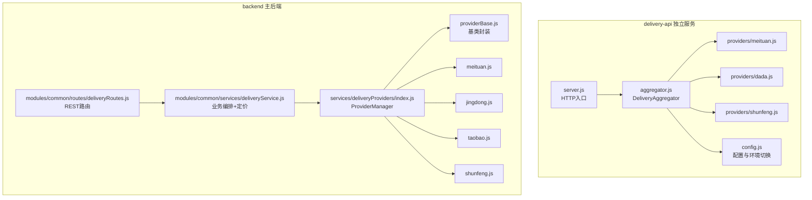
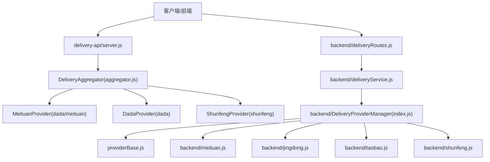
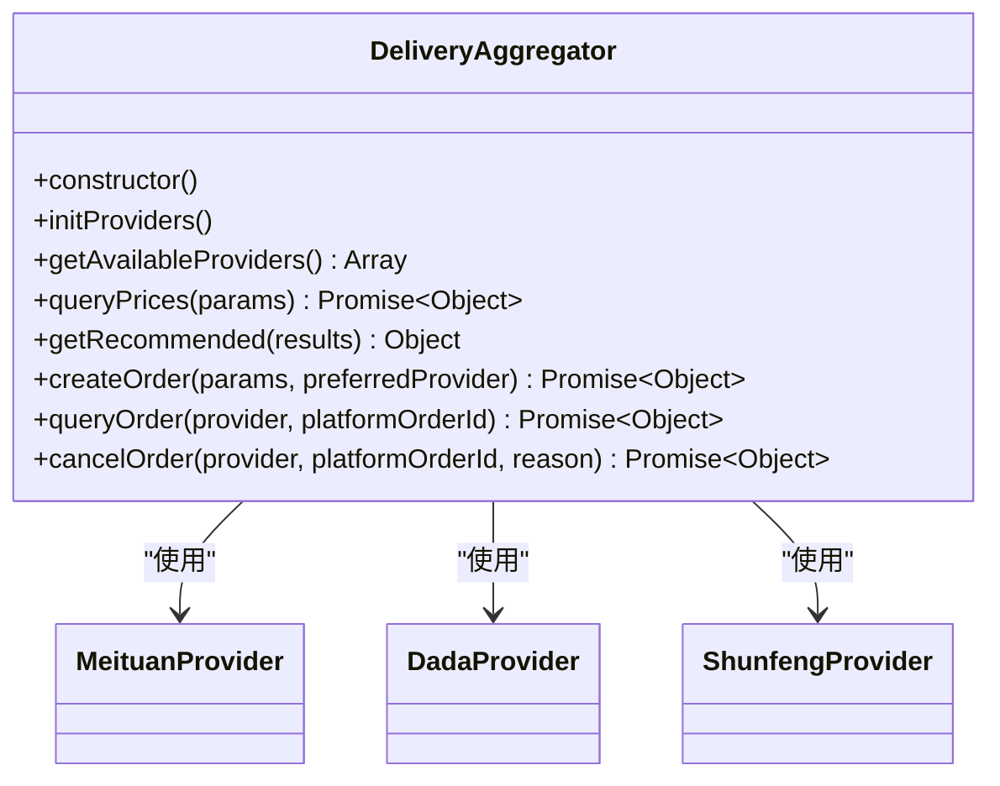
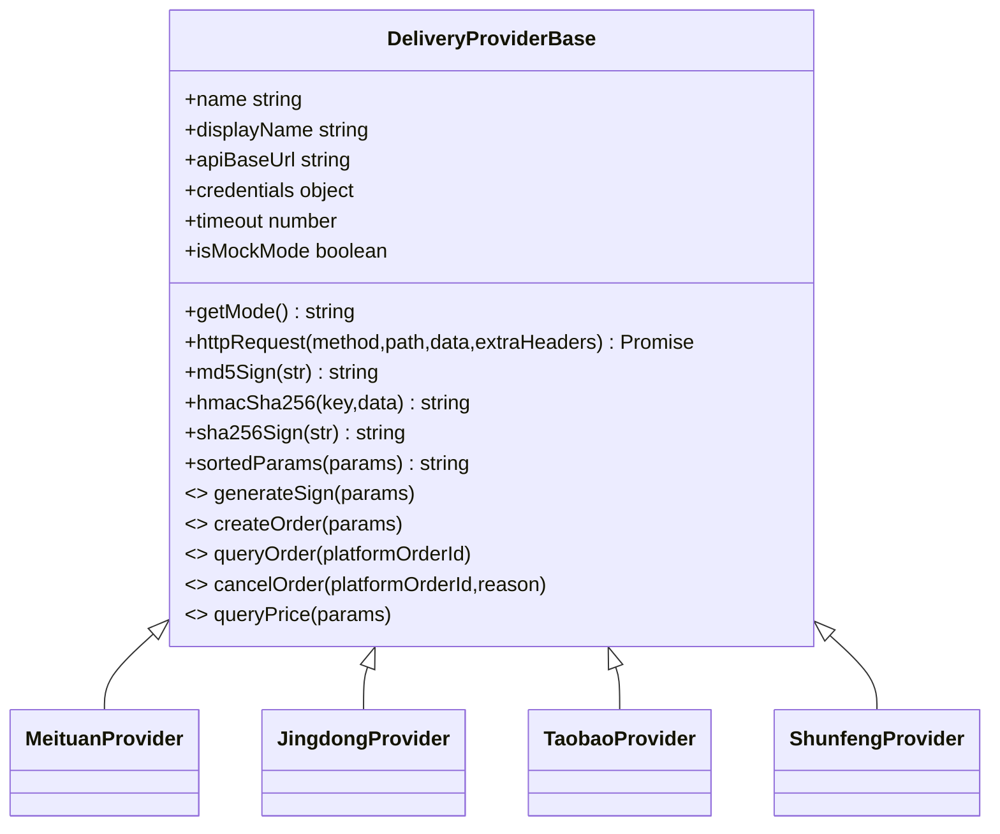
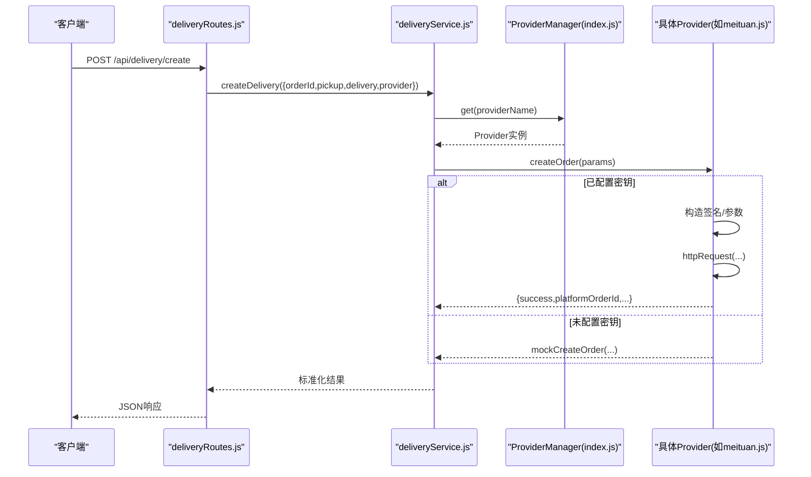
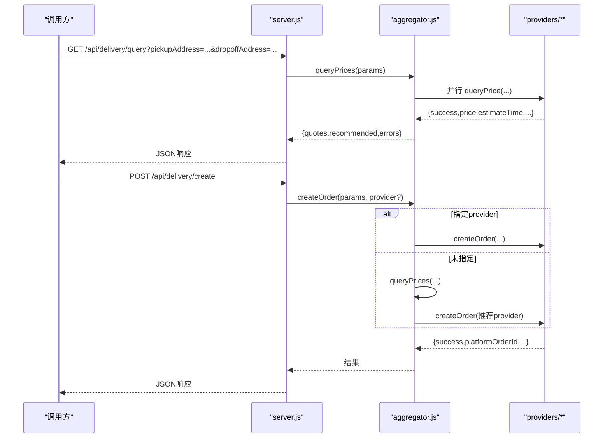
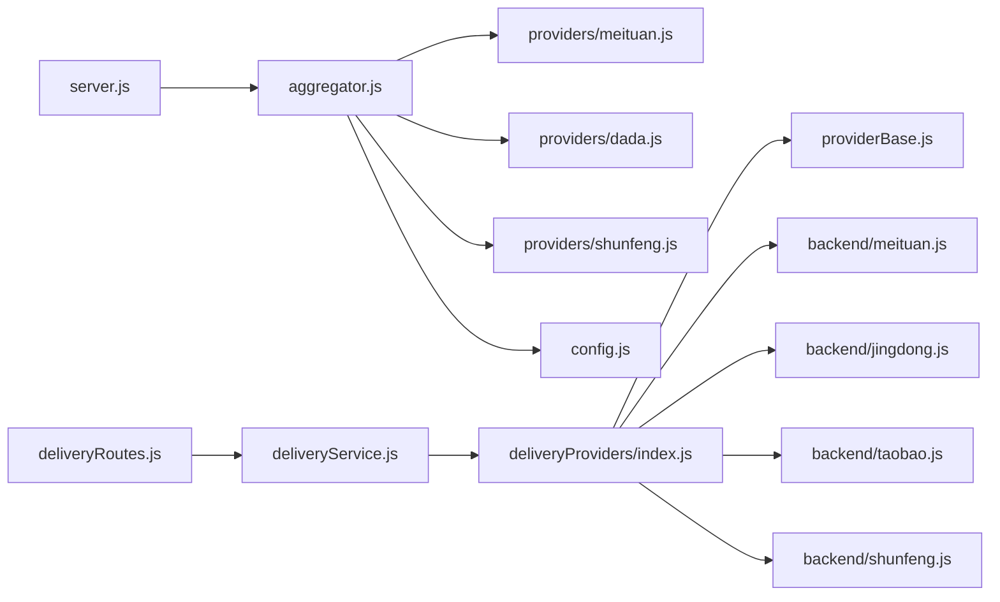

# 聚合架构设计

<cite>
**本文引用的文件列表**
- [delivery-api/aggregator.js](file://delivery-api/aggregator.js)
- [delivery-api/config.js](file://delivery-api/config.js)
- [delivery-api/server.js](file://delivery-api/server.js)
- [delivery-api/providers/meituan.js](file://delivery-api/providers/meituan.js)
- [delivery-api/providers/dada.js](file://delivery-api/providers/dada.js)
- [delivery-api/providers/shunfeng.js](file://delivery-api/providers/shunfeng.js)
- [backend/services/deliveryProviders/index.js](file://backend/services/deliveryProviders/index.js)
- [backend/services/deliveryProviders/providerBase.js](file://backend/services/deliveryProviders/providerBase.js)
- [backend/services/deliveryProviders/meituan.js](file://backend/services/deliveryProviders/meituan.js)
- [backend/services/deliveryProviders/jingdong.js](file://backend/services/deliveryProviders/jingdong.js)
- [backend/services/deliveryProviders/taobao.js](file://backend/services/deliveryProviders/taobao.js)
- [backend/services/deliveryProviders/shunfeng.js](file://backend/services/deliveryProviders/shunfeng.js)
- [backend/modules/common/services/deliveryService.js](file://backend/modules/common/services/deliveryService.js)
- [backend/modules/common/routes/deliveryRoutes.js](file://backend/modules/common/routes/deliveryRoutes.js)
</cite>

## 目录
1. [引言](#引言)
2. [项目结构](#项目结构)
3. [核心组件](#核心组件)
4. [架构总览](#架构总览)
5. [详细组件分析](#详细组件分析)
6. [依赖关系分析](#依赖关系分析)
7. [性能与优化](#性能与优化)
8. [故障排查指南](#故障排查指南)
9. [结论](#结论)
10. [附录：扩展新服务商指南](#附录扩展新服务商指南)

## 引言
本文件围绕“配送聚合服务”的架构设计与实现进行深入解析，重点阐述 DeliveryAggregator 类的设计模式、适配器在多平台配送中的应用、服务商初始化与动态加载策略、统一接口抽象层（queryPrice、createOrder、queryOrder、cancelOrder）的标准化流程，以及错误处理、重试与降级方案。文档同时提供架构图与数据流图，展示从业务层到具体配送商的完整请求链路，并给出并行询价、缓存与连接池等性能优化建议，最后为开发者提供扩展新配送服务商的架构指导。

## 项目结构
仓库包含两套配送聚合能力：
- delivery-api：独立运行的聚合配送微服务，内置 DeliveryAggregator 与多提供商适配层，对外暴露 REST API。
- backend：主后端服务，通过 services/deliveryProviders 直接对接各配送商开放平台，并在 common 模块中提供统一的配送服务与路由。

图表来源
- [delivery-api/server.js:1-238](file://delivery-api/server.js#L1-L238)
- [delivery-api/aggregator.js:1-237](file://delivery-api/aggregator.js#L1-L237)
- [delivery-api/config.js:1-93](file://delivery-api/config.js#L1-L93)
- [backend/modules/common/routes/deliveryRoutes.js:1-323](file://backend/modules/common/routes/deliveryRoutes.js#L1-L323)
- [backend/modules/common/services/deliveryService.js:1-322](file://backend/modules/common/services/deliveryService.js#L1-L322)
- [backend/services/deliveryProviders/index.js:1-87](file://backend/services/deliveryProviders/index.js#L1-L87)
- [backend/services/deliveryProviders/providerBase.js:1-124](file://backend/services/deliveryProviders/providerBase.js#L1-L124)

章节来源
- [delivery-api/server.js:1-238](file://delivery-api/server.js#L1-L238)
- [delivery-api/aggregator.js:1-237](file://delivery-api/aggregator.js#L1-L237)
- [delivery-api/config.js:1-93](file://delivery-api/config.js#L1-L93)
- [backend/modules/common/routes/deliveryRoutes.js:1-323](file://backend/modules/common/routes/deliveryRoutes.js#L1-L323)
- [backend/modules/common/services/deliveryService.js:1-322](file://backend/modules/common/services/deliveryService.js#L1-L322)
- [backend/services/deliveryProviders/index.js:1-87](file://backend/services/deliveryProviders/index.js#L1-L87)
- [backend/services/deliveryProviders/providerBase.js:1-124](file://backend/services/deliveryProviders/providerBase.js#L1-L124)

## 核心组件
- DeliveryAggregator（delivery-api）：聚合调度器，负责按策略并行询价、自动选择最优服务商、创建/查询/取消订单，并提供可用服务商列表。
- ProviderManager（backend）：统一入口，管理多个 provider 实例，支持获取状态、真实/模拟模式判断与单例分发。
- ProviderBase（backend）：抽象基类，封装 HTTPS 请求、签名算法、超时控制与响应标准化，子类必须实现 createOrder/queryOrder/cancelOrder/queryPrice。
- 各 Provider 实现（backend）：美团、京东秒送（达达）、淘宝闪送（蜂鸟）、顺丰同城的具体对接与 Mock 回退。
- 业务服务（backend）：DeliveryService 提供定价计算、报价排序、统一调用 ProviderManager，并对旧接口进行兼容。
- 路由层（backend）：deliveryRoutes 暴露 REST 接口，串联业务服务与 ProviderManager，并处理回调与跟踪模拟。

章节来源
- [delivery-api/aggregator.js:1-237](file://delivery-api/aggregator.js#L1-L237)
- [backend/services/deliveryProviders/index.js:1-87](file://backend/services/deliveryProviders/index.js#L1-L87)
- [backend/services/deliveryProviders/providerBase.js:1-124](file://backend/services/deliveryProviders/providerBase.js#L1-L124)
- [backend/modules/common/services/deliveryService.js:1-322](file://backend/modules/common/services/deliveryService.js#L1-L322)
- [backend/modules/common/routes/deliveryRoutes.js:1-323](file://backend/modules/common/routes/deliveryRoutes.js#L1-L323)

## 架构总览
下图展示了两个运行场景下的整体架构：独立聚合服务（delivery-api）与主后端（backend）各自的多平台适配与统一抽象。

图表来源
- [delivery-api/server.js:1-238](file://delivery-api/server.js#L1-L238)
- [delivery-api/aggregator.js:1-237](file://delivery-api/aggregator.js#L1-L237)
- [delivery-api/providers/meituan.js:1-231](file://delivery-api/providers/meituan.js#L1-L231)
- [delivery-api/providers/dada.js:1-237](file://delivery-api/providers/dada.js#L1-L237)
- [delivery-api/providers/shunfeng.js:1-256](file://delivery-api/providers/shunfeng.js#L1-L256)
- [backend/modules/common/routes/deliveryRoutes.js:1-323](file://backend/modules/common/routes/deliveryRoutes.js#L1-L323)
- [backend/modules/common/services/deliveryService.js:1-322](file://backend/modules/common/services/deliveryService.js#L1-L322)
- [backend/services/deliveryProviders/index.js:1-87](file://backend/services/deliveryProviders/index.js#L1-L87)
- [backend/services/deliveryProviders/providerBase.js:1-124](file://backend/services/deliveryProviders/providerBase.js#L1-L124)
- [backend/services/deliveryProviders/meituan.js:1-257](file://backend/services/deliveryProviders/meituan.js#L1-L257)
- [backend/services/deliveryProviders/jingdong.js:1-278](file://backend/services/deliveryProviders/jingdong.js#L1-L278)
- [backend/services/deliveryProviders/taobao.js:1-263](file://backend/services/deliveryProviders/taobao.js#L1-L263)
- [backend/services/deliveryProviders/shunfeng.js:1-262](file://backend/services/deliveryProviders/shunfeng.js#L1-L262)

## 详细组件分析

### DeliveryAggregator 类（delivery-api）
- 职责
  - 根据配置启用/禁用各服务商实例。
  - 并行询价，收集成功结果并按价格排序，返回推荐结果。
  - 指定或自动选择最优服务商创建订单。
  - 查询/取消订单，透传至对应 provider。
- 关键方法
  - initProviders：基于 config 中的 enabled 字段动态初始化。
  - queryPrices：Promise.allSettled 并行调用各 provider.queryPrice，汇总成功与错误。
  - getRecommended：支持最低价格、最快时效、综合评分三种策略。
  - createOrder：若指定 preferredProvider 则直调；否则先询价再选优下单。
  - queryOrder/cancelOrder：校验 provider 存在后转发。
- 设计模式
  - 适配器模式：将不同平台的差异接口统一为一致的 createOrder/queryOrder/cancelOrder/queryPrice。
  - 策略模式：getRecommended 支持多种推荐策略。
- 错误处理与降级
  - 单个 provider 异常被捕获并记录 errors，不影响其他 provider 的结果。
  - 若无任何成功结果，返回无可用服务商提示。

图表来源
- [delivery-api/aggregator.js:1-237](file://delivery-api/aggregator.js#L1-L237)
- [delivery-api/providers/meituan.js:1-231](file://delivery-api/providers/meituan.js#L1-L231)
- [delivery-api/providers/dada.js:1-237](file://delivery-api/providers/dada.js#L1-L237)
- [delivery-api/providers/shunfeng.js:1-256](file://delivery-api/providers/shunfeng.js#L1-L256)

章节来源
- [delivery-api/aggregator.js:1-237](file://delivery-api/aggregator.js#L1-L237)
- [delivery-api/config.js:1-93](file://delivery-api/config.js#L1-L93)

### ProviderManager 与 ProviderBase（backend）
- ProviderManager
  - 集中管理 meituan/jingdong/taobao/shunfeng 四个 provider 实例。
  - 提供 getAll/get/getStatus/getRealProviders 等方法，便于上层统一访问。
  - 对 createOrder/queryOrder/cancelOrder/queryPrice 做简单转发与参数校验。
- ProviderBase
  - 封装 https 请求、MD5/HMAC-SHA256/SHA256 签名、参数排序拼接。
  - 自动检测是否具备有效凭证，决定 real/mock 模式。
  - 定义抽象接口：generateSign/createOrder/queryOrder/cancelOrder/queryPrice，强制子类实现。

图表来源
- [backend/services/deliveryProviders/providerBase.js:1-124](file://backend/services/deliveryProviders/providerBase.js#L1-L124)
- [backend/services/deliveryProviders/meituan.js:1-257](file://backend/services/deliveryProviders/meituan.js#L1-L257)
- [backend/services/deliveryProviders/jingdong.js:1-278](file://backend/services/deliveryProviders/jingdong.js#L1-L278)
- [backend/services/deliveryProviders/taobao.js:1-263](file://backend/services/deliveryProviders/taobao.js#L1-L263)
- [backend/services/deliveryProviders/shunfeng.js:1-262](file://backend/services/deliveryProviders/shunfeng.js#L1-L262)

章节来源
- [backend/services/deliveryProviders/index.js:1-87](file://backend/services/deliveryProviders/index.js#L1-L87)
- [backend/services/deliveryProviders/providerBase.js:1-124](file://backend/services/deliveryProviders/providerBase.js#L1-L124)

### 业务服务与路由（backend）
- DeliveryService
  - 提供定价规则与报价计算（一对一/拼单），并对外暴露 estimateFee/getAllQuotes。
  - 通过 ProviderManager 调用真实/模拟 provider，完成创建/查询/取消。
- deliveryRoutes
  - 暴露 /providers、/quotes、/estimate、/create、/status/:id、/cancel、/callback 等接口。
  - 在创建成功后启动跑腿跟踪模拟，并通过 MQTT 推送状态变更事件。

图表来源
- [backend/modules/common/routes/deliveryRoutes.js:1-323](file://backend/modules/common/routes/deliveryRoutes.js#L1-L323)
- [backend/modules/common/services/deliveryService.js:1-322](file://backend/modules/common/services/deliveryService.js#L1-L322)
- [backend/services/deliveryProviders/index.js:1-87](file://backend/services/deliveryProviders/index.js#L1-L87)
- [backend/services/deliveryProviders/meituan.js:1-257](file://backend/services/deliveryProviders/meituan.js#L1-L257)

章节来源
- [backend/modules/common/services/deliveryService.js:1-322](file://backend/modules/common/services/deliveryService.js#L1-L322)
- [backend/modules/common/routes/deliveryRoutes.js:1-323](file://backend/modules/common/routes/deliveryRoutes.js#L1-L323)

### 独立聚合服务（delivery-api）API 流程

图表来源
- [delivery-api/server.js:1-238](file://delivery-api/server.js#L1-L238)
- [delivery-api/aggregator.js:1-237](file://delivery-api/aggregator.js#L1-L237)
- [delivery-api/providers/meituan.js:1-231](file://delivery-api/providers/meituan.js#L1-L231)
- [delivery-api/providers/dada.js:1-237](file://delivery-api/providers/dada.js#L1-L237)
- [delivery-api/providers/shunfeng.js:1-256](file://delivery-api/providers/shunfeng.js#L1-L256)

章节来源
- [delivery-api/server.js:1-238](file://delivery-api/server.js#L1-L238)
- [delivery-api/aggregator.js:1-237](file://delivery-api/aggregator.js#L1-L237)

### 错误处理、重试与降级
- 错误处理
  - aggregator.queryPrices 使用 Promise.allSettled 收集每个 provider 的成功与失败，避免单点失败影响整体。
  - 各 provider 内部 try/catch 捕获网络/签名/业务错误，并返回结构化错误对象。
- 重试策略
  - delivery-api 的 aggregator 当前未实现显式重试；可在外层封装通用重试中间件，结合指数退避与熔断。
  - backend 的 provider 在个别方法中对异常进行了降级（如调用失败时回退到 mock）。
- 服务降级
  - backend 的 provider 在无密钥或网络异常时自动进入 mock 模式，保证开发联调与演示可用性。
  - aggregator 在无可用结果时返回明确错误，供上层决策（如提示用户稍后再试或切换渠道）。

章节来源
- [delivery-api/aggregator.js:54-95](file://delivery-api/aggregator.js#L54-L95)
- [backend/services/deliveryProviders/meituan.js:73-93](file://backend/services/deliveryProviders/meituan.js#L73-L93)
- [backend/services/deliveryProviders/jingdong.js:94-98](file://backend/services/deliveryProviders/jingdong.js#L94-L98)
- [backend/services/deliveryProviders/taobao.js:95-99](file://backend/services/deliveryProviders/taobao.js#L95-L99)
- [backend/services/deliveryProviders/shunfeng.js:91-95](file://backend/services/deliveryProviders/shunfeng.js#L91-L95)

## 依赖关系分析
- delivery-api 侧
  - server.js 依赖 aggregator.js 与 providers/*，config.js 控制环境开关。
  - aggregator.js 依赖 providers/* 的统一接口。
- backend 侧
  - deliveryRoutes.js 依赖 deliveryService.js。
  - deliveryService.js 依赖 ProviderManager(index.js)。
  - ProviderManager 依赖 providerBase.js 与各 provider 实现。

图表来源
- [delivery-api/server.js:1-238](file://delivery-api/server.js#L1-L238)
- [delivery-api/aggregator.js:1-237](file://delivery-api/aggregator.js#L1-L237)
- [delivery-api/config.js:1-93](file://delivery-api/config.js#L1-L93)
- [backend/modules/common/routes/deliveryRoutes.js:1-323](file://backend/modules/common/routes/deliveryRoutes.js#L1-L323)
- [backend/modules/common/services/deliveryService.js:1-322](file://backend/modules/common/services/deliveryService.js#L1-L322)
- [backend/services/deliveryProviders/index.js:1-87](file://backend/services/deliveryProviders/index.js#L1-L87)
- [backend/services/deliveryProviders/providerBase.js:1-124](file://backend/services/deliveryProviders/providerBase.js#L1-L124)

章节来源
- [delivery-api/server.js:1-238](file://delivery-api/server.js#L1-L238)
- [delivery-api/aggregator.js:1-237](file://delivery-api/aggregator.js#L1-L237)
- [delivery-api/config.js:1-93](file://delivery-api/config.js#L1-L93)
- [backend/modules/common/routes/deliveryRoutes.js:1-323](file://backend/modules/common/routes/deliveryRoutes.js#L1-L323)
- [backend/modules/common/services/deliveryService.js:1-322](file://backend/modules/common/services/deliveryService.js#L1-L322)
- [backend/services/deliveryProviders/index.js:1-87](file://backend/services/deliveryProviders/index.js#L1-L87)
- [backend/services/deliveryProviders/providerBase.js:1-124](file://backend/services/deliveryProviders/providerBase.js#L1-L124)

## 性能与优化
- 并行询价
  - aggregator.queryPrices 使用 Promise.allSettled 并发调用所有 provider，显著降低端到端延迟。
- 缓存机制
  - 建议在 queryPrice 结果上增加基于地址+重量+城市的缓存键，设置合理 TTL，减少重复外部调用。
- 连接池管理
  - backend 的 providerBase 使用原生 https.request，可考虑引入 http/https Agent 复用连接，减少握手开销。
- 超时与限流
  - 为每个 provider 设置 timeout，并在 aggregator 层增加全局超时控制与速率限制，防止雪崩。
- 推荐策略优化
  - getRecommended 可按业务权重调整价格与时效的评分公式，支持灰度与A/B测试。

[本节为通用性能建议，不直接分析具体文件]

## 故障排查指南
- 常见问题定位
  - 检查环境变量与密钥是否配置正确，确认 provider 处于 real 还是 mock 模式。
  - 查看日志输出，关注 provider 内部的错误信息（签名失败、网络超时、业务码非零）。
  - 对于 delivery-api，确认 /api/health 健康检查返回的 providers 列表是否符合预期。
- 回调与跟踪
  - 确认回调地址可达且 token 一致，检查回调映射逻辑是否正确更新订单 courier 字段与 deliveryStatus。
  - 使用 /tracking/active 调试跟踪任务状态。

章节来源
- [backend/modules/common/routes/deliveryRoutes.js:172-280](file://backend/modules/common/routes/deliveryRoutes.js#L172-L280)
- [backend/modules/common/routes/deliveryRoutes.js:282-323](file://backend/modules/common/routes/deliveryRoutes.js#L282-L323)
- [delivery-api/server.js:205-212](file://delivery-api/server.js#L205-L212)

## 结论
该聚合架构通过适配器模式屏蔽了多平台差异，利用 ProviderBase 统一了 HTTP 请求与签名能力，配合 ProviderManager 与 DeliveryAggregator 实现了灵活的服务商管理与智能选择。backend 侧提供了完整的业务编排与路由，delivery-api 侧则可作为独立微服务对外提供聚合能力。整体具备良好的可扩展性与容错性，适合持续接入更多配送服务商。

[本节为总结性内容，不直接分析具体文件]

## 附录：扩展新服务商指南
- 在 backend 侧新增 provider
  - 新建 backend/services/deliveryProviders/<new>.js，继承 DeliveryProviderBase，实现 generateSign、createOrder、queryOrder、cancelOrder、queryPrice。
  - 在 index.js 中注册新 provider 实例，确保 getRealProviders 与 getStatus 能识别。
  - 如需在 deliveryService 中参与定价与报价，更新 getProviderPricingConfig 与相关逻辑。
- 在 delivery-api 侧新增 provider
  - 新建 delivery-api/providers/<new>.js，实现 queryPrice、createOrder、queryOrder、cancelOrder。
  - 在 aggregator.js 的 initProviders 中按配置启用，并在 getAvailableProviders 中暴露。
  - 在 config.js 中添加新 provider 的配置项（test/production 环境）。
- 注意事项
  - 保持对外接口一致性（参数与返回值结构），便于上层统一调用。
  - 完善错误处理与降级策略，确保异常不影响整体可用性。
  - 补充单元测试与集成测试，覆盖签名、网络异常与业务错误分支。

章节来源
- [backend/services/deliveryProviders/providerBase.js:105-121](file://backend/services/deliveryProviders/providerBase.js#L105-L121)
- [backend/services/deliveryProviders/index.js:20-55](file://backend/services/deliveryProviders/index.js#L20-L55)
- [backend/modules/common/services/deliveryService.js:122-154](file://backend/modules/common/services/deliveryService.js#L122-L154)
- [delivery-api/aggregator.js:21-36](file://delivery-api/aggregator.js#L21-L36)
- [delivery-api/config.js:10-78](file://delivery-api/config.js#L10-L78)