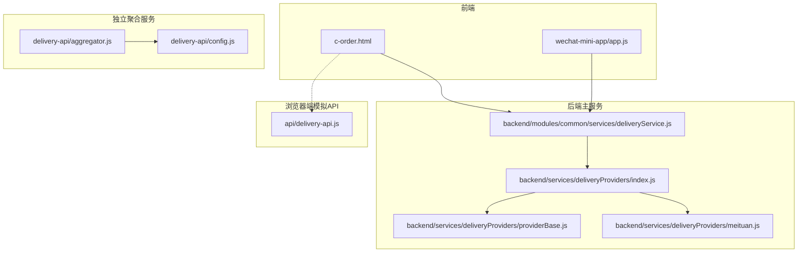
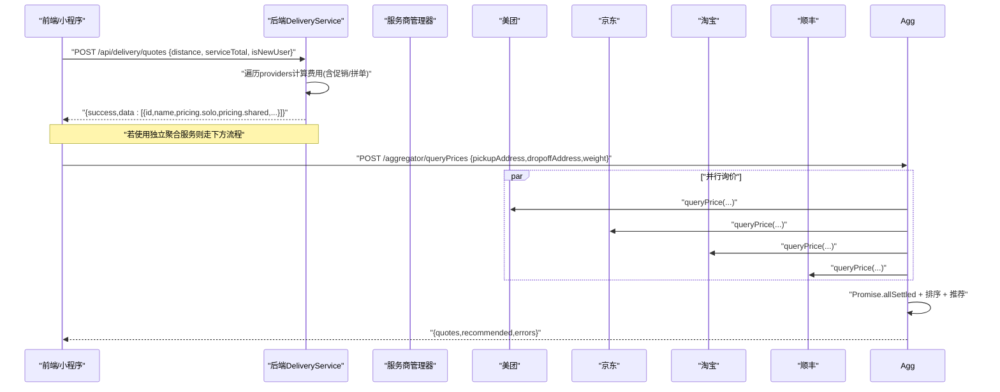
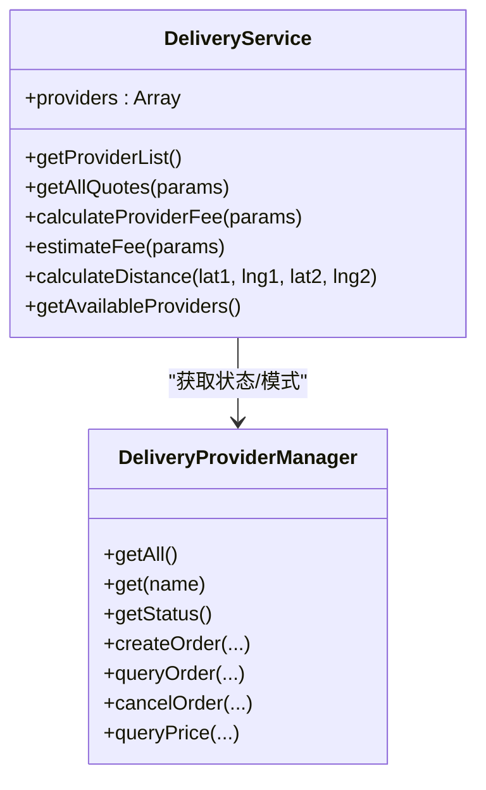
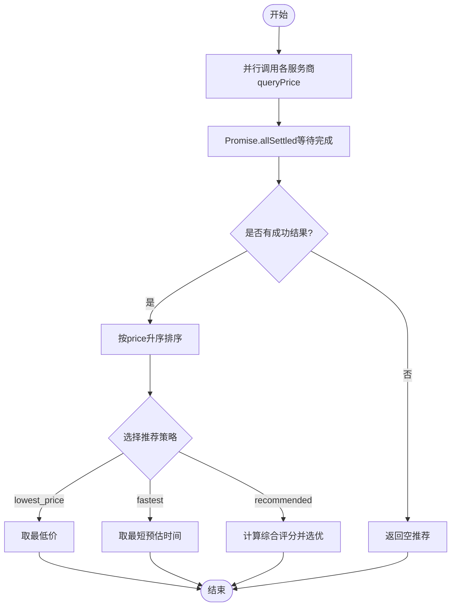
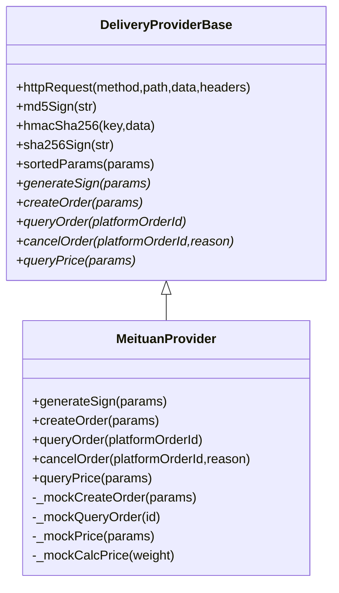
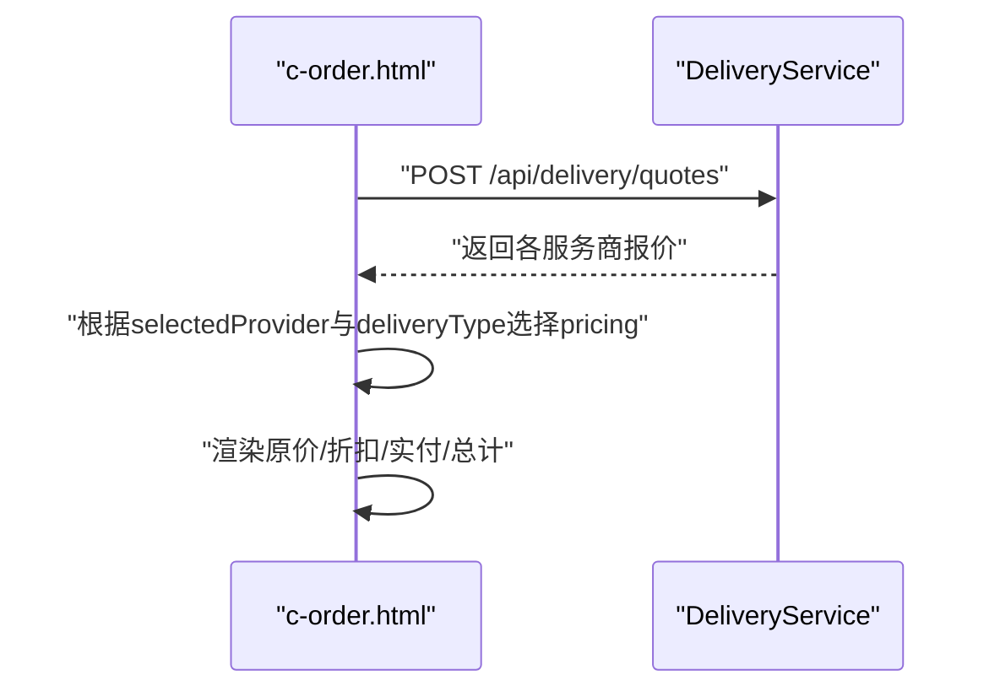
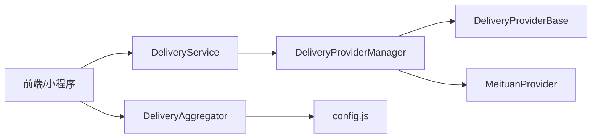

# 费用计算逻辑

<cite>
**本文引用的文件列表**
- [backend/modules/common/services/deliveryService.js](file://backend/modules/common/services/deliveryService.js)
- [backend/services/deliveryProviders/index.js](file://backend/services/deliveryProviders/index.js)
- [backend/services/deliveryProviders/providerBase.js](file://backend/services/deliveryProviders/providerBase.js)
- [backend/services/deliveryProviders/meituan.js](file://backend/services/deliveryProviders/meituan.js)
- [delivery-api/aggregator.js](file://delivery-api/aggregator.js)
- [delivery-api/config.js](file://delivery-api/config.js)
- [api/delivery-api.js](file://api/delivery-api.js)
- [c-order.html](file://c-order.html)
- [wechat-mini-app/app.js](file://wechat-mini-app/app.js)
</cite>

## 目录
1. [简介](#简介)
2. [项目结构](#项目结构)
3. [核心组件](#核心组件)
4. [架构总览](#架构总览)
5. [详细组件分析](#详细组件分析)
6. [依赖关系分析](#依赖关系分析)
7. [性能与并发特性](#性能与并发特性)
8. [定价规则与策略](#定价规则与策略)
9. [配置项说明](#配置项说明)
10. [测试与边界情况](#测试与边界情况)
11. [故障排查指南](#故障排查指南)
12. [结论](#结论)

## 简介
本文件聚焦于“配送费用计算逻辑”的完整实现，覆盖多服务商询价机制（并行查询、结果聚合与排序）、推荐算法策略选择（最低价优先、最快时效优先、综合评分推荐）、距离计算、重量计费、时段加价等定价规则、费用比较与最优选择决策过程，以及费用计算的配置选项和运营优化建议。文档同时提供单元测试示例与边界情况处理要点，帮助开发与运营人员正确理解与调优系统行为。

## 项目结构
围绕配送费用计算的核心代码分布在以下位置：
- 后端统一服务层：负责定价计算、报价聚合、距离估算、促销折扣应用等
- 服务商接入层：封装各平台API调用与Mock降级
- 独立聚合服务：用于微服务模式下的多平台并行询价与推荐
- 前端/小程序：发起询价请求并展示费用明细

图表来源
- [backend/modules/common/services/deliveryService.js:1-322](file://backend/modules/common/services/deliveryService.js#L1-L322)
- [backend/services/deliveryProviders/index.js:1-87](file://backend/services/deliveryProviders/index.js#L1-L87)
- [backend/services/deliveryProviders/providerBase.js:1-124](file://backend/services/deliveryProviders/providerBase.js#L1-L124)
- [backend/services/deliveryProviders/meituan.js:1-257](file://backend/services/deliveryProviders/meituan.js#L1-L257)
- [delivery-api/aggregator.js:1-237](file://delivery-api/aggregator.js#L1-L237)
- [delivery-api/config.js:1-93](file://delivery-api/config.js#L1-L93)
- [api/delivery-api.js:266-282](file://api/delivery-api.js#L266-L282)
- [c-order.html:1524-1832](file://c-order.html#L1524-L1832)
- [wechat-mini-app/app.js:758-799](file://wechat-mini-app/app.js#L758-L799)

章节来源
- [backend/modules/common/services/deliveryService.js:1-322](file://backend/modules/common/services/deliveryService.js#L1-L322)
- [delivery-api/aggregator.js:1-237](file://delivery-api/aggregator.js#L1-L237)
- [delivery-api/config.js:1-93](file://delivery-api/config.js#L1-L93)
- [api/delivery-api.js:266-282](file://api/delivery-api.js#L266-L282)
- [c-order.html:1524-1832](file://c-order.html#L1524-L1832)
- [wechat-mini-app/app.js:758-799](file://wechat-mini-app/app.js#L758-L799)

## 核心组件
- 配送服务类（DeliveryService）
  - 职责：获取可用服务商、计算各服务商费用（一对一/拼单）、估算时间、距离计算、兼容旧接口
  - 关键方法：getAllQuotes、calculateProviderFee、estimateFee、calculateDistance、getAvailableProviders
- 服务商管理器（DeliveryProviderManager）
  - 职责：注册/获取具体服务商实例、状态查询、统一创建/查询/取消订单、价格查询入口
- 服务商基类（DeliveryProviderBase）
  - 职责：HTTP封装、签名工具、模式判断（real/mock）、抽象接口定义
- 具体服务商（以美团为例）
  - 职责：按平台规范构造请求、签名、解析响应、失败降级为Mock
- 独立聚合器（DeliveryAggregator）
  - 职责：并行询价、错误收集、结果排序、推荐策略选择、下单路由

章节来源
- [backend/modules/common/services/deliveryService.js:117-321](file://backend/modules/common/services/deliveryService.js#L117-L321)
- [backend/services/deliveryProviders/index.js:20-87](file://backend/services/deliveryProviders/index.js#L20-L87)
- [backend/services/deliveryProviders/providerBase.js:10-124](file://backend/services/deliveryProviders/providerBase.js#L10-L124)
- [backend/services/deliveryProviders/meituan.js:15-257](file://backend/services/deliveryProviders/meituan.js#L15-L257)
- [delivery-api/aggregator.js:11-237](file://delivery-api/aggregator.js#L11-L237)

## 架构总览
下图展示了从前端到后端再到各服务商的端到端流程，包括并行询价与推荐策略。

图表来源
- [c-order.html:1524-1552](file://c-order.html#L1524-L1552)
- [backend/modules/common/services/deliveryService.js:173-181](file://backend/modules/common/services/deliveryService.js#L173-L181)
- [delivery-api/aggregator.js:54-95](file://delivery-api/aggregator.js#L54-L95)
- [backend/services/deliveryProviders/index.js:78-83](file://backend/services/deliveryProviders/index.js#L78-L83)

## 详细组件分析

### 组件A：配送服务类（DeliveryService）
- 功能要点
  - 一键获取所有服务商报价：遍历内置provider列表，逐个计算费用
  - 单个服务商费用计算：支持一对一与拼单两种模式，包含基础价、每公里价、最低起步价、拼单折扣、促销折扣、最小实付限制
  - 估算时间：基于距离线性估算
  - 距离计算：Haversine公式
  - 兼容旧接口：estimateFee返回标准化字段
- 数据结构与复杂度
  - 输入参数：距离、取送坐标、服务总价、是否新用户
  - 输出对象：包含id/name/icon/rating/distance/estimatedMinutes/pricing.solo/shared等
  - 时间复杂度：O(N)，N为服务商数量；空间复杂度：O(N)
- 依赖链
  - 依赖服务商定价配置（getProviderPricingConfig）
  - 依赖距离计算（calculateDistance）
  - 依赖服务商管理器（getAvailableProviders）

图表来源
- [backend/modules/common/services/deliveryService.js:32-321](file://backend/modules/common/services/deliveryService.js#L32-L321)
- [backend/services/deliveryProviders/index.js:20-87](file://backend/services/deliveryProviders/index.js#L20-L87)

章节来源
- [backend/modules/common/services/deliveryService.js:117-321](file://backend/modules/common/services/deliveryService.js#L117-L321)

### 组件B：独立聚合器（DeliveryAggregator）
- 功能要点
  - 并行询价：对已启用的服务商并发调用queryPrice
  - 结果聚合：收集成功结果与错误信息
  - 排序：默认按价格升序
  - 推荐策略：支持最低价优先、最快时效优先、综合评分推荐
- 推荐算法细节
  - 最低价优先：直接取排序后第一个
  - 最快时效优先：遍历比较estimateTime取最小
  - 综合评分推荐：加权评分（价格权重0.4，时效权重0.6），归一化范围假设价格≤100、时效≤60分钟
- 异常处理
  - 使用Promise.allSettled确保任一失败不影响整体
  - errors数组记录失败详情

图表来源
- [delivery-api/aggregator.js:54-129](file://delivery-api/aggregator.js#L54-L129)

章节来源
- [delivery-api/aggregator.js:54-129](file://delivery-api/aggregator.js#L54-L129)

### 组件C：服务商接入层（ProviderBase与各实现）
- 基类能力
  - HTTP封装、超时控制、MD5/HMAC-SHA256/SHA256签名、参数排序拼接
  - 运行模式判断：未配置密钥自动进入mock模式
- 美团实现要点
  - 真实API路径与签名方式
  - 失败降级：网络或业务错误时回退至Mock
  - Mock价格计算：基于重量+随机波动
- 其他服务商
  - 结构与美团类似，遵循统一接口契约

图表来源
- [backend/services/deliveryProviders/providerBase.js:10-124](file://backend/services/deliveryProviders/providerBase.js#L10-L124)
- [backend/services/deliveryProviders/meituan.js:15-257](file://backend/services/deliveryProviders/meituan.js#L15-L257)

章节来源
- [backend/services/deliveryProviders/providerBase.js:10-124](file://backend/services/deliveryProviders/providerBase.js#L10-L124)
- [backend/services/deliveryProviders/meituan.js:15-257](file://backend/services/deliveryProviders/meituan.js#L15-L257)

### 组件D：前端/小程序费用展示与交互
- 前端页面
  - 加载服务商：根据门店距离与服务总价发起询价
  - 费用计算：结合所选服务商与配送类型（一对一/拼单）显示原价、折扣、实付
  - 更新UI：动态显示优惠行与配送费明细
- 小程序
  - 调用后端接口获取实时报价，失败时回退到本地Mock数据

图表来源
- [c-order.html:1524-1832](file://c-order.html#L1524-L1832)
- [backend/modules/common/services/deliveryService.js:173-181](file://backend/modules/common/services/deliveryService.js#L173-L181)

章节来源
- [c-order.html:1524-1832](file://c-order.html#L1524-L1832)
- [wechat-mini-app/app.js:758-799](file://wechat-mini-app/app.js#L758-L799)

## 依赖关系分析
- 模块耦合
  - DeliveryService与DeliveryProviderManager松耦合，通过统一接口访问各服务商
  - 独立聚合服务与后端主服务解耦，可独立部署
- 外部依赖
  - HTTPS请求、加密库（crypto）
  - 第三方平台API（美团/京东/淘宝/顺丰）
- 潜在循环依赖
  - 当前未发现循环引用，分层清晰

图表来源
- [backend/modules/common/services/deliveryService.js:1-321](file://backend/modules/common/services/deliveryService.js#L1-L321)
- [backend/services/deliveryProviders/index.js:1-87](file://backend/services/deliveryProviders/index.js#L1-L87)
- [delivery-api/aggregator.js:1-237](file://delivery-api/aggregator.js#L1-L237)
- [delivery-api/config.js:1-93](file://delivery-api/config.js#L1-L93)

章节来源
- [backend/modules/common/services/deliveryService.js:1-321](file://backend/modules/common/services/deliveryService.js#L1-L321)
- [backend/services/deliveryProviders/index.js:1-87](file://backend/services/deliveryProviders/index.js#L1-L87)
- [delivery-api/aggregator.js:1-237](file://delivery-api/aggregator.js#L1-L237)
- [delivery-api/config.js:1-93](file://delivery-api/config.js#L1-L93)

## 性能与并发特性
- 并行询价
  - 独立聚合服务使用Promise.allSettled并发调用各服务商，避免串行阻塞
  - 错误隔离：单个失败不影响整体结果，errors数组记录详情
- 计算开销
  - 后端主服务采用纯函数计算，无外部IO，时间复杂度O(N)
  - 距离计算为常数时间操作
- 建议
  - 在高并发场景下，可对聚合器增加限流与熔断保护
  - 缓存热门路线的基础价格以减少重复计算

[本节为通用性能讨论，不直接分析具体文件]

## 定价规则与策略

### 基础定价模型
- 一对一（solo）
  - 基础价 = max(最低起步价, 基础价 + 距离 × 每公里价)
  - 促销折扣：支持新用户立减、按比例折扣、满额减、限时立减
  - 实付价 = max(1元, 基础价 - 折扣)
- 拼单（shared）
  - 拼单基础价 = solo基础价 × (1 - 拼单折扣率)
  - 拼单实付价 = max(1元, 拼单基础价 - 折扣)
- 估算时间
  - 分钟数 ≈ round(距离 × 3) + 10

章节来源
- [backend/modules/common/services/deliveryService.js:186-259](file://backend/modules/common/services/deliveryService.js#L186-L259)

### 附加费与边界规则
- 距离附加费（预留）
  - 当距离超过阈值时，按超出部分乘以单价累加
- 重量附加费（预留）
  - 当重量超过阈值时，按超出部分乘以单价累加
- 最小实付保障
  - 无论折扣多大，最终实付不低于1元

章节来源
- [api/delivery-api.js:266-282](file://api/delivery-api.js#L266-L282)
- [backend/modules/common/services/deliveryService.js:222-231](file://backend/modules/common/services/deliveryService.js#L222-L231)

### 时段加价
- 当前代码中未发现显式的时段加价逻辑
- 建议在服务商定价配置中扩展时段系数，或在聚合层叠加时段乘数

[本节为概念性补充，不直接分析具体文件]

### 推荐算法策略
- 最低价优先：适合成本敏感型用户
- 最快时效优先：适合紧急订单
- 综合评分推荐：平衡价格与时效，默认策略

章节来源
- [delivery-api/aggregator.js:102-129](file://delivery-api/aggregator.js#L102-L129)

## 配置项说明
- 服务商定价配置（后端主服务）
  - 基础价、每公里价、最低起步价、拼单折扣率、评分、促销策略（类型、金额/比例、门槛、描述）
- 独立聚合服务配置
  - 各平台启用开关、测试/生产环境凭证、回调地址、默认推荐策略、重试次数、超时时间
- 环境变量映射
  - 美团、京东、淘宝、顺丰各自的环境变量键名

章节来源
- [backend/modules/common/services/deliveryService.js:122-154](file://backend/modules/common/services/deliveryService.js#L122-L154)
- [delivery-api/config.js:10-93](file://delivery-api/config.js#L10-L93)
- [backend/services/deliveryProviders/index.js:8-13](file://backend/services/deliveryProviders/index.js#L8-L13)

## 测试与边界情况

### 单元测试示例（思路）
- 用例1：基础距离与重量
  - 输入：距离=3km，重量=1kg，serviceTotal=0，isNewUser=false
  - 预期：返回各服务商的pricing.solo与pricing.shared，且actualFee≥1
- 用例2：新用户促销
  - 输入：isNewUser=true
  - 预期：对应服务商的促销生效，discount>0
- 用例3：拼单折扣
  - 输入：deliveryType='shared'
  - 预期：shared.actualFee < solo.actualFee
- 用例4：距离附加费
  - 输入：distance>5
  - 预期：在预留逻辑下fee增加
- 用例5：重量附加费
  - 输入：weight>3
  - 预期：在预留逻辑下fee增加
- 用例6：最小实付保障
  - 输入：极大折扣
  - 预期：actualFee不小于1元
- 用例7：推荐策略
  - 输入：多条报价
  - 预期：按策略返回相应推荐

章节来源
- [backend/modules/common/services/deliveryService.js:186-259](file://backend/modules/common/services/deliveryService.js#L186-L259)
- [api/delivery-api.js:266-282](file://api/delivery-api.js#L266-L282)
- [delivery-api/aggregator.js:102-129](file://delivery-api/aggregator.js#L102-L129)

### 边界情况处理
- 无效距离或缺失坐标
  - 默认距离=3km，保证计算稳定
- 服务商不可用或网络异常
  - 聚合层记录errors，仍返回可用结果
  - 具体服务商实现失败时降级为Mock
- 零或服务总价为负
  - 前端计算total时取max(0, ...)防止负值
- 精度问题
  - 金额计算保留两位小数，避免浮点误差

章节来源
- [backend/modules/common/services/deliveryService.js:191-198](file://backend/modules/common/services/deliveryService.js#L191-L198)
- [delivery-api/aggregator.js:84-95](file://delivery-api/aggregator.js#L84-L95)
- [backend/services/deliveryProviders/meituan.js:173-182](file://backend/services/deliveryProviders/meituan.js#L173-L182)
- [c-order.html:1799-1811](file://c-order.html#L1799-L1811)

## 故障排查指南
- 常见问题
  - 服务商返回错误码：检查errors数组定位具体provider
  - 网络超时：查看providerBase的timeout设置与日志
  - 推荐为空：确认至少有一个成功报价
- 调试步骤
  - 打印各服务商返回的原始响应
  - 校验环境变量是否正确配置
  - 切换至Mock模式验证业务逻辑
- 日志关键字
  - “[配送]”、“[美团]”等前缀便于快速检索

章节来源
- [delivery-api/aggregator.js:84-95](file://delivery-api/aggregator.js#L84-L95)
- [backend/services/deliveryProviders/providerBase.js:65-74](file://backend/services/deliveryProviders/providerBase.js#L65-L74)
- [backend/services/deliveryProviders/meituan.js:86-92](file://backend/services/deliveryProviders/meituan.js#L86-L92)

## 结论
本系统实现了灵活可扩展的多服务商配送费用计算与推荐体系。后端主服务侧重纯业务计算与兼容性，独立聚合服务侧重并发与策略选择。通过清晰的配置项与完善的Mock降级机制，既满足开发测试需求，也具备生产可用性。运营人员可通过调整基础价、附加费阈值、拼单折扣与促销策略，持续优化成本与用户体验。