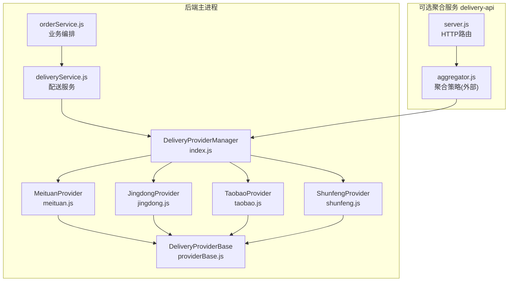
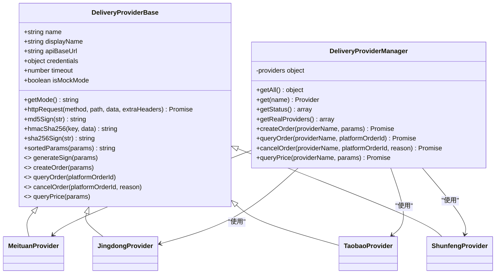
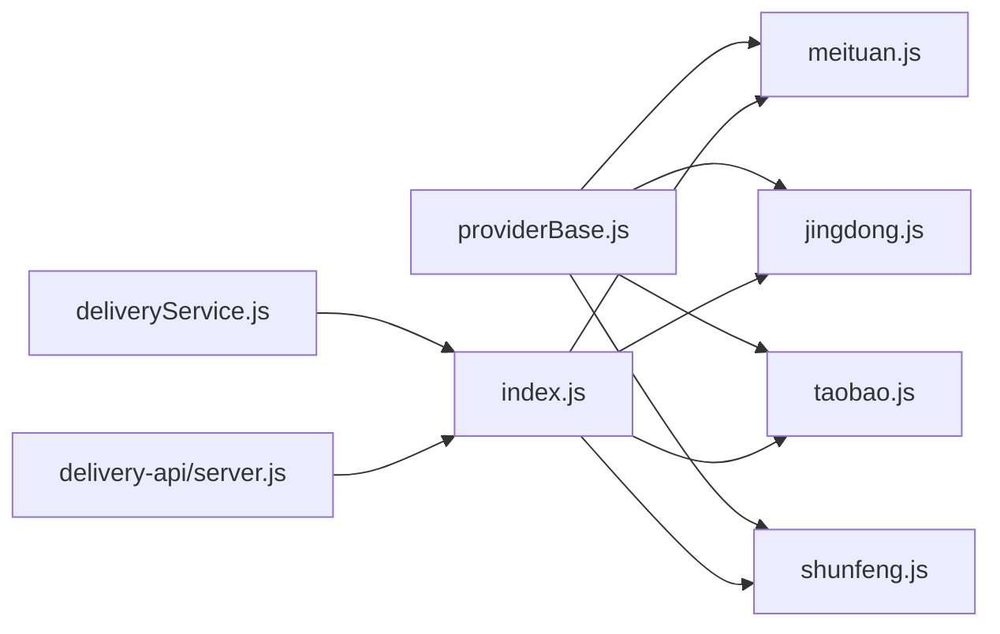

# Provider基类设计

<cite>
**本文引用的文件列表**
- [providerBase.js](file://backend/services/deliveryProviders/providerBase.js)
- [index.js](file://backend/services/deliveryProviders/index.js)
- [meituan.js](file://backend/services/deliveryProviders/meituan.js)
- [jingdong.js](file://backend/services/deliveryProviders/jingdong.js)
- [taobao.js](file://backend/services/deliveryProviders/taobao.js)
- [shunfeng.js](file://backend/services/deliveryProviders/shunfeng.js)
- [deliveryService.js](file://backend/modules/common/services/deliveryService.js)
- [config.js](file://delivery-api/config.js)
- [server.js](file://delivery-api/server.js)
- [test-api.js](file://delivery-api/test-api.js)
</cite>

## 目录
1. [引言](#引言)
2. [项目结构](#项目结构)
3. [核心组件](#核心组件)
4. [架构总览](#架构总览)
5. [详细组件分析](#详细组件分析)
6. [依赖关系分析](#依赖关系分析)
7. [性能与可用性](#性能与可用性)
8. [故障排查指南](#故障排查指南)
9. [结论](#结论)
10. [附录：快速接入模板](#附录快速接入模板)

## 引言
本设计文档围绕“配送服务商基类”展开，聚焦于统一接口、生命周期管理、配置机制、异常处理、日志与监控、测试与Mock，以及基于基类快速扩展新服务商的完整方案。通过抽象出Provider基类，为美团、京东秒送（达达）、淘宝闪送（蜂鸟）、顺丰同城等提供一致的编程模型，屏蔽底层差异，提升可维护性与可扩展性。

## 项目结构
后端采用分层组织：
- 服务层：common模块中的业务编排（如订单服务）调用配送服务
- 配送服务：统一入口聚合各Provider实现
- Provider实现：每个服务商一个具体类，继承自基类
- 独立聚合服务：delivery-api作为可选微服务，提供HTTP API并复用相同Provider能力

图示来源
- [deliveryService.js:1-120](file://backend/modules/common/services/deliveryService.js#L1-L120)
- [index.js:1-87](file://backend/services/deliveryProviders/index.js#L1-L87)
- [meituan.js:1-60](file://backend/services/deliveryProviders/meituan.js#L1-L60)
- [jingdong.js:1-60](file://backend/services/deliveryProviders/jingdong.js#L1-L60)
- [taobao.js:1-60](file://backend/services/deliveryProviders/taobao.js#L1-L60)
- [shunfeng.js:1-60](file://backend/services/deliveryProviders/shunfeng.js#L1-L60)
- [providerBase.js:1-124](file://backend/services/deliveryProviders/providerBase.js#L1-L124)
- [server.js:52-238](file://delivery-api/server.js#L52-L238)

章节来源
- [deliveryService.js:1-120](file://backend/modules/common/services/deliveryService.js#L1-L120)
- [index.js:1-87](file://backend/services/deliveryProviders/index.js#L1-L87)

## 核心组件
- DeliveryProviderBase：定义统一的HTTP请求封装、签名工具、参数排序方法，以及必须实现的抽象接口（生成签名、创建订单、查询状态、取消订单、询价）。
- DeliveryProviderManager：集中注册与分发各Provider实例，暴露统一API，支持获取状态、真实提供商列表等。
- 具体Provider实现：美团、京东秒送、淘宝闪送、顺丰同城各自实现签名算法与平台特定字段映射，同时内置Mock模式以保障无密钥时的开发体验。
- DeliveryService：业务编排层，负责将上层订单数据标准化后转发至ProviderManager，并对返回结果做兼容转换。

章节来源
- [providerBase.js:10-124](file://backend/services/deliveryProviders/providerBase.js#L10-L124)
- [index.js:20-87](file://backend/services/deliveryProviders/index.js#L20-L87)
- [deliveryService.js:32-115](file://backend/modules/common/services/deliveryService.js#L32-L115)

## 架构总览
Provider基类通过“统一接口 + 多态实现”的方式，屏蔽不同平台的差异。Manager作为门面，对外暴露一致的方法；业务层仅依赖Manager与基类契约，无需关心具体平台细节。

图示来源
- [providerBase.js:10-124](file://backend/services/deliveryProviders/providerBase.js#L10-L124)
- [index.js:20-87](file://backend/services/deliveryProviders/index.js#L20-L87)
- [meituan.js:15-45](file://backend/services/deliveryProviders/meituan.js#L15-L45)
- [jingdong.js:17-45](file://backend/services/deliveryProviders/jingdong.js#L17-L45)
- [taobao.js:22-45](file://backend/services/deliveryProviders/taobao.js#L22-L45)
- [shunfeng.js:15-45](file://backend/services/deliveryProviders/shunfeng.js#L15-L45)

## 详细组件分析

### Provider基类（DeliveryProviderBase）
- 职责
  - 统一HTTPS请求封装，含超时、错误处理与JSON解析容错
  - 通用签名工具：MD5、HMAC-SHA256、SHA256、参数排序拼接
  - 抽象接口约束：generateSign、createOrder、queryOrder、cancelOrder、queryPrice
- 关键设计点
  - 构造时根据credentials判断是否进入mock模式，便于本地开发与联调
  - httpRequest对非JSON响应进行兜底，避免上游格式不一致导致崩溃
  - 所有子类必须实现抽象方法，否则在运行时抛出明确错误

章节来源
- [providerBase.js:10-124](file://backend/services/deliveryProviders/providerBase.js#L10-L124)

### 统一入口（DeliveryProviderManager）
- 职责
  - 集中注册四家Provider实例
  - 对外暴露统一方法：创建订单、查询状态、取消订单、询价
  - 提供状态查询与真实提供商列表，便于健康检查与前端展示
- 关键设计点
  - get/getAll用于按名称检索或枚举全部Provider
  - getStatus返回每个Provider的名称、运行模式与凭证状态
  - 未知Provider时返回明确的错误信息，避免上层误用

章节来源
- [index.js:20-87](file://backend/services/deliveryProviders/index.js#L20-L87)

### 具体Provider实现要点
- 美团跑腿
  - 签名：appId + timestamp + secret 的MD5
  - 下单/查询/取消/询价均遵循统一返回结构，失败时降级到Mock
- 京东秒送（达达）
  - 签名：参数排序拼接后追加appSecret取MD5大写
  - 自定义_dadaRequest适配达达平台请求体格式
  - 状态码映射到统一内部状态
- 淘宝闪送（蜂鸟）
  - 签名：sortedParams + secret 的MD5
  - 重量单位换算为克
  - 状态字符串映射到统一内部状态
- 顺丰同城
  - 签名：timestamp + checkWord 的MD5
  - 请求ID生成器保证幂等追踪
  - 状态码映射到统一内部状态

章节来源
- [meituan.js:15-93](file://backend/services/deliveryProviders/meituan.js#L15-L93)
- [jingdong.js:17-122](file://backend/services/deliveryProviders/jingdong.js#L17-L122)
- [taobao.js:22-130](file://backend/services/deliveryProviders/taobao.js#L22-L130)
- [shunfeng.js:15-125](file://backend/services/deliveryProviders/shunfeng.js#L15-L125)

### 业务编排（DeliveryService）
- 职责
  - 将上层订单数据标准化后转发给ProviderManager
  - 对返回结果做兼容转换，保持旧接口稳定
  - 提供定价计算、报价排序、距离估算等纯业务逻辑
- 关键设计点
  - PROVIDER_MAP兼容历史命名
  - getAvailableProviders结合ProviderManager的状态信息，向上层暴露可用能力

章节来源
- [deliveryService.js:32-115](file://backend/modules/common/services/deliveryService.js#L32-L115)
- [deliveryService.js:305-318](file://backend/modules/common/services/deliveryService.js#L305-L318)

### 统一接口设计理念
- 面向契约编程：上层仅依赖基类抽象与Manager门面，不感知具体平台差异
- 统一返回结构：success、platformOrderId、status、driver、price、estimateTime等字段在各Provider中保持一致
- 模式切换：isMockMode自动选择真实API或模拟数据，降低联调成本

章节来源
- [providerBase.js:105-121](file://backend/services/deliveryProviders/providerBase.js#L105-L121)
- [index.js:57-83](file://backend/services/deliveryProviders/index.js#L57-L83)

### 生命周期管理
- 初始化
  - 构造函数读取环境变量注入credentials与apiBaseUrl，设置默认超时
  - 根据是否存在有效凭证自动判定mock模式
- 连接池
  - 当前实现基于Node原生https发起单次请求，未显式实现连接池
  - 建议：引入Agent或HTTP客户端库（如axios）复用TCP连接，减少握手开销
- 健康检查
  - Manager提供getStatus与getRealProviders，可用于健康检查与路由决策
  - delivery-api server.js提供/api/health端点，汇总可用Provider
- 资源清理
  - 当前未显式实现销毁钩子；建议在进程退出前关闭持久化连接或释放定时器

章节来源
- [index.js:40-55](file://backend/services/deliveryProviders/index.js#L40-L55)
- [server.js:205-212](file://delivery-api/server.js#L205-L212)

### 配置管理机制
- 环境变量驱动
  - 各Provider从process.env读取对应密钥与URL，支持沙箱/生产环境切换
  - delivery-api/config.js集中管理多环境配置，包含重试次数、超时、回调地址等
- 动态参数更新
  - 当前为静态加载；可通过热重载或配置中心（如Redis/Nacos）配合进程重启或内存替换实现动态更新
- 推荐实践
  - 将敏感配置放入安全存储（密钥管理服务），启动时拉取并缓存
  - 增加配置校验与告警，缺失必填项时快速失败

章节来源
- [meituan.js:17-28](file://backend/services/deliveryProviders/meituan.js#L17-L28)
- [jingdong.js:19-31](file://backend/services/deliveryProviders/jingdong.js#L19-L31)
- [taobao.js:24-36](file://backend/services/deliveryProviders/taobao.js#L24-L36)
- [shunfeng.js:17-28](file://backend/services/deliveryProviders/shunfeng.js#L17-L28)
- [config.js:1-93](file://delivery-api/config.js#L1-L93)

### 异常处理框架
- 统一错误码与消息
  - 各Provider在失败路径返回{ success:false, error, code? }，上层可据此分类处理
- 降级策略
  - 当真实API调用异常时，部分Provider会回退到Mock，确保流程继续
- 建议增强
  - 定义全局错误码字典（如NETWORK_TIMEOUT、SIGNATURE_INVALID、PLATFORM_ERROR）
  - 在Manager层统一捕获并格式化错误，附加traceId便于追踪

章节来源
- [meituan.js:73-93](file://backend/services/deliveryProviders/meituan.js#L73-L93)
- [jingdong.js:75-98](file://backend/services/deliveryProviders/jingdong.js#L75-L98)
- [taobao.js:79-99](file://backend/services/deliveryProviders/taobao.js#L79-L99)
- [shunfeng.js:75-95](file://backend/services/deliveryProviders/shunfeng.js#L75-L95)

### 日志记录与监控指标
- 现状
  - 使用console.error输出关键失败路径
  - delivery-api test-api.js提供端到端测试脚本
- 建议方案
  - 引入结构化日志（如pino），按级别输出，附带上下文（provider、orderId、traceId）
  - 埋点指标：请求耗时、成功率、失败原因分布、Mock比例、价格查询耗时
  - 健康检查端点暴露关键指标（如最近N次调用成功率）

章节来源
- [server.js:52-83](file://delivery-api/server.js#L52-L83)
- [test-api.js:1-174](file://delivery-api/test-api.js#L1-L174)

### 单元测试与Mock对象
- 现有测试
  - delivery-api/test-api.js覆盖健康检查、服务商列表、询价、下单、查询、取消等流程
- Mock对象创建方法
  - 利用Provider的Mock模式：不配置密钥即可触发模拟数据
  - 针对具体方法编写断言，验证返回结构与边界条件
- 建议
  - 为每个Provider编写单测，覆盖成功、失败、超时、签名错误等场景
  - 使用测试夹具固定时间戳与随机种子，保证用例稳定

章节来源
- [test-api.js:1-174](file://delivery-api/test-api.js#L1-L174)

## 依赖关系分析

图示来源
- [providerBase.js:10-124](file://backend/services/deliveryProviders/providerBase.js#L10-L124)
- [index.js:20-87](file://backend/services/deliveryProviders/index.js#L20-L87)
- [deliveryService.js:32-115](file://backend/modules/common/services/deliveryService.js#L32-L115)
- [server.js:52-238](file://delivery-api/server.js#L52-L238)

章节来源
- [index.js:20-87](file://backend/services/deliveryProviders/index.js#L20-L87)
- [deliveryService.js:32-115](file://backend/modules/common/services/deliveryService.js#L32-L115)

## 性能与可用性
- 网络I/O
  - 当前每次请求新建连接，建议启用连接复用（Agent/HTTP客户端库）
  - 合理设置timeout与重试策略，避免雪崩
- 并发与限流
  - 在高并发场景下，考虑对第三方API进行令牌桶限流与熔断
- 降级与弹性
  - 已实现Mock降级；建议增加开关与灰度发布能力
- 可观测性
  - 增加延迟分位统计、错误率、下游依赖健康度等指标

[本节为通用指导，不直接分析具体文件]

## 故障排查指南
- 常见问题定位
  - 凭证缺失：getStatus显示mode=mock，确认环境变量是否注入
  - 签名失败：核对签名算法与参数顺序，参考各Provider的generateSign实现
  - 超时/网络错误：检查超时配置与网络连通性，必要时开启重试
  - 状态不一致：查看Provider状态映射表，确认平台状态码与内部状态对应关系
- 诊断步骤
  - 使用/api/health检查服务状态
  - 使用test-api.js执行端到端用例，观察失败路径日志
  - 在Provider层打印payload与response，对比平台文档

章节来源
- [index.js:40-55](file://backend/services/deliveryProviders/index.js#L40-L55)
- [server.js:205-212](file://delivery-api/server.js#L205-L212)
- [test-api.js:1-174](file://delivery-api/test-api.js#L1-L174)

## 结论
Provider基类通过统一接口与Mock模式，显著降低了多平台对接复杂度，提升了系统可维护性与扩展性。建议进一步完善连接池、结构化日志、监控指标与更完善的错误码体系，以提升稳定性与可观测性。

[本节为总结，不直接分析具体文件]

## 附录：快速接入模板
以下为新服务商接入的步骤与要点，基于现有基类与管理器即可快速落地：

- 新增Provider类
  - 继承DeliveryProviderBase，实现generateSign、createOrder、queryOrder、cancelOrder、queryPrice
  - 在构造函数中设置name、displayName、apiBaseUrl、credentials、timeout
  - 实现平台特定的状态映射与Mock方法（_mockCreateOrder/_mockQueryOrder/_mockPrice）
- 注册到管理器
  - 在index.js中引入新Provider并在providers对象中注册
  - 如需对外暴露，可在DeliveryService的providers数组中添加
- 配置与环境变量
  - 在Provider构造函数中读取环境变量，或在delivery-api/config.js中补充多环境配置
- 测试与Mock
  - 不配置密钥即进入Mock模式，便于本地联调
  - 编写单测覆盖成功、失败、超时、签名错误等场景
- 示例路径参考
  - 基类与抽象接口：[providerBase.js:10-124](file://backend/services/deliveryProviders/providerBase.js#L10-L124)
  - 管理器注册与分发：[index.js:20-87](file://backend/services/deliveryProviders/index.js#L20-L87)
  - 具体实现参考：[meituan.js:15-93](file://backend/services/deliveryProviders/meituan.js#L15-L93)、[jingdong.js:17-122](file://backend/services/deliveryProviders/jingdong.js#L17-L122)、[taobao.js:22-130](file://backend/services/deliveryProviders/taobao.js#L22-L130)、[shunfeng.js:15-125](file://backend/services/deliveryProviders/shunfeng.js#L15-L125)
  - 业务编排与可用Provider：[deliveryService.js:32-115](file://backend/modules/common/services/deliveryService.js#L32-L115)、[deliveryService.js:305-318](file://backend/modules/common/services/deliveryService.js#L305-L318)
  - 健康检查与测试脚本：[server.js:205-212](file://delivery-api/server.js#L205-L212)、[test-api.js:1-174](file://delivery-api/test-api.js#L1-L174)

章节来源
- [providerBase.js:10-124](file://backend/services/deliveryProviders/providerBase.js#L10-L124)
- [index.js:20-87](file://backend/services/deliveryProviders/index.js#L20-L87)
- [deliveryService.js:32-115](file://backend/modules/common/services/deliveryService.js#L32-L115)
- [server.js:205-212](file://delivery-api/server.js#L205-L212)
- [test-api.js:1-174](file://delivery-api/test-api.js#L1-L174)