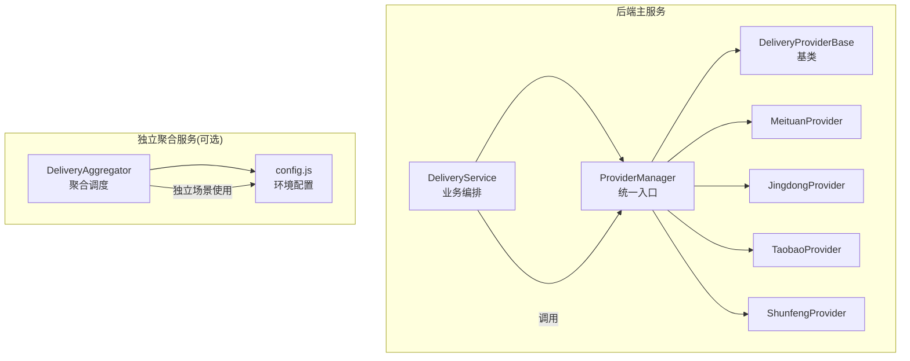
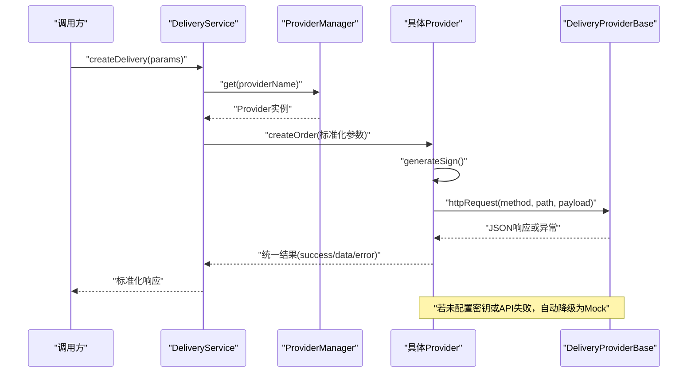
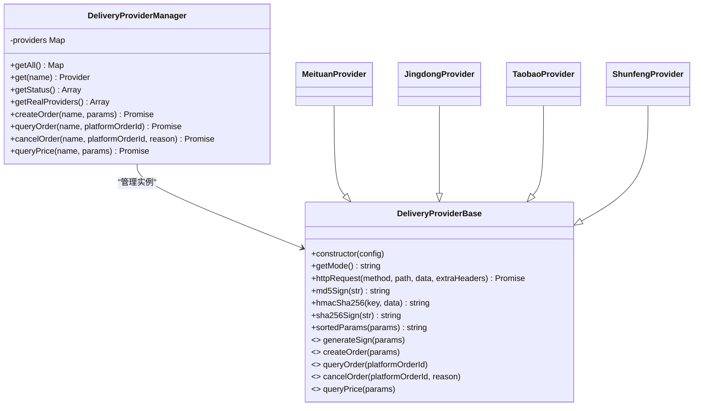
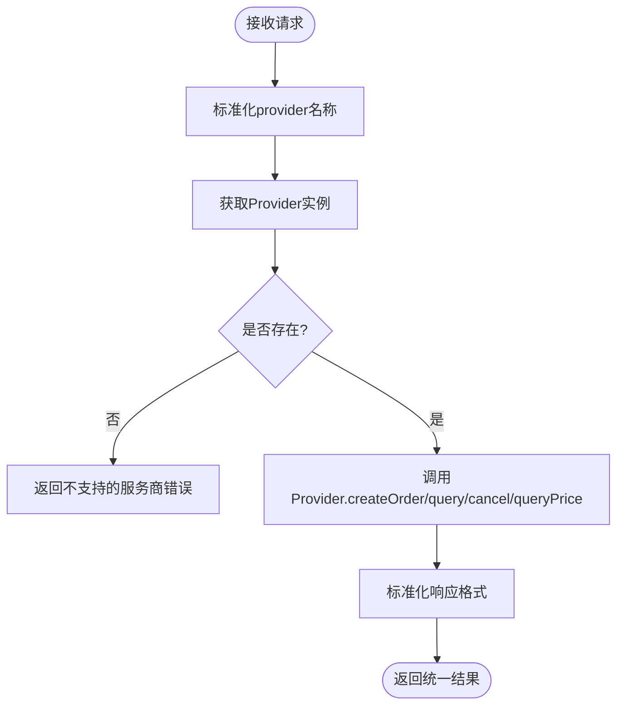
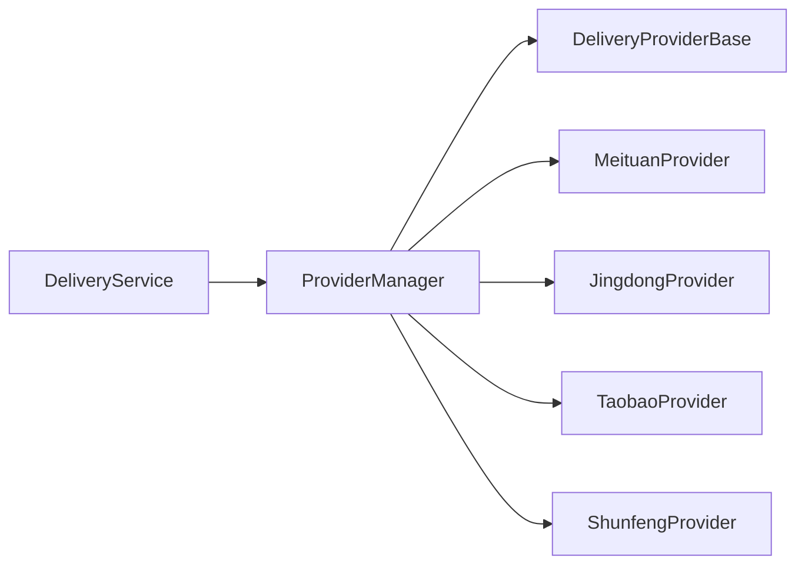

# 新服务商接入指南

<cite>
**本文引用的文件**   
- [backend/services/deliveryProviders/providerBase.js](file://backend/services/deliveryProviders/providerBase.js)
- [backend/services/deliveryProviders/index.js](file://backend/services/deliveryProviders/index.js)
- [backend/services/deliveryProviders/meituan.js](file://backend/services/deliveryProviders/meituan.js)
- [backend/services/deliveryProviders/jingdong.js](file://backend/services/deliveryProviders/jingdong.js)
- [backend/services/deliveryProviders/taobao.js](file://backend/services/deliveryProviders/taobao.js)
- [backend/services/deliveryProviders/shunfeng.js](file://backend/services/deliveryProviders/shunfeng.js)
- [backend/modules/common/services/deliveryService.js](file://backend/modules/common/services/deliveryService.js)
- [delivery-api/aggregator.js](file://delivery-api/aggregator.js)
- [delivery-api/config.js](file://delivery-api/config.js)
- [api/delivery-api.js](file://api/delivery-api.js)
- [backend/package.json](file://backend/package.json)
</cite>

## 目录
1. [引言](#引言)
2. [项目结构](#项目结构)
3. [核心组件](#核心组件)
4. [架构总览](#架构总览)
5. [详细组件分析](#详细组件分析)
6. [依赖关系分析](#依赖关系分析)
7. [性能与稳定性](#性能与稳定性)
8. [测试与验证](#测试与验证)
9. [部署上线与回滚](#部署上线与回滚)
10. [运维监控与告警](#运维监控与告警)
11. [常见问题排查](#常见问题排查)
12. [结论](#结论)
13. [附录：模板与示例](#附录模板与示例)

## 引言
本指南面向需要从零接入新的配送服务商的开发者，覆盖需求分析、技术评估、方案设计、标准化接入步骤、配置与环境变量管理、测试验证、性能与压力测试、部署上线检查清单与回滚策略、运维监控与告警、常见问题排查，以及代码模板与示例项目路径。目标是帮助团队快速、稳定地扩展配送能力，确保多服务商统一接入与可观测性。

## 项目结构
本项目采用“服务提供者抽象 + 统一入口 + 业务编排”的分层设计：
- 基础抽象层：提供统一的HTTP请求、签名算法、响应标准化等通用能力
- 具体服务商实现：各平台（美团、京东秒送、淘宝闪送、顺丰同城）继承基类并实现差异化的签名与API调用
- 统一入口与管理器：集中注册、获取、状态查询与路由分发
- 业务编排层：负责定价计算、报价排序、参数标准化与对外接口适配
- 独立聚合服务（可选）：作为微服务运行时的聚合调度器与配置中心

图示来源
- [backend/modules/common/services/deliveryService.js:1-120](file://backend/modules/common/services/deliveryService.js#L1-L120)
- [backend/services/deliveryProviders/index.js:1-87](file://backend/services/deliveryProviders/index.js#L1-L87)
- [backend/services/deliveryProviders/providerBase.js:1-124](file://backend/services/deliveryProviders/providerBase.js#L1-L124)
- [delivery-api/aggregator.js:1-120](file://delivery-api/aggregator.js#L1-L120)
- [delivery-api/config.js:1-93](file://delivery-api/config.js#L1-L93)

章节来源
- [backend/modules/common/services/deliveryService.js:1-120](file://backend/modules/common/services/deliveryService.js#L1-L120)
- [backend/services/deliveryProviders/index.js:1-87](file://backend/services/deliveryProviders/index.js#L1-L87)
- [backend/services/deliveryProviders/providerBase.js:1-124](file://backend/services/deliveryProviders/providerBase.js#L1-L124)
- [delivery-api/aggregator.js:1-120](file://delivery-api/aggregator.js#L1-L120)
- [delivery-api/config.js:1-93](file://delivery-api/config.js#L1-L93)

## 核心组件
- 配送服务商基类：封装HTTPS请求、超时控制、MD5/HMAC-SHA256/SHA256签名、参数排序拼接、模式判断（真实/模拟）
- 统一入口管理器：注册所有提供商实例，提供创建订单、查询状态、取消订单、查询价格、状态汇总等方法
- 具体服务商实现：各自实现签名算法、下单/查询/取消/询价接口，并在无密钥时自动降级为Mock数据
- 业务编排服务：将外部参数标准化、选择服务商、调用底层Provider、返回统一格式；同时内置定价与拼单逻辑
- 独立聚合服务（可选）：在独立部署场景下，按策略并行询价、推荐最优服务商并下单

章节来源
- [backend/services/deliveryProviders/providerBase.js:1-124](file://backend/services/deliveryProviders/providerBase.js#L1-L124)
- [backend/services/deliveryProviders/index.js:1-87](file://backend/services/deliveryProviders/index.js#L1-L87)
- [backend/modules/common/services/deliveryService.js:1-120](file://backend/modules/common/services/deliveryService.js#L1-L120)
- [delivery-api/aggregator.js:1-120](file://delivery-api/aggregator.js#L1-L120)

## 架构总览
下图展示了从业务层到具体服务商的调用链路与数据流向，包括错误降级与Mock模式切换。

图示来源
- [backend/modules/common/services/deliveryService.js:45-70](file://backend/modules/common/services/deliveryService.js#L45-L70)
- [backend/services/deliveryProviders/index.js:57-62](file://backend/services/deliveryProviders/index.js#L57-L62)
- [backend/services/deliveryProviders/providerBase.js:35-74](file://backend/services/deliveryProviders/providerBase.js#L35-L74)
- [backend/services/deliveryProviders/meituan.js:41-93](file://backend/services/deliveryProviders/meituan.js#L41-L93)

## 详细组件分析

### 基类与统一入口
- 基类职责
  - 统一HTTPS请求封装，支持超时与错误处理
  - 提供常用签名方法（MD5、HMAC-SHA256、SHA256）与参数排序拼接
  - 定义抽象接口：生成签名、创建订单、查询状态、取消订单、查询价格
- 管理器职责
  - 维护已注册的Provider实例集合
  - 暴露统一方法：创建订单、查询状态、取消订单、查询价格
  - 提供状态信息：是否真实模式、是否已配置密钥

图示来源
- [backend/services/deliveryProviders/providerBase.js:10-121](file://backend/services/deliveryProviders/providerBase.js#L10-L121)
- [backend/services/deliveryProviders/index.js:20-84](file://backend/services/deliveryProviders/index.js#L20-L84)
- [backend/services/deliveryProviders/meituan.js:15-35](file://backend/services/deliveryProviders/meituan.js#L15-L35)
- [backend/services/deliveryProviders/jingdong.js:17-31](file://backend/services/deliveryProviders/jingdong.js#L17-L31)
- [backend/services/deliveryProviders/taobao.js:22-36](file://backend/services/deliveryProviders/taobao.js#L22-L36)
- [backend/services/deliveryProviders/shunfeng.js:15-28](file://backend/services/deliveryProviders/shunfeng.js#L15-L28)

章节来源
- [backend/services/deliveryProviders/providerBase.js:1-124](file://backend/services/deliveryProviders/providerBase.js#L1-124)
- [backend/services/deliveryProviders/index.js:1-87](file://backend/services/deliveryProviders/index.js#L1-87)

### 具体服务商实现要点
- 美团跑腿
  - 签名：appId + timestamp + secret 的 MD5
  - 下单接口：POST /api/order/createByShop
  - 查询接口：POST /api/order/status/query
  - 取消接口：POST /api/order/delete
  - 询价接口：POST /api/order/deliveryFee
  - Mock：无密钥时返回合理模拟数据
- 京东秒送（达达开放平台）
  - 签名：参数排序后拼接，末尾加secret，取MD5大写
  - 下单接口：POST /api/order/addOrder
  - 查询接口：POST /api/order/status/query
  - 取消接口：POST /api/order/formalCancel
  - 询价接口：POST /api/order/queryDeliverFee
  - Mock：无密钥时返回合理模拟数据
- 淘宝闪送（蜂鸟即配）
  - 签名：参数排序拼接后 + secret 的 MD5
  - 下单接口：POST /anmp/api/v2/order/create
  - 查询接口：POST /anmp/api/v2/order/query
  - 取消接口：POST /anmp/api/v2/order/cancel
  - 询价接口：POST /anmp/api/v2/order/queryFee
  - Mock：无密钥时返回合理模拟数据
- 顺丰同城
  - 签名：timestamp + checkWord 的 MD5
  - 下单接口：POST /api/v1/order/create
  - 查询接口：POST /api/v1/order/query
  - 取消接口：POST /api/v1/order/cancel
  - 询价接口：POST /api/v1/order/preCreate
  - Mock：无密钥时返回合理模拟数据

章节来源
- [backend/services/deliveryProviders/meituan.js:30-182](file://backend/services/deliveryProviders/meituan.js#L30-L182)
- [backend/services/deliveryProviders/jingdong.js:33-174](file://backend/services/deliveryProviders/jingdong.js#L33-L174)
- [backend/services/deliveryProviders/taobao.js:38-190](file://backend/services/deliveryProviders/taobao.js#L38-L190)
- [backend/services/deliveryProviders/shunfeng.js:30-184](file://backend/services/deliveryProviders/shunfeng.js#L30-L184)

### 业务编排与对外接口
- 参数标准化：将旧系统传入的provider别名映射为新键名
- 统一调用：根据provider名称获取对应Provider实例并调用其方法
- 响应标准化：将不同平台的响应转换为统一结构，便于上层消费
- 定价与报价：内置一对一与拼单两种计费模型，支持促销规则与距离估算
- 可用服务商列表：结合Provider状态与定价配置，返回前端展示所需字段

图示来源
- [backend/modules/common/services/deliveryService.js:32-115](file://backend/modules/common/services/deliveryService.js#L32-L115)
- [backend/modules/common/services/deliveryService.js:173-259](file://backend/modules/common/services/deliveryService.js#L173-L259)

章节来源
- [backend/modules/common/services/deliveryService.js:1-322](file://backend/modules/common/services/deliveryService.js#L1-322)

### 独立聚合服务（可选）
- 初始化：根据配置文件启用各服务商
- 并行询价：并发调用各服务商询价接口，收集成功结果并按策略排序
- 推荐策略：最低价、最快、综合评分
- 下单：优先使用指定服务商，否则基于推荐结果下单

章节来源
- [delivery-api/aggregator.js:1-237](file://delivery-api/aggregator.js#L1-L237)
- [delivery-api/config.js:1-93](file://delivery-api/config.js#L1-L93)

## 依赖关系分析
- 模块耦合
  - DeliveryService 依赖 ProviderManager，ProviderManager 持有各Provider实例
  - 各Provider均继承自基类，复用HTTP与签名能力
- 外部依赖
  - Node.js https 原生模块用于HTTP请求
  - crypto 模块用于签名
  - dotenv 用于环境变量加载（见package.json脚本）
- 潜在循环依赖
  - 当前结构清晰，未见循环引用风险

图示来源
- [backend/modules/common/services/deliveryService.js:1-120](file://backend/modules/common/services/deliveryService.js#L1-L120)
- [backend/services/deliveryProviders/index.js:1-87](file://backend/services/deliveryProviders/index.js#L1-L87)
- [backend/services/deliveryProviders/providerBase.js:1-124](file://backend/services/deliveryProviders/providerBase.js#L1-L124)

章节来源
- [backend/package.json:1-43](file://backend/package.json#L1-L43)

## 性能与稳定性
- 并发与超时
  - 各Provider内部设置超时时间，避免长时间阻塞
  - 独立聚合服务使用Promise.allSettled进行并行询价，提升整体吞吐
- 降级与容错
  - 未配置密钥或API异常时自动降级为Mock，保障开发联调与演示可用性
  - 建议在生产环境增加重试与熔断机制（可在Provider层扩展）
- 资源与连接
  - 使用原生https模块，注意在高并发场景下考虑连接池与限流
- 指标采集
  - 建议在关键路径埋点：下单耗时、成功率、错误码分布、Mock切换次数

[本节为通用指导，不直接分析具体文件]

## 测试与验证
- 单元测试
  - 对基类的签名方法与参数排序进行断言
  - 对各Provider的Mock路径进行覆盖，确保无密钥时行为一致
- 集成测试
  - 使用沙箱环境配置真实密钥，验证下单、查询、取消、询价全流程
  - 校验响应标准化后的字段完整性
- 端到端测试
  - 通过DeliveryService对外接口发起完整流程，验证从业务层到Provider层的链路
- 自动化与回归
  - 将用例纳入CI流水线，每次变更执行冒烟与回归测试

章节来源
- [backend/modules/common/services/deliveryService.js:1-120](file://backend/modules/common/services/deliveryService.js#L1-L120)
- [backend/services/deliveryProviders/meituan.js:212-253](file://backend/services/deliveryProviders/meituan.js#L212-L253)
- [backend/services/deliveryProviders/jingdong.js:234-274](file://backend/services/deliveryProviders/jingdong.js#L234-L274)
- [backend/services/deliveryProviders/taobao.js:219-259](file://backend/services/deliveryProviders/taobao.js#L219-L259)
- [backend/services/deliveryProviders/shunfeng.js:218-258](file://backend/services/deliveryProviders/shunfeng.js#L218-L258)

## 部署上线与回滚
- 上线检查清单
  - 环境变量：确认各服务商生产密钥与回调地址正确配置
  - 域名与证书：确保回调URL公网可达且TLS有效
  - 灰度策略：先小流量灰度，观察错误率与延迟
  - 监控与告警：确认日志、指标、告警规则生效
- 回滚策略
  - 版本化Provider实现，保留上一版本快照
  - 开关控制：通过配置项快速切换至旧版本或关闭新服务商
  - 数据一致性：下单失败需幂等补偿，避免重复下单

章节来源
- [delivery-api/config.js:10-92](file://delivery-api/config.js#L10-L92)

## 运维监控与告警
- 日志收集
  - 记录关键事件：下单成功/失败、查询/取消结果、Mock切换、API异常
  - 结构化输出，包含provider、orderId、platformOrderId、耗时、错误码
- 指标采集
  - 成功率、P95/P99延迟、错误分类统计、Mock占比
- 告警规则
  - 下单失败率超过阈值
  - API超时比例升高
  - Mock模式持续触发（可能意味着密钥缺失）
- 健康检查
  - 提供健康检查接口，返回各Provider状态与模式

章节来源
- [backend/modules/common/services/deliveryService.js:63-70](file://backend/modules/common/services/deliveryService.js#L63-L70)
- [backend/services/deliveryProviders/meituan.js:86-92](file://backend/services/deliveryProviders/meituan.js#L86-L92)
- [backend/services/deliveryProviders/jingdong.js:92-97](file://backend/services/deliveryProviders/jingdong.js#L92-L97)
- [backend/services/deliveryProviders/taobao.js:93-98](file://backend/services/deliveryProviders/taobao.js#L93-L98)
- [backend/services/deliveryProviders/shunfeng.js:89-94](file://backend/services/deliveryProviders/shunfeng.js#L89-L94)

## 常见问题排查
- 签名失败
  - 核对签名算法与参数顺序，确认密钥是否正确
  - 对比官方文档的签名示例
- 下单失败
  - 检查必填字段（取件/收件人、经纬度、重量等）
  - 查看错误码与消息，定位平台侧限制
- 查询状态不一致
  - 确认platformOrderId与本地订单号映射正确
  - 关注状态映射表，确保平台状态码与内部状态一致
- 回调不可达
  - 校验回调URL公网可达性与防火墙策略
  - 检查回调Token与鉴权逻辑

章节来源
- [backend/services/deliveryProviders/meituan.js:30-35](file://backend/services/deliveryProviders/meituan.js#L30-L35)
- [backend/services/deliveryProviders/jingdong.js:33-44](file://backend/services/deliveryProviders/jingdong.js#L33-L44)
- [backend/services/deliveryProviders/taobao.js:38-42](file://backend/services/deliveryProviders/taobao.js#L38-L42)
- [backend/services/deliveryProviders/shunfeng.js:30-34](file://backend/services/deliveryProviders/shunfeng.js#L30-L34)

## 结论
通过统一的Provider抽象与标准化管理器，新增配送服务商只需实现签名与API对接，即可无缝融入现有体系。配合完善的测试、监控与回滚策略，可显著提升系统的可扩展性与稳定性。

[本节为总结性内容，不直接分析具体文件]

## 附录：模板与示例
- 新增Provider步骤
  - 新建Provider类，继承基类，实现签名与四个核心方法
  - 在管理器中注册新Provider实例
  - 在业务编排层添加定价配置与别名映射（如需）
  - 编写单元测试与集成测试用例
  - 配置环境变量与回调地址，完成灰度与上线
- 参考实现路径
  - 基类与签名：[backend/services/deliveryProviders/providerBase.js](file://backend/services/deliveryProviders/providerBase.js)
  - 统一入口：[backend/services/deliveryProviders/index.js](file://backend/services/deliveryProviders/index.js)
  - 示例实现：美团、京东、淘宝、顺丰
    - [backend/services/deliveryProviders/meituan.js](file://backend/services/deliveryProviders/meituan.js)
    - [backend/services/deliveryProviders/jingdong.js](file://backend/services/deliveryProviders/jingdong.js)
    - [backend/services/deliveryProviders/taobao.js](file://backend/services/deliveryProviders/taobao.js)
    - [backend/services/deliveryProviders/shunfeng.js](file://backend/services/deliveryProviders/shunfeng.js)
  - 业务编排与对外接口：[backend/modules/common/services/deliveryService.js](file://backend/modules/common/services/deliveryService.js)
  - 独立聚合服务与配置：[delivery-api/aggregator.js](file://delivery-api/aggregator.js)、[delivery-api/config.js](file://delivery-api/config.js)
  - 前端预留聚合API（参考）：[api/delivery-api.js](file://api/delivery-api.js)
  - 依赖与脚本：[backend/package.json](file://backend/package.json)

章节来源
- [backend/services/deliveryProviders/providerBase.js:1-124](file://backend/services/deliveryProviders/providerBase.js#L1-124)
- [backend/services/deliveryProviders/index.js:1-87](file://backend/services/deliveryProviders/index.js#L1-87)
- [backend/services/deliveryProviders/meituan.js:1-257](file://backend/services/deliveryProviders/meituan.js#L1-L257)
- [backend/services/deliveryProviders/jingdong.js:1-278](file://backend/services/deliveryProviders/jingdong.js#L1-L278)
- [backend/services/deliveryProviders/taobao.js:1-263](file://backend/services/deliveryProviders/taobao.js#L1-L263)
- [backend/services/deliveryProviders/shunfeng.js:1-262](file://backend/services/deliveryProviders/shunfeng.js#L1-L262)
- [backend/modules/common/services/deliveryService.js:1-322](file://backend/modules/common/services/deliveryService.js#L1-L322)
- [delivery-api/aggregator.js:1-237](file://delivery-api/aggregator.js#L1-L237)
- [delivery-api/config.js:1-93](file://delivery-api/config.js#L1-L93)
- [api/delivery-api.js:1-283](file://api/delivery-api.js#L1-L283)
- [backend/package.json:1-43](file://backend/package.json#L1-L43)