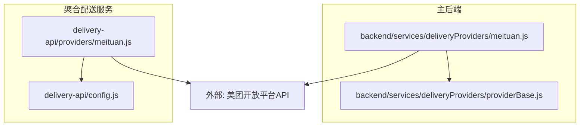
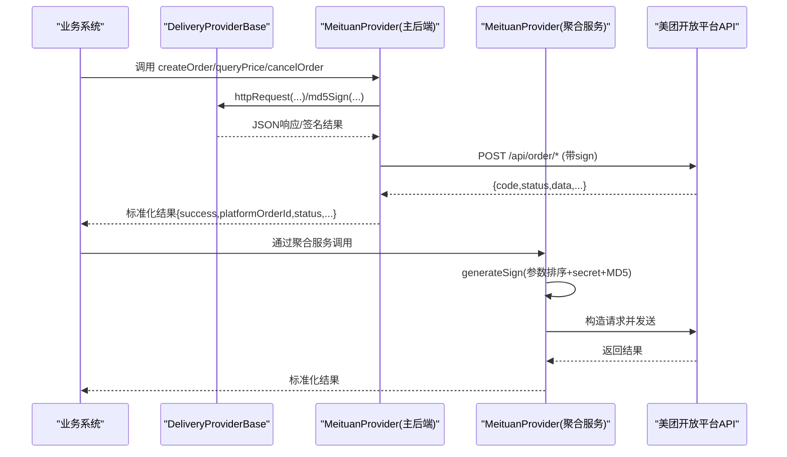
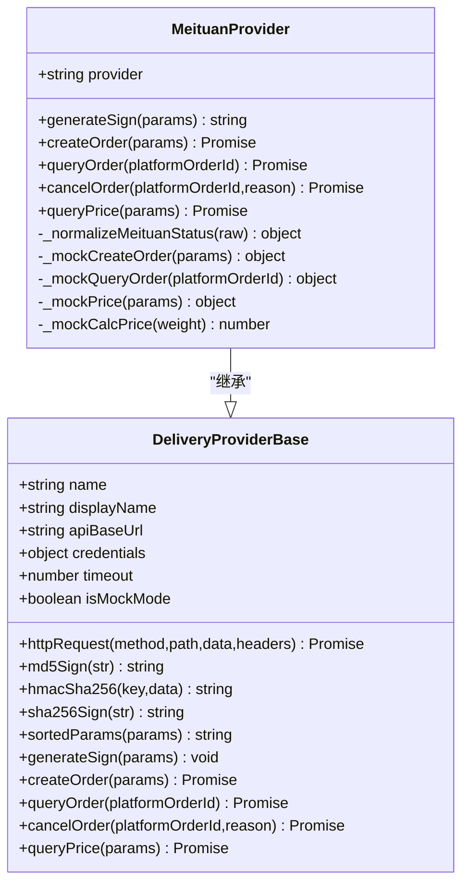
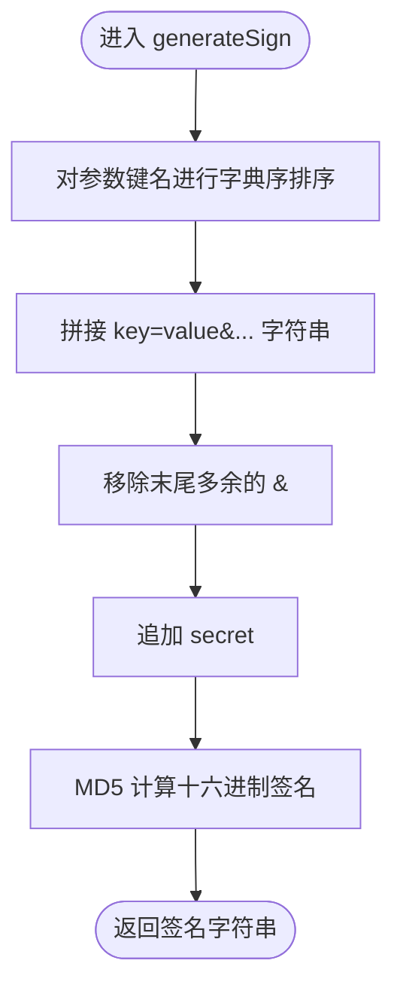
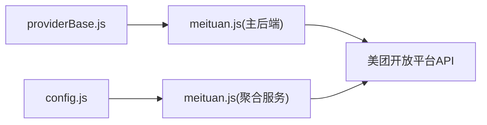

# 美团跑腿接入

<cite>
**本文引用的文件列表**
- [backend/services/deliveryProviders/meituan.js](file://backend/services/deliveryProviders/meituan.js)
- [backend/services/deliveryProviders/providerBase.js](file://backend/services/deliveryProviders/providerBase.js)
- [delivery-api/providers/meituan.js](file://delivery-api/providers/meituan.js)
- [delivery-api/config.js](file://delivery-api/config.js)
- [api/API_DOCUMENTATION.md](file://api/API_DOCUMENTATION.md)
</cite>

## 目录
1. [简介](#简介)
2. [项目结构](#项目结构)
3. [核心组件](#核心组件)
4. [架构总览](#架构总览)
5. [详细组件分析](#详细组件分析)
6. [依赖关系分析](#依赖关系分析)
7. [性能与可用性考虑](#性能与可用性考虑)
8. [故障排查指南](#故障排查指南)
9. [结论](#结论)
10. [附录：接口规范与参数映射](#附录接口规范与参数映射)

## 简介
本文件面向“美团跑腿”服务商的接入与集成，覆盖以下要点：
- API 接口规范：询价、下单、状态查询、取消订单
- 签名算法：参数排序、密钥拼接、MD5 加密流程
- 配置管理：appId、secret 等认证信息的环境变量设置
- 请求参数映射：取货/送货地址、联系人信息的字段要求
- 错误处理机制：异常捕获、降级策略、统一返回格式
- 测试与生产环境差异：沙箱与线上 URL、环境变量区分
- 集成示例与使用模式：后端 Provider 类调用方式与聚合层对接

## 项目结构
本项目包含两套实现路径：
- 主后端直接调用美团开放平台（推荐用于单体或微服务内嵌）
  - 入口类：MeituanProvider（继承 DeliveryProviderBase）
- 独立聚合配送服务 delivery-api（可作为微服务对外暴露统一接口）
  - 入口类：MeituanProvider（独立实现）

图表来源
- [backend/services/deliveryProviders/providerBase.js:1-124](file://backend/services/deliveryProviders/providerBase.js#L1-L124)
- [backend/services/deliveryProviders/meituan.js:1-257](file://backend/services/deliveryProviders/meituan.js#L1-L257)
- [delivery-api/providers/meituan.js:1-231](file://delivery-api/providers/meituan.js#L1-L231)
- [delivery-api/config.js:1-93](file://delivery-api/config.js#L1-L93)

章节来源
- [backend/services/deliveryProviders/meituan.js:1-257](file://backend/services/deliveryProviders/meituan.js#L1-L257)
- [backend/services/deliveryProviders/providerBase.js:1-124](file://backend/services/deliveryProviders/providerBase.js#L1-L124)
- [delivery-api/providers/meituan.js:1-231](file://delivery-api/providers/meituan.js#L1-L231)
- [delivery-api/config.js:1-93](file://delivery-api/config.js#L1-L93)

## 核心组件
- 基础能力封装（HTTP、签名工具、超时控制、Mock 判定）
  - 提供 HTTPS 请求封装、MD5/HMAC-SHA256/SHA256 签名方法、参数排序拼接、运行模式判断
- 美团 Provider（主后端）
  - 基于基础能力实现美团 API 的创建订单、状态查询、取消订单、询价
  - 支持无密钥自动降级为 Mock 数据
- 美团 Provider（聚合服务）
  - 独立实现，按 test/prod 双配置加载，提供相同能力的对外接口

章节来源
- [backend/services/deliveryProviders/providerBase.js:1-124](file://backend/services/deliveryProviders/providerBase.js#L1-L124)
- [backend/services/deliveryProviders/meituan.js:1-257](file://backend/services/deliveryProviders/meituan.js#L1-L257)
- [delivery-api/providers/meituan.js:1-231](file://delivery-api/providers/meituan.js#L1-L231)

## 架构总览
下图展示从业务侧到美团开放平台的调用链路，以及两种实现路径的关系。

图表来源
- [backend/services/deliveryProviders/providerBase.js:35-81](file://backend/services/deliveryProviders/providerBase.js#L35-L81)
- [backend/services/deliveryProviders/meituan.js:30-93](file://backend/services/deliveryProviders/meituan.js#L30-L93)
- [delivery-api/providers/meituan.js:20-81](file://delivery-api/providers/meituan.js#L20-L81)

## 详细组件分析

### 美团 Provider（主后端）
- 职责
  - 读取环境变量 appId/appSecret/apiBaseUrl
  - 生成签名（简单 MD5(appId + timestamp + secret)）
  - 调用美团开放平台接口：创建订单、状态查询、取消订单、询价
  - 失败时降级为 Mock 数据，保证前端体验稳定
- 关键流程
  - 创建订单：组装取货/收货信息、商品描述、重量、回调地址，计算签名后发起请求
  - 状态查询：根据平台订单号查询，并将美团状态码映射为标准状态
  - 取消订单：携带取消原因与类型
  - 询价：传入起终点经纬度与重量，返回预估费用与时效
- 错误处理
  - HTTP 异常、超时均被捕获，记录日志并回退至 Mock
  - 业务异常依据 code/status 判断成功与否，统一返回 success 标志与错误信息

图表来源
- [backend/services/deliveryProviders/providerBase.js:10-121](file://backend/services/deliveryProviders/providerBase.js#L10-L121)
- [backend/services/deliveryProviders/meituan.js:15-254](file://backend/services/deliveryProviders/meituan.js#L15-L254)

章节来源
- [backend/services/deliveryProviders/meituan.js:30-182](file://backend/services/deliveryProviders/meituan.js#L30-L182)
- [backend/services/deliveryProviders/providerBase.js:35-103](file://backend/services/deliveryProviders/providerBase.js#L35-L103)

### 美团 Provider（聚合服务）
- 职责
  - 通过配置文件选择 test 或 prod 环境
  - 实现参数排序 + 密钥拼接 + MD5 的签名算法
  - 提供 queryPrice/createOrder/queryOrder/cancelOrder 四个方法
- 特点
  - 独立部署的微服务模式，便于多服务商聚合
  - 所有方法返回统一结构，含 success、provider、providerName、error 等字段

图表来源
- [delivery-api/providers/meituan.js:20-36](file://delivery-api/providers/meituan.js#L20-L36)

章节来源
- [delivery-api/providers/meituan.js:20-200](file://delivery-api/providers/meituan.js#L20-L200)

## 依赖关系分析
- 主后端 Provider 依赖基础类提供网络与签名能力
- 聚合服务 Provider 自实现签名与请求逻辑，并通过配置文件加载不同环境凭证
- 两者最终都依赖美团开放平台 API 完成真实业务

图表来源
- [backend/services/deliveryProviders/providerBase.js:1-124](file://backend/services/deliveryProviders/providerBase.js#L1-124)
- [backend/services/deliveryProviders/meituan.js:1-257](file://backend/services/deliveryProviders/meituan.js#L1-257)
- [delivery-api/providers/meituan.js:1-231](file://delivery-api/providers/meituan.js#L1-231)
- [delivery-api/config.js:1-93](file://delivery-api/config.js#L1-93)

章节来源
- [delivery-api/config.js:16-29](file://delivery-api/config.js#L16-L29)

## 性能与可用性考虑
- 超时控制：基础类默认 15s 超时，避免长尾请求阻塞
- 降级策略：当未配置密钥或网络异常时，自动返回 Mock 数据，保障前端可用
- 重试建议：在聚合层可结合配置的重试次数与超时时间进行重试（参考聚合配置中的 retryTimes 与 timeout）
- 并发与限流：在高并发场景下，建议在网关或服务层增加限流与熔断保护

[本节为通用指导，不直接分析具体文件]

## 故障排查指南
- 常见问题定位
  - 签名不一致：检查是否按规则排序、拼接、追加 secret 后再做 MD5
  - 鉴权失败：确认 appId/appSecret 是否正确，且与当前环境（test/prod）匹配
  - 网络异常：检查 API 域名、端口、证书与防火墙策略
  - 超时：适当增大超时时间或优化上游处理耗时
- 日志与调试
  - 关注各方法 catch 分支的错误输出，结合返回的 error/message/code 定位问题
  - 使用 Mock 模式验证业务流程，再逐步切换真实环境

章节来源
- [backend/services/deliveryProviders/meituan.js:86-92](file://backend/services/deliveryProviders/meituan.js#L86-L92)
- [backend/services/deliveryProviders/meituan.js:118-122](file://backend/services/deliveryProviders/meituan.js#L118-L122)
- [backend/services/deliveryProviders/meituan.js:149-153](file://backend/services/deliveryProviders/meituan.js#L149-L153)
- [delivery-api/providers/meituan.js:72-80](file://delivery-api/providers/meituan.js#L72-L80)
- [delivery-api/providers/meituan.js:121-129](file://delivery-api/providers/meituan.js#L121-L129)
- [delivery-api/providers/meituan.js:156-164](file://delivery-api/providers/meituan.js#L156-L164)
- [delivery-api/providers/meituan.js:191-199](file://delivery-api/providers/meituan.js#L191-L199)

## 结论
- 两套实现均提供了完整的下单、查询、取消与询价能力
- 主后端方案更贴近现有业务模块，具备完善的降级与统一返回
- 聚合服务方案适合多服务商统一管理，便于扩展与灰度发布
- 接入前务必正确配置环境变量与环境 URL，并在沙箱验证通过后切换生产

[本节为总结性内容，不直接分析具体文件]

## 附录：接口规范与参数映射

### 一、签名算法说明
- 主后端（简单 MD5）
  - 拼接顺序：app_id + timestamp + appSecret
  - 算法：MD5(拼接字符串)
- 聚合服务（标准排序 + 密钥拼接 + MD5）
  - 步骤：
    1) 过滤空值与 null
    2) 按键名升序排序
    3) 拼接为 key=value&key=value...
    4) 去除末尾多余 &
    5) 拼接 secret
    6) MD5 十六进制

章节来源
- [backend/services/deliveryProviders/meituan.js:30-35](file://backend/services/deliveryProviders/meituan.js#L30-L35)
- [delivery-api/providers/meituan.js:20-36](file://delivery-api/providers/meituan.js#L20-L36)

### 二、配置参数与环境差异
- 主后端环境变量
  - MEITUAN_APP_ID、MEITUAN_APP_SECRET、MEITUAN_API_URL（默认 https://peisongopen.meituan.com）
- 聚合服务配置
  - test：appId/secret/url（沙箱）
  - production：appId/secret/url（线上）
  - 通过 isProduction 开关选择对应配置

章节来源
- [backend/services/deliveryProviders/meituan.js:16-28](file://backend/services/deliveryProviders/meituan.js#L16-L28)
- [delivery-api/config.js:16-29](file://delivery-api/config.js#L16-L29)

### 三、API 接口与参数映射
- 询价接口
  - 主后端：POST /api/order/deliveryFee
    - 必填：app_id、timestamp、sign
    - 选填：pickup_lat/pickup_lng、receiver_lat/receiver_lng、goods_weight
  - 聚合服务：内部方法 queryPrice
    - 入参：pickupAddress、dropoffAddress、weight、cityName
    - 构造：app_id、timestamp、version、city_name、pickup_address、dropoff_address、weight
- 创建订单
  - 主后端：POST /api/order/createByShop
    - 关键字段：shop_no、delivery_id、order_id、order_type、goods_type、goods_weight、goods_detail、pickup_*、receiver_*、callback_url
  - 聚合服务：内部方法 createOrder
    - 关键字段：app_id、timestamp、order_id、pickup_address、pickup_contact_name/phone、dropoff_address、dropoff_contact_name/phone、goods_desc、weight
- 状态查询
  - 主后端：POST /api/order/status/query
    - 关键字段：app_id、timestamp、sign、delivery_id
  - 聚合服务：内部方法 queryOrder
    - 关键字段：app_id、timestamp、order_id
- 取消订单
  - 主后端：POST /api/order/delete
    - 关键字段：app_id、timestamp、sign、delivery_id、cancel_reason、cancel_type
  - 聚合服务：内部方法 cancelOrder
    - 关键字段：app_id、timestamp、order_id、cancel_reason

章节来源
- [backend/services/deliveryProviders/meituan.js:41-93](file://backend/services/deliveryProviders/meituan.js#L41-L93)
- [backend/services/deliveryProviders/meituan.js:99-123](file://backend/services/deliveryProviders/meituan.js#L99-L123)
- [backend/services/deliveryProviders/meituan.js:129-154](file://backend/services/deliveryProviders/meituan.js#L129-L154)
- [backend/services/deliveryProviders/meituan.js:157-182](file://backend/services/deliveryProviders/meituan.js#L157-L182)
- [delivery-api/providers/meituan.js:43-81](file://delivery-api/providers/meituan.js#L43-L81)
- [delivery-api/providers/meituan.js:88-130](file://delivery-api/providers/meituan.js#L88-L130)
- [delivery-api/providers/meituan.js:137-165](file://delivery-api/providers/meituan.js#L137-L165)
- [delivery-api/providers/meituan.js:173-200](file://delivery-api/providers/meituan.js#L173-L200)

### 四、请求参数映射（取货/送货/联系人）
- 取货方
  - 名称：pickup_name / pickup_contact_name
  - 电话：pickup_phone / pickup_contact_phone
  - 地址：pickup_address
  - 坐标：pickup_lat / pickup_lng
- 收货方
  - 名称：receiver_name / dropoff_contact_name
  - 电话：receiver_phone / dropoff_contact_phone
  - 地址：receiver_address / dropoff_address
  - 坐标：receiver_lat / receiver_lng
- 商品信息
  - 类型：goods_type
  - 重量：goods_weight / weight
  - 描述：goods_detail / goods_desc
- 其他
  - 商户编号：shop_no
  - 回调地址：callback_url
  - 城市：city_name（聚合服务询价）

章节来源
- [backend/services/deliveryProviders/meituan.js:48-71](file://backend/services/deliveryProviders/meituan.js#L48-L71)
- [delivery-api/providers/meituan.js:47-55](file://delivery-api/providers/meituan.js#L47-L55)
- [delivery-api/providers/meituan.js:91-103](file://delivery-api/providers/meituan.js#L91-L103)

### 五、状态码与状态映射
- 美团原始状态 → 标准状态
  - 0 → pending（待调度）
  - 10 → accepted（已接单）
  - 20 → picking_up（已取件）
  - 30 → delivering（配送中）
  - 40 → delivered（已送达）
  - 50 → cancelled（已取消）
  - 99 → exception（异常）
- 统一返回
  - success：布尔
  - provider：服务商标识
  - platformOrderId：平台订单号
  - status：标准状态
  - driver：骑手信息（可选）
  - distance/eta：距离/预计到达（可选）

章节来源
- [backend/services/deliveryProviders/meituan.js:185-209](file://backend/services/deliveryProviders/meituan.js#L185-L209)

### 六、错误处理与异常
- 网络/超时异常：catch 捕获并记录日志，必要时回退 Mock
- 业务异常：依据返回 code/status 判断，提取 message/msg 作为错误信息
- 统一返回：始终包含 success 标志与 provider，失败时附带 error 与 code

章节来源
- [backend/services/deliveryProviders/meituan.js:86-92](file://backend/services/deliveryProviders/meituan.js#L86-L92)
- [backend/services/deliveryProviders/meituan.js:118-122](file://backend/services/deliveryProviders/meituan.js#L118-L122)
- [backend/services/deliveryProviders/meituan.js:149-153](file://backend/services/deliveryProviders/meituan.js#L149-L153)
- [delivery-api/providers/meituan.js:72-80](file://delivery-api/providers/meituan.js#L72-L80)
- [delivery-api/providers/meituan.js:121-129](file://delivery-api/providers/meituan.js#L121-L129)
- [delivery-api/providers/meituan.js:156-164](file://delivery-api/providers/meituan.js#L156-L164)
- [delivery-api/providers/meituan.js:191-199](file://delivery-api/providers/meituan.js#L191-L199)

### 七、测试环境与生产环境差异
- 测试环境
  - 聚合服务：使用 test.appId/test.secret/test.url（沙箱）
  - 主后端：可通过 MEITUAN_API_URL 指向沙箱域名
- 生产环境
  - 聚合服务：使用 production.appId/production.secret/production.url（线上）
  - 主后端：默认线上域名，也可通过环境变量覆盖

章节来源
- [delivery-api/config.js:16-29](file://delivery-api/config.js#L16-L29)
- [backend/services/deliveryProviders/meituan.js:16-28](file://backend/services/deliveryProviders/meituan.js#L16-L28)

### 八、集成示例与使用模式
- 主后端集成
  - 实例化 MeituanProvider，直接调用 createOrder/queryOrder/cancelOrder/queryPrice
  - 无需额外 HTTP 转发，由 Provider 内部完成签名与请求
- 聚合服务集成
  - 通过 delivery-api 提供的统一接口调用，内部路由到对应 Provider
  - 适用于多服务商聚合、统一监控与治理

章节来源
- [backend/services/deliveryProviders/meituan.js:41-182](file://backend/services/deliveryProviders/meituan.js#L41-L182)
- [delivery-api/providers/meituan.js:43-200](file://delivery-api/providers/meituan.js#L43-L200)