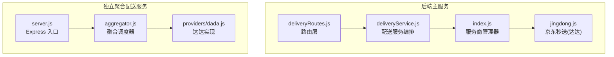
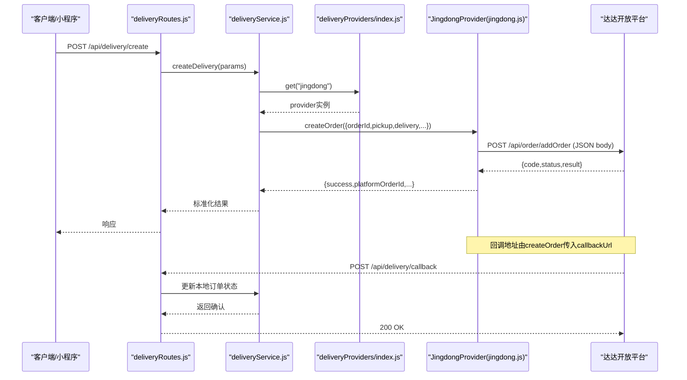
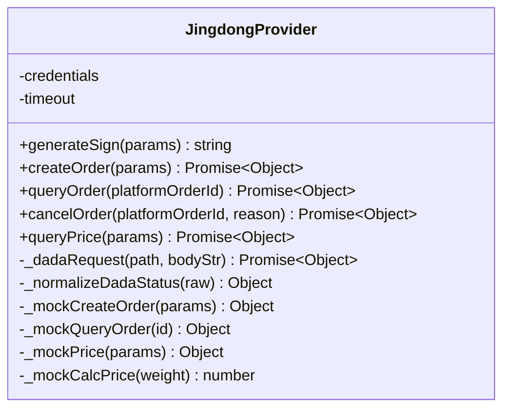
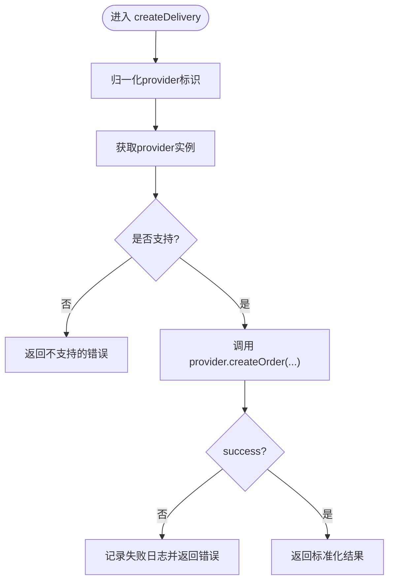
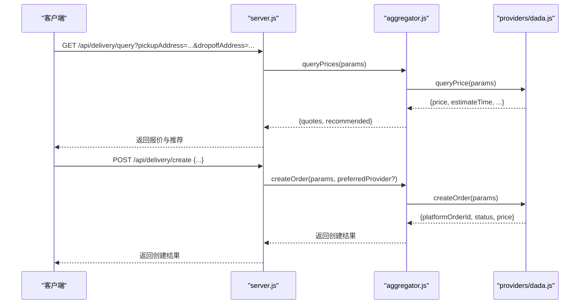
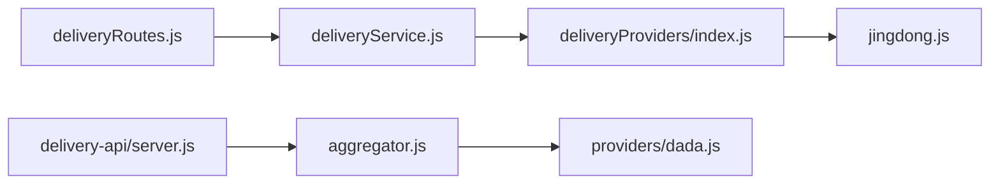

# 达达/京东秒送接入

<cite>
**本文引用的文件列表**   
- [backend/services/deliveryProviders/jingdong.js](file://backend/services/deliveryProviders/jingdong.js)
- [backend/services/deliveryProviders/index.js](file://backend/services/deliveryProviders/index.js)
- [backend/modules/common/services/deliveryService.js](file://backend/modules/common/services/deliveryService.js)
- [backend/modules/common/routes/deliveryRoutes.js](file://backend/modules/common/routes/deliveryRoutes.js)
- [delivery-api/server.js](file://delivery-api/server.js)
- [delivery-api/aggregator.js](file://delivery-api/aggregator.js)
- [delivery-api/providers/dada.js](file://delivery-api/providers/dada.js)
- [delivery-api/README.md](file://delivery-api/README.md)
</cite>

## 目录
1. [简介](#简介)
2. [项目结构](#项目结构)
3. [核心组件](#核心组件)
4. [架构总览](#架构总览)
5. [详细组件分析](#详细组件分析)
6. [依赖关系分析](#依赖关系分析)
7. [性能与并发优化](#性能与并发优化)
8. [故障排查指南](#故障排查指南)
9. [结论](#结论)
10. [附录：开发到上线全流程](#附录开发到上线全流程)

## 简介
本文件面向“达达/京东秒送”的接入与集成，聚焦以下目标：
- 说明达达开放平台API对接规范在本仓库中的实现方式（订单创建、状态查询、取消、价格估算）。
- 解释即时配送与预约配送在业务流程上的差异及落地建议。
- 对比主流配送平台的技术差异（签名机制、请求体格式、错误码约定等）。
- 提供从申请开发者账号到生产环境上线的全流程指引。
- 给出覆盖范围与限制条件的说明方法（城市支持、时效、费用标准）以及如何在系统中配置与展示。
- 提供性能优化建议（批量操作、缓存策略、并发控制）。
- 提供故障排查方法与常见问题解决方案。
- 结合业务场景给出最佳实践。

## 项目结构
本项目包含两套与配送相关的服务：
- 后端统一配送服务（基于 Node.js + Express），通过 deliveryService 聚合多家服务商，其中京东秒送底层使用达达开放平台 API。
- 独立的聚合配送 API 服务（delivery-api），对外暴露统一的询价、下单、查询、取消接口，内部调度美团、达达、顺丰三家。

图表来源
- [backend/modules/common/routes/deliveryRoutes.js:1-175](file://backend/modules/common/routes/deliveryRoutes.js#L1-L175)
- [backend/modules/common/services/deliveryService.js:1-322](file://backend/modules/common/services/deliveryService.js#L1-L322)
- [backend/services/deliveryProviders/index.js:1-87](file://backend/services/deliveryProviders/index.js#L1-L87)
- [backend/services/deliveryProviders/jingdong.js:1-278](file://backend/services/deliveryProviders/jingdong.js#L1-L278)
- [delivery-api/server.js:1-377](file://delivery-api/server.js#L1-L377)
- [delivery-api/aggregator.js:1-237](file://delivery-api/aggregator.js#L1-L237)
- [delivery-api/providers/dada.js:1-237](file://delivery-api/providers/dada.js#L1-L237)

章节来源
- [backend/modules/common/routes/deliveryRoutes.js:1-175](file://backend/modules/common/routes/deliveryRoutes.js#L1-L175)
- [backend/modules/common/services/deliveryService.js:1-322](file://backend/modules/common/services/deliveryService.js#L1-L322)
- [backend/services/deliveryProviders/index.js:1-87](file://backend/services/deliveryProviders/index.js#L1-L87)
- [backend/services/deliveryProviders/jingdong.js:1-278](file://backend/services/deliveryProviders/jingdong.js#L1-L278)
- [delivery-api/server.js:1-377](file://delivery-api/server.js#L1-L377)
- [delivery-api/aggregator.js:1-237](file://delivery-api/aggregator.js#L1-L237)
- [delivery-api/providers/dada.js:1-237](file://delivery-api/providers/dada.js#L1-L237)

## 核心组件
- 京东秒送（达达）提供商实现：负责签名、下单、查单、取消、估价、回调处理与状态映射。
- 配送服务编排：将外部调用与业务逻辑解耦，提供定价计算、报价排序、多服务商选择等能力。
- 聚合配送服务：对外暴露统一REST接口，内部并行询价并推荐最优服务商。

章节来源
- [backend/services/deliveryProviders/jingdong.js:1-278](file://backend/services/deliveryProviders/jingdong.js#L1-L278)
- [backend/modules/common/services/deliveryService.js:1-322](file://backend/modules/common/services/deliveryService.js#L1-L322)
- [delivery-api/aggregator.js:1-237](file://delivery-api/aggregator.js#L1-L237)

## 架构总览
下图展示了从前端到后端再到第三方平台的整体链路，包括回调驱动的状态同步。

图表来源
- [backend/modules/common/routes/deliveryRoutes.js:1-175](file://backend/modules/common/routes/deliveryRoutes.js#L1-L175)
- [backend/modules/common/services/deliveryService.js:1-322](file://backend/modules/common/services/deliveryService.js#L1-L322)
- [backend/services/deliveryProviders/jingdong.js:1-278](file://backend/services/deliveryProviders/jingdong.js#L1-L278)

## 详细组件分析

### 京东秒送（达达）提供商（JingdongProvider）
职责与要点：
- 签名算法：对参数按key排序拼接后追加appSecret，取MD5大写。
- 下单接口：POST /api/order/addOrder，body为JSON对象；成功时返回result字段包含order_id、deliver_fee、delivery_time、distance等。
- 状态查询：POST /api/order/status/query，返回order_status等字段，内部做状态映射。
- 取消接口：POST /api/order/formalCancel，携带cancel_reason_id与cancel_reason。
- 价格估算：POST /api/order/queryDeliverFee，返回deliver_fee与delivery_time。
- 回调处理：在创建订单时传入callbackUrl，用于接收达达推送的订单状态变更。
- Mock模式：未配置密钥或网络异常时回退到模拟数据，便于联调。

图表来源
- [backend/services/deliveryProviders/jingdong.js:1-278](file://backend/services/deliveryProviders/jingdong.js#L1-L278)

章节来源
- [backend/services/deliveryProviders/jingdong.js:1-278](file://backend/services/deliveryProviders/jingdong.js#L1-L278)

### 配送服务编排（DeliveryService）
职责与要点：
- 统一入口：对外暴露 createDelivery、queryDelivery、cancelDelivery。
- 提供商标识归一化：兼容旧键名（如 dada/jd/jingdong -> jingdong）。
- 定价与报价：内置各服务商计费规则，支持一对一与拼单两种模式，输出原价、折扣、实付、预估时长等。
- 距离计算：Haversine公式估算两点距离。
- 可用服务商状态：根据是否配置密钥返回 real/mock 模式。

图表来源
- [backend/modules/common/services/deliveryService.js:1-322](file://backend/modules/common/services/deliveryService.js#L1-L322)

章节来源
- [backend/modules/common/services/deliveryService.js:1-322](file://backend/modules/common/services/deliveryService.js#L1-L322)

### 聚合配送服务（delivery-api）
职责与要点：
- 对外REST接口：/api/delivery/providers、/api/delivery/query、/api/delivery/create、/api/delivery/:provider/:orderId、/api/delivery/:provider/:orderId/cancel。
- 并行询价：同时向多家服务商发起询价，汇总并按策略推荐最优。
- 自动选择：若未指定preferredProvider，则先询价再选择推荐服务商下单。
- 兼容接口：保留旧版 /api/deliveries 系列接口。

图表来源
- [delivery-api/server.js:1-377](file://delivery-api/server.js#L1-L377)
- [delivery-api/aggregator.js:1-237](file://delivery-api/aggregator.js#L1-L237)
- [delivery-api/providers/dada.js:1-237](file://delivery-api/providers/dada.js#L1-L237)

章节来源
- [delivery-api/server.js:1-377](file://delivery-api/server.js#L1-L377)
- [delivery-api/aggregator.js:1-237](file://delivery-api/aggregator.js#L1-L237)
- [delivery-api/providers/dada.js:1-237](file://delivery-api/providers/dada.js#L1-L237)

## 依赖关系分析
- 路由层依赖服务层，服务层依赖提供商管理器，提供商管理器持有具体提供商实例。
- 京东秒送提供商依赖达达开放平台HTTPS接口，采用JSON body与自定义签名。
- 聚合服务与后端服务相互独立，但都实现了达达能力的封装与适配。

图表来源
- [backend/modules/common/routes/deliveryRoutes.js:1-175](file://backend/modules/common/routes/deliveryRoutes.js#L1-L175)
- [backend/modules/common/services/deliveryService.js:1-322](file://backend/modules/common/services/deliveryService.js#L1-L322)
- [backend/services/deliveryProviders/index.js:1-87](file://backend/services/deliveryProviders/index.js#L1-L87)
- [backend/services/deliveryProviders/jingdong.js:1-278](file://backend/services/deliveryProviders/jingdong.js#L1-L278)
- [delivery-api/server.js:1-377](file://delivery-api/server.js#L1-L377)
- [delivery-api/aggregator.js:1-237](file://delivery-api/aggregator.js#L1-L237)
- [delivery-api/providers/dada.js:1-237](file://delivery-api/providers/dada.js#L1-L237)

章节来源
- [backend/services/deliveryProviders/index.js:1-87](file://backend/services/deliveryProviders/index.js#L1-L87)
- [backend/services/deliveryProviders/jingdong.js:1-278](file://backend/services/deliveryProviders/jingdong.js#L1-L278)
- [delivery-api/aggregator.js:1-237](file://delivery-api/aggregator.js#L1-L237)

## 性能与并发优化
- 并行询价：聚合服务对多家服务商并行询价，降低端到端延迟。
- 超时与重试：京东秒送提供商设置HTTP超时；建议在网关或服务层增加幂等重试与熔断降级。
- 批量操作：对于批量下单/查询，可在上层进行批处理与限流，避免触发第三方限频。
- 缓存策略：对价格估算结果按“起终点+重量+城市”维度缓存短时效结果，减少重复调用。
- 回调去抖：对高频状态回调进行去重与合并，避免频繁写库。
- 连接复用：使用HTTP Keep-Alive或连接池提升吞吐。

[本节为通用指导，不直接分析具体文件]

## 故障排查指南
- 签名失败：检查参数排序、空值过滤、secret拼接与MD5大小写是否符合要求。
- 下单失败：核对必填字段（如source_id/shop_no/order_id/receiver信息）、city_code与坐标有效性。
- 状态不一致：确认callbackUrl可达且返回200；检查回调幂等与状态映射表。
- 超时与网络错误：检查DNS、TLS、防火墙；必要时启用Mock模式快速定位问题。
- 错误码解析：优先判断code===0或status==="success"分支；否则记录msg/message字段以便排障。

章节来源
- [backend/services/deliveryProviders/jingdong.js:1-278](file://backend/services/deliveryProviders/jingdong.js#L1-L278)

## 结论
本项目已实现达达/京东秒送的完整接入路径，涵盖签名、下单、查单、取消、估价与回调处理，并通过服务编排与聚合服务提供了统一、可扩展的配送能力。建议在生产环境完善限流、重试、监控与告警，确保高可用与可观测性。

[本节为总结性内容，不直接分析具体文件]

## 附录：开发到上线全流程

### 1. 申请开发者账号与配置
- 在达达开放平台注册应用，获取 appKey、appSecret、sourceId。
- 在环境变量中配置：
  - DADA_APP_KEY
  - DADA_APP_SECRET
  - DADA_SOURCE_ID
  - JD_API_URL（可选，默认指向新开放平台域名）
- 参考示例与环境变量说明：
  - [delivery-api/README.md:1-162](file://delivery-api/README.md#L1-L162)

章节来源
- [delivery-api/README.md:1-162](file://delivery-api/README.md#L1-L162)
- [backend/services/deliveryProviders/jingdong.js:1-278](file://backend/services/deliveryProviders/jingdong.js#L1-L278)

### 2. 沙箱测试与切换生产
- 使用测试密钥在沙箱环境完成下单、查询、取消、回调全链路验证。
- 校验状态映射与回调幂等，确保异常分支正确回退至Mock或错误提示。
- 切换生产密钥与域名，开启限流与监控。

章节来源
- [backend/services/deliveryProviders/jingdong.js:1-278](file://backend/services/deliveryProviders/jingdong.js#L1-L278)

### 3. 接口清单与调用规范
- 下单：POST /api/order/addOrder（JSON body）
- 状态查询：POST /api/order/status/query
- 取消：POST /api/order/formalCancel
- 估价：POST /api/order/queryDeliverFee
- 回调：由达达主动POST至你方配置的callbackUrl

章节来源
- [backend/services/deliveryProviders/jingdong.js:1-278](file://backend/services/deliveryProviders/jingdong.js#L1-L278)

### 4. 数据格式与错误码约定
- 请求体：JSON字符串，Content-Type: application/json;charset=utf-8。
- 响应体：优先以 code===0 或 status==="success" 判定成功；失败时关注 msg/message。
- 状态映射：内部已将达达数字状态映射为标准字符串（待接单/已接单/配送中等）。

章节来源
- [backend/services/deliveryProviders/jingdong.js:1-278](file://backend/services/deliveryProviders/jingdong.js#L1-L278)

### 5. 即时配送 vs 预约配送
- 即时配送：下单后立即调度骑手，适合紧急需求。
- 预约配送：下单时指定未来取件时间窗口，系统提前分配运力。
- 建议：在订单模型中增加“配送类型”字段（instant/scheduled），并在创建订单时传递相应参数（如预约时间窗），由上游业务决定走哪条流程。

[本节为概念性说明，不直接分析具体文件]

### 6. 与主流平台技术差异
- 签名机制：达达采用“参数排序拼接+secret+MD5大写”。
- 请求体：达达使用JSON body；部分平台可能使用表单或XML。
- 错误码：达达以code或status作为成功标志，其他平台可能不同，需统一抽象。
- 回调：达达通过HTTP回调推送状态，需保证幂等与重试安全。

章节来源
- [backend/services/deliveryProviders/jingdong.js:1-278](file://backend/services/deliveryProviders/jingdong.js#L1-L278)

### 7. 覆盖范围与限制条件
- 城市支持：city_code/city_name需在达达开通范围内；默认北京，实际应由地址解析得出。
- 配送时间与费用：通过估价接口返回delivery_time与deliver_fee；前端展示预计时长与费用区间。
- 建议：在系统中维护城市白名单与费率表，结合地理围栏与距离阈值控制可用性。

章节来源
- [backend/services/deliveryProviders/jingdong.js:1-278](file://backend/services/deliveryProviders/jingdong.js#L1-L278)

### 8. 性能优化建议
- 并行询价与推荐：已在聚合服务中实现。
- 缓存：对估价结果按“起点+终点+重量+城市”维度缓存短时结果。
- 限流与熔断：对第三方API调用增加令牌桶限流与熔断降级。
- 批量下单：对批量订单进行分批提交与退避重试。

[本节为通用指导，不直接分析具体文件]

### 9. 故障排查与常见问题
- 常见错误：签名失败、缺少必填字段、回调不可达、状态映射缺失。
- 定位步骤：
  - 打印请求体与响应体，核对签名生成过程。
  - 检查callbackUrl可达性与幂等处理。
  - 在Mock模式下复现，逐步切换到真实环境定位。
- 监控指标：成功率、平均耗时、超时率、回调成功率、错误码分布。

章节来源
- [backend/services/deliveryProviders/jingdong.js:1-278](file://backend/services/deliveryProviders/jingdong.js#L1-L278)

### 10. 业务场景与最佳实践
- 干洗店上门取送：用户选择跑腿上门取件，系统并行询价并推荐最优服务商，下单后通过回调实时更新跟踪页。
- 门店自提：无需配送，仅记录服务项与优惠。
- 拼单模式：在配送服务层计算拼单折扣，提高性价比与用户体验。

章节来源
- [backend/modules/common/services/deliveryService.js:1-322](file://backend/modules/common/services/deliveryService.js#L1-L322)