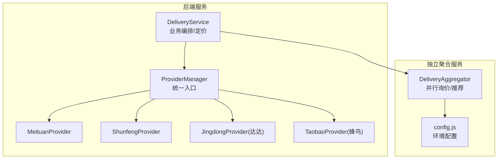
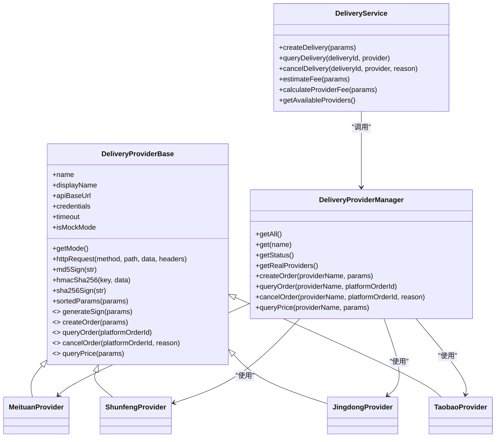
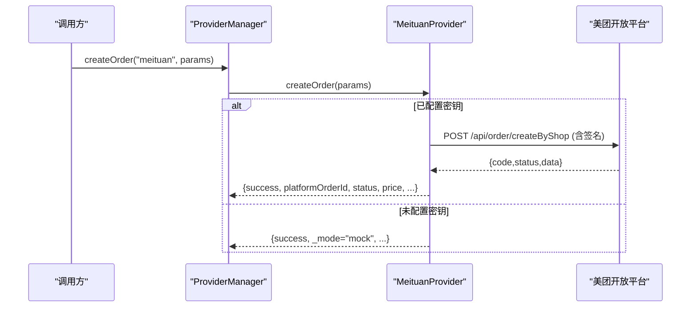
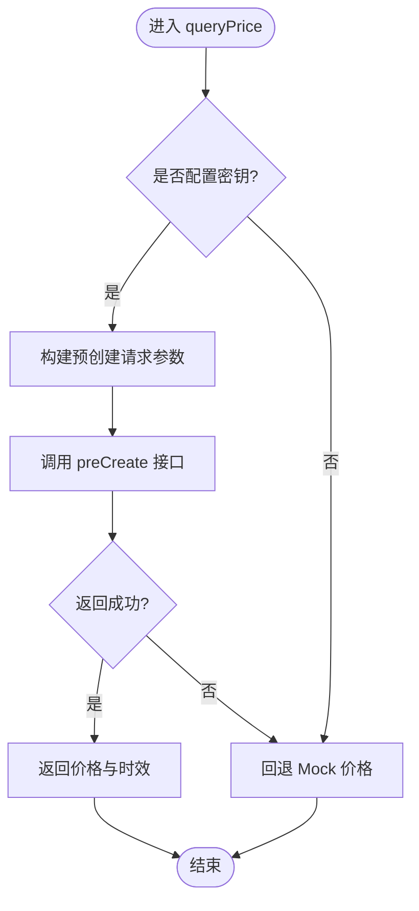
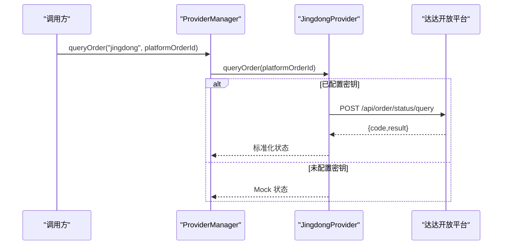
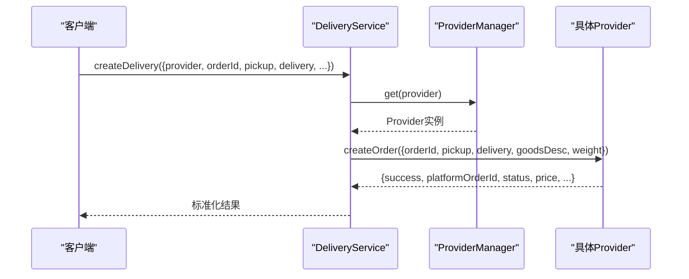
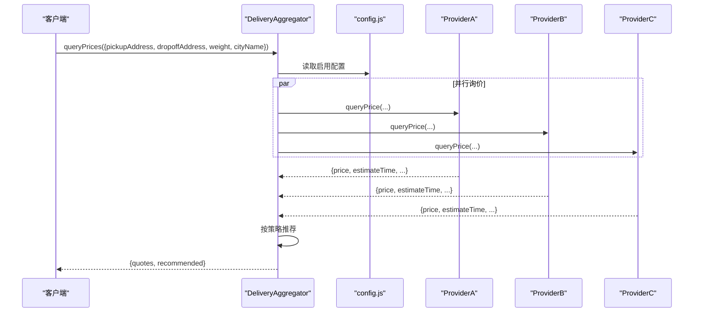
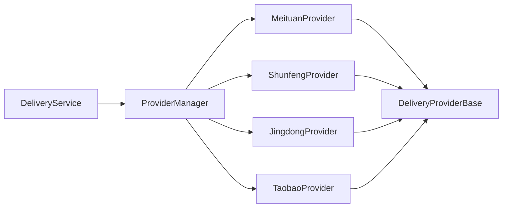

# 配送服务商接入

<cite>
**本文引用的文件**
- [providerBase.js](file://backend/services/deliveryProviders/providerBase.js)
- [meituan.js](file://backend/services/deliveryProviders/meituan.js)
- [shunfeng.js](file://backend/services/deliveryProviders/shunfeng.js)
- [jingdong.js](file://backend/services/deliveryProviders/jingdong.js)
- [taobao.js](file://backend/services/deliveryProviders/taobao.js)
- [index.js](file://backend/services/deliveryProviders/index.js)
- [deliveryService.js](file://backend/modules/common/services/deliveryService.js)
- [aggregator.js](file://delivery-api/aggregator.js)
- [config.js](file://delivery-api/config.js)
- [server.js](file://delivery-api/server.js)
</cite>

## 目录
1. [简介](#简介)
2. [项目结构](#项目结构)
3. [核心组件](#核心组件)
4. [架构总览](#架构总览)
5. [详细组件分析](#详细组件分析)
6. [依赖关系分析](#依赖关系分析)
7. [性能与可靠性](#性能与可靠性)
8. [故障排查指南](#故障排查指南)
9. [结论](#结论)
10. [附录：新服务商接入规范](#附录新服务商接入规范)

## 简介
本文件面向“配送服务商接入”的完整技术文档，覆盖已集成的三大服务商（美团跑腿、顺丰同城、达达/京东秒送）的对接实现、API 接口规范、认证机制、参数映射、状态码映射与异常处理；同时提供 Provider 基类的继承结构与必须实现的接口方法，以及新增服务商的接入指南（配置、密钥管理、测试验证）、监控指标与健康检查、熔断降级策略和第三方物流集成最佳实践。

## 项目结构
后端通过统一的配送服务层调用各服务商实现，独立 delivery-api 聚合器用于多服务商并行询价与推荐下单。关键路径如下：
- backend/services/deliveryProviders：统一入口与各服务商实现
- backend/modules/common/services/deliveryService.js：业务编排与定价计算
- delivery-api/aggregator.js：聚合调度（可选微服务模式）
- delivery-api/config.js：聚合服务配置与环境变量映射

图表来源
- [deliveryService.js:1-322](file://backend/modules/common/services/deliveryService.js#L1-L322)
- [index.js:1-87](file://backend/services/deliveryProviders/index.js#L1-L87)
- [aggregator.js:1-237](file://delivery-api/aggregator.js#L1-L237)
- [config.js:1-93](file://delivery-api/config.js#L1-L93)

章节来源
- [deliveryService.js:1-322](file://backend/modules/common/services/deliveryService.js#L1-L322)
- [index.js:1-87](file://backend/services/deliveryProviders/index.js#L1-L87)
- [aggregator.js:1-237](file://delivery-api/aggregator.js#L1-L237)
- [config.js:1-93](file://delivery-api/config.js#L1-L93)

## 核心组件
- Provider 基类：封装 HTTPS 请求、签名工具、超时控制、Mock 模式判断与抽象接口定义
- 具体服务商实现：美团、顺丰、京东（达达）、淘宝（蜂鸟），各自实现签名、创建/查询/取消订单、价格查询及状态映射
- ProviderManager：统一注册与分发，暴露 createOrder/queryOrder/cancelOrder/queryPrice 等能力
- DeliveryService：业务层编排，负责参数标准化、定价计算、结果归一化与兼容旧接口
- Aggregator（可选）：并行询价、按策略推荐并下单

章节来源
- [providerBase.js:1-124](file://backend/services/deliveryProviders/providerBase.js#L1-L124)
- [index.js:1-87](file://backend/services/deliveryProviders/index.js#L1-L87)
- [deliveryService.js:1-322](file://backend/modules/common/services/deliveryService.js#L1-L322)
- [aggregator.js:1-237](file://delivery-api/aggregator.js#L1-L237)

## 架构总览
整体采用“基类 + 多实现 + 管理器 + 业务编排”的分层设计，既保证统一契约，又允许差异化实现。

图表来源
- [providerBase.js:1-124](file://backend/services/deliveryProviders/providerBase.js#L1-L124)
- [meituan.js:1-257](file://backend/services/deliveryProviders/meituan.js#L1-L257)
- [shunfeng.js:1-262](file://backend/services/deliveryProviders/shunfeng.js#L1-L262)
- [jingdong.js:1-278](file://backend/services/deliveryProviders/jingdong.js#L1-L278)
- [taobao.js:1-263](file://backend/services/deliveryProviders/taobao.js#L1-L263)
- [index.js:1-87](file://backend/services/deliveryProviders/index.js#L1-L87)
- [deliveryService.js:1-322](file://backend/modules/common/services/deliveryService.js#L1-L322)

## 详细组件分析

### Provider 基类与统一契约
- 职责
  - 统一 HTTP 请求封装（HTTPS、超时、错误处理）
  - 通用签名工具（MD5/HMAC-SHA256/SHA256）
  - 自动检测 Mock 模式（未配置密钥则走模拟数据）
  - 定义抽象接口：generateSign、createOrder、queryOrder、cancelOrder、queryPrice
- 关键点
  - httpRequest 对 JSON 响应进行容错解析
  - getMode 返回 'mock'/'real'，便于上层决策
  - sortedParams 为多数平台签名提供排序拼接能力

章节来源
- [providerBase.js:1-124](file://backend/services/deliveryProviders/providerBase.js#L1-L124)

### 美团跑腿（MeituanProvider）
- 认证与签名
  - 使用 appId/appSecret，签名算法为 MD5(appId + timestamp + secret)
- 主要接口
  - 创建订单：POST /api/order/createByShop
  - 查询状态：POST /api/order/status/query
  - 取消订单：POST /api/order/delete
  - 价格查询：POST /api/order/deliveryFee
- 参数映射要点
  - 取件/收件地址包含经纬度、联系人、电话
  - 商品描述与重量参与计费
- 状态映射
  - 将平台数字状态映射到内部统一状态（pending/accepted/picking_up/delivering/delivered/cancelled/exception）
- 异常与降级
  - API 失败时回退至 Mock 数据，保障前端可用性

图表来源
- [meituan.js:1-257](file://backend/services/deliveryProviders/meituan.js#L1-L257)
- [index.js:1-87](file://backend/services/deliveryProviders/index.js#L1-L87)

章节来源
- [meituan.js:1-257](file://backend/services/deliveryProviders/meituan.js#L1-L257)

### 顺丰同城（ShunfengProvider）
- 认证与签名
  - 使用 partnerId/checkWord，签名算法为 MD5(timestamp + checkWord)
- 主要接口
  - 创建订单：POST /api/v1/order/create
  - 查询状态：POST /api/v1/order/query
  - 取消订单：POST /api/v1/order/cancel
  - 价格查询：POST /api/v1/order/preCreate
- 参数映射要点
  - shop/user 地址与坐标、产品名与重量
- 状态映射
  - 将平台状态码映射到内部统一状态
- 异常与降级
  - 网络或鉴权异常时回退 Mock

图表来源
- [shunfeng.js:1-262](file://backend/services/deliveryProviders/shunfeng.js#L1-L262)

章节来源
- [shunfeng.js:1-262](file://backend/services/deliveryProviders/shunfeng.js#L1-L262)

### 达达/京东秒送（JingdongProvider）
- 认证与签名
  - 使用 appKey/appSecret/sourceId，签名算法为“参数排序拼接 + secret，再 MD5 大写”
- 主要接口
  - 创建订单：POST /api/order/addOrder
  - 查询状态：POST /api/order/status/query
  - 取消订单：POST /api/order/formalCancel
  - 价格查询：POST /api/order/queryDeliverFee
- 参数映射要点
  - 收货人信息、经纬度、城市编码、货物重量与数量
- 状态映射
  - 将达达状态码映射到内部统一状态
- 异常与降级
  - 自定义 _dadaRequest 封装，异常时回退 Mock

图表来源
- [jingdong.js:1-278](file://backend/services/deliveryProviders/jingdong.js#L1-L278)
- [index.js:1-87](file://backend/services/deliveryProviders/index.js#L1-L87)

章节来源
- [jingdong.js:1-278](file://backend/services/deliveryProviders/jingdong.js#L1-L278)

### 淘宝闪送（TaobaoProvider，底层蜂鸟即配）
- 认证与签名
  - 使用 appId/secret/merchantId，签名算法为“参数排序拼接 + secret，再 MD5”
- 主要接口
  - 创建订单：POST /anmp/api/v2/order/create
  - 查询状态：POST /anmp/api/v2/order/query
  - 取消订单：POST /anmp/api/v2/order/cancel
  - 价格查询：POST /anmp/api/v2/order/queryFee
- 参数映射要点
  - 发/收件人信息与经纬度、商品名称与重量（单位克）
- 状态映射
  - 将蜂鸟字符串状态映射到内部统一状态
- 异常与降级
  - 异常时回退 Mock

章节来源
- [taobao.js:1-263](file://backend/services/deliveryProviders/taobao.js#L1-L263)

### ProviderManager 与 DeliveryService 协作
- ProviderManager
  - 集中注册所有 Provider，提供 get/getAll/getStatus/getRealProviders
  - 对外暴露 createOrder/queryOrder/cancelOrder/queryPrice
- DeliveryService
  - 统一参数标准化与提供商别名映射（如 dada/jd → jingdong）
  - 提供定价计算、报价汇总、距离估算、可用服务商列表
  - 将各 Provider 返回结果归一化为稳定格式

图表来源
- [deliveryService.js:1-322](file://backend/modules/common/services/deliveryService.js#L1-L322)
- [index.js:1-87](file://backend/services/deliveryProviders/index.js#L1-L87)

章节来源
- [deliveryService.js:1-322](file://backend/modules/common/services/deliveryService.js#L1-L322)
- [index.js:1-87](file://backend/services/deliveryProviders/index.js#L1-L87)

### 聚合服务（可选微服务模式）
- aggregator.js
  - 并行询价多家服务商，按策略（最低价/最快/综合推荐）选择最优
  - 支持指定优先服务商或直接自动选择
- config.js
  - 统一管理各服务商 test/production 配置与环境变量映射
- server.js
  - 启动聚合服务（端口、路由挂载等）

图表来源
- [aggregator.js:1-237](file://delivery-api/aggregator.js#L1-L237)
- [config.js:1-93](file://delivery-api/config.js#L1-L93)

章节来源
- [aggregator.js:1-237](file://delivery-api/aggregator.js#L1-L237)
- [config.js:1-93](file://delivery-api/config.js#L1-L93)

## 依赖关系分析
- 低耦合高内聚
  - Provider 仅依赖 Node 标准库（https/crypto），不依赖外部框架
  - ProviderManager 作为装配中心，避免业务层直接耦合具体实现
- 可能的循环依赖
  - 当前未见循环引用；Provider 之间相互独立
- 外部依赖
  - 各平台开放平台 API（HTTPS）
  - 环境变量注入密钥与端点

图表来源
- [deliveryService.js:1-322](file://backend/modules/common/services/deliveryService.js#L1-L322)
- [index.js:1-87](file://backend/services/deliveryProviders/index.js#L1-L87)
- [providerBase.js:1-124](file://backend/services/deliveryProviders/providerBase.js#L1-L124)

章节来源
- [deliveryService.js:1-322](file://backend/modules/common/services/deliveryService.js#L1-L322)
- [index.js:1-87](file://backend/services/deliveryProviders/index.js#L1-L87)
- [providerBase.js:1-124](file://backend/services/deliveryProviders/providerBase.js#L1-L124)

## 性能与可靠性
- 并发与吞吐
  - 聚合服务并行询价，降低端到端延迟
- 超时与重试
  - Provider 内置请求超时；建议在网关或服务侧增加重试与幂等键
- 降级与熔断
  - 默认无密钥时走 Mock；建议在生产引入熔断器（如基于错误率/慢调用阈值）
- 资源与连接
  - 复用 HTTPS 连接池（可考虑引入 http.Agent）
- 观测性
  - 记录关键指标：成功率、P95/P99 耗时、错误分类、Mock 切换次数

[本节为通用指导，无需代码来源]

## 故障排查指南
- 常见问题定位
  - 鉴权失败：检查环境变量与签名算法是否与平台一致
  - 地址/坐标缺失：确保 pickup/delivery 包含经纬度
  - 状态不一致：核对平台状态映射表
  - 超时/网络异常：查看日志中的错误堆栈与超时时间
- 快速自检清单
  - 是否配置了真实密钥（非空）
  - 是否启用了正确的环境（sandbox/prod）
  - 回调地址是否公网可达（如需）
  - 是否使用了正确的 provider 别名（如 jd→jingdong）

章节来源
- [meituan.js:1-257](file://backend/services/deliveryProviders/meituan.js#L1-L257)
- [shunfeng.js:1-262](file://backend/services/deliveryProviders/shunfeng.js#L1-L262)
- [jingdong.js:1-278](file://backend/services/deliveryProviders/jingdong.js#L1-L278)
- [taobao.js:1-263](file://backend/services/deliveryProviders/taobao.js#L1-L263)

## 结论
本项目以 Provider 基类为核心契约，结合 ProviderManager 与 DeliveryService 完成统一编排与业务计算，既满足多服务商差异化的实现需求，又保持上层接口的稳定性与一致性。配合聚合服务可实现并行询价与智能推荐，提升用户体验与系统弹性。

[本节为总结，无需代码来源]

## 附录：新服务商接入规范

### 1. 目录与命名
- 在 backend/services/deliveryProviders 下新增 provider 文件，例如 newplatform.js
- 文件名与导出类名保持一致，遵循现有命名风格

### 2. 继承基类与实现接口
- 继承 DeliveryProviderBase
- 必须实现：
  - generateSign(params)
  - createOrder(params)
  - queryOrder(platformOrderId)
  - cancelOrder(platformOrderId, reason)
  - queryPrice(params)
- 建议实现：
  - 状态映射方法（如 _normalizeNewPlatformStatus）
  - Mock 方法（_mockCreateOrder/_mockQueryOrder/_mockPrice）

章节来源
- [providerBase.js:1-124](file://backend/services/deliveryProviders/providerBase.js#L1-L124)

### 3. 注册与发现
- 在 ProviderManager 中注册新 Provider
- 确保 getRealProviders 能正确识别已配置密钥的服务商

章节来源
- [index.js:1-87](file://backend/services/deliveryProviders/index.js#L1-L87)

### 4. 配置与环境变量
- 在 delivery-api/config.js 中添加对应 test/production 配置项
- 在 Provider 构造中从 process.env 读取密钥与端点

章节来源
- [config.js:1-93](file://delivery-api/config.js#L1-L93)
- [meituan.js:1-257](file://backend/services/deliveryProviders/meituan.js#L1-L257)
- [shunfeng.js:1-262](file://backend/services/deliveryProviders/shunfeng.js#L1-L262)
- [jingdong.js:1-278](file://backend/services/deliveryProviders/jingdong.js#L1-L278)
- [taobao.js:1-263](file://backend/services/deliveryProviders/taobao.js#L1-L263)

### 5. 参数映射与地址格式
- 统一输入模型：pickup/delivery 包含 contactName、contactPhone、address、latitude、longitude
- 平台差异：
  - 重量单位（kg/g）
  - 城市编码/名称
  - 回调 URL 字段名
- 在 Provider 内部做转换，对外保持统一

章节来源
- [meituan.js:1-257](file://backend/services/deliveryProviders/meituan.js#L1-L257)
- [shunfeng.js:1-262](file://backend/services/deliveryProviders/shunfeng.js#L1-L262)
- [jingdong.js:1-278](file://backend/services/deliveryProviders/jingdong.js#L1-L278)
- [taobao.js:1-263](file://backend/services/deliveryProviders/taobao.js#L1-L263)

### 6. 状态码映射与异常处理
- 建立平台状态到内部状态的映射表
- 统一返回结构：{ success, provider, platformOrderId, status, driver?, distance?, eta?, price? }
- 异常场景：
  - 鉴权失败、网络超时、平台限流
  - 建议记录错误分类与上下文，必要时触发熔断

章节来源
- [meituan.js:1-257](file://backend/services/deliveryProviders/meituan.js#L1-L257)
- [shunfeng.js:1-262](file://backend/services/deliveryProviders/shunfeng.js#L1-L262)
- [jingdong.js:1-278](file://backend/services/deliveryProviders/jingdong.js#L1-L278)
- [taobao.js:1-263](file://backend/services/deliveryProviders/taobao.js#L1-L263)

### 7. 测试与验证流程
- 本地开发
  - 不配置密钥，验证 Mock 模式正常
- 沙箱联调
  - 配置 sandbox 密钥，校验创建/查询/取消/价格接口
- 生产上线
  - 切换到 production 配置，灰度放量，观察错误率与耗时

章节来源
- [meituan.js:1-257](file://backend/services/deliveryProviders/meituan.js#L1-L257)
- [shunfeng.js:1-262](file://backend/services/deliveryProviders/shunfeng.js#L1-L262)
- [jingdong.js:1-278](file://backend/services/deliveryProviders/jingdong.js#L1-L278)
- [taobao.js:1-263](file://backend/services/deliveryProviders/taobao.js#L1-L263)

### 8. 监控指标与健康检查
- 指标建议
  - 成功率、错误率（按错误类型分桶）
  - 请求耗时（P50/P95/P99）
  - Mock 切换次数
  - 各平台订单量、取消率、平均时效
- 健康检查
  - 暴露 /health 接口，返回各 Provider 的 mode 与 hasCredentials
  - 定期探测关键接口连通性

章节来源
- [index.js:1-87](file://backend/services/deliveryProviders/index.js#L1-L87)

### 9. 熔断与降级策略
- 熔断条件
  - 错误率超过阈值（如 10%）
  - 慢调用比例过高（如 P95 > 3s）
- 降级动作
  - 切至 Mock 或备用服务商
  - 限制流量（令牌桶/漏桶）
- 恢复策略
  - 半开探测，逐步放行

[本节为通用指导，无需代码来源]

### 10. 最佳实践
- 安全
  - 密钥通过环境变量注入，禁止硬编码
  - 敏感日志脱敏（手机号、地址）
- 幂等与去重
  - 为每次请求生成唯一 request_id，平台侧幂等
- 可观测性
  - 结构化日志（traceId、provider、order_id、耗时）
- 兼容性
  - 对外接口保持稳定，内部实现可演进
- 文档化
  - 每个 Provider 附带接口说明、参数示例、错误码说明

[本节为通用指导，无需代码来源]