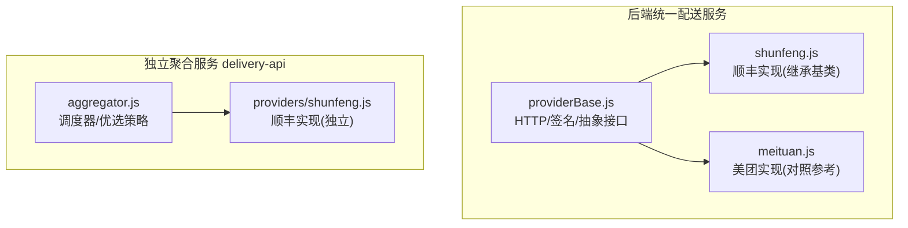
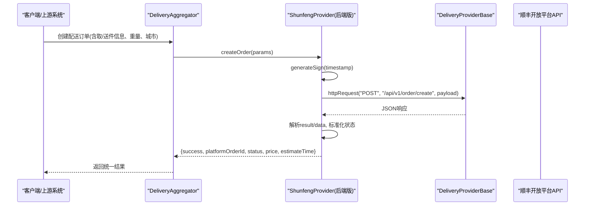
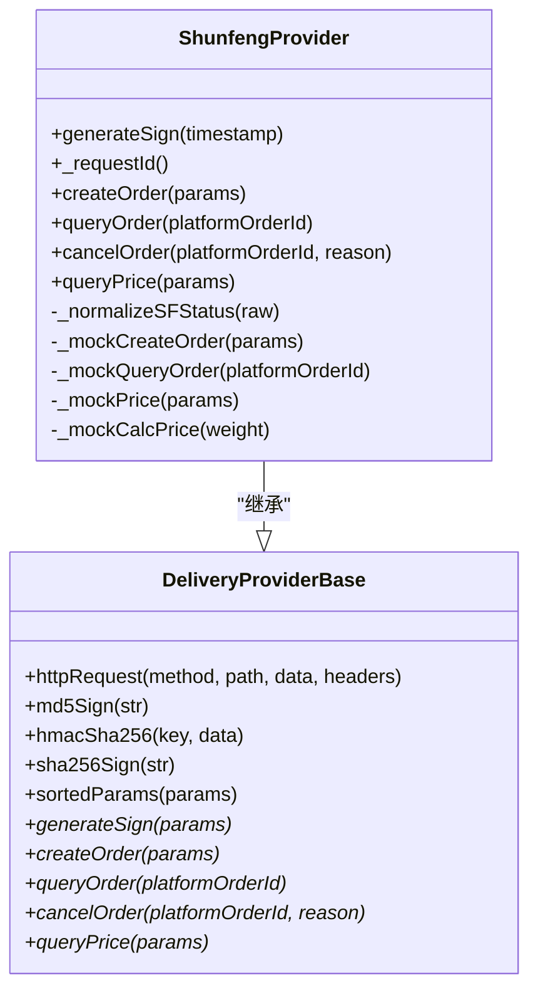
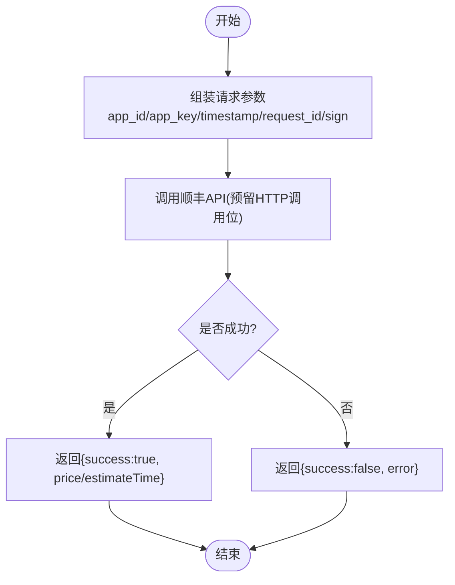
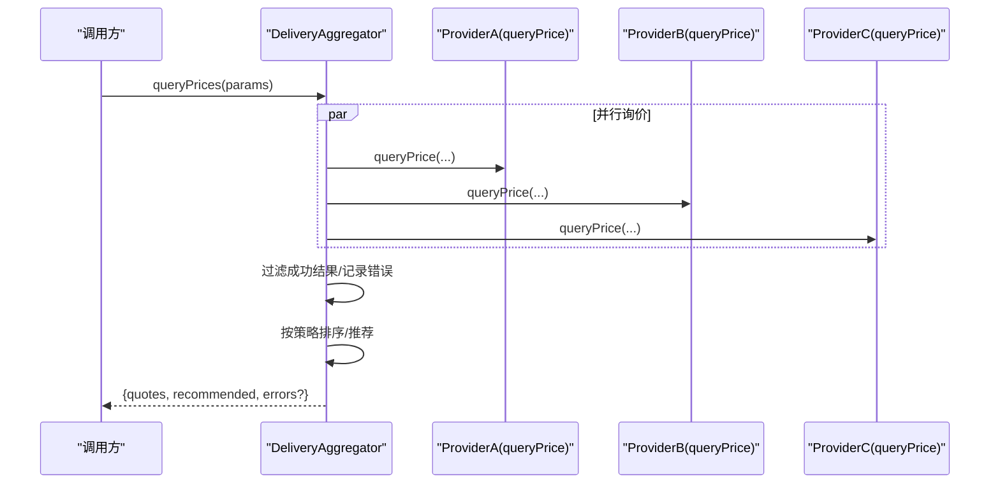
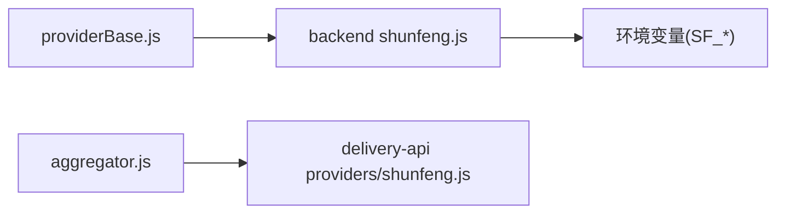

# 顺丰同城接入

<cite>
**本文引用的文件列表**
- [backend/services/deliveryProviders/shunfeng.js](file://backend/services/deliveryProviders/shunfeng.js)
- [backend/services/deliveryProviders/providerBase.js](file://backend/services/deliveryProviders/providerBase.js)
- [delivery-api/providers/shunfeng.js](file://delivery-api/providers/shunfeng.js)
- [delivery-api/aggregator.js](file://delivery-api/aggregator.js)
- [backend/services/deliveryProviders/meituan.js](file://backend/services/deliveryProviders/meituan.js)
- [api/API_DOCUMENTATION.md](file://api/API_DOCUMENTATION.md)
</cite>

## 目录
1. [简介](#简介)
2. [项目结构](#项目结构)
3. [核心组件](#核心组件)
4. [架构总览](#架构总览)
5. [详细组件分析](#详细组件分析)
6. [依赖关系分析](#依赖关系分析)
7. [性能与可靠性](#性能与可靠性)
8. [故障排查指南](#故障排查指南)
9. [结论](#结论)
10. [附录：配置与环境切换](#附录配置与环境切换)

## 简介
本文件面向“顺丰同城”配送服务商的接入与集成，覆盖以下要点：
- API 接口规范：订单创建、费用计算（询价）、实时跟踪（状态查询）与回调通知
- 认证机制与数据签名：MD5/SHA256 两种签名风格在不同实现中的使用
- 与美团跑腿的差异点：地址格式、状态码映射、业务逻辑处理差异
- 配置参数说明：商户号、密钥管理、环境切换（沙箱/生产）
- 业务规则：重量计费、距离计算、服务范围限制的实现思路
- 异常处理与重试机制：超时降级、Mock 兜底、幂等与去重
- 调试与日志最佳实践：请求追踪、错误定位、可观测性建议
- 与其他服务商对比与选择策略：价格、时效、稳定性与推荐算法

## 项目结构
本项目在两个位置实现了“顺丰同城”能力：
- 后端统一配送服务层：基于基类 DeliveryProviderBase 的扩展实现，提供 HTTP 封装、签名工具与 Mock 模式
- 独立聚合服务 delivery-api：以 Provider 形式暴露统一接口，支持多服务商并行询价与自动优选

图表来源
- [backend/services/deliveryProviders/providerBase.js:1-124](file://backend/services/deliveryProviders/providerBase.js#L1-L124)
- [backend/services/deliveryProviders/shunfeng.js:1-262](file://backend/services/deliveryProviders/shunfeng.js#L1-L262)
- [backend/services/deliveryProviders/meituan.js:1-257](file://backend/services/deliveryProviders/meituan.js#L1-L257)
- [delivery-api/aggregator.js:1-237](file://delivery-api/aggregator.js#L1-L237)
- [delivery-api/providers/shunfeng.js:1-256](file://delivery-api/providers/shunfeng.js#L1-L256)

章节来源
- [backend/services/deliveryProviders/providerBase.js:1-124](file://backend/services/deliveryProviders/providerBase.js#L1-L124)
- [backend/services/deliveryProviders/shunfeng.js:1-262](file://backend/services/deliveryProviders/shunfeng.js#L1-L262)
- [delivery-api/aggregator.js:1-237](file://delivery-api/aggregator.js#L1-L237)
- [delivery-api/providers/shunfeng.js:1-256](file://delivery-api/providers/shunfeng.js#L1-L256)

## 核心组件
- 统一配送基类（DeliveryProviderBase）
  - 提供 HTTPS 请求封装、超时控制、通用签名方法（MD5/HMAC-SHA256/SHA256）、参数排序拼接
  - 定义抽象接口：createOrder/queryOrder/cancelOrder/queryPrice
- 顺丰实现（后端版）
  - 通过环境变量加载商户号与校验字，默认指向沙箱域名
  - 签名采用 MD5(timestamp + checkWord)，并生成唯一 request_id
  - 提供 createOrder/queryOrder/cancelOrder/queryPrice 及状态标准化
  - 无密钥时自动进入 Mock 模式，返回合理模拟数据
- 顺丰实现（delivery-api 版）
  - 按 test/prod 双配置注入，签名采用 SHA256（键值排序后拼接 secret）
  - 提供 queryPrice/createOrder/queryOrder/cancelOrder 与模拟数据
- 聚合调度器（DeliveryAggregator）
  - 初始化各 Provider，支持并行询价、结果排序与推荐策略（最低价/最快/综合评分）
  - 支持指定优先服务商或自动选择最优

章节来源
- [backend/services/deliveryProviders/providerBase.js:1-124](file://backend/services/deliveryProviders/providerBase.js#L1-L124)
- [backend/services/deliveryProviders/shunfeng.js:1-262](file://backend/services/deliveryProviders/shunfeng.js#L1-L262)
- [delivery-api/providers/shunfeng.js:1-256](file://delivery-api/providers/shunfeng.js#L1-L256)
- [delivery-api/aggregator.js:1-237](file://delivery-api/aggregator.js#L1-L237)

## 架构总览
下图展示从外部调用到具体服务商实现的端到端流程。

图表来源
- [delivery-api/aggregator.js:137-197](file://delivery-api/aggregator.js#L137-L197)
- [backend/services/deliveryProviders/shunfeng.js:45-95](file://backend/services/deliveryProviders/shunfeng.js#L45-L95)
- [backend/services/deliveryProviders/providerBase.js:35-74](file://backend/services/deliveryProviders/providerBase.js#L35-L74)

## 详细组件分析

### 顺丰实现（后端版）
- 认证与签名
  - 通过环境变量读取商户号与校验字，默认 API 基础域为沙箱地址
  - 签名算法：MD5(timestamp + checkWord)
  - 每个请求携带 partner_id、request_id、timestamp、sign
- 订单创建
  - 接口路径：POST /api/v1/order/create
  - 入参包含取件/收件联系人、电话、经纬度、商品描述、重量、回调地址等
  - 成功时返回平台订单号、内部 deliveryId、初始状态 pending、预估运费与时效
- 状态查询
  - 接口路径：POST /api/v1/order/query
  - 将顺丰原始状态码映射为统一状态（pending/accepted/picking_up/delivering/delivered/cancelled/exception）
  - 返回司机信息与可选位置、距离、预计到达时间
- 取消订单
  - 接口路径：POST /api/v1/order/cancel
  - 支持传入取消原因
- 询价
  - 接口路径：POST /api/v1/order/preCreate
  - 根据取/送经纬度与重量返回预估价格与时效
- Mock 模式
  - 当未配置有效凭证时，自动返回合理的模拟数据，便于联调与演示

图表来源
- [backend/services/deliveryProviders/providerBase.js:1-124](file://backend/services/deliveryProviders/providerBase.js#L1-L124)
- [backend/services/deliveryProviders/shunfeng.js:1-262](file://backend/services/deliveryProviders/shunfeng.js#L1-L262)

章节来源
- [backend/services/deliveryProviders/shunfeng.js:1-262](file://backend/services/deliveryProviders/shunfeng.js#L1-L262)
- [backend/services/deliveryProviders/providerBase.js:1-124](file://backend/services/deliveryProviders/providerBase.js#L1-L124)

### 顺丰实现（delivery-api 版）
- 认证与签名
  - 构造 test/prod 两套配置，签名采用 SHA256（键值排序后拼接 secret）
  - 请求参数包含 app_id/app_key/timestamp/request_id/version 等
- 询价
  - 入参包含取/送地址、重量、城市；返回价格、时效、距离
- 创建订单
  - 入参包含取/送地址、联系人、商品信息、重量、支付类型等
- 状态查询与取消
  - 返回统一结构与模拟数据

图表来源
- [delivery-api/providers/shunfeng.js:50-88](file://delivery-api/providers/shunfeng.js#L50-L88)
- [delivery-api/providers/shunfeng.js:95-152](file://delivery-api/providers/shunfeng.js#L95-L152)

章节来源
- [delivery-api/providers/shunfeng.js:1-256](file://delivery-api/providers/shunfeng.js#L1-L256)

### 聚合调度器（DeliveryAggregator）
- 初始化各 Provider（美团/达达/顺丰），按开关启用
- 并行询价，收集成功结果并按价格排序
- 推荐策略：最低价/最快/综合评分（价格权重0.4，时效权重0.6）
- 创建订单：若指定优先服务商则直调，否则先询价再选择最优

图表来源
- [delivery-api/aggregator.js:54-95](file://delivery-api/aggregator.js#L54-L95)
- [delivery-api/aggregator.js:102-129](file://delivery-api/aggregator.js#L102-L129)

章节来源
- [delivery-api/aggregator.js:1-237](file://delivery-api/aggregator.js#L1-L237)

### 与美团跑腿的差异点
- 地址格式
  - 顺丰（后端版）：shop_address/user_address + shop_lat/shop_lng + user_lat/user_lng
  - 美团：pickup_address/receiver_address + pickup_lat/pickup_lng + receiver_lat/receiver_lng
- 状态码映射
  - 顺丰：10/12/15/20/25/30/35/40/45/50/99 → 统一状态
  - 美团：0/10/20/30/40/50/99 → 统一状态
- 业务逻辑
  - 顺丰：weight 影响价格估算；支持 callback_url 回调
  - 美团：goods_weight/goods_detail 字段；deliveryFee 接口用于询价

章节来源
- [backend/services/deliveryProviders/shunfeng.js:186-215](file://backend/services/deliveryProviders/shunfeng.js#L186-L215)
- [backend/services/deliveryProviders/meituan.js:184-209](file://backend/services/deliveryProviders/meituan.js#L184-L209)
- [backend/services/deliveryProviders/meituan.js:41-93](file://backend/services/deliveryProviders/meituan.js#L41-L93)
- [backend/services/deliveryProviders/shunfeng.js:45-95](file://backend/services/deliveryProviders/shunfeng.js#L45-L95)

## 依赖关系分析
- 后端版
  - ShunfengProvider 依赖 DeliveryProviderBase 提供的 HTTP 与签名能力
  - 通过环境变量注入商户号、校验字与 API 基础域
- delivery-api 版
  - ShunfengProvider 由 aggregator 按需实例化，遵循统一的 Provider 契约
  - aggregator 负责并发询价与推荐策略

图表来源
- [backend/services/deliveryProviders/providerBase.js:1-124](file://backend/services/deliveryProviders/providerBase.js#L1-L124)
- [backend/services/deliveryProviders/shunfeng.js:1-262](file://backend/services/deliveryProviders/shunfeng.js#L1-L262)
- [delivery-api/aggregator.js:1-237](file://delivery-api/aggregator.js#L1-L237)
- [delivery-api/providers/shunfeng.js:1-256](file://delivery-api/providers/shunfeng.js#L1-L256)

章节来源
- [backend/services/deliveryProviders/providerBase.js:1-124](file://backend/services/deliveryProviders/providerBase.js#L1-L124)
- [backend/services/deliveryProviders/shunfeng.js:1-262](file://backend/services/deliveryProviders/shunfeng.js#L1-L262)
- [delivery-api/aggregator.js:1-237](file://delivery-api/aggregator.js#L1-L237)
- [delivery-api/providers/shunfeng.js:1-256](file://delivery-api/providers/shunfeng.js#L1-L256)

## 性能与可靠性
- 并发与容错
  - 聚合层并行询价，使用 Promise.allSettled 保证部分失败不影响整体
  - 单个 Provider 失败时记录错误并继续，最终返回可用报价集合
- 超时与降级
  - 基类设置默认超时（秒级），触发超时即拒绝请求
  - 无密钥或网络异常时自动回退至 Mock 模式，保障链路可用
- 幂等与去重
  - 每次请求生成唯一 request_id，避免重复下单
- 推荐策略
  - 支持最低价、最快、综合评分三种策略，可按业务目标调整权重

章节来源
- [delivery-api/aggregator.js:54-95](file://delivery-api/aggregator.js#L54-L95)
- [delivery-api/aggregator.js:102-129](file://delivery-api/aggregator.js#L102-L129)
- [backend/services/deliveryProviders/providerBase.js:35-74](file://backend/services/deliveryProviders/providerBase.js#L35-L74)
- [backend/services/deliveryProviders/shunfeng.js:36-39](file://backend/services/deliveryProviders/shunfeng.js#L36-L39)

## 故障排查指南
- 常见问题定位
  - 签名失败：检查 timestamp、checkWord/secret 与签名算法（MD5 vs SHA256）
  - 地址无效：确认经纬度与详细地址格式是否符合对方要求
  - 状态不一致：核对状态码映射表，确保上层统一状态正确
- 日志与追踪
  - 记录 request_id、partner_id、timestamp、sign 摘要（脱敏）
  - 打印完整请求体与响应体（敏感字段需脱敏）
  - 对异常堆栈进行结构化输出，便于检索
- 快速验证
  - 使用 Mock 模式验证业务流程
  - 逐步切换到真实环境，先询价后下单，观察差异

章节来源
- [backend/services/deliveryProviders/shunfeng.js:88-94](file://backend/services/deliveryProviders/shunfeng.js#L88-L94)
- [backend/services/deliveryProviders/shunfeng.js:121-124](file://backend/services/deliveryProviders/shunfeng.js#L121-L124)
- [backend/services/deliveryProviders/meituan.js:86-92](file://backend/services/deliveryProviders/meituan.js#L86-L92)

## 结论
- 本项目提供了两套“顺丰同城”实现：后端统一服务层与独立聚合服务，均具备完整的订单生命周期能力
- 通过基类抽象与 Provider 模式，实现跨服务商的统一接入与可扩展
- 结合 Mock 模式、并发询价与推荐策略，兼顾开发效率与生产可用性
- 建议在上线前完成沙箱联调、签名与状态映射回归测试，并完善日志与监控

## 附录：配置与环境切换
- 环境变量（后端版）
  - SF_API_URL：顺丰 API 基础地址（默认沙箱）
  - SF_PARTNER_ID：商户号
  - SF_CHECK_WORD：校验字
- 配置对象（delivery-api 版）
  - test/prod 两套配置，包含 appId/appKey/secret 等
  - aggregator 根据 NODE_ENV 选择对应配置
- 环境切换建议
  - 开发/联调：使用沙箱域名与测试密钥
  - 预发/生产：切换至生产域名与正式密钥，关闭 Mock 模式
- 对外 API 参考
  - 聚合跑腿服务 API 文档见：[api/API_DOCUMENTATION.md](file://api/API_DOCUMENTATION.md)

章节来源
- [backend/services/deliveryProviders/shunfeng.js:16-28](file://backend/services/deliveryProviders/shunfeng.js#L16-L28)
- [delivery-api/providers/shunfeng.js:8-14](file://delivery-api/providers/shunfeng.js#L8-L14)
- [delivery-api/aggregator.js:11-16](file://delivery-api/aggregator.js#L11-L16)
- [api/API_DOCUMENTATION.md:123-220](file://api/API_DOCUMENTATION.md#L123-L220)