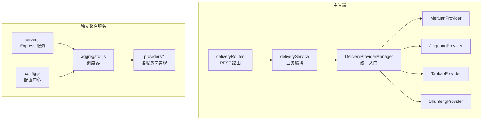
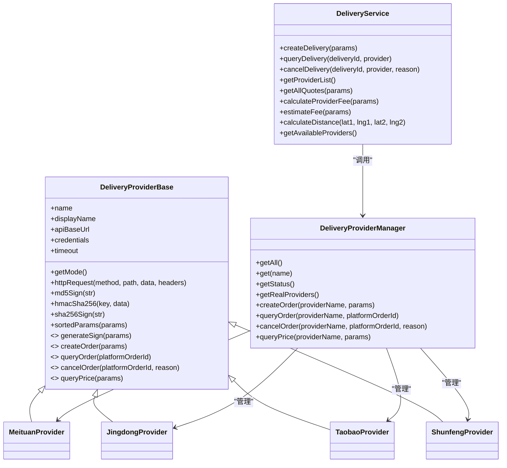
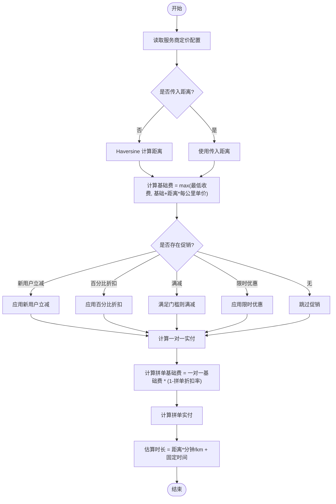
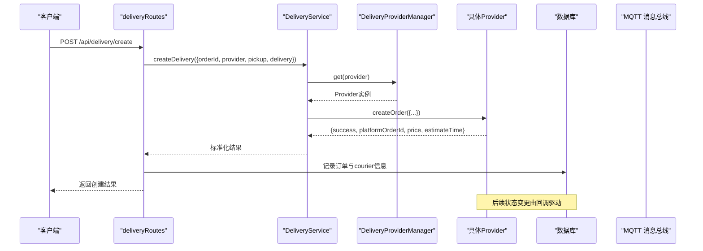
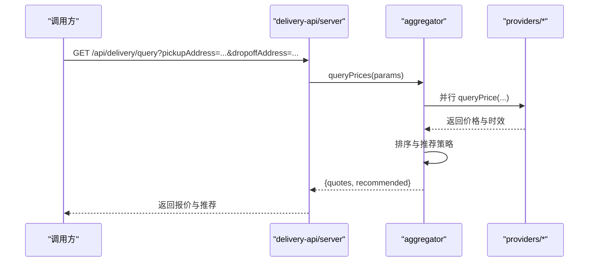
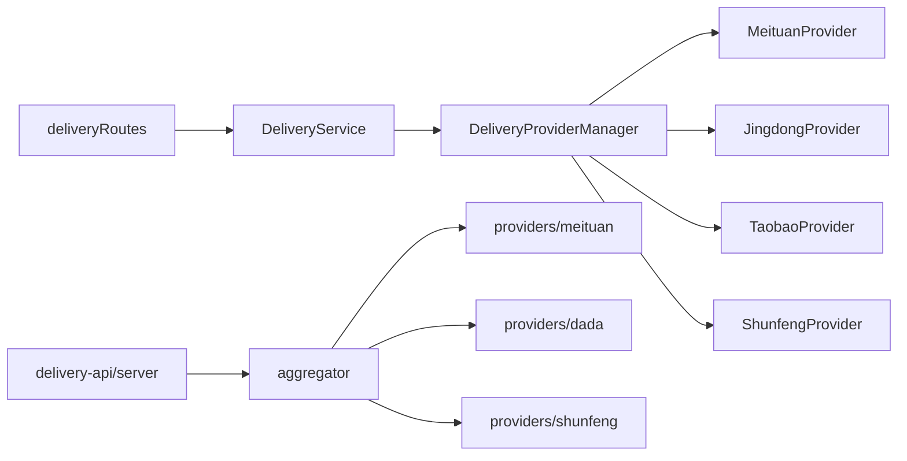

# 配送聚合服务

<cite>
**本文引用的文件**   
- [backend/services/deliveryProviders/index.js](file://backend/services/deliveryProviders/index.js)
- [backend/services/deliveryProviders/providerBase.js](file://backend/services/deliveryProviders/providerBase.js)
- [backend/services/deliveryProviders/meituan.js](file://backend/services/deliveryProviders/meituan.js)
- [backend/services/deliveryProviders/jingdong.js](file://backend/services/deliveryProviders/jingdong.js)
- [backend/services/deliveryProviders/taobao.js](file://backend/services/deliveryProviders/taobao.js)
- [backend/services/deliveryProviders/shunfeng.js](file://backend/services/deliveryProviders/shunfeng.js)
- [backend/modules/common/services/deliveryService.js](file://backend/modules/common/services/deliveryService.js)
- [backend/modules/common/routes/deliveryRoutes.js](file://backend/modules/common/routes/deliveryRoutes.js)
- [delivery-api/aggregator.js](file://delivery-api/aggregator.js)
- [delivery-api/server.js](file://delivery-api/server.js)
- [delivery-api/config.js](file://delivery-api/config.js)
- [delivery-api/providers/meituan.js](file://delivery-api/providers/meituan.js)
- [delivery-api/providers/dada.js](file://delivery-api/providers/dada.js)
- [delivery-api/providers/shunfeng.js](file://delivery-api/providers/shunfeng.js)
</cite>

## 目录
1. [简介](#简介)
2. [项目结构](#项目结构)
3. [核心组件](#核心组件)
4. [架构总览](#架构总览)
5. [详细组件分析](#详细组件分析)
6. [依赖关系分析](#依赖关系分析)
7. [性能与可用性](#性能与可用性)
8. [故障排查指南](#故障排查指南)
9. [结论](#结论)
10. [附录：新服务商接入指南](#附录新服务商接入指南)

## 简介
本文件面向干洗店管理系统的“配送聚合服务”，系统性阐述多平台物流服务的统一接口抽象、适配器模式实现、已集成的配送服务商（美团跑腿、京东秒送、淘宝闪送、顺丰同城）对接细节，以及费用计算、状态跟踪、监控指标、性能优化与故障排查方法。文档同时提供新配送服务商的接入规范、测试方法与上线流程，帮助开发与运营人员快速理解并扩展系统能力。

## 项目结构
本项目包含两套相关实现：
- 主后端集成：在 backend 模块中通过 deliveryProviders 子模块实现各服务商适配，并通过 deliveryService 暴露统一的业务接口；路由层 deliveryRoutes 对外提供 REST API。
- 独立聚合服务：delivery-api 作为独立微服务，提供聚合调度、询价、下单、查询等接口，内部同样按服务商拆分 provider 实现。

图示来源
- [backend/modules/common/routes/deliveryRoutes.js:1-323](file://backend/modules/common/routes/deliveryRoutes.js#L1-L323)
- [backend/modules/common/services/deliveryService.js:1-322](file://backend/modules/common/services/deliveryService.js#L1-L322)
- [backend/services/deliveryProviders/index.js:1-87](file://backend/services/deliveryProviders/index.js#L1-L87)
- [delivery-api/aggregator.js:1-237](file://delivery-api/aggregator.js#L1-L237)
- [delivery-api/server.js:1-377](file://delivery-api/server.js#L1-L377)
- [delivery-api/config.js:1-93](file://delivery-api/config.js#L1-L93)

章节来源
- [backend/modules/common/routes/deliveryRoutes.js:1-323](file://backend/modules/common/routes/deliveryRoutes.js#L1-L323)
- [backend/modules/common/services/deliveryService.js:1-322](file://backend/modules/common/services/deliveryService.js#L1-L322)
- [backend/services/deliveryProviders/index.js:1-87](file://backend/services/deliveryProviders/index.js#L1-L87)
- [delivery-api/aggregator.js:1-237](file://delivery-api/aggregator.js#L1-L237)
- [delivery-api/server.js:1-377](file://delivery-api/server.js#L1-L377)
- [delivery-api/config.js:1-93](file://delivery-api/config.js#L1-L93)

## 核心组件
- 统一入口与适配器
  - DeliveryProviderManager：集中注册与管理各服务商实例，屏蔽差异，对外提供 createOrder/queryOrder/cancelOrder/queryPrice 等统一方法。
  - DeliveryProviderBase：封装 HTTPS 请求、签名算法、参数排序、超时控制等通用能力，定义抽象接口供具体服务商继承实现。
- 业务编排与定价
  - DeliveryService：负责调用 ProviderManager 完成下单、查询、取消；并提供本地定价策略（距离、重量、促销、拼单折扣等）。
- 路由与回调
  - deliveryRoutes：对外暴露 REST 接口，处理创建订单、查询状态、取消、报价估算、回调更新等业务。
- 独立聚合服务
  - aggregator：并行询价、推荐策略、自动选择最优服务商下单。
  - server：基于 Express 的 HTTP 服务，暴露聚合配送 API。
  - config：统一管理各服务商测试/生产环境配置。

章节来源
- [backend/services/deliveryProviders/index.js:1-87](file://backend/services/deliveryProviders/index.js#L1-L87)
- [backend/services/deliveryProviders/providerBase.js:1-124](file://backend/services/deliveryProviders/providerBase.js#L1-L124)
- [backend/modules/common/services/deliveryService.js:1-322](file://backend/modules/common/services/deliveryService.js#L1-L322)
- [backend/modules/common/routes/deliveryRoutes.js:1-323](file://backend/modules/common/routes/deliveryRoutes.js#L1-L323)
- [delivery-api/aggregator.js:1-237](file://delivery-api/aggregator.js#L1-L237)
- [delivery-api/server.js:1-377](file://delivery-api/server.js#L1-L377)
- [delivery-api/config.js:1-93](file://delivery-api/config.js#L1-L93)

## 架构总览
整体采用“适配器模式 + 统一入口”的分层设计：上层业务仅依赖统一接口，底层通过不同 Provider 适配第三方开放平台。独立聚合服务可作为微服务部署，提供跨端一致的配送能力。

图示来源
- [backend/services/deliveryProviders/providerBase.js:1-124](file://backend/services/deliveryProviders/providerBase.js#L1-L124)
- [backend/services/deliveryProviders/meituan.js:1-257](file://backend/services/deliveryProviders/meituan.js#L1-L257)
- [backend/services/deliveryProviders/jingdong.js:1-278](file://backend/services/deliveryProviders/jingdong.js#L1-L278)
- [backend/services/deliveryProviders/taobao.js:1-263](file://backend/services/deliveryProviders/taobao.js#L1-L263)
- [backend/services/deliveryProviders/shunfeng.js:1-262](file://backend/services/deliveryProviders/shunfeng.js#L1-L262)
- [backend/services/deliveryProviders/index.js:1-87](file://backend/services/deliveryProviders/index.js#L1-L87)
- [backend/modules/common/services/deliveryService.js:1-322](file://backend/modules/common/services/deliveryService.js#L1-L322)

## 详细组件分析

### 统一入口与基类
- 统一入口（DeliveryProviderManager）
  - 职责：维护所有 Provider 实例，提供获取列表、状态、真实可用列表及统一操作接口。
  - 关键点：根据是否配置密钥自动切换 real/mock 模式，便于开发联调与生产稳定运行。
- 基类（DeliveryProviderBase）
  - 职责：封装 HTTPS 请求、MD5/HMAC-SHA256/SHA256 签名、参数排序、超时控制等。
  - 抽象接口：generateSign、createOrder、queryOrder、cancelOrder、queryPrice 由子类实现。

章节来源
- [backend/services/deliveryProviders/index.js:1-87](file://backend/services/deliveryProviders/index.js#L1-L87)
- [backend/services/deliveryProviders/providerBase.js:1-124](file://backend/services/deliveryProviders/providerBase.js#L1-L124)

### 美团跑腿适配
- 签名与请求
  - 使用 MD5(app_id + timestamp + secret) 生成签名。
  - 创建订单、查询状态、取消、询价分别对应各自 API 路径。
- Mock 降级
  - 未配置密钥或网络异常时返回合理模拟数据，保证前端体验与联调顺畅。
- 状态映射
  - 将平台状态码映射为统一状态（pending/accepted/picking_up/delivering/delivered/cancelled/exception），并补充骑手信息与 ETA。

章节来源
- [backend/services/deliveryProviders/meituan.js:1-257](file://backend/services/deliveryProviders/meituan.js#L1-L257)

### 京东秒送（达达）适配
- 签名与请求
  - 对参数按 key 排序拼接后追加 appSecret，取 MD5 大写。
  - 提供专用 _dadaRequest 方法处理 JSON body 与错误回退。
- 状态映射
  - 将达达状态码映射到统一状态，支持骑手位置与距离字段。
- Mock 降级
  - 无密钥或异常时返回模拟价格与时间，保障链路可用。

章节来源
- [backend/services/deliveryProviders/jingdong.js:1-278](file://backend/services/deliveryProviders/jingdong.js#L1-L278)

### 淘宝闪送（蜂鸟）适配
- 签名与请求
  - 使用 sortedParams + secret 的 MD5 签名。
  - 重量单位换算为克，符合蜂鸟要求。
- 状态映射
  - 将蜂鸟订单状态字符串映射为统一状态，支持骑手信息。
- Mock 降级
  - 无密钥或异常时返回模拟结果。

章节来源
- [backend/services/deliveryProviders/taobao.js:1-263](file://backend/services/deliveryProviders/taobao.js#L1-L263)

### 顺丰同城适配
- 签名与请求
  - 使用 MD5(timestamp + checkWord) 生成签名。
  - 提供预下单询价接口以获取预估费用与时效。
- 状态映射
  - 将顺丰状态码映射为统一状态，支持骑手位置与 ETA。
- Mock 降级
  - 无密钥或异常时返回模拟结果。

章节来源
- [backend/services/deliveryProviders/shunfeng.js:1-262](file://backend/services/deliveryProviders/shunfeng.js#L1-L262)

### 业务编排与定价策略（DeliveryService）
- 统一调用
  - 通过 ProviderManager 分发到具体 Provider，屏蔽差异。
- 定价模型
  - 基础费 + 距离附加费（每公里单价）、最低收费限制。
  - 促销类型：新用户立减、百分比折扣、满减、限时优惠。
  - 拼单折扣：按配置比例打折，输出一对一与拼单两种报价。
- 距离计算
  - 使用 Haversine 公式计算经纬度距离。
- 报价聚合
  - 一键获取所有服务商报价，含预估时长与优惠信息。

图示来源
- [backend/modules/common/services/deliveryService.js:117-303](file://backend/modules/common/services/deliveryService.js#L117-L303)

章节来源
- [backend/modules/common/services/deliveryService.js:1-322](file://backend/modules/common/services/deliveryService.js#L1-322)

### 路由与回调（deliveryRoutes）
- 对外接口
  - 获取服务商列表与接入状态、一键报价、估算费用、创建订单、查询状态、取消订单。
- 回调处理
  - 接收服务商状态推送，映射为系统 courier 状态，更新数据库并通过 MQTT 推送给 C 端实时展示。
- 跟踪模拟
  - 提供启动跟踪模拟接口，用于开发调试与演示。

图示来源
- [backend/modules/common/routes/deliveryRoutes.js:86-133](file://backend/modules/common/routes/deliveryRoutes.js#L86-L133)
- [backend/modules/common/services/deliveryService.js:45-70](file://backend/modules/common/services/deliveryService.js#L45-L70)
- [backend/services/deliveryProviders/index.js:57-62](file://backend/services/deliveryProviders/index.js#L57-L62)

章节来源
- [backend/modules/common/routes/deliveryRoutes.js:1-323](file://backend/modules/common/routes/deliveryRoutes.js#L1-L323)

### 独立聚合服务（delivery-api）
- 调度器（aggregator）
  - 并行询价多家服务商，按策略（最低价/最快/综合推荐）选择最优，再下单。
- 服务（server）
  - 基于 Express 暴露健康检查、服务商列表、询价、下单、查询、取消等接口。
- 配置（config）
  - 统一管理测试/生产环境 URL、密钥、默认策略、回调地址等。

图示来源
- [delivery-api/aggregator.js:54-95](file://delivery-api/aggregator.js#L54-L95)
- [delivery-api/server.js:56-83](file://delivery-api/server.js#L56-L83)
- [delivery-api/config.js:80-92](file://delivery-api/config.js#L80-L92)

章节来源
- [delivery-api/aggregator.js:1-237](file://delivery-api/aggregator.js#L1-L237)
- [delivery-api/server.js:1-377](file://delivery-api/server.js#L1-L377)
- [delivery-api/config.js:1-93](file://delivery-api/config.js#L1-L93)

## 依赖关系分析
- 耦合与内聚
  - Provider 之间相互独立，通过基类与统一入口解耦；业务层仅依赖统一接口，内聚于定价与编排逻辑。
- 外部依赖
  - 各 Provider 依赖第三方开放平台 API；独立聚合服务依赖 Express、CORS、body-parser。
- 潜在循环依赖
  - 当前结构未见循环引用；Provider 不反向依赖业务层。
- 接口契约
  - 统一响应格式：{ success, provider, platformOrderId, status, price, estimateTime, driver, distance, eta }。

图示来源
- [backend/modules/common/routes/deliveryRoutes.js:1-323](file://backend/modules/common/routes/deliveryRoutes.js#L1-L323)
- [backend/modules/common/services/deliveryService.js:1-322](file://backend/modules/common/services/deliveryService.js#L1-L322)
- [backend/services/deliveryProviders/index.js:1-87](file://backend/services/deliveryProviders/index.js#L1-L87)
- [delivery-api/server.js:1-377](file://delivery-api/server.js#L1-L377)
- [delivery-api/aggregator.js:1-237](file://delivery-api/aggregator.js#L1-L237)

章节来源
- [backend/modules/common/routes/deliveryRoutes.js:1-323](file://backend/modules/common/routes/deliveryRoutes.js#L1-L323)
- [backend/modules/common/services/deliveryService.js:1-322](file://backend/modules/common/services/deliveryService.js#L1-L322)
- [backend/services/deliveryProviders/index.js:1-87](file://backend/services/deliveryProviders/index.js#L1-L87)
- [delivery-api/server.js:1-377](file://delivery-api/server.js#L1-L377)
- [delivery-api/aggregator.js:1-237](file://delivery-api/aggregator.js#L1-L237)

## 性能与可用性
- 并发与容错
  - 独立聚合服务并行询价，使用 Promise.allSettled 收集结果，避免单点失败影响整体。
  - Provider 层具备超时控制与异常捕获，并在失败时降级至 mock，提升可用性。
- 缓存与重试
  - 建议对常用路线的价格与时效进行短时缓存；对关键接口增加重试与熔断机制。
- 资源与连接
  - 复用 HTTPS 连接池（可引入 http.Agent 或第三方库）减少握手开销。
- 监控指标
  - 成功率、P95/P99 延迟、错误分类（签名失败、超时、平台错误）、Mock 模式占比、回调处理耗时。
- 容量规划
  - 针对高峰时段扩容独立聚合服务实例，配合负载均衡与水平扩展。

[本节为通用指导，无需特定文件来源]

## 故障排查指南
- 常见问题定位
  - 签名失败：核对各 Provider 的签名算法与参数顺序，确认密钥与环境变量。
  - 超时：检查网络连通性、目标平台限流与超时阈值设置。
  - 回调未触发：确认回调地址公网可达、域名与端口正确、防火墙放行。
- 日志与追踪
  - 在各 Provider 的关键步骤打印结构化日志，包含 orderId、platformOrderId、provider、error。
  - 结合回调日志与数据库 courier 字段变化，定位状态不一致问题。
- 快速验证
  - 使用 /api/delivery/providers 与 /api/delivery/query 接口验证服务商可用性与报价。
  - 使用 /api/delivery/:orderId/start-tracking 启动跟踪模拟，观察 C 端实时更新。

章节来源
- [backend/modules/common/routes/deliveryRoutes.js:12-26](file://backend/modules/common/routes/deliveryRoutes.js#L12-L26)
- [backend/modules/common/routes/deliveryRoutes.js:282-320](file://backend/modules/common/routes/deliveryRoutes.js#L282-L320)

## 结论
本配送聚合服务通过适配器模式与统一入口，有效屏蔽了多平台差异，提供了稳定的下单、查询、取消与报价能力；结合本地定价策略与回调驱动的状态同步，实现了端到端的配送可视化。独立聚合服务进一步提升了可扩展性与部署灵活性。建议在现有基础上完善监控、缓存与重试机制，持续提升稳定性与用户体验。

[本节为总结，无需特定文件来源]

## 附录：新服务商接入指南

### 接口规范
- 必须实现的抽象方法
  - generateSign(params)：按平台规则生成签名。
  - createOrder(params)：创建配送订单，返回统一格式。
  - queryOrder(platformOrderId)：查询订单状态，返回统一格式。
  - cancelOrder(platformOrderId, reason)：取消订单，返回统一格式。
  - queryPrice(params)：询价，返回统一格式。
- 统一响应字段
  - success、provider、platformOrderId、status、price、estimateTime、driver、distance、eta。

章节来源
- [backend/services/deliveryProviders/providerBase.js:105-121](file://backend/services/deliveryProviders/providerBase.js#L105-L121)

### 接入步骤
- 新建 Provider 类
  - 继承 DeliveryProviderBase，实现上述抽象方法。
  - 在构造函数中配置 name、displayName、apiBaseUrl、credentials、timeout。
- 注册到统一入口
  - 在 DeliveryProviderManager 的 providers 对象中新增实例键值对。
- 配置环境变量
  - 在 config 或环境变量中配置对应密钥与 API 地址。
- 本地联调
  - 未配置密钥时自动进入 mock 模式，验证业务流程。
- 上线流程
  - 配置生产密钥，切换到 real 模式；灰度放量，监控关键指标；逐步全量。

章节来源
- [backend/services/deliveryProviders/index.js:20-28](file://backend/services/deliveryProviders/index.js#L20-L28)
- [delivery-api/config.js:10-78](file://delivery-api/config.js#L10-L78)

### 测试方法
- 单元测试
  - 覆盖签名算法、参数排序、异常分支与 mock 降级。
- 集成测试
  - 使用沙箱环境调用真实 API，校验下单、查询、取消、询价全流程。
- 回归测试
  - 确保新增 Provider 不影响既有 Provider 的行为。

章节来源
- [backend/services/deliveryProviders/meituan.js:211-253](file://backend/services/deliveryProviders/meituan.js#L211-L253)
- [backend/services/deliveryProviders/jingdong.js:233-274](file://backend/services/deliveryProviders/jingdong.js#L233-L274)
- [backend/services/deliveryProviders/taobao.js:218-259](file://backend/services/deliveryProviders/taobao.js#L218-L259)
- [backend/services/deliveryProviders/shunfeng.js:217-258](file://backend/services/deliveryProviders/shunfeng.js#L217-L258)