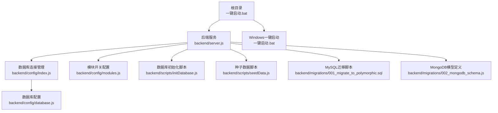
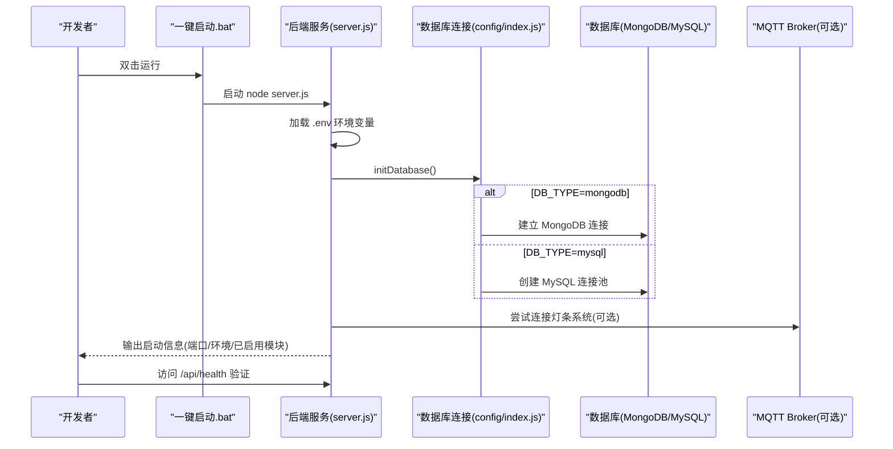
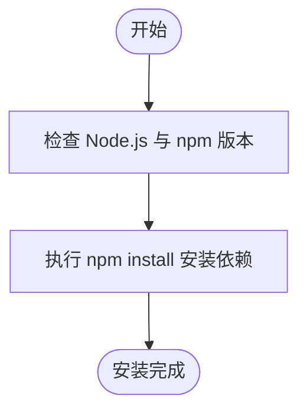
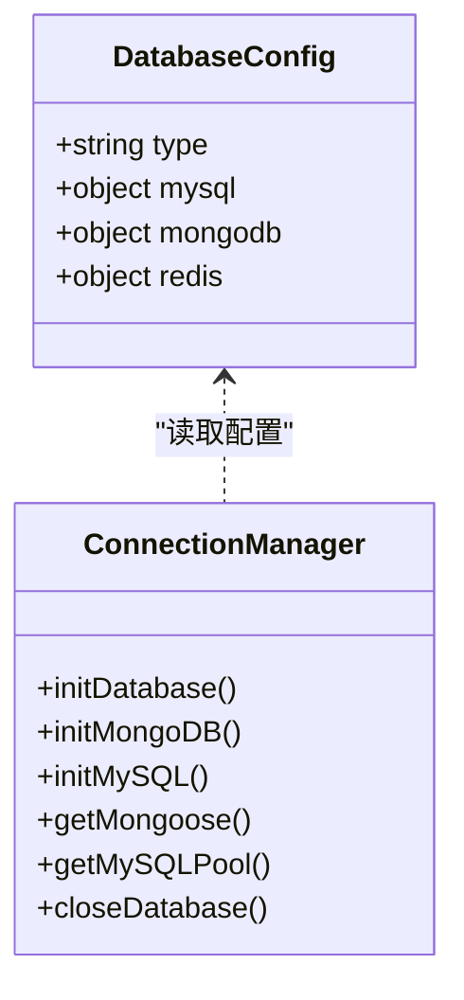
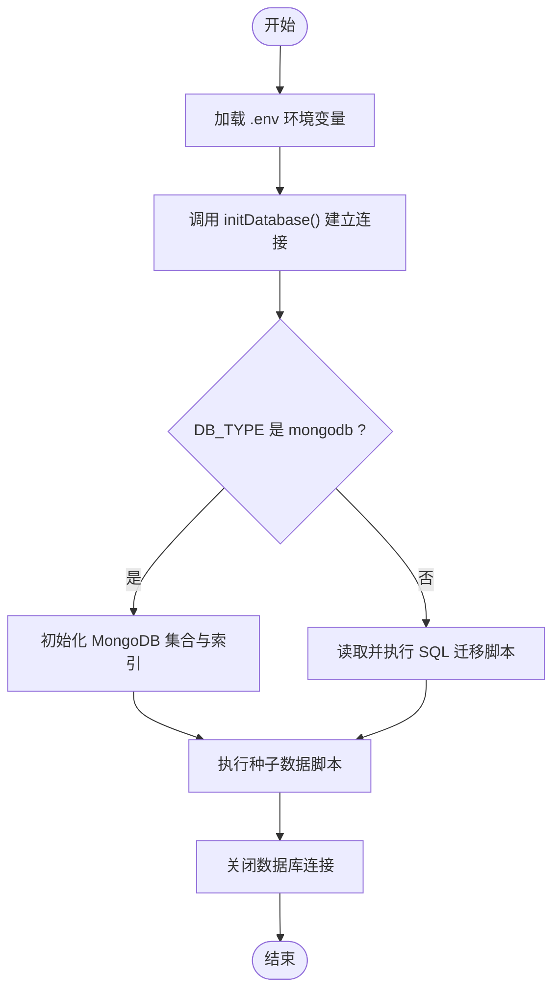
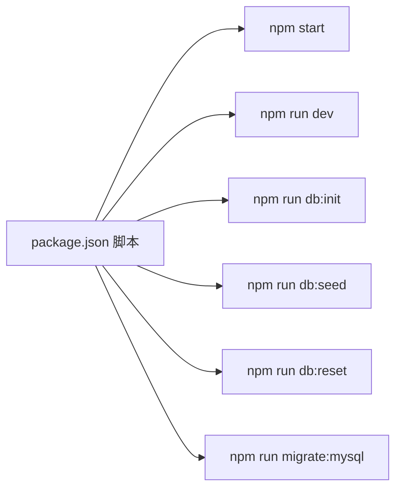

# 快速开始指南

<cite>
**本文引用的文件**   
- [backend/QUICKSTART.md](file://backend/QUICKSTART.md)
- [backend/package.json](file://backend/package.json)
- [backend/config/index.js](file://backend/config/index.js)
- [backend/config/database.js](file://backend/config/database.js)
- [backend/.env.example](file://backend/.env.example)
- [backend/scripts/setup.sh](file://backend/scripts/setup.sh)
- [backend/scripts/setup.ps1](file://backend/scripts/setup.ps1)
- [backend/scripts/initDatabase.js](file://backend/scripts/initDatabase.js)
- [backend/scripts/seedData.js](file://backend/scripts/seedData.js)
- [backend/server.js](file://backend/server.js)
- [backend/migrations/001_migrate_to_polymorphic.sql](file://backend/migrations/001_migrate_to_polymorphic.sql)
- [backend/migrations/002_mongodb_schema.js](file://backend/migrations/002_mongodb_schema.js)
- [backend/config/modules.js](file://backend/config/modules.js)
- [backend/scripts/testConnection.js](file://backend/scripts/testConnection.js)
- [一键启动.bat](file://一键启动.bat)
</cite>

## 目录
1. [简介](#简介)
2. [项目结构](#项目结构)
3. [核心组件](#核心组件)
4. [架构总览](#架构总览)
5. [详细组件分析](#详细组件分析)
6. [依赖分析](#依赖分析)
7. [性能考虑](#性能考虑)
8. [故障排查指南](#故障排查指南)
9. [结论](#结论)
10. [附录](#附录)

## 简介
本指南面向新加入的开发者，提供干洗店管理系统的“最短路径”快速上手体验。内容涵盖：
- Node.js 环境要求与依赖安装
- 数据库选择与配置（MongoDB 或 MySQL）
- 环境变量配置（数据库、第三方服务密钥等）
- 一键启动脚本使用说明
- 基本服务验证步骤
- 常见问题与故障排查方法

目标是帮助你在最短时间内完成本地开发环境的搭建并成功运行后端服务。

## 项目结构
本项目采用模块化后端架构，核心入口位于 backend 目录，支持 MongoDB 和 MySQL 双数据库，并提供初始化与种子数据脚本、模块开关配置、统一错误处理与优雅关闭机制。根目录提供一键启动脚本，简化启动流程。

图表来源
- [backend/server.js:1-120](file://backend/server.js#L1-L120)
- [backend/config/index.js:1-120](file://backend/config/index.js#L1-L120)
- [backend/config/database.js:1-65](file://backend/config/database.js#L1-L65)
- [backend/config/modules.js:1-120](file://backend/config/modules.js#L1-L120)
- [backend/scripts/initDatabase.js:1-60](file://backend/scripts/initDatabase.js#L1-L60)
- [backend/scripts/seedData.js:1-40](file://backend/scripts/seedData.js#L1-L40)
- [backend/migrations/001_migrate_to_polymorphic.sql:1-60](file://backend/migrations/001_migrate_to_polymorphic.sql#L1-L60)
- [backend/migrations/002_mongodb_schema.js:1-60](file://backend/migrations/002_mongodb_schema.js#L1-L60)
- [一键启动.bat:1-59](file://一键启动.bat#L1-L59)

章节来源
- [backend/QUICKSTART.md:1-161](file://backend/QUICKSTART.md#L1-L161)
- [backend/package.json:1-43](file://backend/package.json#L1-L43)
- [backend/server.js:1-120](file://backend/server.js#L1-L120)
- [backend/config/index.js:1-120](file://backend/config/index.js#L1-L120)
- [backend/config/database.js:1-65](file://backend/config/database.js#L1-L65)
- [backend/config/modules.js:1-120](file://backend/config/modules.js#L1-L120)
- [backend/scripts/initDatabase.js:1-60](file://backend/scripts/initDatabase.js#L1-L60)
- [backend/scripts/seedData.js:1-40](file://backend/scripts/seedData.js#L1-L40)
- [backend/migrations/001_migrate_to_polymorphic.sql:1-60](file://backend/migrations/001_migrate_to_polymorphic.sql#L1-L60)
- [backend/migrations/002_mongodb_schema.js:1-60](file://backend/migrations/002_mongodb_schema.js#L1-L60)
- [一键启动.bat:1-59](file://一键启动.bat#L1-L59)

## 核心组件
- 后端入口与路由挂载：负责加载环境变量、中间件、健康检查、业务模块路由、支付接口、消息中心、跨端同步等。
- 数据库连接管理：单例模式，支持 MongoDB 与 MySQL 两种连接方式，提供连接池与事务便捷方法。
- 数据库配置：从环境变量读取 DB_TYPE、MongoDB URI、MySQL 连接参数、Redis 可选配置。
- 模块开关：控制各业务模块启用状态与功能特性开关。
- 初始化与种子数据：分别用于创建集合/表结构与插入测试数据。
- 迁移脚本：MySQL 多态字段与新增表；MongoDB 模型定义与索引策略。
- 一键启动脚本：检测端口占用、自动启动后端服务并提示访问地址。

章节来源
- [backend/server.js:1-120](file://backend/server.js#L1-L120)
- [backend/config/index.js:1-120](file://backend/config/index.js#L1-L120)
- [backend/config/database.js:1-65](file://backend/config/database.js#L1-L65)
- [backend/config/modules.js:1-120](file://backend/config/modules.js#L1-L120)
- [backend/scripts/initDatabase.js:1-60](file://backend/scripts/initDatabase.js#L1-L60)
- [backend/scripts/seedData.js:1-40](file://backend/scripts/seedData.js#L1-L40)
- [backend/migrations/001_migrate_to_polymorphic.sql:1-60](file://backend/migrations/001_migrate_to_polymorphic.sql#L1-L60)
- [backend/migrations/002_mongodb_schema.js:1-60](file://backend/migrations/002_mongodb_schema.js#L1-L60)
- [一键启动.bat:1-59](file://一键启动.bat#L1-L59)

## 架构总览
下图展示了后端服务的启动流程与环境交互关系，包括环境变量加载、数据库初始化、MQTT 客户端连接尝试、HTTP 服务监听与优雅关闭。

图表来源
- [backend/server.js:615-702](file://backend/server.js#L615-L702)
- [backend/config/index.js:19-88](file://backend/config/index.js#L19-L88)
- [backend/config/database.js:6-48](file://backend/config/database.js#L6-L48)
- [backend/.env.example:1-40](file://backend/.env.example#L1-L40)

## 详细组件分析

### 环境准备与依赖安装
- Node.js 版本要求：>= 16.x；npm >= 8.x
- 进入 backend 目录执行依赖安装
- 使用平台脚本进行自动化安装检查与依赖安装（PowerShell 或 Bash）

图表来源
- [backend/QUICKSTART.md:10-16](file://backend/QUICKSTART.md#L10-L16)
- [backend/scripts/setup.ps1:10-42](file://backend/scripts/setup.ps1#L10-L42)
- [backend/scripts/setup.sh:12-42](file://backend/scripts/setup.sh#L12-L42)
- [backend/package.json:25-41](file://backend/package.json#L25-L41)

章节来源
- [backend/QUICKSTART.md:1-20](file://backend/QUICKSTART.md#L1-L20)
- [backend/scripts/setup.ps1:1-58](file://backend/scripts/setup.ps1#L1-L58)
- [backend/scripts/setup.sh:1-58](file://backend/scripts/setup.sh#L1-L58)
- [backend/package.json:1-43](file://backend/package.json#L1-L43)

### 数据库选择与配置
- 支持 MongoDB 与 MySQL 二选一
- 通过环境变量 DB_TYPE 切换数据库类型
- MongoDB 使用 MONGODB_URI；MySQL 使用 MYSQL_HOST、MYSQL_PORT、MYSQL_USER、MYSQL_PASSWORD、MYSQL_DATABASE
- Redis 为可选缓存配置项

图表来源
- [backend/config/database.js:6-65](file://backend/config/database.js#L6-L65)
- [backend/config/index.js:19-126](file://backend/config/index.js#L19-L126)

章节来源
- [backend/.env.example:36-58](file://backend/.env.example#L36-L58)
- [backend/config/database.js:1-65](file://backend/config/database.js#L1-L65)
- [backend/config/index.js:1-120](file://backend/config/index.js#L1-L120)

### 环境变量配置方法
- 复制示例文件为 .env 并填写实际值
- 关键配置项：
  - 服务器：PORT、NODE_ENV
  - 数据库：DB_TYPE、MONGODB_URI 或 MYSQL_* 系列
  - 微信：WECHAT_APP_ID、WECHAT_MCH_ID、WECHAT_API_KEY、WECHAT_API_SECRET
  - 配送：MEITUAN_*、DADA_*、SHUNFENG_*
  - 短信：TENCENT_SMS_*
  - 存储：COS_*
  - 业务：MODULE_* 开关、PLATFORM_COMMISSION_RATE、DEFAULT_DEPOSIT_RATIO、VIP_DEPOSIT_RATIO、MIN_FULFILLMENT_SCORE、MAX_CANCELLED_ORDERS

章节来源
- [backend/.env.example:1-121](file://backend/.env.example#L1-L121)

### 一键启动脚本使用说明
- 双击根目录的一键启动脚本即可检测端口占用并自动启动后端服务
- 若服务已在运行，将直接显示访问地址
- 若启动失败，会提示手动启动命令

章节来源
- [一键启动.bat:1-59](file://一键启动.bat#L1-L59)

### 服务启动与常用命令
- 生产模式：npm start
- 开发模式（自动重启）：npm run dev
- 初始化数据库：npm run db:init
- 创建测试数据：npm run db:seed
- 重置数据库：npm run db:reset
- MySQL 迁移：npm run migrate:mysql

章节来源
- [backend/package.json:6-15](file://backend/package.json#L6-L15)
- [backend/QUICKSTART.md:80-100](file://backend/QUICKSTART.md#L80-L100)

### 数据库初始化与种子数据
- 初始化脚本会根据 DB_TYPE 选择 MongoDB 或 MySQL 的初始化逻辑
- MongoDB：打印集合列表与索引说明
- MySQL：读取 SQL 迁移脚本并逐条执行，忽略“表已存在”的错误
- 种子数据脚本会清空现有数据并插入门店、用户、订单、信用记录等测试数据

图表来源
- [backend/scripts/initDatabase.js:10-48](file://backend/scripts/initDatabase.js#L10-L48)
- [backend/scripts/initDatabase.js:96-144](file://backend/scripts/initDatabase.js#L96-L144)
- [backend/scripts/seedData.js:10-37](file://backend/scripts/seedData.js#L10-L37)
- [backend/migrations/001_migrate_to_polymorphic.sql:100-140](file://backend/migrations/001_migrate_to_polymorphic.sql#L100-L140)

章节来源
- [backend/scripts/initDatabase.js:1-148](file://backend/scripts/initDatabase.js#L1-L148)
- [backend/scripts/seedData.js:1-375](file://backend/scripts/seedData.js#L1-L375)
- [backend/migrations/001_migrate_to_polymorphic.sql:1-310](file://backend/migrations/001_migrate_to_polymorphic.sql#L1-L310)

### 模块开关与功能特性
- 模块开关控制各业务模块的启用状态（如干洗、鞋类洗护、奢侈品护理、宠物清洗、电子产品维修、租赁等）
- 功能特性包含配送、会员体系、积分、优惠券、押金、信用评估等开关
- 支付分账配置定义了平台与门店的分账比例

章节来源
- [backend/config/modules.js:1-203](file://backend/config/modules.js#L1-L203)

### 服务验证步骤
- 健康检查：访问 http://localhost:3000/api/health
- 模块状态：访问 http://localhost:3000/api/system/modules
- 数据库连接测试：运行数据库连接测试脚本

章节来源
- [backend/QUICKSTART.md:112-119](file://backend/QUICKSTART.md#L112-L119)
- [backend/server.js:88-90](file://backend/server.js#L88-L90)
- [backend/server.js:59-70](file://backend/server.js#L59-L70)
- [backend/scripts/testConnection.js:1-88](file://backend/scripts/testConnection.js#L1-L88)

## 依赖分析
后端依赖 Express、CORS、Body Parser、dotenv、Mongoose、mysql2、uuid、ws、aedes、mosca、mqtt、nodemon 等。package.json 中定义了常用脚本以简化开发与运维操作。

图表来源
- [backend/package.json:6-15](file://backend/package.json#L6-L15)

章节来源
- [backend/package.json:1-43](file://backend/package.json#L1-L43)

## 性能考虑
- 数据库连接池：MySQL 连接池大小、超时与空闲时间可在配置中调整
- MongoDB 选项：最大连接数、选择超时与套接字超时可优化高并发场景
- 模块开关：按需启用模块以减少内存与 CPU 开销
- 日志与调试：开发环境下开启数据库日志便于定位问题

[本节为通用指导，不直接分析具体文件]

## 故障排查指南
- MongoDB 连接失败
  - 确认服务已启动
  - 检查连接字符串是否正确
  - 如果使用 Atlas，确保 IP 白名单已配置
- MySQL 连接失败
  - 确认服务已启动
  - 检查用户名密码是否正确
  - 确保数据库已创建
- 端口被占用
  - 修改 .env 中的 PORT 为其他可用端口
- 数据库连接测试
  - 运行连接测试脚本，查看具体错误信息与排除建议

章节来源
- [backend/QUICKSTART.md:120-153](file://backend/QUICKSTART.md#L120-L153)
- [backend/scripts/testConnection.js:1-88](file://backend/scripts/testConnection.js#L1-L88)

## 结论
通过以上步骤，你可以在最短时间内完成干洗店管理系统的环境搭建与服务启动。建议使用 MongoDB 作为默认数据库以获得更灵活的数据结构支持；如需使用 MySQL，请确保迁移脚本正确执行。借助一键启动脚本与常用命令，可以显著降低开发环境配置的复杂度。

[本节为总结性内容，不直接分析具体文件]

## 附录
- 推荐优先使用 MongoDB，便于快速迭代与扩展
- 在开发环境中可使用模拟支付模式进行联调
- 建议在正式部署前完善微信支付、配送、短信与存储等第三方服务配置

[本节为补充说明，不直接分析具体文件]