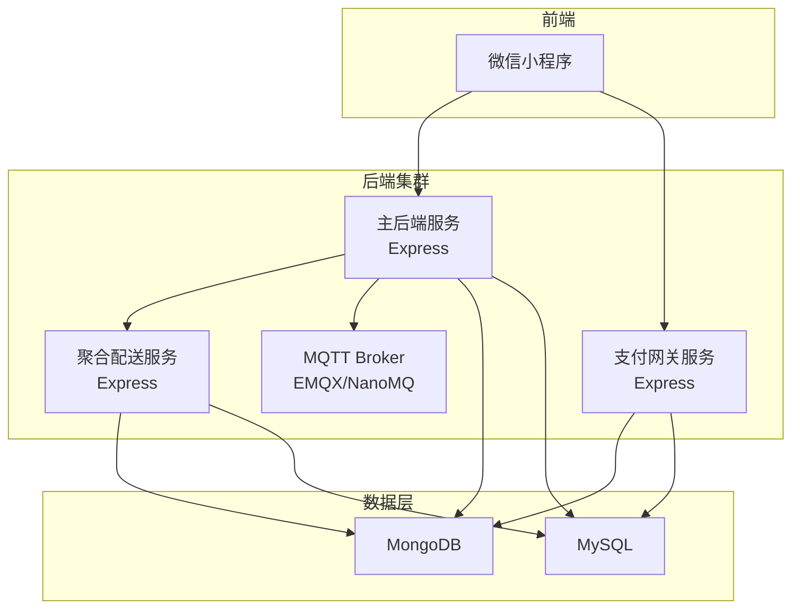
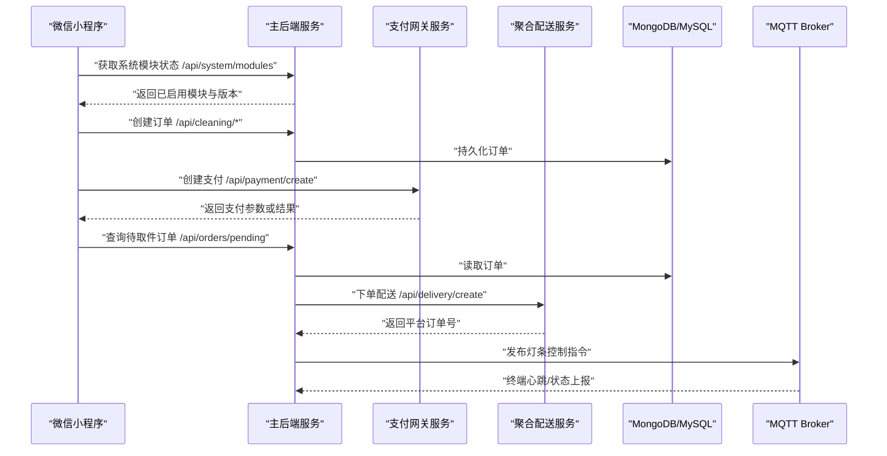
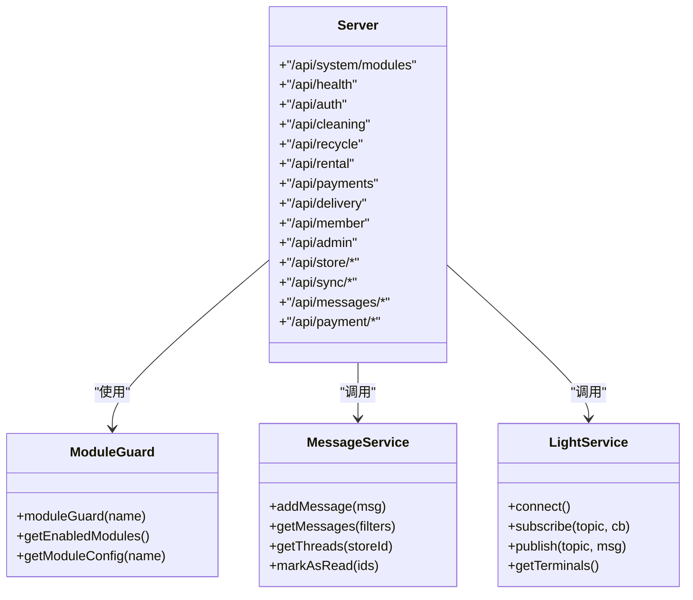
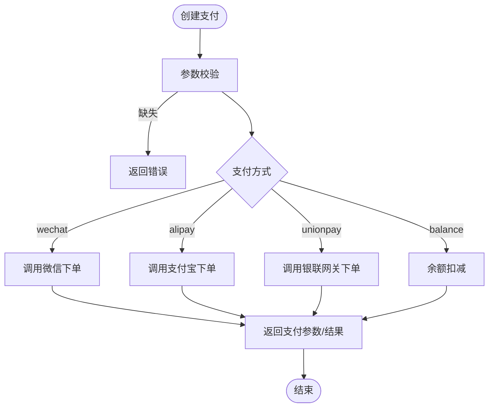
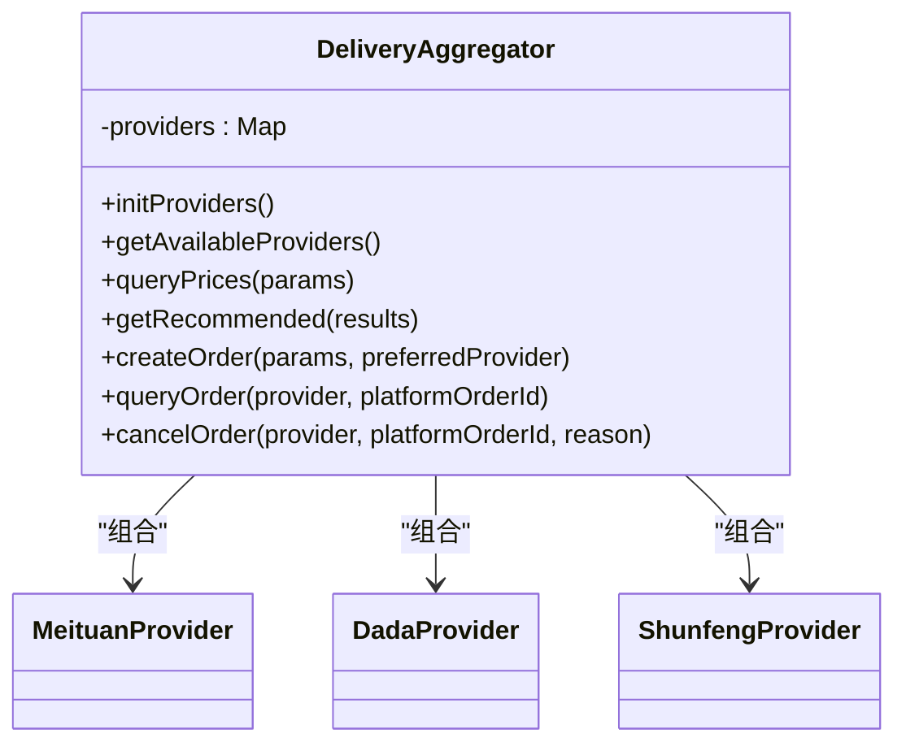
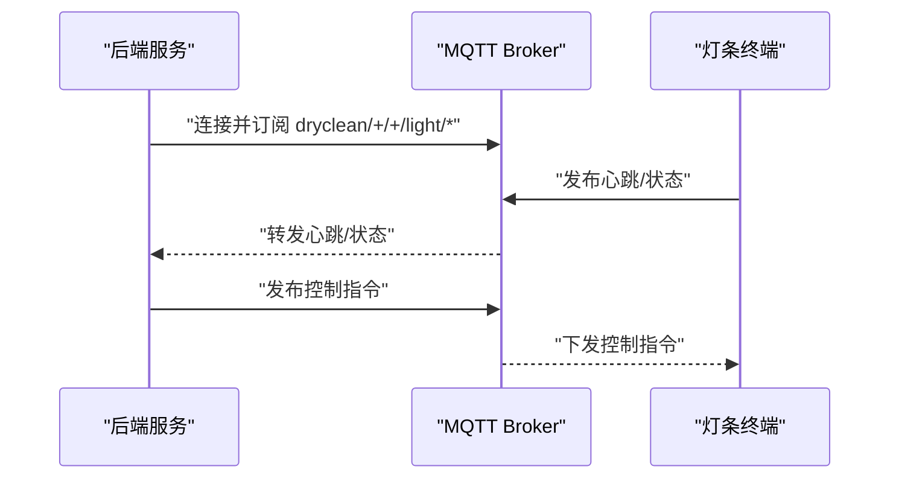
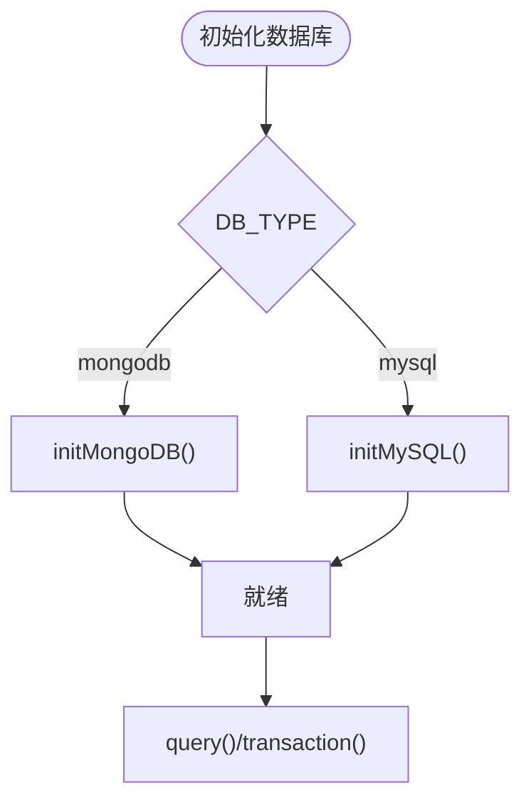
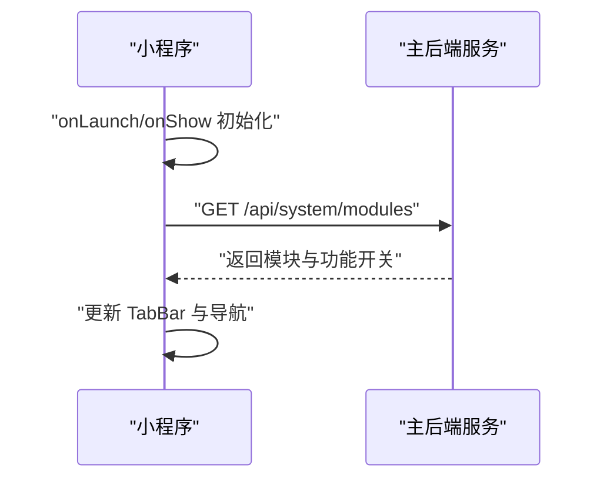
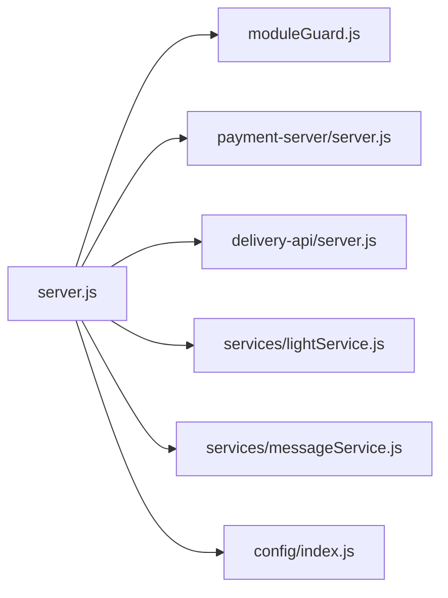
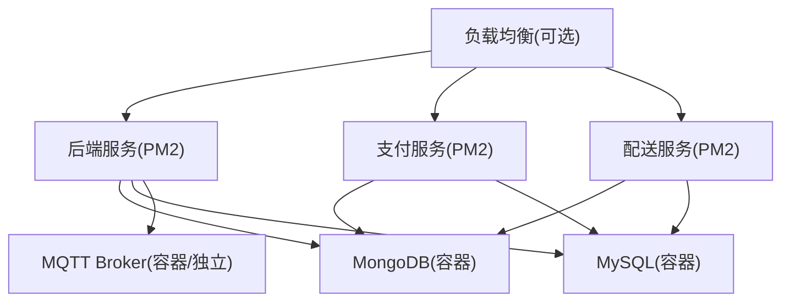

# 技术架构总览

<cite>
**本文引用的文件**   
- [backend/server.js](file://backend/server.js)
- [backend/config/index.js](file://backend/config/index.js)
- [backend/config/database.js](file://backend/config/database.js)
- [backend/config/modules.js](file://backend/config/modules.js)
- [backend/modules/common/middlewares/moduleGuard.js](file://backend/modules/common/middlewares/moduleGuard.js)
- [backend/services/lightService.js](file://backend/services/lightService.js)
- [backend/services/messageService.js](file://backend/services/messageService.js)
- [api/payment-server/server.js](file://api/payment-server/server.js)
- [delivery-api/server.js](file://delivery-api/server.js)
- [delivery-api/aggregator.js](file://delivery-api/aggregator.js)
- [wechat-mini-app/app.js](file://wechat-mini-app/app.js)
- [ecosystem.config.js](file://ecosystem.config.js)
- [backend/docker-compose.yml](file://backend/docker-compose.yml)
</cite>

## 目录
1. [简介](#简介)
2. [项目结构](#项目结构)
3. [核心组件](#核心组件)
4. [架构总览](#架构总览)
5. [详细组件分析](#详细组件分析)
6. [依赖关系分析](#依赖关系分析)
7. [性能与可扩展性](#性能与可扩展性)
8. [部署拓扑与高可用](#部署拓扑与高可用)
9. [故障排查指南](#故障排查指南)
10. [结论](#结论)

## 简介
本技术架构总览面向干洗店管理系统的研发与运维人员，系统性阐述整体架构设计、模块职责、数据流与交互关系、技术选型与扩展策略，以及容器化与进程管理的部署方案。系统采用“主后端服务 + 独立支付服务 + 配送聚合服务 + MQTT 消息中间件”的渐进式微服务形态，前端以微信小程序为主，配合多端（C端/门店端）协同工作。

## 项目结构
仓库采用按领域与职责划分的目录组织方式：
- backend：Express 主后端服务，承载认证、订单、门店、会员、通知、跨端同步等能力；内置模块化开关与动态路由挂载；集成数据库连接管理与 MQTT 客户端。
- api/payment-server：独立支付网关服务，统一封装微信支付、支付宝、银联、余额等支付方式，提供结算与报表接口。
- delivery-api：聚合配送服务，抽象多家第三方跑腿平台（美团、达达、顺丰），对外暴露统一询价、下单、查询与取消接口。
- wechat-mini-app：微信小程序前端，负责用户侧下单、支付、取件码、模块配置加载与 TabBar 动态更新。
- ecosystem.config.js：PM2 进程管理配置，定义后端与 MQTT Broker 进程的启动、日志与重启策略。
- docker-compose.yml：本地开发环境数据库编排（MongoDB/MySQL）。

图表来源
- [backend/server.js:1-150](file://backend/server.js#L1-L150)
- [api/payment-server/server.js:1-120](file://api/payment-server/server.js#L1-L120)
- [delivery-api/server.js:1-120](file://delivery-api/server.js#L1-L120)
- [backend/config/index.js:1-120](file://backend/config/index.js#L1-L120)
- [backend/docker-compose.yml:1-34](file://backend/docker-compose.yml#L1-L34)

章节来源
- [backend/server.js:1-150](file://backend/server.js#L1-L150)
- [backend/config/index.js:1-120](file://backend/config/index.js#L1-L120)
- [backend/docker-compose.yml:1-34](file://backend/docker-compose.yml#L1-L34)

## 核心组件
- 主后端服务（Express）
  - 功能：统一入口、模块路由挂载、健康检查、系统模块状态查询、跨端同步、通知中心、消息中心、支付回调桥接、小程序订单接口。
  - 关键特性：模块化开关（moduleGuard）、动态模块加载、优雅关闭、全局错误处理。
- 独立支付服务（Express）
  - 功能：统一支付创建、查询、关闭；微信/支付宝/银联回调；账户余额充值与交易记录；门店结算与提现；财务报表生成。
  - 关键特性：多支付渠道适配、签名校验、幂等与状态回写。
- 配送聚合服务（Express）
  - 功能：服务商列表、并行询价、自动推荐、下单、查询、取消；兼容旧接口。
  - 关键特性：DeliveryAggregator 抽象层、策略选择（最低价/最快/综合评分）。
- MQTT 消息中间件
  - 功能：灯条终端心跳注册、状态上报、主题订阅与发布、离线检测。
  - 关键特性：轻量客户端、QoS 1、心跳超时清理、主题命名空间隔离。
- 数据库双引擎
  - MongoDB：文档型存储，适合订单事件、设备状态等灵活结构。
  - MySQL：事务型存储，适合账户、结算、库存等强一致场景。
- 前端（微信小程序）
  - 功能：扫码进入、登录态恢复、模块配置拉取与 TabBar 动态更新、订单与支付流程。
  - 关键特性：延迟初始化、安全兜底、模块开关驱动 UI。

章节来源
- [backend/server.js:1-200](file://backend/server.js#L1-L200)
- [api/payment-server/server.js:1-200](file://api/payment-server/server.js#L1-L200)
- [delivery-api/server.js:1-200](file://delivery-api/server.js#L1-L200)
- [delivery-api/aggregator.js:1-200](file://delivery-api/aggregator.js#L1-L200)
- [backend/services/lightService.js:1-200](file://backend/services/lightService.js#L1-L200)
- [backend/config/index.js:1-120](file://backend/config/index.js#L1-L120)
- [wechat-mini-app/app.js:1-200](file://wechat-mini-app/app.js#L1-L200)

## 架构总览
系统采用“渐进式微服务”模式：
- 单体可拆分的 Express 应用作为主后端，通过模块化中间件与路由实现“插件化”能力。
- 支付与配送作为独立服务，通过 HTTP API 与主后端解耦，便于独立扩缩容与灰度发布。
- MQTT 用于设备与后台的实时通信，支撑智能灯条等 IoT 场景。
- 双数据库策略兼顾灵活性与一致性。

图表来源
- [backend/server.js:55-150](file://backend/server.js#L55-L150)
- [api/payment-server/server.js:36-174](file://api/payment-server/server.js#L36-L174)
- [delivery-api/server.js:89-154](file://delivery-api/server.js#L89-L154)
- [backend/services/lightService.js:29-90](file://backend/services/lightService.js#L29-L90)

## 详细组件分析

### 主后端服务（Express）
- 模块化与动态加载
  - 通过 moduleGuard 中间件对模块进行启用/禁用控制，未启用模块返回友好提示与服务不可用状态。
  - server.js 集中挂载各业务路由，支持运行时查询模块状态与单个模块配置。
- 跨端同步与通知中心
  - 提供注册、心跳、注销、操作历史与广播接口，保障 index 与 m-index 双向同步。
  - 通知中心与消息中心分离，前者用于系统事件流，后者用于客户消息与账户通讯。
- 支付桥接与小程序订单
  - 统一支付入口转发至具体渠道；小程序订单接口在开发环境支持模拟支付快速联调。
- 生命周期与健壮性
  - 优雅关闭、端口冲突保护、未捕获异常与未处理 Promise 拒绝的全局处理。

图表来源
- [backend/server.js:1-200](file://backend/server.js#L1-L200)
- [backend/modules/common/middlewares/moduleGuard.js:1-55](file://backend/modules/common/middlewares/moduleGuard.js#L1-L55)
- [backend/services/messageService.js:1-200](file://backend/services/messageService.js#L1-L200)
- [backend/services/lightService.js:1-200](file://backend/services/lightService.js#L1-L200)

章节来源
- [backend/server.js:1-200](file://backend/server.js#L1-L200)
- [backend/modules/common/middlewares/moduleGuard.js:1-55](file://backend/modules/common/middlewares/moduleGuard.js#L1-L55)
- [backend/services/messageService.js:1-200](file://backend/services/messageService.js#L1-L200)
- [backend/services/lightService.js:1-200](file://backend/services/lightService.js#L1-L200)

### 独立支付服务（Express）
- 统一支付入口
  - 根据 paymentMethod 分发到微信、支付宝、银联或余额通道；余额支付直接扣减并落库。
- 回调与结算
  - 多渠道回调签名校验成功后更新订单状态，并记录到结算系统；支持门店结算、提现与报表。
- 健康检查与服务清单
  - 提供健康检查与支持的支付方式说明。

图表来源
- [api/payment-server/server.js:36-174](file://api/payment-server/server.js#L36-L174)

章节来源
- [api/payment-server/server.js:1-200](file://api/payment-server/server.js#L1-L200)

### 配送聚合服务（Express）
- 聚合调度器
  - DeliveryAggregator 维护多个 Provider 实例，支持并行询价、自动推荐与指定优先服务商。
- 统一 API
  - 提供 providers、query、create、queryOrder、cancel 等接口，同时兼容旧版 deliveries 接口。

图表来源
- [delivery-api/aggregator.js:1-237](file://delivery-api/aggregator.js#L1-L237)
- [delivery-api/server.js:1-200](file://delivery-api/server.js#L1-L200)

章节来源
- [delivery-api/aggregator.js:1-237](file://delivery-api/aggregator.js#L1-L237)
- [delivery-api/server.js:1-200](file://delivery-api/server.js#L1-L200)

### MQTT 消息中间件（灯条系统）
- 连接与订阅
  - 动态读取配置，建立连接后订阅终端心跳与状态主题。
- 终端注册与心跳
  - 解析主题提取 storeId 与 lightId，维护在线灯条集合，定时清理超时节点。
- 发布与回调
  - 提供 subscribe/publish 方法供业务模块调用，统一 QoS 1。

图表来源
- [backend/services/lightService.js:29-200](file://backend/services/lightService.js#L29-L200)

章节来源
- [backend/services/lightService.js:1-200](file://backend/services/lightService.js#L1-L200)

### 数据库双引擎策略
- 单例连接管理
  - 根据配置类型初始化 MongoDB 或 MySQL 连接池；提供便捷 query 与 transaction 方法。
- 配置项
  - 支持 SSL、时区、连接池大小、超时等生产级参数。

图表来源
- [backend/config/index.js:1-167](file://backend/config/index.js#L1-L167)
- [backend/config/database.js:1-65](file://backend/config/database.js#L1-L65)

章节来源
- [backend/config/index.js:1-167](file://backend/config/index.js#L1-L167)
- [backend/config/database.js:1-65](file://backend/config/database.js#L1-L65)

### 微信小程序前端（动态模块）
- 启动流程
  - onLaunch 仅做缓存恢复与扫码参数解析；onShow 延迟执行模块配置加载与登录。
- 模块配置与 TabBar
  - 从后端 /api/system/modules 拉取模块开关，动态更新 TabBar 与页面可见性。

图表来源
- [wechat-mini-app/app.js:1-200](file://wechat-mini-app/app.js#L1-L200)
- [backend/server.js:55-90](file://backend/server.js#L55-L90)

章节来源
- [wechat-mini-app/app.js:1-200](file://wechat-mini-app/app.js#L1-L200)
- [backend/server.js:55-90](file://backend/server.js#L55-L90)

## 依赖关系分析
- 模块开关与路由挂载
  - server.js 依赖 moduleGuard 提供的 getEnabledModules/getModuleConfig，并在路由层按需挂载。
- 支付与配送的外部依赖
  - 主后端通过 HTTP 调用支付与配送服务，避免耦合第三方 SDK 到主进程。
- 设备通信
  - 主后端通过 mqtt 包与 Broker 通信，LightService 封装连接、订阅与发布逻辑。

图表来源
- [backend/server.js:1-200](file://backend/server.js#L1-L200)
- [backend/modules/common/middlewares/moduleGuard.js:1-55](file://backend/modules/common/middlewares/moduleGuard.js#L1-L55)
- [api/payment-server/server.js:1-120](file://api/payment-server/server.js#L1-L120)
- [delivery-api/server.js:1-120](file://delivery-api/server.js#L1-L120)
- [backend/services/lightService.js:1-120](file://backend/services/lightService.js#L1-L120)
- [backend/services/messageService.js:1-120](file://backend/services/messageService.js#L1-L120)
- [backend/config/index.js:1-120](file://backend/config/index.js#L1-L120)

章节来源
- [backend/server.js:1-200](file://backend/server.js#L1-L200)
- [backend/modules/common/middlewares/moduleGuard.js:1-55](file://backend/modules/common/middlewares/moduleGuard.js#L1-L55)
- [api/payment-server/server.js:1-120](file://api/payment-server/server.js#L1-L120)
- [delivery-api/server.js:1-120](file://delivery-api/server.js#L1-L120)
- [backend/services/lightService.js:1-120](file://backend/services/lightService.js#L1-L120)
- [backend/services/messageService.js:1-120](file://backend/services/messageService.js#L1-L120)
- [backend/config/index.js:1-120](file://backend/config/index.js#L1-L120)

## 性能与可扩展性
- 模块化与插件化
  - 通过 modules.js 与 moduleGuard 实现运行时开关与动态加载，新增品类只需添加模块配置与路由即可热插拔。
- 微服务拆分
  - 支付与配送独立部署，可按流量特征水平扩展；主后端聚焦业务编排与数据一致性。
- 并发与异步
  - 配送询价并行调用，Promise.allSettled 汇总结果，降低端到端时延。
- 数据库优化
  - MySQL 连接池与 MongoDB 连接选项可调；事务封装保证关键路径一致性。
- 进程管理
  - PM2 配置支持崩溃自启、内存上限、指数退避重启与日志合并，提升稳定性。

[本节为通用指导，不直接分析具体文件]

## 部署拓扑与高可用
- 容器化
  - docker-compose 提供 MongoDB 与 MySQL 的快速编排，卷持久化数据，便于本地与测试环境复用。
- 进程管理
  - ecosystem.config.js 定义后端与 MQTT Broker 两个应用，分别配置环境变量、日志与重启策略。
- 负载均衡与高可用（建议）
  - 在生产环境可通过反向代理（Nginx/Traefik）对后端与支付/配送服务进行负载均衡与健康检查；数据库可采用主从或云托管高可用实例。
- 开机自启与守护
  - PM2 startup 与 save 确保服务随系统启动；结合系统服务管理器实现更稳健的守护。

图表来源
- [ecosystem.config.js:1-100](file://ecosystem.config.js#L1-L100)
- [backend/docker-compose.yml:1-34](file://backend/docker-compose.yml#L1-L34)

章节来源
- [ecosystem.config.js:1-100](file://ecosystem.config.js#L1-L100)
- [backend/docker-compose.yml:1-34](file://backend/docker-compose.yml#L1-L34)

## 故障排查指南
- 端口占用与启动失败
  - 监听端口被占用会触发 EADDRINUSE 错误，需先释放端口再重启。
- 数据库连接问题
  - 检查 DB_TYPE 与对应连接参数；确认容器是否启动且端口可达。
- 支付回调失败
  - 核对签名校验逻辑与回调地址；查看支付服务日志中的错误信息。
- 配送询价失败
  - 检查各 Provider 配置与网络连通；关注聚合层的 errors 字段。
- MQTT 连接异常
  - 确认 Broker 地址、端口与鉴权；查看 LightService 的连接与订阅日志。
- 模块不可用
  - 通过 /api/system/modules 检查模块 enabled 状态与 message 提示。

章节来源
- [backend/server.js:602-702](file://backend/server.js#L602-L702)
- [backend/config/index.js:1-167](file://backend/config/index.js#L1-L167)
- [api/payment-server/server.js:306-451](file://api/payment-server/server.js#L306-L451)
- [delivery-api/server.js:56-83](file://delivery-api/server.js#L56-L83)
- [backend/services/lightService.js:29-90](file://backend/services/lightService.js#L29-L90)
- [backend/server.js:55-90](file://backend/server.js#L55-L90)

## 结论
本系统以“模块化单体 + 关键微服务”的渐进式架构为核心，借助 Express 的灵活路由与中间件机制实现插件化能力；通过独立支付与配送服务解耦外部依赖，利用 MQTT 打通设备通信，并以双数据库策略平衡灵活性与一致性。配合 PM2 与 Docker Compose，可在开发与生产环境中获得良好的可观测性与可运维性。未来可进一步引入 API 网关、服务发现与链路追踪，完善分布式治理与容量规划。