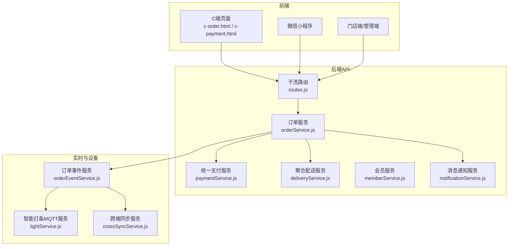
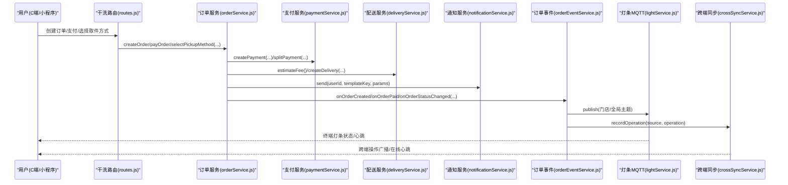
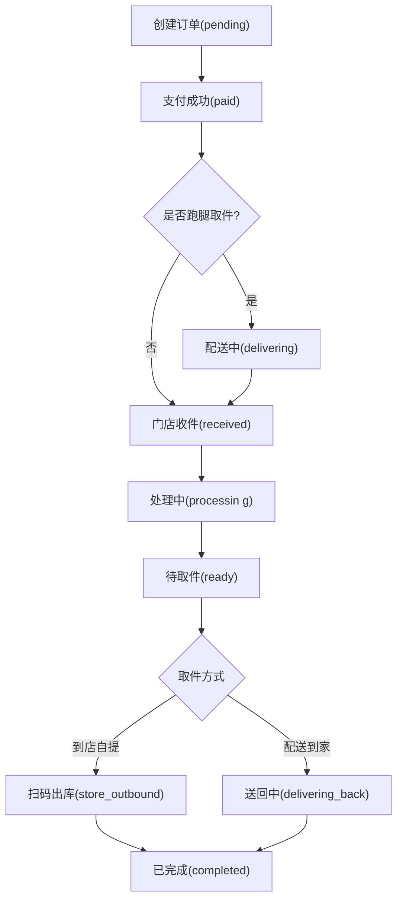
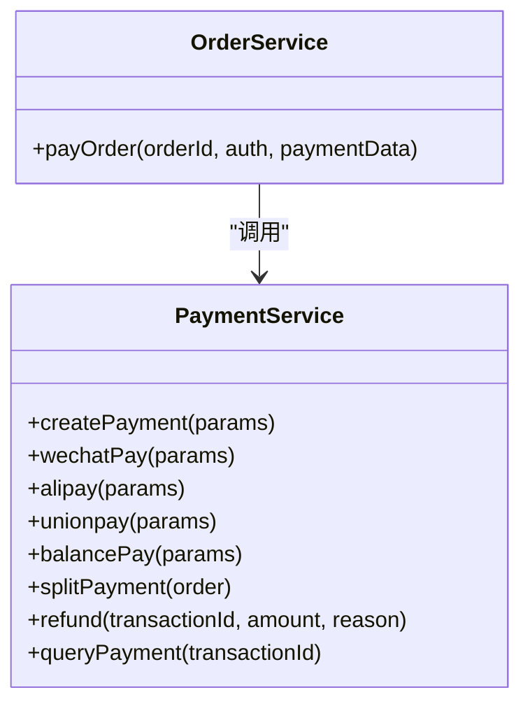
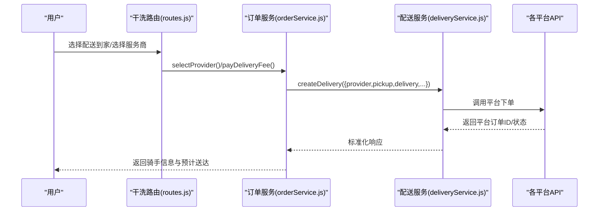
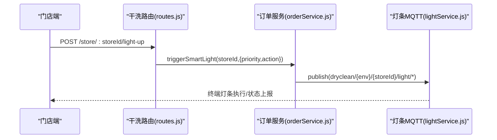
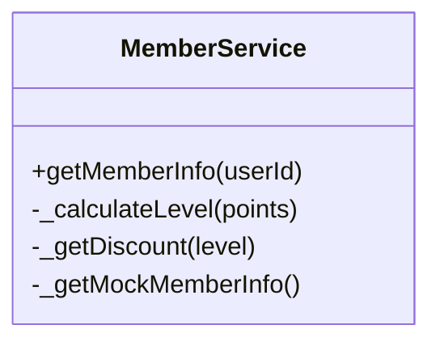
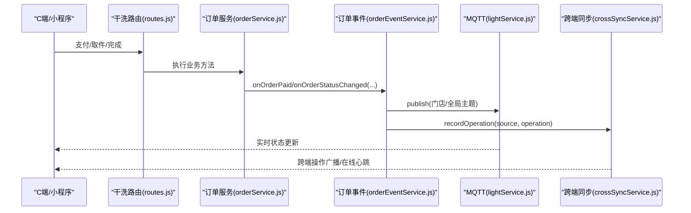
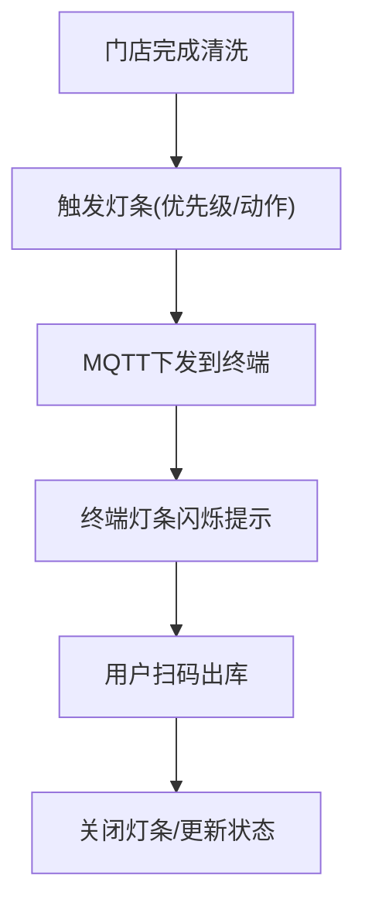
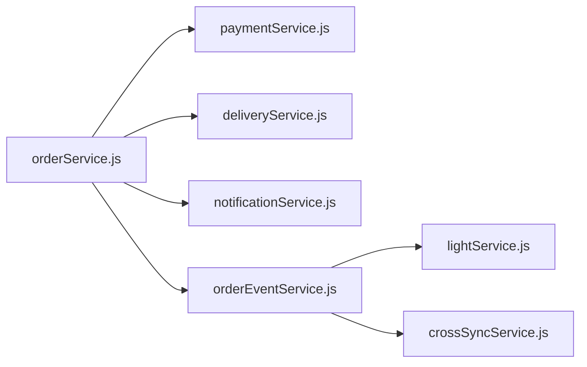

# 核心功能特性

<cite>
**本文引用的文件**   
- [backend/modules/cleaning/services/orderService.js](file://backend/modules/cleaning/services/orderService.js)
- [backend/modules/cleaning/routes.js](file://backend/modules/cleaning/routes.js)
- [backend/modules/common/services/paymentService.js](file://backend/modules/common/services/paymentService.js)
- [api/payment-api.js](file://api/payment-api.js)
- [backend/modules/common/services/deliveryService.js](file://backend/modules/common/services/deliveryService.js)
- [api/delivery-api.js](file://api/delivery-api.js)
- [backend/modules/member/services/memberService.js](file://backend/modules/member/services/memberService.js)
- [backend/services/orderEventService.js](file://backend/services/orderEventService.js)
- [backend/services/lightService.js](file://backend/services/lightService.js)
- [backend/services/crossSyncService.js](file://backend/services/crossSyncService.js)
- [backend/modules/common/services/notificationService.js](file://backend/modules/common/services/notificationService.js)
- [backend/README.md](file://backend/README.md)
- [FEATURES_IMPLEMENTED.md](file://FEATURES_IMPLEMENTED.md)
- [C-APP-FEATURES.md](file://C-APP-FEATURES.md)
</cite>

## 目录
1. [引言](#引言)
2. [项目结构](#项目结构)
3. [核心组件](#核心组件)
4. [架构总览](#架构总览)
5. [详细组件分析](#详细组件分析)
6. [依赖分析](#依赖分析)
7. [性能考虑](#性能考虑)
8. [故障排查指南](#故障排查指南)
9. [结论](#结论)

## 引言
本系统面向干洗门店，提供覆盖“下单—取送—清洗—取件—结算”的全链路数字化能力。围绕订单管理、支付结算、配送服务、门店管理与会员服务五大模块，构建双向配送（上门取件与服务完成送回）、基于MQTT的跨端实时同步、以及智能设备联动（灯条提示、扫码入库）等特色能力，帮助门店提升效率与用户体验。

## 项目结构
后端采用模块化分层：路由层负责HTTP接口，服务层封装业务逻辑，公共能力（支付、通知、配送、事件、MQTT）横向复用；前端包含C端页面、微信小程序与后台管理页。

图表来源
- [backend/modules/cleaning/routes.js](file://backend/modules/cleaning/routes.js)
- [backend/modules/cleaning/services/orderService.js](file://backend/modules/cleaning/services/orderService.js)
- [backend/modules/common/services/paymentService.js](file://backend/modules/common/services/paymentService.js)
- [backend/modules/common/services/deliveryService.js](file://backend/modules/common/services/deliveryService.js)
- [backend/modules/member/services/memberService.js](file://backend/modules/member/services/memberService.js)
- [backend/modules/common/services/notificationService.js](file://backend/modules/common/services/notificationService.js)
- [backend/services/orderEventService.js](file://backend/services/orderEventService.js)
- [backend/services/lightService.js](file://backend/services/lightService.js)
- [backend/services/crossSyncService.js](file://backend/services/crossSyncService.js)

章节来源
- [backend/README.md](file://backend/README.md)

## 核心组件
- 订单管理：创建、查询、状态流转、取件方式选择、批量操作、软删除等。
- 支付结算：多渠道支付（微信/支付宝/银联/余额）与分账结算（平台抽佣、门店收益）。
- 配送服务：多平台聚合（美团/京东/顺丰/淘宝闪送），报价计算、下单、取消、状态查询。
- 门店管理：员工权限、门店配置、一键取货、智能灯条控制。
- 会员服务：等级体系、积分折扣、到期时间等。
- 特色能力：双向配送（取件+送回）、MQTT跨端实时同步、智能设备联动（灯条提示、扫码入库）。

章节来源
- [backend/modules/cleaning/services/orderService.js](file://backend/modules/cleaning/services/orderService.js)
- [backend/modules/common/services/paymentService.js](file://backend/modules/common/services/paymentService.js)
- [backend/modules/common/services/deliveryService.js](file://backend/modules/common/services/deliveryService.js)
- [backend/modules/member/services/memberService.js](file://backend/modules/member/services/memberService.js)
- [backend/services/orderEventService.js](file://backend/services/orderEventService.js)
- [backend/services/lightService.js](file://backend/services/lightService.js)
- [backend/services/crossSyncService.js](file://backend/services/crossSyncService.js)

## 架构总览
系统以订单为核心，贯穿支付、配送、通知与设备联动，通过MQTT实现小程序/C端/M端/管理端的实时数据同步。

图表来源
- [backend/modules/cleaning/routes.js](file://backend/modules/cleaning/routes.js)
- [backend/modules/cleaning/services/orderService.js](file://backend/modules/cleaning/services/orderService.js)
- [backend/modules/common/services/paymentService.js](file://backend/modules/common/services/paymentService.js)
- [backend/modules/common/services/deliveryService.js](file://backend/modules/common/services/deliveryService.js)
- [backend/modules/common/services/notificationService.js](file://backend/modules/common/services/notificationService.js)
- [backend/services/orderEventService.js](file://backend/services/orderEventService.js)
- [backend/services/lightService.js](file://backend/services/lightService.js)
- [backend/services/crossSyncService.js](file://backend/services/crossSyncService.js)

## 详细组件分析

### 订单管理（创建、跟踪、状态流转）
- 核心价值：标准化订单生命周期，支持双向配送与取件方式灵活切换，保障前后端一致性与可追溯性。
- 关键流程
  - 创建订单：生成订单号、物品明细、金额、取件码、预计归还日期，并触发通知与事件。
  - 支付：更新支付状态与订单状态，发布支付事件。
  - 收件/处理/完成：门店端推进状态至“待取件”，记录时间与质检结果。
  - 取件方式：支持到店自提或配送到家，驱动后续配送或出库流程。
  - 状态追踪：提供轮询接口返回简化状态与最新历史。
- 典型状态机
  - pending → paid → delivering → received → processing → ready → delivering_back → completed
  - 扩展态：awaiting_pickup_scan / awaiting_store_outbound / store_outbound（扫码出库相关）

图表来源
- [backend/modules/cleaning/services/orderService.js](file://backend/modules/cleaning/services/orderService.js)
- [backend/modules/cleaning/routes.js](file://backend/modules/cleaning/routes.js)

章节来源
- [backend/modules/cleaning/services/orderService.js](file://backend/modules/cleaning/services/orderService.js)
- [backend/modules/cleaning/routes.js](file://backend/modules/cleaning/routes.js)
- [FEATURES_IMPLEMENTED.md](file://FEATURES_IMPLEMENTED.md)

### 支付结算（多渠道支付、分账结算）
- 核心价值：统一接入多种支付方式，内置分账策略，支撑平台抽佣与门店结算。
- 能力要点
  - 多渠道：微信/支付宝/银联/余额，预留真实API对接点。
  - 分账：按订单类型计算平台与门店/用户/品牌方比例，支持押金冻结与释放。
  - 退款与查询：标准退款与支付状态查询接口。
- 使用场景
  - C端下单后进入支付页，选择支付方式完成扣款。
  - 后台查看分账明细与结算报表。

图表来源
- [backend/modules/common/services/paymentService.js](file://backend/modules/common/services/paymentService.js)
- [backend/modules/cleaning/services/orderService.js](file://backend/modules/cleaning/services/orderService.js)

章节来源
- [backend/modules/common/services/paymentService.js](file://backend/modules/common/services/paymentService.js)
- [api/payment-api.js](file://api/payment-api.js)
- [C-APP-FEATURES.md](file://C-APP-FEATURES.md)

### 配送服务（多平台聚合、实时跟踪）
- 核心价值：聚合多家跑腿平台，统一报价与下单，支持一对一与拼单模式，提供状态查询与取消。
- 能力要点
  - 服务商：美团/京东秒送/顺丰同城/淘宝闪送，支持定价规则与优惠。
  - 费用计算：基础费+里程+促销，区分一对一与拼单。
  - 订单生命周期：创建→接单→取件→配送→完成。
- 使用场景
  - 用户在“待取件”阶段选择“配送到家”，系统自动创建配送订单并展示骑手信息。

图表来源
- [backend/modules/cleaning/routes.js](file://backend/modules/cleaning/routes.js)
- [backend/modules/cleaning/services/orderService.js](file://backend/modules/cleaning/services/orderService.js)
- [backend/modules/common/services/deliveryService.js](file://backend/modules/common/services/deliveryService.js)
- [api/delivery-api.js](file://api/delivery-api.js)

章节来源
- [backend/modules/common/services/deliveryService.js](file://backend/modules/common/services/deliveryService.js)
- [api/delivery-api.js](file://api/delivery-api.js)
- [C-APP-FEATURES.md](file://C-APP-FEATURES.md)

### 门店管理（员工权限、库存管理、智能灯条）
- 核心价值：为门店提供高效作业工具，包括一键取货、智能灯条提示、扫码出库等。
- 能力要点
  - 权限：RBAC角色控制（店员/店长/管理员）。
  - 灯条控制：点亮/关闭/状态查询，优先级normal/urgent/vip。
  - 批量操作：一键完成同一网点所有待取件订单。
- 使用场景
  - 门店完成清洗后，点亮对应灯条引导用户取件；用户扫码出库后关闭灯条。

图表来源
- [backend/modules/cleaning/routes.js](file://backend/modules/cleaning/routes.js)
- [backend/modules/cleaning/services/orderService.js](file://backend/modules/cleaning/services/orderService.js)
- [backend/services/lightService.js](file://backend/services/lightService.js)

章节来源
- [FEATURES_IMPLEMENTED.md](file://FEATURES_IMPLEMENTED.md)
- [backend/modules/cleaning/routes.js](file://backend/modules/cleaning/routes.js)

### 会员服务（等级体系、积分管理）
- 核心价值：基于积分的会员等级与折扣体系，增强用户粘性与复购。
- 能力要点
  - 等级：根据积分划分普通/白银/黄金/铂金。
  - 折扣：不同等级对应不同折扣率。
  - 有效期：从注册时间起算一年。
- 使用场景
  - 用户个人中心查看等级、积分与可用折扣。

图表来源
- [backend/modules/member/services/memberService.js](file://backend/modules/member/services/memberService.js)

章节来源
- [backend/modules/member/services/memberService.js](file://backend/modules/member/services/memberService.js)

### 实时数据同步（基于MQTT的跨端状态同步）
- 核心价值：确保小程序、C端、门店端与管理端的数据一致性，降低轮询成本。
- 能力要点
  - 订单事件：创建/支付/取消/状态变更通过MQTT推送至门店级与全局主题。
  - 跨端同步：记录操作来源，避免本地回显，维护在线客户端列表与心跳。
  - 通知中心：将事件写入通知中心供管理端轮询。
- 使用场景
  - 用户支付成功后，门店端与管理端即时刷新订单列表与详情。

图表来源
- [backend/modules/cleaning/routes.js](file://backend/modules/cleaning/routes.js)
- [backend/modules/cleaning/services/orderService.js](file://backend/modules/cleaning/services/orderService.js)
- [backend/services/orderEventService.js](file://backend/services/orderEventService.js)
- [backend/services/lightService.js](file://backend/services/lightService.js)
- [backend/services/crossSyncService.js](file://backend/services/crossSyncService.js)

章节来源
- [backend/services/orderEventService.js](file://backend/services/orderEventService.js)
- [backend/services/crossSyncService.js](file://backend/services/crossSyncService.js)

### 智能设备联动（灯条提示、扫码入库）
- 核心价值：线下可视化的取件指引与扫码出库，减少人工沟通成本。
- 能力要点
  - 终端注册与心跳：灯条定期上报在线状态。
  - 指令下发：点亮/关闭/优先级设置。
  - 状态查询：获取门店灯条清单与最后更新时间。
- 使用场景
  - 门店完成清洗后，按订单点亮灯条；用户扫码出库后自动关闭。

图表来源
- [backend/services/lightService.js](file://backend/services/lightService.js)
- [backend/modules/cleaning/routes.js](file://backend/modules/cleaning/routes.js)

章节来源
- [backend/services/lightService.js](file://backend/services/lightService.js)
- [FEATURES_IMPLEMENTED.md](file://FEATURES_IMPLEMENTED.md)

## 依赖分析
- 耦合关系
  - 订单服务依赖支付、配送、通知、事件服务；事件服务依赖MQTT与跨端同步。
  - 配送服务抽象出多平台提供者，便于扩展新渠道。
  - 灯条服务独立于业务，通过MQTT与终端交互。
- 外部依赖
  - 数据库：MongoDB（推荐）/MySQL（生产）。
  - MQTT Broker：EMQX/NanoMQ等。
  - 第三方：微信支付/支付宝/银联、跑腿平台API。

图表来源
- [backend/modules/cleaning/services/orderService.js](file://backend/modules/cleaning/services/orderService.js)
- [backend/modules/common/services/paymentService.js](file://backend/modules/common/services/paymentService.js)
- [backend/modules/common/services/deliveryService.js](file://backend/modules/common/services/deliveryService.js)
- [backend/modules/common/services/notificationService.js](file://backend/modules/common/services/notificationService.js)
- [backend/services/orderEventService.js](file://backend/services/orderEventService.js)
- [backend/services/lightService.js](file://backend/services/lightService.js)
- [backend/services/crossSyncService.js](file://backend/services/crossSyncService.js)

章节来源
- [backend/README.md](file://backend/README.md)

## 性能考虑
- 数据库索引：订单号、用户ID、门店ID、状态字段已建立索引，提高查询性能。
- 异步通知：通知与事件发布采用异步，不阻塞主流程。
- 轮询优化：状态接口禁用缓存，返回精简字段，降低带宽占用。
- MQTT重连：灯条服务定时检测连接健康并自动重连，保证稳定性。
- 分页与过滤：订单列表支持分页与多维度过滤，避免全表扫描。

[本节为通用指导，无需代码引用]

## 故障排查指南
- 支付问题
  - 检查支付方式是否启用、商户配置是否正确；确认交易号与回调状态。
  - 参考路径：[支付服务](file://backend/modules/common/services/paymentService.js)、[C端支付API](file://api/payment-api.js)。
- 配送异常
  - 核对服务商密钥与计费参数；确认地址坐标与距离计算；查看平台回调。
  - 参考路径：[配送服务](file://backend/modules/common/services/deliveryService.js)、[C端配送API](file://api/delivery-api.js)。
- 实时同步失败
  - 检查MQTT Broker连通性与端口；确认订阅主题与客户端ID；查看心跳与离线恢复日志。
  - 参考路径：[订单事件服务](file://backend/services/orderEventService.js)、[灯条MQTT服务](file://backend/services/lightService.js)、[跨端同步服务](file://backend/services/crossSyncService.js)。
- 灯条无响应
  - 确认终端心跳是否超时；检查门店ID与灯条ID映射；验证指令下发主题。
  - 参考路径：[灯条服务](file://backend/services/lightService.js)。
- 权限与数据可见性
  - 校验JWT与角色；确认跨平台手机号匹配；检查软删除标记。
  - 参考路径：[订单路由](file://backend/modules/cleaning/routes.js)、[订单服务](file://backend/modules/cleaning/services/orderService.js)。

章节来源
- [backend/modules/common/services/paymentService.js](file://backend/modules/common/services/paymentService.js)
- [api/payment-api.js](file://api/payment-api.js)
- [backend/modules/common/services/deliveryService.js](file://backend/modules/common/services/deliveryService.js)
- [api/delivery-api.js](file://api/delivery-api.js)
- [backend/services/orderEventService.js](file://backend/services/orderEventService.js)
- [backend/services/lightService.js](file://backend/services/lightService.js)
- [backend/services/crossSyncService.js](file://backend/services/crossSyncService.js)
- [backend/modules/cleaning/routes.js](file://backend/modules/cleaning/routes.js)
- [backend/modules/cleaning/services/orderService.js](file://backend/modules/cleaning/services/orderService.js)

## 结论
本系统以订单为中心，打通支付、配送、通知与设备联动，借助MQTT实现跨端实时同步，形成“线上预约—双向配送—智能取件—结算分账”的闭环。未来可在会员积分兑换、优惠券、评价与客服等方面持续演进，进一步提升运营效率与用户满意度。