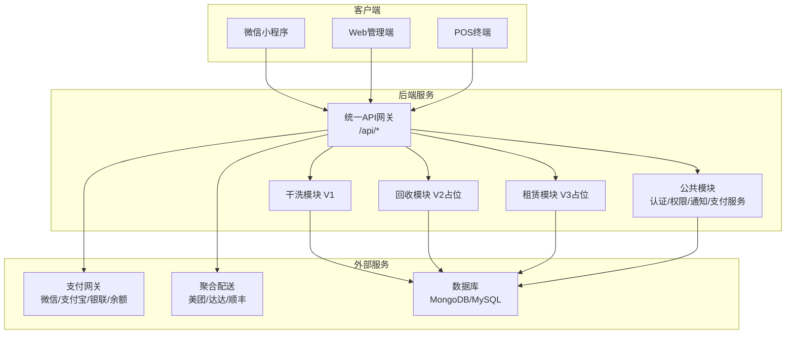
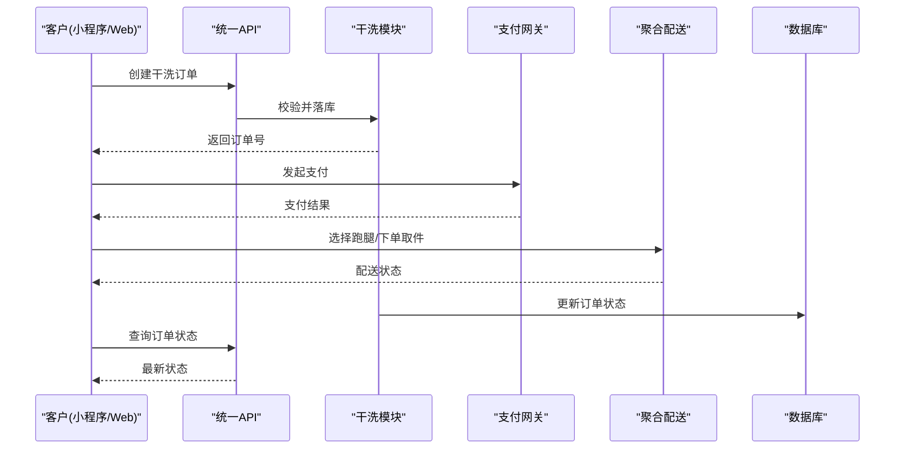
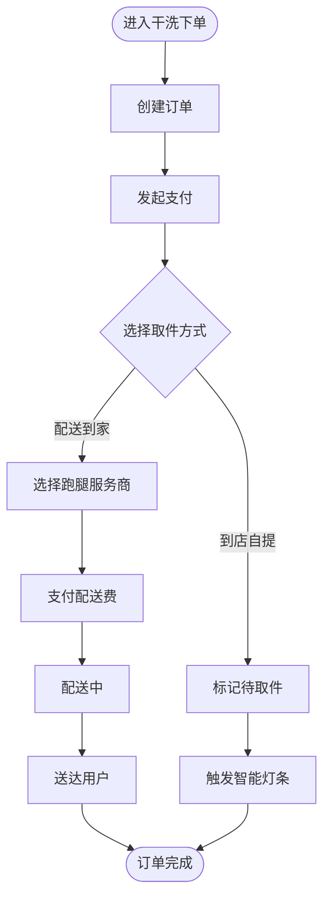
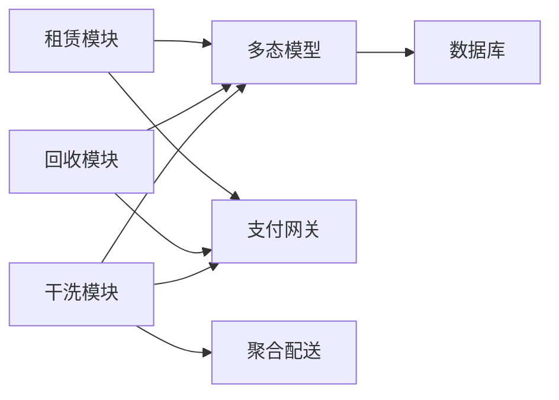

# 系统介绍与目标

<cite>
**本文引用的文件**   
- [backend/README.md](file://backend/README.md)
- [backend/QUICKSTART.md](file://backend/QUICKSTART.md)
- [PROJECT_COMPLETE.md](file://PROJECT_COMPLETE.md)
- [FEATURES_IMPLEMENTED.md](file://FEATURES_IMPLEMENTED.md)
- [backend/modules/common/models/index.js](file://backend/modules/common/models/index.js)
- [backend/modules/cleaning/routes.js](file://backend/modules/cleaning/routes.js)
- [backend/modules/recycle/routes.js](file://backend/modules/recycle/routes.js)
- [backend/modules/rental/routes.js](file://backend/modules/rental/routes.js)
- [api/payment-server/README.md](file://api/payment-server/README.md)
- [delivery-api/README.md](file://delivery-api/README.md)
</cite>

## 目录
1. [引言](#引言)
2. [项目结构](#项目结构)
3. [核心组件](#核心组件)
4. [架构总览](#架构总览)
5. [详细组件分析](#详细组件分析)
6. [依赖关系分析](#依赖关系分析)
7. [性能与扩展性考量](#性能与扩展性考量)
8. [故障排查指南](#故障排查指南)
9. [结论](#结论)
10. [附录](#附录)

## 引言
本系统面向干洗门店及连锁经营，提供覆盖“干洗→回收→租赁”的渐进式业务演进能力。系统以多端协同（微信小程序、Web管理端、POS终端）为核心体验，围绕订单全生命周期、支付结算、聚合配送与实时协作构建统一平台，旨在解决传统干洗店数字化程度低、订单管理混乱、配送效率低下、支付结算复杂等痛点，帮助门店实现标准化运营与规模化增长。

- 核心价值主张
  - 一站式服务：从下单、取送、清洗到取件的全链路数字化
  - 多端协同：小程序便捷下单、Web管理端高效运营、POS终端快速收银
  - 渐进扩展：V1干洗打基础，V2回收增价值，V3租赁拓场景
  - 资金合规：统一支付网关与分账结算，降低对账与提现复杂度
  - 智能调度：聚合多家跑腿服务商，提升取送时效与成本可控性

- 支持的多品类服务场景
  - 干洗：衣物、鞋类、奢侈品护理等
  - 回收：旧衣回收估价与上门回收
  - 租赁：服饰与小件商品租赁（押金、信用评估、双向跑腿）
  - 宠物清洗：作为干洗品类的延伸服务项纳入定价与服务配置
  - 电子产品维修：通过物品类型与属性字段预留扩展，未来可接入独立流程

[本节为概念性说明，不直接分析具体代码文件]

## 项目结构
系统采用模块化后端与多端前端组合：
- 后端：Express 模块化路由 + 多态数据模型 + 模块开关控制
- 支付与配送：独立微服务（支付网关、聚合配送中间层）
- 前端：微信小程序、Web管理端、POS终端页面

图表来源
- [backend/README.md:1-17](file://backend/README.md#L1-L17)
- [backend/modules/cleaning/routes.js:1-15](file://backend/modules/cleaning/routes.js#L1-L15)
- [backend/modules/recycle/routes.js:1-12](file://backend/modules/recycle/routes.js#L1-L12)
- [backend/modules/rental/routes.js:1-15](file://backend/modules/rental/routes.js#L1-L15)
- [api/payment-server/README.md](file://api/payment-server/README.md)
- [delivery-api/README.md](file://delivery-api/README.md)

章节来源
- [backend/README.md:1-17](file://backend/README.md#L1-L17)
- [backend/QUICKSTART.md:1-20](file://backend/QUICKSTART.md#L1-L20)

## 核心组件
- 多态数据模型
  - 通过枚举与JSON字段隔离不同业务的特有属性，支撑干洗/回收/租赁三阶段平滑扩展
  - 统一的订单、物品、用户、门店、配送单、消息模板等模型定义
- 模块化路由与守卫
  - 各业务模块独立路由，通过模块守卫控制启用/禁用
  - 干洗模块已完整实现；回收与租赁模块当前返回“暂未开放”，便于后续逐步上线
- 支付与结算
  - 统一支付网关，支持微信、支付宝、银联、余额，具备回调处理与分账能力
  - 结算周期与门店账户体系，支持提现与报表
- 聚合配送
  - 统一询价比价、智能推荐、状态追踪与回调处理，对接多家跑腿服务商
- 多端协同与实时协作
  - 小程序下单、Web管理端运营、POS终端收银，结合MQTT/轮询实现状态同步与灯条联动

章节来源
- [backend/modules/common/models/index.js:1-130](file://backend/modules/common/models/index.js#L1-L130)
- [backend/modules/cleaning/routes.js:1-15](file://backend/modules/cleaning/routes.js#L1-L15)
- [backend/modules/recycle/routes.js:1-12](file://backend/modules/recycle/routes.js#L1-L12)
- [backend/modules/rental/routes.js:1-15](file://backend/modules/rental/routes.js#L1-L15)
- [PROJECT_COMPLETE.md:37-80](file://PROJECT_COMPLETE.md#L37-L80)
- [PROJECT_COMPLETE.md:147-186](file://PROJECT_COMPLETE.md#L147-L186)

## 架构总览
系统遵循“渐进式架构设计”，在V1阶段聚焦干洗闭环，V2/V3阶段通过模块开关与多态模型无缝扩展至回收与租赁。

图表来源
- [backend/modules/cleaning/routes.js:24-42](file://backend/modules/cleaning/routes.js#L24-L42)
- [PROJECT_COMPLETE.md:243-314](file://PROJECT_COMPLETE.md#L243-L314)

章节来源
- [backend/README.md:1-17](file://backend/README.md#L1-L17)
- [PROJECT_COMPLETE.md:243-314](file://PROJECT_COMPLETE.md#L243-L314)

## 详细组件分析

### 渐进式架构与三阶段扩展规划
- 设计理念
  - 数据模型多态：通过枚举与JSON字段区分不同业务域，避免频繁重构
  - 模块化隔离：各业务模块独立路由与中间件，按版本启用/禁用
  - RBAC权限体系：角色与权限分离，支持跨角色协作
  - 支付分账预留：为平台、门店、品牌等多方分账提供基础
- 三阶段目标与价值
  - V1 干洗：打通订单、会员、收衣、取件、对账，建立标准化流程与数据基座
  - V2 回收：引入旧衣回收估价与结算，拓展绿色循环业务，增强用户粘性
  - V3 租赁：服饰与小件租赁，结合信用评估与双向跑腿，形成高客单价场景

章节来源
- [backend/README.md:1-17](file://backend/README.md#L1-L17)
- [backend/README.md:211-240](file://backend/README.md#L211-L240)
- [backend/README.md:258-289](file://backend/README.md#L258-L289)
- [backend/README.md:318-325](file://backend/README.md#L318-L325)

### 多端支持与实时协作
- 多端能力
  - 微信小程序：下单、支付、物流追踪、取件码、评价
  - Web管理端：订单处理、门店配置、结算中心、数据统计
  - POS终端：快速收款、扫码支付、现金找零、小票打印
- 实时协作特性
  - 订单状态轮询接口用于前端实时刷新
  - 门店智能灯条联动，提示待取件与完成
  - MQTT消息通道用于跨端事件广播（如灯条控制、订单状态变更）

章节来源
- [FEATURES_IMPLEMENTED.md:64-102](file://FEATURES_IMPLEMENTED.md#L64-L102)
- [FEATURES_IMPLEMENTED.md:104-126](file://FEATURES_IMPLEMENTED.md#L104-L126)
- [backend/modules/cleaning/routes.js:497-564](file://backend/modules/cleaning/routes.js#L497-L564)
- [backend/modules/cleaning/routes.js:425-471](file://backend/modules/cleaning/routes.js#L425-L471)

### 干洗模块（V1）关键流程
- 订单创建与查询
  - 支持JWT或查询参数识别用户，兼容跨平台数据同步
  - 提供订单列表、详情、取消、删除（软删）、收件、开始处理、完成清洗等
- 取件方式与配送
  - 支持到店自提与配送到家，选择跑腿服务商并支付配送费
  - 一键取货批量操作，智能灯条点亮/关闭
- 价格计算与促销
  - 根据门店配置与服务选择计算价格，支持满减与折扣活动

图表来源
- [backend/modules/cleaning/routes.js:24-42](file://backend/modules/cleaning/routes.js#L24-L42)
- [backend/modules/cleaning/routes.js:276-301](file://backend/modules/cleaning/routes.js#L276-L301)
- [backend/modules/cleaning/routes.js:307-334](file://backend/modules/cleaning/routes.js#L307-L334)
- [backend/modules/cleaning/routes.js:425-471](file://backend/modules/cleaning/routes.js#L425-L471)
- [backend/modules/cleaning/routes.js:660-668](file://backend/modules/cleaning/routes.js#L660-L668)

章节来源
- [backend/modules/cleaning/routes.js:1-15](file://backend/modules/cleaning/routes.js#L1-L15)
- [backend/modules/cleaning/routes.js:24-42](file://backend/modules/cleaning/routes.js#L24-L42)
- [backend/modules/cleaning/routes.js:497-564](file://backend/modules/cleaning/routes.js#L497-L564)
- [backend/modules/cleaning/routes.js:660-668](file://backend/modules/cleaning/routes.js#L660-L668)

### 回收模块（V2）与租赁模块（V3）占位与扩展点
- 回收模块
  - 当前返回“服务暂未开放”，预留估价、订单、确认、上门回收等接口
- 租赁模块
  - 提供商品列表、订单创建、发货/归还、押金管理与信用评估接口
  - 双向跑腿模型：发货（门店→用户）与归还（用户→门店）

章节来源
- [backend/modules/recycle/routes.js:1-39](file://backend/modules/recycle/routes.js#L1-L39)
- [backend/modules/rental/routes.js:1-156](file://backend/modules/rental/routes.js#L1-L156)

### 支付与结算
- 支付方式
  - 微信支付、支付宝、银联、余额，统一入口与签名验签
- 结算链路
  - 订单完成后进入T+N结算周期，平台服务费扣除后转入门店可用余额
  - 支持提现申请与财务报表生成

章节来源
- [PROJECT_COMPLETE.md:37-80](file://PROJECT_COMPLETE.md#L37-L80)
- [PROJECT_COMPLETE.md:147-186](file://PROJECT_COMPLETE.md#L147-L186)
- [PROJECT_COMPLETE.md:243-314](file://PROJECT_COMPLETE.md#L243-L314)

### 聚合配送
- 服务商集成
  - 美团跑腿、达达/京东秒送、顺丰同城
- 核心能力
  - 多平台询价比价、智能调度推荐、统一订单管理与状态追踪

章节来源
- [PROJECT_COMPLETE.md:5-33](file://PROJECT_COMPLETE.md#L5-L33)
- [PROJECT_COMPLETE.md:178-186](file://PROJECT_COMPLETE.md#L178-L186)

## 依赖关系分析
- 模块耦合与内聚
  - 干洗模块高度内聚，包含订单、定价、门店配置等逻辑
  - 回收与租赁模块通过模块守卫与多态模型解耦，便于独立演进
- 外部依赖
  - 支付网关与聚合配送作为独立服务，通过HTTP API与后端交互
  - 数据库支持MongoDB与MySQL，迁移脚本与连接管理清晰

图表来源
- [backend/modules/common/models/index.js:1-130](file://backend/modules/common/models/index.js#L1-L130)
- [backend/modules/cleaning/routes.js:1-15](file://backend/modules/cleaning/routes.js#L1-L15)
- [backend/modules/recycle/routes.js:1-12](file://backend/modules/recycle/routes.js#L1-L12)
- [backend/modules/rental/routes.js:1-15](file://backend/modules/rental/routes.js#L1-L15)

章节来源
- [backend/modules/common/models/index.js:1-130](file://backend/modules/common/models/index.js#L1-L130)
- [backend/README.md:1-17](file://backend/README.md#L1-L17)

## 性能与扩展性考量
- 多态模型减少表结构变更带来的迁移成本，新增业务仅需扩展枚举与JSON字段
- 模块开关机制允许灰度发布与按需启用，降低上线风险
- 支付与配送服务独立部署，横向扩展能力强
- 订单状态轮询与MQTT结合，兼顾兼容性与实时性

[本节为通用指导，不直接分析具体代码文件]

## 故障排查指南
- 常见问题定位
  - 端口占用：修改环境变量中的端口配置
  - 数据库连接失败：检查服务是否启动、凭据是否正确、IP白名单是否配置
  - 模块未启用：检查模块开关配置
- 验证步骤
  - 健康检查接口与模块状态接口
  - 使用测试账号进行端到端流程验证

章节来源
- [backend/QUICKSTART.md:120-161](file://backend/QUICKSTART.md#L120-L161)
- [backend/QUICKSTART.md:112-119](file://backend/QUICKSTART.md#L112-L119)

## 结论
本系统以渐进式架构为核心，通过多态数据模型与模块化路由，将干洗业务打透的同时为回收与租赁预留扩展空间。统一支付与聚合配送提升了资金与物流效率，多端协同与实时协作优化了用户体验与门店运营效率。建议优先落地V1干洗闭环，随后按业务节奏逐步开启V2与V3，持续完善数据指标与风控策略，实现可持续增长。

[本节为总结性内容，不直接分析具体代码文件]

## 附录
- 快速参考与测试
  - 后端快速开始与环境配置
  - 支付与配送服务启动与测试
  - 功能实现清单与API参考

章节来源
- [backend/QUICKSTART.md:1-20](file://backend/QUICKSTART.md#L1-L20)
- [PROJECT_COMPLETE.md:109-144](file://PROJECT_COMPLETE.md#L109-L144)
- [FEATURES_IMPLEMENTED.md:178-198](file://FEATURES_IMPLEMENTED.md#L178-L198)