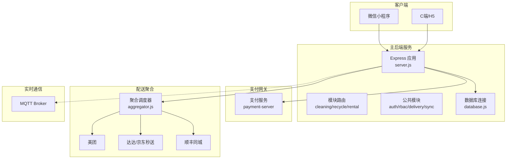
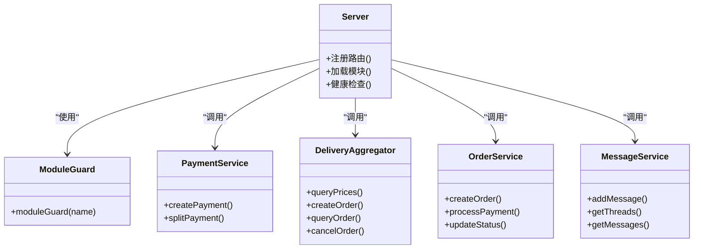
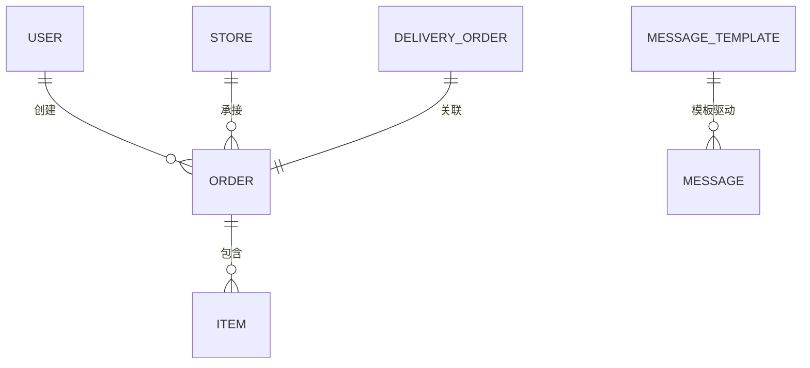
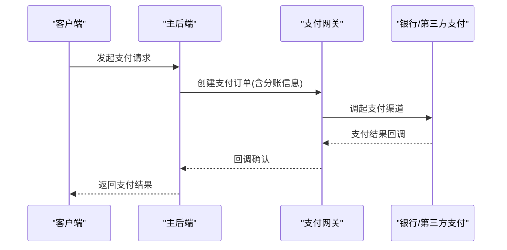
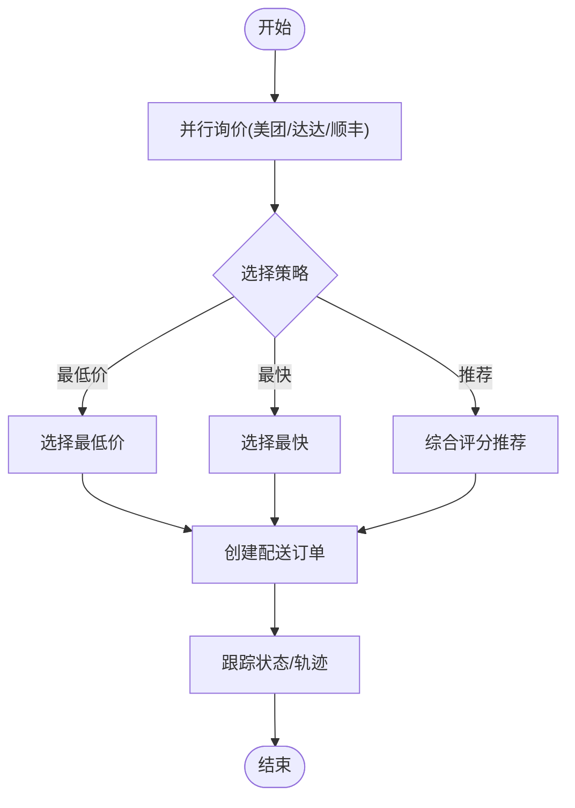
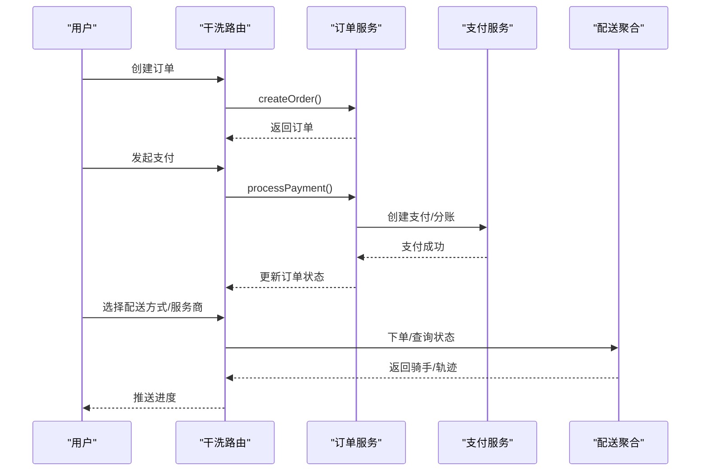
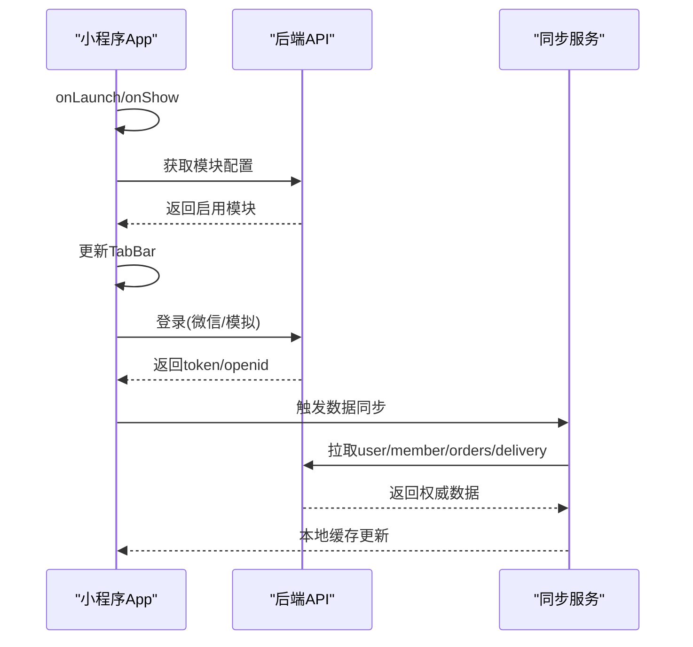
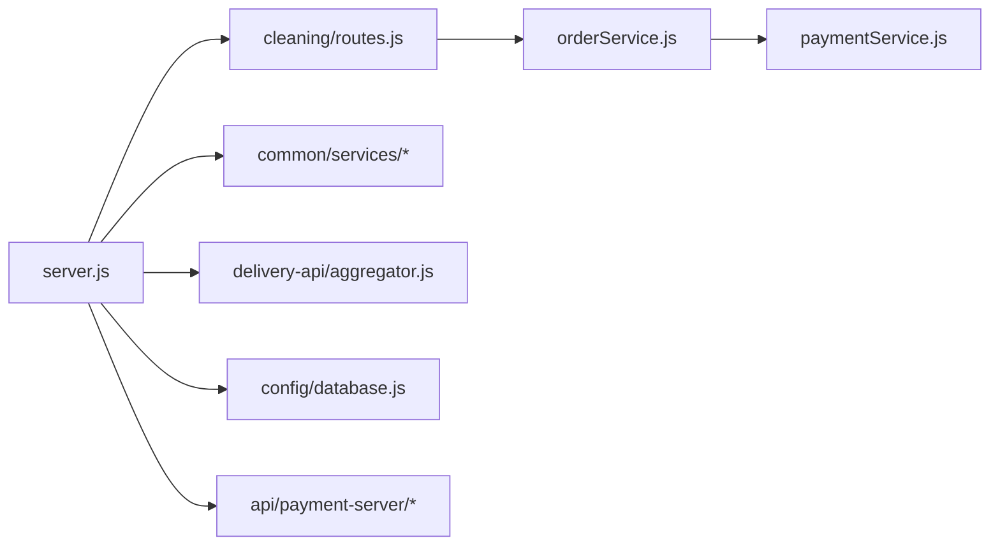

# 项目概述

<cite>
**本文引用的文件列表**
- [backend/README.md](file://backend/README.md)
- [backend/server.js](file://backend/server.js)
- [backend/config/modules.js](file://backend/config/modules.js)
- [backend/config/database.js](file://backend/config/database.js)
- [backend/modules/common/models/index.js](file://backend/modules/common/models/index.js)
- [backend/modules/cleaning/routes.js](file://backend/modules/cleaning/routes.js)
- [backend/modules/cleaning/services/orderService.js](file://backend/modules/cleaning/services/orderService.js)
- [backend/modules/common/services/paymentService.js](file://backend/modules/common/services/paymentService.js)
- [api/payment-server/README.md](file://api/payment-server/README.md)
- [delivery-api/README.md](file://delivery-api/README.md)
- [delivery-api/aggregator.js](file://delivery-api/aggregator.js)
- [wechat-mini-app/app.js](file://wechat-mini-app/app.js)
- [backend/services/messageService.js](file://backend/services/messageService.js)
</cite>

## 目录
1. [引言](#引言)
2. [项目结构](#项目结构)
3. [核心组件](#核心组件)
4. [架构总览](#架构总览)
5. [详细组件分析](#详细组件分析)
6. [依赖关系分析](#依赖关系分析)
7. [性能与扩展性](#性能与扩展性)
8. [故障排查指南](#故障排查指南)
9. [结论](#结论)
10. [附录](#附录)

## 引言
本项目为干洗店管理系统，采用渐进式架构设计，支持“干洗 → 回收 → 租赁”三阶段平滑扩展。系统以多品类服务为核心（干洗、鞋类护理、奢侈品护理、宠物清洗、电子产品维修），并内置双向配送能力（取件与送回）。技术栈涵盖 Node.js 后端、微信小程序前端、MongoDB/MySQL 双数据库、MQTT 实时通信等。支付体系预留分账能力，权限体系基于 RBAC，模块化隔离确保各业务模块可独立启用/禁用。

## 项目结构
整体采用前后端分离与微服务化思路：
- 主后端服务：Express 应用，统一路由挂载、模块守卫、中间件、通知中心、跨端同步、支付聚合入口等
- 支付网关：独立支付服务，支持微信/支付宝/银联/余额及资金结算
- 配送聚合服务：聚合美团、达达、顺丰等多家跑腿服务商，提供询价、下单、状态查询、取消等
- 小程序前端：动态菜单、登录态管理、数据同步、配送选择与下单流程

图表来源
- [backend/server.js:1-702](file://backend/server.js#L1-L702)
- [backend/config/database.js:1-65](file://backend/config/database.js#L1-L65)
- [delivery-api/aggregator.js:1-237](file://delivery-api/aggregator.js#L1-L237)
- [api/payment-server/README.md:1-481](file://api/payment-server/README.md#L1-L481)

章节来源
- [backend/README.md:1-325](file://backend/README.md#L1-L325)
- [backend/server.js:1-702](file://backend/server.js#L1-L702)

## 核心组件
- 渐进式架构与模块化隔离
  - 通过配置控制各业务模块的启用/禁用，实现干洗→回收→租赁的平滑演进
  - 模块开关、功能开关、消息模板集中管理
- 多品类服务与双向配送
  - 服务类：用户→门店（取件）→处理→门店→用户（送回）
  - 租赁类：门店→用户（发货）→使用中→用户→门店（归还）
  - 回收类：门店→用户（上门）→估价→用户→门店（回收）
- RBAC 权限体系
  - 角色与权限矩阵定义清晰，覆盖订单、物品、回收、租赁、门店、结算等
- 支付分账预留
  - 干洗：平台抽佣+门店分账
  - 回收：用户货款+平台服务费
  - 租赁：所有者+品牌方+平台分账，押金冻结机制

章节来源
- [backend/config/modules.js:1-203](file://backend/config/modules.js#L1-L203)
- [backend/modules/common/models/index.js:1-795](file://backend/modules/common/models/index.js#L1-L795)
- [backend/modules/common/services/paymentService.js:1-185](file://backend/modules/common/services/paymentService.js#L1-L185)

## 架构总览
系统采用“主后端 + 独立支付 + 配送聚合 + 小程序前端”的微服务组合，配合 MongoDB/MySQL 双库与 MQTT 实时通信，形成高内聚、低耦合的可扩展架构。

图表来源
- [backend/server.js:1-702](file://backend/server.js#L1-L702)
- [backend/modules/common/services/paymentService.js:1-185](file://backend/modules/common/services/paymentService.js#L1-L185)
- [delivery-api/aggregator.js:1-237](file://delivery-api/aggregator.js#L1-L237)
- [backend/modules/cleaning/services/orderService.js:1-200](file://backend/modules/cleaning/services/orderService.js#L1-L200)
- [backend/services/messageService.js:1-200](file://backend/services/messageService.js#L1-L200)

## 详细组件分析

### 渐进式架构与模块化隔离
- 设计理念
  - 通过 modules.js 集中管理模块开关、功能开关、支付分账比例、消息模板等
  - 路由层通过 moduleGuard 进行模块级访问控制，未启用模块返回友好提示
- 关键要点
  - 版本管理与特性开关便于灰度发布与回滚
  - 多品类服务在模型层通过 itemType/orderType 枚举扩展，避免频繁重构

章节来源
- [backend/config/modules.js:1-203](file://backend/config/modules.js#L1-L203)
- [backend/server.js:1-702](file://backend/server.js#L1-L702)

### 数据模型多态与权限体系
- 多态模型
  - Item/Order/User/Store/DeliveryOrder/MessageTemplate 等模型通过通用字段 + JSON 业务字段实现多态
  - 状态机模式用于订单与物品生命周期管理
- RBAC 权限
  - 权限矩阵覆盖用户、订单、物品、回收、租赁、门店、结算、模块管理等维度
  - 支持多角色叠加，细粒度控制接口访问

图表来源
- [backend/modules/common/models/index.js:1-795](file://backend/modules/common/models/index.js#L1-L795)

章节来源
- [backend/modules/common/models/index.js:1-795](file://backend/modules/common/models/index.js#L1-L795)

### 支付与分账体系
- 统一支付服务
  - 封装微信/支付宝/银联/余额等多种支付方式
  - 按订单类型执行分账策略（干洗/回收/租赁）
- 支付网关
  - 独立服务提供统一下单、回调、余额充值、提现、报表等能力
  - 支持生产环境证书与签名校验

图表来源
- [backend/modules/common/services/paymentService.js:1-185](file://backend/modules/common/services/paymentService.js#L1-L185)
- [api/payment-server/README.md:1-481](file://api/payment-server/README.md#L1-L481)

章节来源
- [backend/modules/common/services/paymentService.js:1-185](file://backend/modules/common/services/paymentService.js#L1-L185)
- [api/payment-server/README.md:1-481](file://api/payment-server/README.md#L1-L481)

### 双向配送系统与聚合调度
- 聚合调度器
  - 并行询价多家服务商，按价格/时效综合推荐最优
  - 自动或指定服务商下单，支持状态查询与取消
- 双向配送
  - 服务类：取件(用户→门店) + 送回(门店→用户)
  - 租赁类：发货(门店→用户) + 归还(用户→门店)
  - 回收类：上门(门店→用户) + 回收(用户→门店)

图表来源
- [delivery-api/aggregator.js:1-237](file://delivery-api/aggregator.js#L1-L237)
- [delivery-api/README.md:1-216](file://delivery-api/README.md#L1-L216)

章节来源
- [delivery-api/aggregator.js:1-237](file://delivery-api/aggregator.js#L1-L237)
- [delivery-api/README.md:1-216](file://delivery-api/README.md#L1-L216)

### 干洗订单全链路（示例）
- 路由与服务
  - 路由层负责参数校验、鉴权、模块守卫
  - 服务层负责订单创建、支付、状态流转、灯条联动、批量操作等
- 状态机
  - 从待支付到完成的全链路状态，含配送中、已入库、处理中、清洗中、可取件、送回中、已完成等

图表来源
- [backend/modules/cleaning/routes.js:1-800](file://backend/modules/cleaning/routes.js#L1-L800)
- [backend/modules/cleaning/services/orderService.js:1-200](file://backend/modules/cleaning/services/orderService.js#L1-L200)
- [backend/modules/common/services/paymentService.js:1-185](file://backend/modules/common/services/paymentService.js#L1-L185)
- [delivery-api/aggregator.js:1-237](file://delivery-api/aggregator.js#L1-L237)

章节来源
- [backend/modules/cleaning/routes.js:1-800](file://backend/modules/cleaning/routes.js#L1-L800)
- [backend/modules/cleaning/services/orderService.js:1-200](file://backend/modules/cleaning/services/orderService.js#L1-L200)

### 小程序前端与数据同步
- 启动与登录
  - onLaunch/onShow 异步初始化，扫码场景解析，模拟登录兜底
- 动态菜单
  - 拉取后端模块配置，动态渲染 TabBar
- 数据同步
  - 登录后按手机号/用户标识同步用户、会员、订单、配送信息，保证跨端一致性

图表来源
- [wechat-mini-app/app.js:1-800](file://wechat-mini-app/app.js#L1-L800)
- [backend/server.js:1-702](file://backend/server.js#L1-L702)

章节来源
- [wechat-mini-app/app.js:1-800](file://wechat-mini-app/app.js#L1-L800)

### 通知与消息中心
- 通知中心
  - 面向 Admin/Store 的事件流通知，轮询获取
- 消息中心
  - 客户消息与账户消息独立存储，支持线程聚合、未读计数、过期清理

章节来源
- [backend/server.js:1-702](file://backend/server.js#L1-L702)
- [backend/services/messageService.js:1-200](file://backend/services/messageService.js#L1-L200)

## 依赖关系分析
- 模块耦合
  - server.js 作为入口，集中挂载各模块路由与公共服务
  - cleaning 模块强依赖 orderService/pricingService，并通过 paymentService 完成支付
  - delivery 聚合服务独立部署，通过 HTTP 与主后端交互
- 外部依赖
  - 数据库：MongoDB/MySQL 双库，通过 database.js 统一管理
  - 支付：微信支付/支付宝/银联/余额，由支付网关提供服务
  - 配送：美团/达达/顺丰，由聚合调度器统一编排
  - 实时通信：MQTT（灯条/事件广播）

图表来源
- [backend/server.js:1-702](file://backend/server.js#L1-L702)
- [backend/modules/cleaning/routes.js:1-800](file://backend/modules/cleaning/routes.js#L1-L800)
- [backend/modules/cleaning/services/orderService.js:1-200](file://backend/modules/cleaning/services/orderService.js#L1-L200)
- [backend/modules/common/services/paymentService.js:1-185](file://backend/modules/common/services/paymentService.js#L1-L185)
- [delivery-api/aggregator.js:1-237](file://delivery-api/aggregator.js#L1-L237)
- [backend/config/database.js:1-65](file://backend/config/database.js#L1-L65)
- [api/payment-server/README.md:1-481](file://api/payment-server/README.md#L1-L481)

章节来源
- [backend/server.js:1-702](file://backend/server.js#L1-L702)
- [backend/config/database.js:1-65](file://backend/config/database.js#L1-L65)

## 性能与扩展性
- 并发与吞吐
  - 配送询价并行调用，Promise.allSettled 保障容错
  - 数据库连接池与超时配置优化稳定性
- 可扩展性
  - 新增品类仅需扩展枚举与 JSON 业务字段，无需大改模型
  - 模块开关与路由守卫使新功能可按需上线
- 实时性
  - MQTT 用于灯条控制与事件广播，降低轮询压力
- 建议
  - 引入缓存层（Redis）提升热点数据读取性能
  - 对支付回调与配送回调增加幂等与重试机制
  - 对长链路操作引入任务队列与异步处理

[本节为通用指导，不直接分析具体文件]

## 故障排查指南
- 端口冲突与进程异常
  - 监听 EADDRINUSE 错误并优雅退出，记录堆栈便于定位
- 支付问题
  - 检查支付网关证书与回调 URL 可达性
  - 核对分账比例与金额精度
- 配送失败
  - 核查服务商密钥与环境切换（测试/生产）
  - 查看聚合调度器的错误汇总与推荐策略
- 数据不一致
  - 使用同步接口与心跳机制排查两端在线状态
  - 关注消息中心的未读计数与过期清理

章节来源
- [backend/server.js:1-702](file://backend/server.js#L1-L702)
- [api/payment-server/README.md:1-481](file://api/payment-server/README.md#L1-L481)
- [delivery-api/README.md:1-216](file://delivery-api/README.md#L1-L216)

## 结论
本系统以渐进式架构为核心，通过模块化隔离、多态数据模型、RBAC 权限与支付分账预留，支撑干洗→回收→租赁的业务演进；以聚合配送与小程序前端构建完整的双向配送闭环；结合双数据库与 MQTT 实时通信，兼顾灵活性与实时性。该架构既适合初学者理解，也为有经验的开发者提供了足够的扩展空间。

[本节为总结性内容，不直接分析具体文件]

## 附录
- 快速参考
  - 后端启动与模块状态查看
  - 支付网关与配送聚合的使用说明
  - 小程序登录与数据同步流程

章节来源
- [backend/README.md:1-325](file://backend/README.md#L1-L325)
- [api/payment-server/README.md:1-481](file://api/payment-server/README.md#L1-L481)
- [delivery-api/README.md:1-216](file://delivery-api/README.md#L1-L216)
- [wechat-mini-app/app.js:1-800](file://wechat-mini-app/app.js#L1-L800)